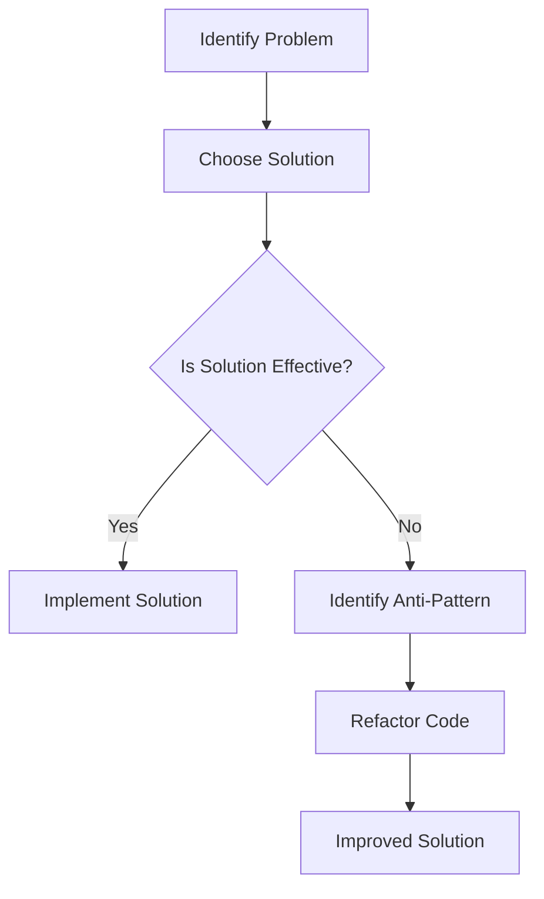

## 17.1 Understanding Anti-Patterns

In the realm of software development, anti-patterns are a critical concept that every expert developer must understand. While design patterns provide tried-and-true solutions to common problems, anti-patterns represent the opposite: they are poor solutions that may seem beneficial at first but ultimately lead to negative consequences. In this section, we will delve into the definition of anti-patterns, their impact on software projects, and how to identify and avoid them in the D programming language.

### Definition of Anti-Patterns

**Anti-patterns** are recurring solutions to common problems that are ineffective and counterproductive. They often arise from misunderstandings, lack of experience, or the pressure to deliver quickly. Unlike design patterns, which are best practices, anti-patterns are practices to be avoided.

#### Poor Solutions

Anti-patterns often masquerade as quick fixes or easy solutions. They may appear to solve a problem in the short term but introduce more significant issues in the long run. Recognizing these poor solutions is crucial for maintaining code quality and project success.

### Impact on Software Projects

The presence of anti-patterns in a codebase can have several detrimental effects on a software project. Understanding these impacts is essential for preventing them.

#### Technical Debt

One of the most significant impacts of anti-patterns is the accumulation of **technical debt**. This term refers to the future work required to fix shortcuts taken during development. While technical debt can sometimes be a strategic decision, anti-patterns often lead to unintentional debt that hinders progress and increases maintenance costs.

#### Maintainability Issues

Anti-patterns can also lead to **maintainability issues**. They often increase the complexity of the codebase, making it harder to understand, modify, and extend. This complexity can reduce readability and make onboarding new team members more challenging.

### Use Cases and Examples

To better understand anti-patterns, let's explore some common mistakes and learn from past failures.

#### Common Mistakes

1. **The God Object**

   The God Object anti-pattern occurs when a single class or module takes on too many responsibilities. This violates the Single Responsibility Principle and leads to a monolithic design that is difficult to maintain and extend.

   ```d
   class GodObject {
       // Handles user input, data processing, and output
       void handleInput() { /* ... */ }
       void processData() { /* ... */ }
       void generateOutput() { /* ... */ }
   }
   ```

   **Solution**: Break down the God Object into smaller, more focused classes that adhere to the Single Responsibility Principle.

2. **The Golden Hammer**

   This anti-pattern involves using a familiar tool or pattern for every problem, regardless of its suitability. It often results from over-reliance on a particular technology or approach.

   ```d
   // Using a hammer for every problem
   void solveProblem() {
       // Assume every problem is a nail
       hammer.nail();
   }
   ```

   **Solution**: Evaluate each problem individually and choose the most appropriate tool or pattern.

3. **Copy-Paste Programming**

   Copy-paste programming involves duplicating code to reuse functionality. While it may seem efficient, it leads to code duplication and maintenance challenges.

   ```d
   void functionA() {
       // Some logic
   }

   void functionB() {
       // Duplicated logic
   }
   ```

   **Solution**: Refactor duplicated code into reusable functions or modules.

#### Learning from Failures

Learning from past failures is a valuable way to avoid anti-patterns. By analyzing previous projects, we can identify patterns that led to problems and develop strategies to prevent them in the future.

### Visualizing Anti-Patterns

To better understand the concept of anti-patterns, let's visualize the impact of a common anti-pattern using a flowchart.



**Figure 1**: This flowchart illustrates the process of identifying and addressing anti-patterns. When a solution is not effective, it may indicate the presence of an anti-pattern, prompting a refactor to achieve an improved solution.

### Code Examples

Let's explore some code examples to illustrate how anti-patterns manifest in D programming and how to address them.

#### Example 1: The God Object

In this example, we have a God Object that handles multiple responsibilities.

```d
class GodObject {
    void handleInput() {
        // Code to handle input
    }

    void processData() {
        // Code to process data
    }

    void generateOutput() {
        // Code to generate output
    }
}
```

**Solution**: Refactor the God Object into smaller classes.

```d
class InputHandler {
    void handleInput() {
        // Code to handle input
    }
}

class DataProcessor {
    void processData() {
        // Code to process data
    }
}

class OutputGenerator {
    void generateOutput() {
        // Code to generate output
    }
}
```

#### Example 2: Copy-Paste Programming

In this example, we have duplicated code in two functions.

```d
void functionA() {
    // Some logic
}

void functionB() {
    // Duplicated logic
}
```

**Solution**: Refactor the duplicated code into a reusable function.

```d
void commonLogic() {
    // Some logic
}

void functionA() {
    commonLogic();
}

void functionB() {
    commonLogic();
}
```

### Try It Yourself

To deepen your understanding of anti-patterns, try modifying the code examples above. For instance, attempt to refactor a God Object in your own project or identify duplicated code and consolidate it into reusable functions.

### References and Links

- [Refactoring Guru: Anti-Patterns](https://refactoring.guru/antipatterns)
- [Martin Fowler's Bliki: Anti-Patterns](https://martinfowler.com/bliki/AntiPattern.html)
- [Wikipedia: Anti-Pattern](https://en.wikipedia.org/wiki/Anti-pattern)

### Knowledge Check

- What is an anti-pattern, and how does it differ from a design pattern?
- How can anti-patterns lead to technical debt?
- What are some common anti-patterns in software development?
- How can you identify and refactor a God Object?
- Why is copy-paste programming considered an anti-pattern?

### Embrace the Journey

Remember, understanding anti-patterns is just the beginning. As you progress in your software development journey, you'll encounter more complex challenges. Keep learning, stay curious, and enjoy the process of refining your skills.

## Quiz Time!



### What is an anti-pattern?

- [x] A recurring solution that is ineffective and counterproductive
- [ ] A best practice for solving common problems
- [ ] A design pattern used in software architecture
- [ ] A tool for debugging code

> **Explanation:** An anti-pattern is a recurring solution that is ineffective and counterproductive, unlike a design pattern which is a best practice.

### How do anti-patterns impact software projects?

- [x] They lead to technical debt and maintainability issues
- [ ] They improve code readability and efficiency
- [ ] They reduce the complexity of the codebase
- [ ] They enhance the performance of the software

> **Explanation:** Anti-patterns lead to technical debt and maintainability issues by increasing complexity and reducing readability.

### What is the God Object anti-pattern?

- [x] A class that takes on too many responsibilities
- [ ] A class that adheres to the Single Responsibility Principle
- [ ] A design pattern for organizing code
- [ ] A tool for managing dependencies

> **Explanation:** The God Object anti-pattern occurs when a single class takes on too many responsibilities, violating the Single Responsibility Principle.

### How can you address the Golden Hammer anti-pattern?

- [x] Evaluate each problem individually and choose the most appropriate tool
- [ ] Use the same tool for every problem
- [ ] Avoid using any tools or patterns
- [ ] Focus on a single technology for all solutions

> **Explanation:** To address the Golden Hammer anti-pattern, evaluate each problem individually and choose the most appropriate tool or pattern.

### What is a common consequence of copy-paste programming?

- [x] Code duplication and maintenance challenges
- [ ] Improved code efficiency and readability
- [ ] Reduced technical debt
- [ ] Enhanced software performance

> **Explanation:** Copy-paste programming leads to code duplication and maintenance challenges, making it harder to manage and modify the codebase.

### How can you refactor a God Object?

- [x] Break it down into smaller, more focused classes
- [ ] Combine it with other classes to reduce complexity
- [ ] Use it as a template for other classes
- [ ] Ignore it and focus on other parts of the code

> **Explanation:** Refactor a God Object by breaking it down into smaller, more focused classes that adhere to the Single Responsibility Principle.

### What is technical debt?

- [x] Future work required to fix shortcuts taken during development
- [ ] A measure of code efficiency and performance
- [ ] A design pattern for managing dependencies
- [ ] A tool for debugging software

> **Explanation:** Technical debt refers to the future work required to fix shortcuts taken during development, often resulting from anti-patterns.

### Why is it important to learn from past failures?

- [x] To identify patterns that led to problems and develop strategies to prevent them
- [ ] To repeat the same mistakes in future projects
- [ ] To avoid using any patterns or tools
- [ ] To focus solely on new technologies

> **Explanation:** Learning from past failures helps identify patterns that led to problems and develop strategies to prevent them in future projects.

### What is the impact of anti-patterns on code readability?

- [x] They reduce readability by increasing complexity
- [ ] They enhance readability by simplifying the code
- [ ] They have no impact on readability
- [ ] They improve readability by organizing code

> **Explanation:** Anti-patterns reduce readability by increasing complexity, making it harder to understand and modify the code.

### True or False: Anti-patterns are best practices for solving common problems.

- [ ] True
- [x] False

> **Explanation:** False. Anti-patterns are not best practices; they are ineffective and counterproductive solutions that should be avoided.


