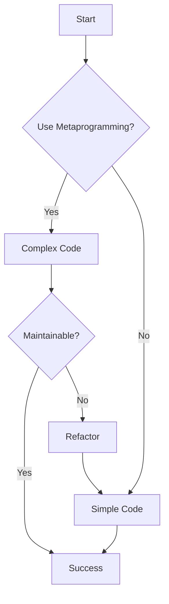

## 17.10 Strategies to Avoid Anti-Patterns

In the realm of software development, anti-patterns are like weeds in a garden—they can stifle growth and lead to a tangled mess if not addressed. As expert developers and architects, our goal is to cultivate a codebase that is robust, maintainable, and scalable. This section will delve into strategies to avoid anti-patterns in D programming, leveraging the language's unique features and best practices.

### Understanding Anti-Patterns

Before we dive into strategies, let's clarify what anti-patterns are. Anti-patterns are common responses to recurring problems that are ineffective and counterproductive. They often arise from a lack of understanding of design principles or from taking shortcuts that lead to technical debt.

#### Common Anti-Patterns in D

1. **Overusing Metaprogramming**: While D's metaprogramming capabilities are powerful, overuse can lead to code that is difficult to understand and maintain.
2. **Misusing Exceptions**: Using exceptions for control flow can lead to convoluted error handling and obscure logic.
3. **Inefficient Memory Management**: Ignoring D's memory safety features can result in leaks and undefined behavior.
4. **Concurrency Missteps**: Poor handling of concurrency can lead to race conditions and deadlocks.
5. **Bypassing Type Safety**: Ignoring D's type system can lead to runtime errors and unstable code.

### Education and Awareness

#### Continuous Learning

To avoid anti-patterns, continuous learning is paramount. Staying informed about best practices and emerging trends in D programming can help you make informed decisions.

- **Read Books and Articles**: Engage with literature on design patterns and software architecture.
- **Attend Conferences and Workshops**: Participate in events to learn from industry experts.
- **Online Courses and Tutorials**: Platforms like Coursera and Udemy offer courses on advanced D programming.

#### Peer Evaluation

Encourage a culture of feedback and knowledge sharing within your team. Code reviews are an excellent way to catch anti-patterns early and learn from each other.

- **Pair Programming**: Work together to solve complex problems and share insights.
- **Regular Code Reviews**: Establish a routine for reviewing code to ensure adherence to best practices.

### Design Principles

#### SOLID Principles

Applying SOLID principles can help you design systems that are flexible and easy to maintain. These principles provide a foundation for avoiding common anti-patterns.

- **Single Responsibility Principle (SRP)**: Ensure that each module or class has one responsibility.
- **Open/Closed Principle (OCP)**: Design modules that can be extended without modifying existing code.
- **Liskov Substitution Principle (LSP)**: Ensure that derived classes can be substituted for their base classes.
- **Interface Segregation Principle (ISP)**: Design interfaces that are specific to client needs.
- **Dependency Inversion Principle (DIP)**: Depend on abstractions rather than concrete implementations.

### Use Cases and Examples

#### Team Improvements

Fostering a culture of quality involves more than just individual effort. It requires a team commitment to continuous improvement.

- **Retrospectives**: Regularly reflect on what went well and what can be improved.
- **Knowledge Sharing Sessions**: Host sessions where team members can share insights and experiences.

### Code Examples

Let's explore some code examples to illustrate how to avoid anti-patterns in D.

#### Avoiding Overuse of Metaprogramming

```d
// Example of excessive metaprogramming
mixin template ExcessiveTemplate(T) {
    static if (is(T == int)) {
        void foo() { writeln("Integer"); }
    } else static if (is(T == string)) {
        void foo() { writeln("String"); }
    } else {
        void foo() { writeln("Other"); }
    }
}

// Improved version using simple polymorphism
interface Fooable {
    void foo();
}

class IntegerFoo : Fooable {
    void foo() { writeln("Integer"); }
}

class StringFoo : Fooable {
    void foo() { writeln("String"); }
}

void process(Fooable obj) {
    obj.foo();
}
```

In the improved version, we use polymorphism instead of excessive metaprogramming, making the code more maintainable and easier to understand.

#### Proper Exception Handling

```d
// Misusing exceptions for control flow
void process(int value) {
    try {
        if (value < 0) throw new Exception("Negative value");
        // Process value
    } catch (Exception e) {
        writeln("Error: ", e.msg);
    }
}

// Improved version using conditional logic
void process(int value) {
    if (value < 0) {
        writeln("Error: Negative value");
        return;
    }
    // Process value
}
```

By using conditional logic instead of exceptions for control flow, we simplify error handling and improve code clarity.

### Visualizing Anti-Patterns

To better understand how anti-patterns can affect your code, let's visualize a common anti-pattern scenario using a flowchart.



**Figure 1**: This flowchart illustrates the decision-making process when considering metaprogramming. Opting for simple code often leads to more maintainable solutions.

### Try It Yourself

Experiment with the code examples provided. Try modifying the polymorphism example to add more types, or refactor the exception handling example to handle different error scenarios.

### References and Links

- [SOLID Principles](https://en.wikipedia.org/wiki/SOLID)
- [D Programming Language](https://dlang.org/)
- [Design Patterns: Elements of Reusable Object-Oriented Software](https://en.wikipedia.org/wiki/Design_Patterns)

### Knowledge Check

- **What are anti-patterns, and why should they be avoided?**
- **How can continuous learning help in avoiding anti-patterns?**
- **What role do SOLID principles play in preventing anti-patterns?**

### Embrace the Journey

Remember, avoiding anti-patterns is a continuous journey. As you progress, you'll develop a keen eye for spotting potential pitfalls and steering clear of them. Keep experimenting, stay curious, and enjoy the process of refining your craft.

### Quiz Time!



### What is an anti-pattern?

- [x] A common response to recurring problems that is ineffective and counterproductive
- [ ] A design pattern that is widely accepted and used
- [ ] A programming language feature
- [ ] A type of software bug

> **Explanation:** Anti-patterns are ineffective solutions to common problems, often leading to technical debt.

### Which principle is part of the SOLID design principles?

- [x] Single Responsibility Principle
- [ ] Simple Responsibility Principle
- [ ] Secure Responsibility Principle
- [ ] Static Responsibility Principle

> **Explanation:** The Single Responsibility Principle is one of the SOLID design principles, emphasizing that a class should have only one reason to change.

### What is a benefit of code reviews?

- [x] Encouraging feedback and knowledge sharing
- [ ] Increasing code complexity
- [ ] Reducing team collaboration
- [ ] Avoiding documentation

> **Explanation:** Code reviews encourage feedback and knowledge sharing, helping to catch anti-patterns early.

### How can metaprogramming be overused?

- [x] By creating complex and hard-to-maintain code
- [ ] By simplifying code logic
- [ ] By reducing code duplication
- [ ] By improving code readability

> **Explanation:** Overusing metaprogramming can lead to complex and hard-to-maintain code.

### What is a common mistake when handling exceptions?

- [x] Using exceptions for control flow
- [ ] Logging exceptions
- [ ] Catching specific exceptions
- [ ] Providing meaningful error messages

> **Explanation:** Using exceptions for control flow is a common mistake, leading to convoluted error handling.

### What is the purpose of the Dependency Inversion Principle?

- [x] To depend on abstractions rather than concrete implementations
- [ ] To depend on concrete implementations rather than abstractions
- [ ] To avoid using interfaces
- [ ] To increase code coupling

> **Explanation:** The Dependency Inversion Principle encourages depending on abstractions to reduce code coupling.

### Why is continuous learning important in software development?

- [x] To stay informed about best practices and emerging trends
- [ ] To avoid writing documentation
- [ ] To increase code complexity
- [ ] To reduce team collaboration

> **Explanation:** Continuous learning helps developers stay informed about best practices and emerging trends.

### What is a benefit of using polymorphism over metaprogramming?

- [x] Improved code maintainability and readability
- [ ] Increased code complexity
- [ ] Reduced code flexibility
- [ ] Increased runtime errors

> **Explanation:** Polymorphism improves code maintainability and readability compared to excessive metaprogramming.

### What is the role of retrospectives in team improvements?

- [x] Reflecting on what went well and what can be improved
- [ ] Avoiding team collaboration
- [ ] Increasing code complexity
- [ ] Reducing code quality

> **Explanation:** Retrospectives help teams reflect on successes and areas for improvement.

### True or False: Anti-patterns are effective solutions to common problems.

- [ ] True
- [x] False

> **Explanation:** Anti-patterns are ineffective solutions to common problems, often leading to technical debt.



By implementing these strategies, you can effectively avoid anti-patterns and enhance the quality of your D programming projects. Remember, the journey to mastering design patterns and avoiding anti-patterns is ongoing, so keep learning and refining your skills.
