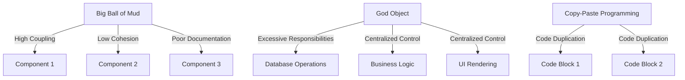

## 17.2 Common Anti-Patterns in D Programming

In the world of software development, anti-patterns are recurring solutions to common problems that are ineffective and counterproductive. In D programming, as in any language, recognizing and avoiding these anti-patterns is crucial for creating maintainable, efficient, and scalable systems. This section delves into some of the most prevalent anti-patterns in D programming, providing insights into their characteristics, consequences, and strategies for avoidance.

### The Big Ball of Mud

#### Lack of Structure

The "Big Ball of Mud" is a term used to describe a system with little to no discernible architecture. This anti-pattern is characterized by a lack of modularity, where the codebase is a tangled mess of interdependencies and ad-hoc solutions. Such systems are difficult to maintain, understand, and extend.

**Characteristics:**

- **High Coupling**: Components are tightly interwoven, making changes in one part affect many others.
- **Low Cohesion**: Modules lack a clear, single responsibility, often doing too much.
- **Poor Documentation**: Lack of clear documentation exacerbates the confusion.

**Consequences:**

- **Maintenance Nightmare**: Changes become risky and time-consuming.
- **Scalability Issues**: Adding new features or scaling the system is challenging.
- **Bug Proliferation**: Bugs are harder to isolate and fix due to the tangled nature of the code.

**Example in D:**

```d
// Example of a Big Ball of Mud in D
module bigballofmud;

import std.stdio;

class Application {
    void run() {
        // Intermixed logic without clear separation
        writeln("Starting application...");
        // Database connection logic
        connectToDatabase();
        // Business logic
        processBusinessRules();
        // UI logic
        renderUI();
    }

    void connectToDatabase() {
        writeln("Connecting to database...");
        // Database connection code
    }

    void processBusinessRules() {
        writeln("Processing business rules...");
        // Business logic code
    }

    void renderUI() {
        writeln("Rendering UI...");
        // UI rendering code
    }
}

void main() {
    auto app = new Application();
    app.run();
}
```

**Avoidance Strategies:**

- **Modular Design**: Break down the system into well-defined modules with clear interfaces.
- **Layered Architecture**: Implement a layered approach to separate concerns.
- **Refactoring**: Regularly refactor code to improve structure and readability.

### God Object

#### Overloaded Classes

The "God Object" anti-pattern occurs when a single class takes on too many responsibilities, becoming overly complex and difficult to manage. This violates the Single Responsibility Principle, making the class a bottleneck for changes and testing.

**Characteristics:**

- **Excessive Responsibilities**: The class handles multiple unrelated tasks.
- **Large Size**: The class is significantly larger than others, often with many methods and attributes.
- **Centralized Control**: The class becomes a central point of control, leading to high coupling.

**Consequences:**

- **Difficult to Test**: Testing becomes complex due to the numerous responsibilities.
- **Hard to Maintain**: Changes in one responsibility can inadvertently affect others.
- **Reduced Reusability**: The class is too specific to be reused in different contexts.

**Example in D:**

```d
// Example of a God Object in D
module godobject;

import std.stdio;

class GodObject {
    // Handles database operations
    void connectToDatabase() {
        writeln("Connecting to database...");
    }

    // Handles business logic
    void processBusinessRules() {
        writeln("Processing business rules...");
    }

    // Handles UI rendering
    void renderUI() {
        writeln("Rendering UI...");
    }

    // Handles logging
    void logMessage(string message) {
        writeln("Log: ", message);
    }
}

void main() {
    auto god = new GodObject();
    god.connectToDatabase();
    god.processBusinessRules();
    god.renderUI();
    god.logMessage("Application started.");
}
```

**Avoidance Strategies:**

- **Single Responsibility Principle**: Ensure each class has one responsibility.
- **Delegation**: Delegate tasks to other classes or modules.
- **Refactoring**: Split the God Object into smaller, more focused classes.

### Copy-Paste Programming

#### Duplication

Copy-paste programming is a common anti-pattern where code is duplicated rather than abstracted. This leads to maintenance challenges and inconsistencies, as changes need to be replicated across multiple locations.

**Characteristics:**

- **Code Duplication**: Identical or similar code blocks appear in multiple places.
- **Inconsistent Changes**: Updates to one instance of the code may not be applied to others.
- **Lack of Abstraction**: Opportunities for abstraction and reuse are missed.

**Consequences:**

- **Increased Maintenance Effort**: Changes must be made in multiple places.
- **Higher Risk of Bugs**: Inconsistencies can lead to subtle bugs.
- **Code Bloat**: The codebase becomes unnecessarily large.

**Example in D:**

```d
// Example of Copy-Paste Programming in D
module copypaste;

import std.stdio;

void processUserInput(string input) {
    if (input == "start") {
        writeln("Starting process...");
    } else if (input == "stop") {
        writeln("Stopping process...");
    }
}

void handleUserCommand(string command) {
    if (command == "start") {
        writeln("Starting process...");
    } else if (command == "stop") {
        writeln("Stopping process...");
    }
}

void main() {
    processUserInput("start");
    handleUserCommand("stop");
}
```

**Avoidance Strategies:**

- **Abstraction**: Use functions or classes to encapsulate repeated logic.
- **DRY Principle**: Follow the "Don't Repeat Yourself" principle to eliminate duplication.
- **Refactoring**: Regularly refactor code to identify and remove duplication.

### Use Cases and Examples

#### Real-World Scenarios

Understanding anti-patterns in the context of real-world scenarios helps in recognizing them in your own projects. Let's explore some examples:

1. **Legacy Systems**: Often, legacy systems evolve into a Big Ball of Mud due to years of ad-hoc changes and lack of refactoring.
2. **Rapid Prototyping**: In the rush to deliver prototypes, developers might create God Objects, which then become entrenched in the codebase.
3. **Team Collaboration**: In large teams, copy-paste programming can occur when developers are unaware of existing solutions.

#### Consequences

The consequences of anti-patterns can be severe, impacting both the short-term and long-term success of a project:

- **Increased Costs**: Maintenance and debugging costs rise as the codebase becomes more complex.
- **Reduced Agility**: The ability to adapt to new requirements or technologies is hindered.
- **Lower Quality**: The overall quality of the software suffers, leading to user dissatisfaction.

### Visualizing Anti-Patterns

To better understand the impact of these anti-patterns, let's visualize the relationships and dependencies they create within a codebase.



**Diagram Description:** This diagram illustrates how the Big Ball of Mud leads to high coupling and low cohesion among components, how the God Object centralizes control and responsibilities, and how Copy-Paste Programming results in code duplication.

### Try It Yourself

To deepen your understanding of these anti-patterns, try modifying the provided code examples:

- **Refactor the Big Ball of Mud**: Break down the `Application` class into separate modules for database, business logic, and UI.
- **Split the God Object**: Create separate classes for each responsibility in the `GodObject` example.
- **Eliminate Duplication**: Refactor the `processUserInput` and `handleUserCommand` functions to use a common helper function.

### References and Links

For further reading on anti-patterns and best practices in software development, consider the following resources:

- [Refactoring: Improving the Design of Existing Code](https://martinfowler.com/books/refactoring.html) by Martin Fowler
- [Design Patterns: Elements of Reusable Object-Oriented Software](https://www.oreilly.com/library/view/design-patterns-elements/0201633612/) by Erich Gamma et al.
- [AntiPatterns: Refactoring Software, Architectures, and Projects in Crisis](https://www.amazon.com/AntiPatterns-Refactoring-Software-Architectures-Projects/dp/0471197130) by William J. Brown et al.

### Knowledge Check

To reinforce your understanding of common anti-patterns in D programming, consider the following questions:

- What are the key characteristics of a Big Ball of Mud?
- How does the God Object violate the Single Responsibility Principle?
- What are the consequences of Copy-Paste Programming?

### Embrace the Journey

Remember, recognizing and avoiding anti-patterns is a continuous journey. As you progress in your software development career, you'll encounter new challenges and opportunities to refine your skills. Keep experimenting, stay curious, and enjoy the journey!

## Quiz Time!



### What is a key characteristic of the Big Ball of Mud anti-pattern?

- [x] High coupling and low cohesion
- [ ] Strict modularity
- [ ] Clear documentation
- [ ] Single responsibility

> **Explanation:** The Big Ball of Mud is characterized by high coupling and low cohesion, making the system difficult to maintain.

### Which principle does the God Object violate?

- [x] Single Responsibility Principle
- [ ] Open/Closed Principle
- [ ] Liskov Substitution Principle
- [ ] Interface Segregation Principle

> **Explanation:** The God Object violates the Single Responsibility Principle by taking on multiple responsibilities.

### What is a common consequence of Copy-Paste Programming?

- [x] Increased maintenance effort
- [ ] Improved code readability
- [ ] Enhanced performance
- [ ] Reduced code size

> **Explanation:** Copy-Paste Programming leads to increased maintenance effort due to code duplication.

### How can you avoid the Big Ball of Mud anti-pattern?

- [x] Implement a modular design
- [ ] Centralize control in a single class
- [ ] Duplicate code for efficiency
- [ ] Ignore documentation

> **Explanation:** A modular design helps avoid the Big Ball of Mud by separating concerns and reducing coupling.

### What is a strategy to avoid the God Object anti-pattern?

- [x] Delegate tasks to other classes
- [ ] Consolidate all logic in one class
- [ ] Use copy-paste programming
- [ ] Increase class size

> **Explanation:** Delegating tasks to other classes helps distribute responsibilities and avoid the God Object.

### Which of the following is a characteristic of Copy-Paste Programming?

- [x] Code duplication
- [ ] High cohesion
- [ ] Single responsibility
- [ ] Modular design

> **Explanation:** Copy-Paste Programming is characterized by code duplication, leading to maintenance challenges.

### What is a consequence of the Big Ball of Mud anti-pattern?

- [x] Difficult maintenance
- [ ] Easy scalability
- [ ] Clear architecture
- [ ] Low coupling

> **Explanation:** The Big Ball of Mud results in difficult maintenance due to its tangled and unstructured nature.

### How does the God Object affect testing?

- [x] Makes testing difficult
- [ ] Simplifies testing
- [ ] Has no impact on testing
- [ ] Reduces test cases

> **Explanation:** The God Object makes testing difficult due to its numerous responsibilities and high complexity.

### What is a benefit of avoiding Copy-Paste Programming?

- [x] Reduced maintenance effort
- [ ] Increased code duplication
- [ ] Centralized control
- [ ] Larger codebase

> **Explanation:** Avoiding Copy-Paste Programming reduces maintenance effort by eliminating code duplication.

### True or False: The Big Ball of Mud is a well-structured architectural pattern.

- [ ] True
- [x] False

> **Explanation:** False. The Big Ball of Mud is not a well-structured architectural pattern; it lacks clear architecture and structure.



By understanding and avoiding these common anti-patterns, you can significantly improve the quality and maintainability of your D programming projects. Keep these insights in mind as you continue to develop and refine your skills in systems programming.
