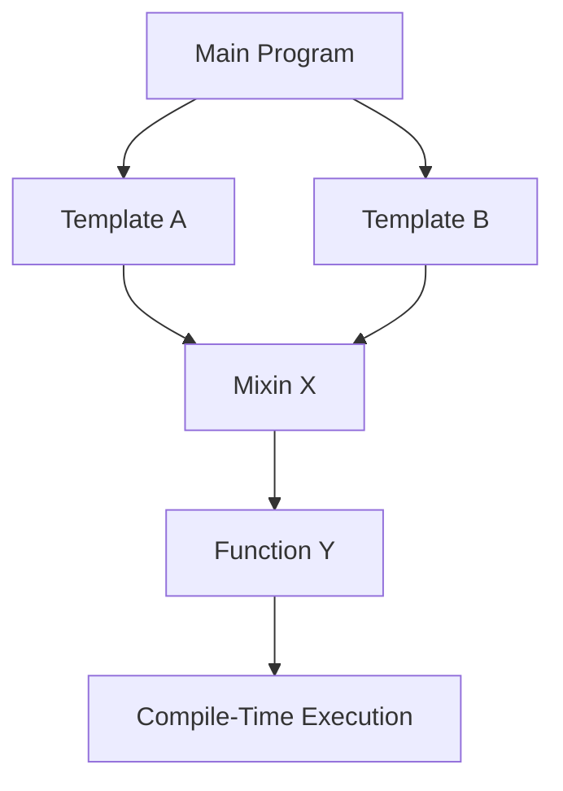

## 17.3 Overusing Metaprogramming

Metaprogramming in D is a powerful tool that allows developers to write code that can generate other code, perform compile-time computations, and create highly generic and reusable components. However, with great power comes great responsibility. Overusing metaprogramming can lead to complex, unreadable code and increased compilation times, which can hinder development and maintenance. In this section, we will explore the potential pitfalls of overusing metaprogramming, provide best practices for its judicious use, and examine real-world use cases where metaprogramming can be both beneficial and detrimental.

### Understanding Metaprogramming in D

Metaprogramming refers to the practice of writing programs that can manipulate other programs or themselves. In D, this is achieved through features like templates, mixins, compile-time function execution (CTFE), and compile-time reflection. These features allow developers to create highly flexible and efficient code, but they also introduce complexity that can be difficult to manage.

#### Key Concepts in Metaprogramming

1. **Templates**: Templates in D allow for generic programming by enabling functions and types to operate with any data type. They are a cornerstone of metaprogramming but can become overly complex if not used carefully.

2. **Mixins**: Mixins enable the inclusion of code snippets into a program at compile time. While they provide powerful code reuse capabilities, excessive use can lead to code that is hard to follow.

3. **Compile-Time Function Execution (CTFE)**: CTFE allows functions to be executed at compile time, enabling optimizations and checks that would otherwise be impossible. However, over-reliance on CTFE can increase compilation times significantly.

4. **Reflection and Traits**: D's reflection capabilities allow for introspection of types and functions at compile time, which can be used to automate code generation. This can lead to complex code that is difficult to debug.

### Complexity in Metaprogramming

While metaprogramming can greatly enhance the flexibility and efficiency of a codebase, it can also introduce significant complexity. This complexity manifests in several ways:

#### Readability Issues

Metaprogramming can obscure the logic of a program, making it difficult for developers to understand what the code is doing. This is particularly problematic in large codebases where multiple developers are involved. Code that relies heavily on templates and mixins can become a tangled web of dependencies that are challenging to untangle.

**Example of Readability Issue:**

```d
import std.stdio;

template Add(T) {
    T add(T a, T b) {
        return a + b;
    }
}

mixin Add!int; // Mixes in the add function for int

void main() {
    writeln(add(5, 10)); // Output: 15
}
```

In this example, the use of a mixin to include the `add` function can make it unclear where the function is defined, especially in larger codebases with multiple mixins.

#### Compilation Times

Metaprogramming can significantly increase compilation times, particularly when using complex templates and CTFE. This can slow down the development process and make iterative development more cumbersome.

**Example of Increased Compilation Time:**

```d
import std.stdio;

template Factorial(int n) {
    enum Factorial = n <= 1 ? 1 : n * Factorial!(n - 1);
}

void main() {
    writeln(Factorial!10); // Output: 3628800
}
```

While this example demonstrates the power of CTFE, calculating factorials at compile time can lead to longer compilation times, especially for larger values of `n`.

### Best Practices for Metaprogramming

To mitigate the issues associated with overusing metaprogramming, consider the following best practices:

#### Simplicity

Use metaprogramming judiciously. Aim to keep your code as simple as possible while still achieving the desired functionality. Avoid using metaprogramming for tasks that can be accomplished with simpler constructs.

#### Documentation

Clearly document any complex metaprogramming logic. This includes explaining the purpose of templates, mixins, and CTFE in your code. Good documentation can help other developers (and your future self) understand the code more easily.

#### Code Reviews

Incorporate code reviews into your development process to catch potential readability and complexity issues early. Having another set of eyes on your code can help identify areas where metaprogramming may be overused.

#### Profiling and Optimization

Regularly profile your code to identify bottlenecks in compilation times. Optimize metaprogramming constructs where possible to reduce their impact on build times.

### Use Cases and Examples

Let's explore some real-world use cases where metaprogramming can be both beneficial and detrimental.

#### Beneficial Use Case: Generic Data Structures

Metaprogramming is ideal for creating generic data structures that can work with any data type. This allows for code reuse and flexibility without sacrificing type safety.

**Example of Generic Data Structure:**

```d
import std.stdio;

struct Stack(T) {
    T[] items;

    void push(T item) {
        items ~= item;
    }

    T pop() {
        return items.length ? items[$-1] : T.init;
    }
}

void main() {
    auto intStack = Stack!int();
    intStack.push(10);
    intStack.push(20);
    writeln(intStack.pop()); // Output: 20
}
```

In this example, the `Stack` struct is a generic data structure that can store any type of data, thanks to the use of templates.

#### Detrimental Use Case: Overly Complex Mixins

While mixins can be useful for code reuse, they can also lead to overly complex code that is difficult to understand and maintain.

**Example of Overly Complex Mixin:**

```d
import std.stdio;

mixin template ComplexMixin() {
    void complexFunction() {
        writeln("Complex logic here");
    }
}

class MyClass {
    mixin ComplexMixin;
}

void main() {
    auto obj = new MyClass();
    obj.complexFunction();
}
```

In this example, the use of a mixin to include `complexFunction` can make it difficult to track where the function is defined and what it does, especially if the mixin is used in multiple places.

### Visualizing Metaprogramming Complexity

To better understand the complexity introduced by metaprogramming, let's visualize the dependencies and interactions in a codebase that heavily uses templates and mixins.



**Diagram Description:** This diagram illustrates how a main program can depend on multiple templates and mixins, which in turn depend on compile-time executed functions. Such dependencies can create a complex web that is difficult to manage.

### Knowledge Check

Before we wrap up, let's test your understanding of metaprogramming and its potential pitfalls.

- **Question 1:** What is a common issue associated with overusing metaprogramming?
  - Increased readability
  - Decreased compilation times
  - **Increased complexity and compilation times**

- **Question 2:** Which D feature allows for compile-time code execution?
  - Mixins
  - **CTFE (Compile-Time Function Execution)**
  - Templates

- **Question 3:** What is a best practice to mitigate the complexity of metaprogramming?
  - Avoid documentation
  - **Use metaprogramming judiciously and document complex logic**
  - Increase the use of templates

### Embrace the Journey

Remember, metaprogramming is a powerful tool that, when used wisely, can greatly enhance your codebase. However, it's important to balance its power with simplicity and clarity. As you continue to explore the capabilities of D, keep experimenting, stay curious, and enjoy the journey!

## Quiz Time!



### What is a common issue associated with overusing metaprogramming?

- [ ] Increased readability
- [ ] Decreased compilation times
- [x] Increased complexity and compilation times
- [ ] Improved performance

> **Explanation:** Overusing metaprogramming can lead to increased complexity and longer compilation times, making the code harder to understand and maintain.

### Which D feature allows for compile-time code execution?

- [ ] Mixins
- [x] CTFE (Compile-Time Function Execution)
- [ ] Templates
- [ ] Reflection

> **Explanation:** CTFE allows functions to be executed at compile time, enabling optimizations and checks that would otherwise be impossible.

### What is a best practice to mitigate the complexity of metaprogramming?

- [ ] Avoid documentation
- [x] Use metaprogramming judiciously and document complex logic
- [ ] Increase the use of templates
- [ ] Ignore code reviews

> **Explanation:** Using metaprogramming judiciously and documenting complex logic helps maintain code readability and manageability.

### How can mixins lead to complexity in a codebase?

- [ ] By simplifying code
- [x] By making it difficult to track where functions are defined
- [ ] By reducing code reuse
- [ ] By improving performance

> **Explanation:** Mixins can lead to complexity by making it difficult to track where functions are defined, especially in large codebases.

### What is the primary benefit of using templates in D?

- [ ] To increase compilation times
- [x] To create generic and reusable code
- [ ] To obscure code logic
- [ ] To reduce type safety

> **Explanation:** Templates allow for generic programming, enabling functions and types to operate with any data type, thus creating reusable code.

### What should be included in code reviews to catch potential issues?

- [ ] Only syntax errors
- [x] Readability and complexity issues
- [ ] Only performance optimizations
- [ ] Only security vulnerabilities

> **Explanation:** Code reviews should include checks for readability and complexity issues to ensure the code is maintainable and understandable.

### How can CTFE affect compilation times?

- [ ] By decreasing them
- [x] By increasing them
- [ ] By having no effect
- [ ] By optimizing runtime performance

> **Explanation:** CTFE can increase compilation times, especially when used extensively, as it involves executing functions at compile time.

### What is a potential downside of using reflection in D?

- [ ] Improved code clarity
- [x] Increased code complexity
- [ ] Reduced flexibility
- [ ] Enhanced performance

> **Explanation:** Reflection can increase code complexity by introducing introspection capabilities that may be difficult to manage.

### Why is documentation important in metaprogramming?

- [ ] To increase code size
- [x] To help developers understand complex logic
- [ ] To reduce compilation times
- [ ] To obscure code functionality

> **Explanation:** Documentation is crucial in metaprogramming to help developers understand the complex logic and purpose of the code.

### True or False: Metaprogramming should be used for every task in D programming.

- [ ] True
- [x] False

> **Explanation:** Metaprogramming should be used judiciously and only when it provides clear benefits, as overuse can lead to complexity and maintenance challenges.


