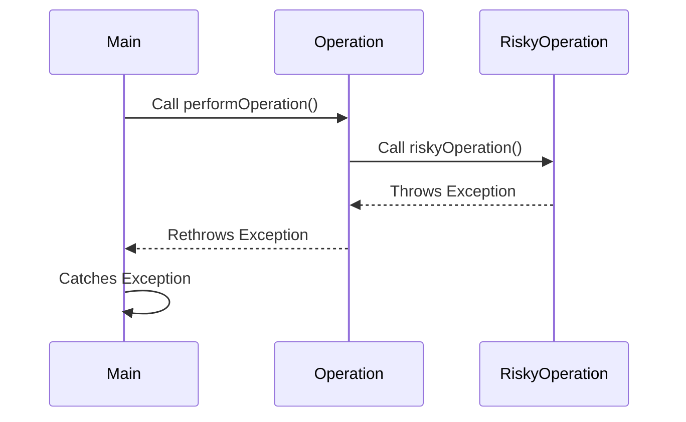

## 17.4 Misusing Exceptions and Error Handling

In the realm of software development, exceptions and error handling are crucial for building robust and maintainable applications. However, when misused, they can lead to convoluted code, known as "exception spaghetti," and obscure bugs that are difficult to trace and fix. In this section, we will delve into common anti-patterns associated with exception handling in D programming, explore best practices, and provide practical examples to guide you in writing cleaner and more effective error-handling code.

### Exception Spaghetti

**Exception Spaghetti** refers to the tangled and complex code that arises from the improper use of exceptions. This often results from:

#### Overuse of Exceptions

One of the most common pitfalls is the overuse of exceptions, particularly using them for control flow rather than for handling truly exceptional conditions. This misuse can lead to performance issues and make the codebase harder to understand and maintain.

**Example of Overuse:**

```d
void processItems(int[] items) {
    foreach (item; items) {
        try {
            if (item < 0) {
                throw new Exception("Negative value encountered");
            }
            // Process item
        } catch (Exception e) {
            // Handle exception
            writeln("Error: ", e.msg);
        }
    }
}
```

In this example, exceptions are used to handle a common condition (negative values), which could be more efficiently managed using a simple conditional check.

**Best Practice:**

Use exceptions for truly exceptional conditions that are unexpected and cannot be handled through regular control flow mechanisms.

```d
void processItems(int[] items) {
    foreach (item; items) {
        if (item < 0) {
            writeln("Warning: Negative value encountered, skipping item.");
            continue;
        }
        // Process item
    }
}
```

### Empty Catch Blocks

Another common anti-pattern is the use of empty catch blocks, which effectively swallow errors without providing any feedback or logging. This can lead to silent failures that are difficult to diagnose.

**Example of Empty Catch Block:**

```d
void readFile(string filename) {
    try {
        auto file = File(filename, "r");
        // Read file contents
    } catch (Exception) {
        // Do nothing
    }
}
```

This code catches exceptions but does nothing with them, potentially hiding critical errors such as file not found or permission issues.

**Best Practice:**

Always handle exceptions meaningfully, either by logging the error, rethrowing it, or taking corrective action.

```d
void readFile(string filename) {
    try {
        auto file = File(filename, "r");
        // Read file contents
    } catch (Exception e) {
        writeln("Failed to read file: ", e.msg);
        // Optionally rethrow or handle the error
    }
}
```

### Best Practices for Exception Handling

#### Appropriate Use

Exceptions should be used to handle unexpected conditions that cannot be managed through normal program logic. They are not a substitute for regular control flow constructs like `if` statements or loops.

#### Providing Context

When throwing exceptions, provide meaningful messages and include relevant data to aid in debugging and understanding the error context.

**Example:**

```d
void connectToDatabase(string connectionString) {
    if (connectionString.empty) {
        throw new Exception("Connection string cannot be empty.");
    }
    // Attempt to connect
}
```

#### Error Propagation

Ensure that errors are propagated appropriately through the call stack. This can be achieved by rethrowing exceptions or using custom exception types to convey specific error information.

**Example of Error Propagation:**

```d
void performOperation() {
    try {
        riskyOperation();
    } catch (Exception e) {
        writeln("Operation failed: ", e.msg);
        throw; // Rethrow to propagate the error
    }
}

void riskyOperation() {
    // Code that might throw an exception
}
```

### Use Cases and Examples

#### Error Propagation

Proper error propagation ensures that exceptions are not silently ignored and that the calling code can decide how to handle them.

**Example:**

```d
void main() {
    try {
        performOperation();
    } catch (Exception e) {
        writeln("An error occurred: ", e.msg);
        // Handle or log the error
    }
}
```

In this example, `performOperation` may throw an exception, which is caught and handled in the `main` function, allowing for centralized error management.

### Visualizing Exception Flow

To better understand how exceptions propagate through a program, let's visualize the flow using a sequence diagram.



**Diagram Description:**

This sequence diagram illustrates the flow of exceptions from `riskyOperation` to `performOperation`, and finally to the `main` function, where it is caught and handled.

### Try It Yourself

Experiment with the provided code examples by modifying the conditions under which exceptions are thrown or caught. Try adding logging or additional error handling logic to see how it affects the program's behavior.

### References and Links

- [D Programming Language: Exception Handling](https://dlang.org/spec/exceptions.html)
- [MDN Web Docs: Exception Handling Statements](https://developer.mozilla.org/en-US/docs/Web/JavaScript/Guide/Control_flow_and_error_handling#Exception_handling_statements)
- [Effective Java: Programming Language Guide](https://www.oreilly.com/library/view/effective-java/9780134686097/)

### Knowledge Check

- What is "exception spaghetti" and how can it be avoided?
- Why is it important to provide context when throwing exceptions?
- How can empty catch blocks lead to silent failures?

### Embrace the Journey

Remember, mastering exception handling is a journey. As you continue to develop your skills, you'll learn to write more resilient and maintainable code. Keep experimenting, stay curious, and enjoy the process of becoming a more proficient D programmer!

## Quiz Time!



### What is the primary purpose of exceptions in programming?

- [x] To handle unexpected conditions that cannot be managed through normal program logic.
- [ ] To replace all control flow constructs like `if` statements.
- [ ] To improve the performance of the program.
- [ ] To make the code more complex.

> **Explanation:** Exceptions are meant to handle unexpected conditions that are not part of the normal program flow, allowing the program to manage errors gracefully.

### What is a common issue with using exceptions for control flow?

- [x] It can lead to performance issues and make the codebase harder to understand.
- [ ] It simplifies the code and makes it easier to read.
- [ ] It is the recommended way to handle all conditions.
- [ ] It ensures that all errors are caught and handled.

> **Explanation:** Using exceptions for control flow can lead to performance issues and make the code more complex and harder to maintain.

### Why should empty catch blocks be avoided?

- [x] They can lead to silent failures and obscure bugs.
- [ ] They improve the performance of the program.
- [ ] They are the best way to handle exceptions.
- [ ] They make the code easier to read.

> **Explanation:** Empty catch blocks swallow exceptions without handling them, leading to silent failures that are difficult to diagnose.

### What should be included when throwing an exception?

- [x] A meaningful message and relevant data.
- [ ] Only the exception type.
- [ ] No additional information.
- [ ] A random error code.

> **Explanation:** Providing a meaningful message and relevant data helps in debugging and understanding the context of the error.

### How can errors be propagated through the call stack?

- [x] By rethrowing exceptions or using custom exception types.
- [ ] By ignoring them.
- [ ] By logging them and continuing execution.
- [ ] By using only `if` statements.

> **Explanation:** Rethrowing exceptions or using custom exception types ensures that errors are propagated and can be handled appropriately by the calling code.

### What is the benefit of providing context in exception messages?

- [x] It aids in debugging and understanding the error.
- [ ] It makes the code run faster.
- [ ] It is not necessary and can be omitted.
- [ ] It complicates the error handling process.

> **Explanation:** Providing context in exception messages helps developers understand the error and aids in debugging.

### What is a potential consequence of overusing exceptions?

- [x] It can lead to exception spaghetti and performance issues.
- [ ] It simplifies the code structure.
- [ ] It ensures all errors are handled.
- [ ] It improves code readability.

> **Explanation:** Overusing exceptions can lead to complex and tangled code, known as exception spaghetti, and can impact performance.

### How should exceptions be used in a program?

- [x] For handling truly exceptional conditions.
- [ ] For managing all control flow.
- [ ] For improving code readability.
- [ ] For replacing all error checks.

> **Explanation:** Exceptions should be used for handling truly exceptional conditions that are unexpected and cannot be managed through regular control flow.

### What is the role of a catch block in exception handling?

- [x] To handle exceptions and take corrective action.
- [ ] To ignore exceptions.
- [ ] To improve program performance.
- [ ] To replace all control flow constructs.

> **Explanation:** A catch block is used to handle exceptions and take corrective action, such as logging the error or rethrowing the exception.

### True or False: Using exceptions for control flow is a best practice.

- [ ] True
- [x] False

> **Explanation:** Using exceptions for control flow is not a best practice as it can lead to performance issues and make the codebase harder to understand and maintain.


