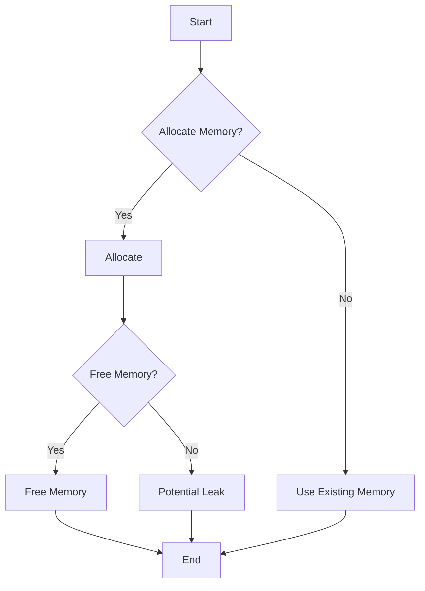

## 17.5 Inefficient Memory Management Practices

Memory management is a critical aspect of systems programming, especially in a language like D that offers both high-level abstractions and low-level control. Inefficient memory management can lead to performance degradation, resource leaks, and even application crashes. In this section, we will explore common pitfalls in memory management, focusing on memory leaks, excessive garbage collection, and best practices to ensure efficient resource management.

### Memory Leaks

Memory leaks occur when a program allocates memory but fails to release it back to the system. This can lead to increased memory usage and eventually exhaust available memory, causing the program to crash or become unresponsive.

#### Forgetting to Free Resources

One of the most common causes of memory leaks is neglecting to release memory that is no longer needed. In D, while the garbage collector (GC) handles most memory management tasks, there are scenarios where manual memory management is necessary, especially when interfacing with C or C++ libraries.

**Example:**

```d
import core.stdc.stdlib : malloc, free;

void memoryLeakExample() {
    // Allocate memory using C's malloc
    int* ptr = cast(int*) malloc(int.sizeof * 10);

    // Perform operations on the allocated memory
    for (int i = 0; i < 10; ++i) {
        ptr[i] = i * i;
    }

    // Forgetting to free the allocated memory
    // free(ptr); // This line is commented out, causing a memory leak
}
```

In the example above, memory is allocated using `malloc`, but the `free` function is not called, resulting in a memory leak. Always ensure that every `malloc` or similar allocation is paired with a corresponding `free`.

### Excessive Garbage Collection

D's garbage collector simplifies memory management by automatically reclaiming unused memory. However, over-reliance on the GC can lead to performance issues due to frequent collections, which can pause program execution.

#### Over-Reliance on GC

Relying solely on the garbage collector without considering its impact on performance can be detrimental, especially in performance-critical applications.

**Example:**

```d
import std.stdio;

void excessiveGCExample() {
    foreach (i; 0 .. 100_000) {
        // Creating a large number of temporary objects
        auto temp = new int[100];
        writeln(temp.length);
    }
}
```

In this example, a large number of temporary arrays are created, which can trigger frequent garbage collections. To mitigate this, consider reusing objects or using stack allocation where possible.

### Best Practices

To avoid inefficient memory management, adhere to best practices that ensure resources are managed effectively.

#### Resource Ownership

Clearly defining who is responsible for freeing resources is crucial. This can be achieved through ownership semantics, where each resource has a single owner responsible for its lifecycle.

#### Using RAII

Resource Acquisition Is Initialization (RAII) is a powerful idiom that ties resource management to object lifetime. In D, scope guards can be used to implement RAII, ensuring resources are automatically released when they go out of scope.

**Example:**

```d
import std.stdio;
import core.stdc.stdlib : malloc, free;

void raiiExample() {
    // Using a scope guard to ensure memory is freed
    int* ptr = cast(int*) malloc(int.sizeof * 10);
    scope(exit) free(ptr);

    // Perform operations on the allocated memory
    for (int i = 0; i < 10; ++i) {
        ptr[i] = i * i;
    }

    writeln("Memory managed with RAII");
}
```

In this example, the `scope(exit)` statement ensures that `free(ptr)` is called when the function exits, preventing memory leaks.

### Use Cases and Examples

Understanding the impact of poor memory management practices can help in identifying and rectifying them.

#### Performance Degradation

Inefficient memory management can lead to performance degradation, as demonstrated in the following example:

**Example:**

```d
import std.stdio;
import std.datetime : benchmark;

void performanceDegradationExample() {
    auto result = benchmark!(() {
        foreach (i; 0 .. 1_000_000) {
            auto temp = new int[100];
        }
    })();

    writeln("Execution time: ", result[0].msecs, " ms");
}

void main() {
    performanceDegradationExample();
}
```

In this example, the creation of a large number of temporary arrays results in significant execution time due to excessive garbage collection. Optimizing memory usage can lead to substantial performance improvements.

### Visualizing Memory Management in D

To better understand memory management in D, let's visualize the process using a flowchart.



**Caption:** This flowchart illustrates the decision-making process in memory management, highlighting the importance of freeing memory to prevent leaks.

### References and Links

- [D Programming Language: Memory Management](https://dlang.org/spec/garbage.html)
- [MDN Web Docs: Memory Management](https://developer.mozilla.org/en-US/docs/Web/JavaScript/Memory_Management)
- [W3Schools: Memory Management](https://www.w3schools.com/js/js_memory_management.asp)

### Knowledge Check

- What are the common causes of memory leaks in D?
- How can excessive garbage collection impact application performance?
- What is RAII, and how does it help in managing resources?

### Embrace the Journey

Remember, mastering memory management is a journey. As you progress, you'll develop a deeper understanding of how to optimize resource usage and improve application performance. Keep experimenting, stay curious, and enjoy the journey!

### Quiz Time!



### What is a common cause of memory leaks in D?

- [x] Forgetting to free allocated memory
- [ ] Using too many variables
- [ ] Overusing functions
- [ ] Writing too many lines of code

> **Explanation:** Forgetting to free allocated memory is a common cause of memory leaks, as it prevents the memory from being returned to the system.

### How can excessive garbage collection affect performance?

- [x] It can cause program execution to pause frequently
- [ ] It speeds up program execution
- [ ] It reduces memory usage
- [ ] It has no effect on performance

> **Explanation:** Excessive garbage collection can cause program execution to pause frequently, leading to performance degradation.

### What is the purpose of RAII in memory management?

- [x] To tie resource management to object lifetime
- [ ] To increase memory usage
- [ ] To slow down program execution
- [ ] To create more objects

> **Explanation:** RAII ties resource management to object lifetime, ensuring resources are automatically released when they go out of scope.

### Which D feature can be used to implement RAII?

- [x] Scope guards
- [ ] Arrays
- [ ] Functions
- [ ] Loops

> **Explanation:** Scope guards in D can be used to implement RAII, ensuring resources are released when they go out of scope.

### What is the impact of not freeing memory in a program?

- [x] It can lead to memory leaks
- [ ] It speeds up the program
- [x] It can cause the program to crash
- [ ] It has no impact

> **Explanation:** Not freeing memory can lead to memory leaks, which can cause the program to crash or become unresponsive.

### What is a potential solution to excessive garbage collection?

- [x] Reusing objects
- [ ] Creating more objects
- [ ] Increasing memory allocation
- [ ] Using more loops

> **Explanation:** Reusing objects can reduce the need for garbage collection, improving performance.

### How can you prevent memory leaks when using `malloc` in D?

- [x] By pairing `malloc` with `free`
- [ ] By using more variables
- [x] By using RAII
- [ ] By writing more code

> **Explanation:** Pairing `malloc` with `free` and using RAII can prevent memory leaks by ensuring allocated memory is released.

### What is the role of the garbage collector in D?

- [x] To automatically reclaim unused memory
- [ ] To increase memory usage
- [ ] To slow down the program
- [ ] To create more objects

> **Explanation:** The garbage collector in D automatically reclaims unused memory, simplifying memory management.

### What is a best practice for resource ownership?

- [x] Clearly defining who is responsible for freeing resources
- [ ] Using more functions
- [ ] Writing more code
- [ ] Ignoring memory usage

> **Explanation:** Clearly defining who is responsible for freeing resources ensures efficient memory management and prevents leaks.

### True or False: Over-reliance on the garbage collector can lead to performance issues.

- [x] True
- [ ] False

> **Explanation:** Over-reliance on the garbage collector can lead to performance issues due to frequent collections, which can pause program execution.


