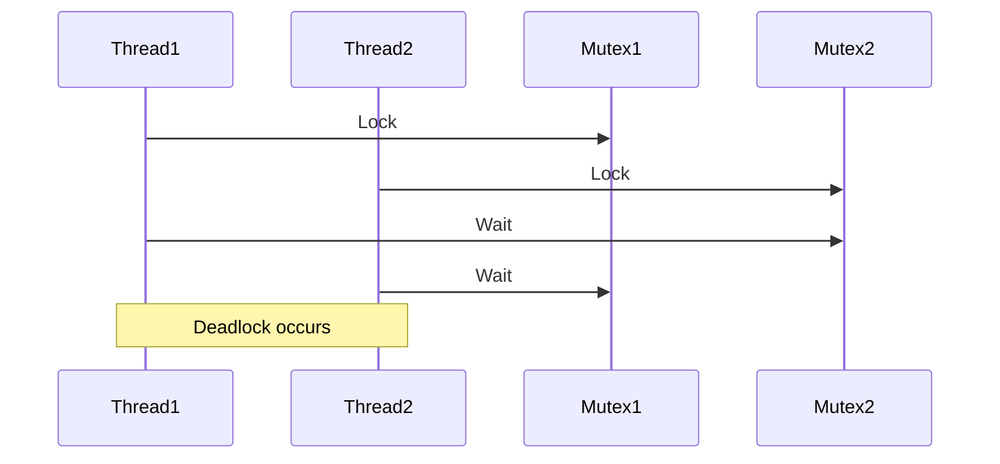

## 17.6 Concurrency Missteps and Deadlocks

Concurrency is a powerful tool in systems programming, allowing multiple tasks to run simultaneously, improving performance and responsiveness. However, it introduces complexity and potential pitfalls, such as data races and deadlocks, which can lead to unpredictable behavior and system hang-ups. In this section, we will explore these concurrency missteps, focusing on their causes, consequences, and strategies to avoid them in the D programming language.

### Improper Synchronization

Concurrency issues often arise from improper synchronization of shared resources. Let's delve into some common synchronization problems and how they manifest in D.

#### Data Races

A data race occurs when two or more threads access shared data simultaneously, and at least one of the accesses is a write. This can lead to inconsistent or incorrect results, as the order of operations is not guaranteed.

**Example of a Data Race in D:**

```d
import std.stdio;
import core.thread;

int sharedCounter = 0;

void incrementCounter() {
    foreach (i; 0 .. 1000) {
        sharedCounter++;
    }
}

void main() {
    auto t1 = new Thread(&incrementCounter);
    auto t2 = new Thread(&incrementCounter);

    t1.start();
    t2.start();

    t1.join();
    t2.join();

    writeln("Final counter value: ", sharedCounter);
}
```

**Explanation:**

In this example, two threads increment a shared counter. Without proper synchronization, the final value of `sharedCounter` is unpredictable due to concurrent modifications.

**Avoiding Data Races:**

To prevent data races, use synchronization primitives such as mutexes to ensure that only one thread can access the shared resource at a time.

**Corrected Example Using Mutex:**

```d
import std.stdio;
import core.thread;
import core.sync.mutex;

int sharedCounter = 0;
Mutex mtx;

void incrementCounter() {
    foreach (i; 0 .. 1000) {
        synchronized(mtx) {
            sharedCounter++;
        }
    }
}

void main() {
    auto t1 = new Thread(&incrementCounter);
    auto t2 = new Thread(&incrementCounter);

    t1.start();
    t2.start();

    t1.join();
    t2.join();

    writeln("Final counter value: ", sharedCounter);
}
```

**Key Takeaway:** Always protect shared data with appropriate synchronization mechanisms to avoid data races.

### Deadlocks

Deadlocks occur when two or more threads are blocked forever, each waiting for the other to release a resource. This situation can bring a system to a halt.

#### Resource Ordering Issues

Deadlocks often arise from inconsistent resource ordering. If threads acquire locks in different orders, a circular wait condition can occur, leading to a deadlock.

**Example of a Deadlock in D:**

```d
import std.stdio;
import core.thread;
import core.sync.mutex;

Mutex mtx1;
Mutex mtx2;

void thread1() {
    synchronized(mtx1) {
        Thread.sleep(1.seconds); // Simulate work
        synchronized(mtx2) {
            writeln("Thread 1 acquired both locks");
        }
    }
}

void thread2() {
    synchronized(mtx2) {
        Thread.sleep(1.seconds); // Simulate work
        synchronized(mtx1) {
            writeln("Thread 2 acquired both locks");
        }
    }
}

void main() {
    auto t1 = new Thread(&thread1);
    auto t2 = new Thread(&thread2);

    t1.start();
    t2.start();

    t1.join();
    t2.join();
}
```

**Explanation:**

In this example, `thread1` locks `mtx1` and then `mtx2`, while `thread2` locks `mtx2` and then `mtx1`. This creates a circular wait, resulting in a deadlock.

**Avoiding Deadlocks:**

1. **Lock Hierarchies:** Establish a global order for acquiring locks and ensure all threads follow this order.
2. **Avoid Blocking Operations:** Use non-blocking algorithms or try-lock mechanisms to prevent threads from waiting indefinitely.

**Corrected Example Using Lock Hierarchy:**

```d
import std.stdio;
import core.thread;
import core.sync.mutex;

Mutex mtx1;
Mutex mtx2;

void thread1() {
    synchronized(mtx1) {
        synchronized(mtx2) {
            writeln("Thread 1 acquired both locks");
        }
    }
}

void thread2() {
    synchronized(mtx1) {
        synchronized(mtx2) {
            writeln("Thread 2 acquired both locks");
        }
    }
}

void main() {
    auto t1 = new Thread(&thread1);
    auto t2 = new Thread(&thread2);

    t1.start();
    t2.start();

    t1.join();
    t2.join();
}
```

**Key Takeaway:** Consistent lock ordering is crucial to prevent deadlocks.

### Best Practices

To effectively manage concurrency and avoid common pitfalls, consider the following best practices:

#### Lock Hierarchies

- **Establish a Lock Order:** Define a consistent order for acquiring locks and ensure all threads adhere to it.
- **Document Locking Strategies:** Clearly document the locking strategy in your codebase to avoid confusion and errors.

#### Avoiding Blocking Operations

- **Use Non-Blocking Algorithms:** Where possible, use algorithms that do not require locks or that use try-lock mechanisms to avoid indefinite blocking.
- **Leverage D's Concurrency Features:** Utilize D's `std.concurrency` and `std.parallelism` modules for message-passing and parallel execution, which can reduce the need for explicit locking.

### Use Cases and Examples

Understanding the impact of concurrency missteps is crucial for designing robust systems. Let's explore some real-world scenarios where these issues can manifest.

#### System Hang-ups

Deadlocks can lead to system hang-ups, where the application becomes unresponsive. This is particularly critical in systems programming, where reliability and uptime are paramount.

**Example Scenario:**

Consider a server application that handles multiple client requests. If a deadlock occurs in the request handling logic, the server may stop responding, leading to downtime and potential data loss.

**Preventive Measures:**

- **Design for Concurrency:** Architect your application with concurrency in mind, using patterns such as the Actor model to minimize shared state.
- **Monitor and Test:** Regularly test your application under concurrent loads and monitor for deadlocks and performance bottlenecks.

### Visualizing Concurrency Issues

To better understand the flow of concurrency and potential deadlocks, let's visualize the process using a sequence diagram.



**Diagram Description:**

This sequence diagram illustrates how `Thread1` and `Thread2` acquire locks in different orders, leading to a deadlock.

### Try It Yourself

Experiment with the provided code examples by modifying the lock order or introducing additional threads. Observe how these changes affect the program's behavior and explore different synchronization strategies.

### References and Links

For further reading on concurrency and synchronization, consider the following resources:

- [Concurrency in D Programming](https://dlang.org/library/std/concurrency.html)
- [Mutex and Synchronization Primitives](https://dlang.org/phobos/core_sync_mutex.html)
- [Deadlock Prevention Techniques](https://en.wikipedia.org/wiki/Deadlock_prevention_algorithms)

### Knowledge Check

To reinforce your understanding, consider the following questions:

- What are the key differences between data races and deadlocks?
- How can lock hierarchies help prevent deadlocks?
- What are some non-blocking algorithms you can use to avoid concurrency issues?

### Embrace the Journey

Concurrency is a challenging but rewarding aspect of systems programming. By understanding and avoiding common pitfalls like data races and deadlocks, you can design more robust and efficient applications. Remember, this is just the beginning. Keep experimenting, stay curious, and enjoy the journey!

## Quiz Time!



### What is a data race?

- [x] A condition where two threads access shared data simultaneously, and at least one access is a write.
- [ ] A condition where two threads are waiting for each other to release resources.
- [ ] A situation where a program runs out of memory.
- [ ] A scenario where a thread is blocked indefinitely.

> **Explanation:** A data race occurs when two threads access shared data at the same time, and at least one of the accesses is a write, leading to unpredictable results.

### How can you prevent data races in D?

- [x] Use mutexes to synchronize access to shared data.
- [ ] Use more threads to increase parallelism.
- [ ] Avoid using shared data altogether.
- [ ] Use global variables instead of local ones.

> **Explanation:** Mutexes are used to synchronize access to shared data, ensuring that only one thread can modify the data at a time, thus preventing data races.

### What is a deadlock?

- [x] A situation where two or more threads are blocked forever, each waiting for the other to release a resource.
- [ ] A condition where a thread runs out of memory.
- [ ] A scenario where a program crashes unexpectedly.
- [ ] A situation where a thread completes its execution.

> **Explanation:** A deadlock occurs when two or more threads are blocked forever, each waiting for the other to release a resource, creating a circular wait condition.

### What is a common cause of deadlocks?

- [x] Inconsistent resource ordering.
- [ ] Using too many threads.
- [ ] Insufficient memory allocation.
- [ ] Excessive use of global variables.

> **Explanation:** Deadlocks often occur due to inconsistent resource ordering, where threads acquire locks in different orders, leading to a circular wait condition.

### What is a lock hierarchy?

- [x] A predefined order for acquiring locks to prevent deadlocks.
- [ ] A method for increasing the number of locks in a program.
- [ ] A way to reduce the number of threads in a program.
- [ ] A strategy for optimizing memory usage.

> **Explanation:** A lock hierarchy is a predefined order for acquiring locks, ensuring that all threads follow the same order, thus preventing deadlocks.

### How can non-blocking algorithms help in concurrency?

- [x] They avoid indefinite blocking by not requiring locks.
- [ ] They increase the number of threads.
- [ ] They reduce memory usage.
- [ ] They simplify the code structure.

> **Explanation:** Non-blocking algorithms avoid indefinite blocking by not requiring locks, allowing threads to proceed without waiting for resources to be released.

### What is the role of `std.concurrency` in D?

- [x] It provides message-passing capabilities for concurrent programming.
- [ ] It increases the speed of single-threaded applications.
- [ ] It reduces the memory footprint of applications.
- [ ] It simplifies the syntax of D programs.

> **Explanation:** `std.concurrency` provides message-passing capabilities, allowing threads to communicate without sharing state, reducing the need for explicit locking.

### What is the impact of deadlocks on a system?

- [x] They can cause the system to become unresponsive.
- [ ] They increase the system's performance.
- [ ] They reduce the system's memory usage.
- [ ] They simplify the system's architecture.

> **Explanation:** Deadlocks can cause the system to become unresponsive, as threads are blocked indefinitely, waiting for resources to be released.

### How can you monitor for deadlocks in a system?

- [x] Regularly test under concurrent loads and use monitoring tools.
- [ ] Increase the number of threads.
- [ ] Reduce the amount of shared data.
- [ ] Use more global variables.

> **Explanation:** Regular testing under concurrent loads and using monitoring tools can help detect deadlocks and performance bottlenecks in a system.

### True or False: Consistent lock ordering is crucial to prevent deadlocks.

- [x] True
- [ ] False

> **Explanation:** Consistent lock ordering is crucial to prevent deadlocks, as it ensures that all threads acquire locks in the same order, avoiding circular waits.




