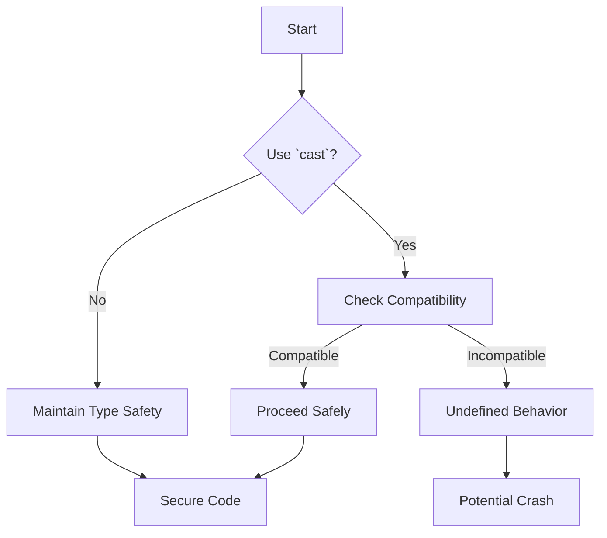

## 17.7 Bypassing Type Safety and Safety Mechanisms

In the realm of systems programming, ensuring the safety and reliability of your code is paramount. The D programming language offers robust type safety and safety mechanisms to help developers write secure and efficient code. However, there are scenarios where developers might be tempted to bypass these mechanisms, often leading to unintended consequences. In this section, we will explore the dangers of bypassing type safety and safety mechanisms, the common pitfalls associated with such practices, and best practices to maintain code integrity.

### Using `cast` Indiscriminately

#### Type Casting Risks

Type casting is a powerful tool in programming that allows developers to convert a variable from one type to another. In D, the `cast` keyword is used for this purpose. However, indiscriminate use of `cast` can lead to several risks:

- **Loss of Type Information**: Casting can strip away important type information, leading to errors that are difficult to debug.
- **Undefined Behavior**: Casting between incompatible types can result in undefined behavior, which can manifest as crashes or incorrect program logic.
- **Security Vulnerabilities**: Improper casting can open up security vulnerabilities, especially if it leads to buffer overflows or memory corruption.

#### Example of Unsafe Casting

```d
import std.stdio;

void main() {
    int a = 42;
    // Unsafe cast from int to pointer
    void* ptr = cast(void*)a;
    writeln("Pointer value: ", ptr);
    
    // Attempting to cast back to int
    int b = cast(int)ptr;
    writeln("Recovered value: ", b);
}
```

In this example, casting an integer to a pointer and back can lead to undefined behavior, especially if the architecture does not support such conversions natively.

### Disabling Safety Attributes

#### `@system` Overuse

D provides three safety attributes: `@safe`, `@trusted`, and `@system`. These attributes help developers specify the safety level of their code:

- **`@safe`**: Guarantees memory safety, preventing operations that could lead to undefined behavior.
- **`@trusted`**: Allows certain operations that are not `@safe`, but the developer guarantees their safety.
- **`@system`**: No safety checks are enforced, and the developer takes full responsibility for the code's safety.

Overusing `@system` can lead to:

- **Increased Risk of Bugs**: Without safety checks, the likelihood of introducing bugs increases.
- **Maintenance Challenges**: Future developers may struggle to understand and maintain `@system` code.
- **Security Risks**: `@system` code can inadvertently introduce vulnerabilities.

#### Example of `@system` Overuse

```d
@system void unsafeFunction() {
    int* ptr = null;
    *ptr = 42; // Dereferencing a null pointer
}

void main() {
    unsafeFunction();
}
```

This code demonstrates a classic mistake: dereferencing a null pointer. Marking the function as `@system` bypasses safety checks, leading to potential crashes.

### Best Practices

#### Embracing Type Safety

- **Leverage Compiler Checks**: Use the compiler's type checks to catch errors early in the development process.
- **Use `@safe` by Default**: Start with `@safe` and only relax to `@trusted` or `@system` when absolutely necessary.
- **Avoid Unnecessary Casting**: Only use `cast` when there is no alternative, and ensure the cast is safe.

#### Minimizing Unsafe Code

- **Isolate `@system` Code**: Keep `@system` code isolated and well-documented to minimize its impact on the rest of the codebase.
- **Justify `@system` Usage**: Clearly document why `@system` is necessary and what safety guarantees are being made.
- **Regular Code Reviews**: Conduct regular code reviews to ensure that `@system` code is justified and safe.

### Use Cases and Examples

#### Undefined Behavior

Ignoring safety features can lead to undefined behavior, which is notoriously difficult to diagnose and fix. Consider the following example:

```d
@system void riskyOperation() {
    int[] arr = [1, 2, 3];
    int outOfBounds = arr[5]; // Accessing out-of-bounds index
    writeln("Value: ", outOfBounds);
}

void main() {
    riskyOperation();
}
```

Accessing an out-of-bounds index can lead to unpredictable results, including crashes or data corruption.

### Visualizing Type Safety

To better understand the flow of type safety and the impact of bypassing it, let's visualize the process using a flowchart.



**Figure 1**: This flowchart illustrates the decision-making process when considering type casting. It highlights the importance of checking compatibility to avoid undefined behavior.

### References and Links

- [D Programming Language Specification](https://dlang.org/spec/spec.html)
- [Memory Safety in D](https://dlang.org/spec/memory-safe-d.html)
- [Type Safety in Programming](https://en.wikipedia.org/wiki/Type_safety)

### Knowledge Check

To reinforce your understanding of bypassing type safety and safety mechanisms, consider the following questions:

1. What are the risks associated with indiscriminate use of `cast` in D?
2. How can overuse of `@system` attributes affect code maintainability?
3. Why is it important to isolate `@system` code in a project?
4. What are some best practices for minimizing unsafe code in D?
5. How can undefined behavior manifest in a program?

### Embrace the Journey

Remember, mastering type safety and safety mechanisms is a journey. By understanding the risks and best practices, you can write more secure and reliable code. Keep experimenting, stay curious, and enjoy the process of learning and improving your skills.

## Quiz Time!



### What is a major risk of using `cast` indiscriminately in D?

- [x] Loss of type information
- [ ] Improved performance
- [ ] Enhanced readability
- [ ] Increased code maintainability

> **Explanation:** Indiscriminate use of `cast` can lead to loss of type information, making the code error-prone and difficult to debug.


### Which attribute in D guarantees memory safety?

- [x] `@safe`
- [ ] `@trusted`
- [ ] `@system`
- [ ] `@nogc`

> **Explanation:** The `@safe` attribute in D guarantees memory safety by preventing operations that could lead to undefined behavior.


### What is a consequence of overusing `@system` in D code?

- [x] Increased risk of bugs
- [ ] Improved code readability
- [ ] Enhanced performance
- [ ] Simplified debugging

> **Explanation:** Overusing `@system` increases the risk of bugs because it bypasses safety checks, making the code more prone to errors.


### Why should `@system` code be isolated?

- [x] To minimize its impact on the rest of the codebase
- [ ] To improve performance
- [ ] To enhance readability
- [ ] To simplify testing

> **Explanation:** Isolating `@system` code helps minimize its impact on the rest of the codebase, making it easier to manage and maintain.


### What should be done before using `cast` in D?

- [x] Check compatibility between types
- [ ] Ensure the code is `@system`
- [ ] Disable safety checks
- [ ] Use `@trusted` attribute

> **Explanation:** Before using `cast`, it's important to check compatibility between types to avoid undefined behavior.


### What is a best practice for minimizing unsafe code in D?

- [x] Use `@safe` by default
- [ ] Use `@system` liberally
- [ ] Avoid type checks
- [ ] Disable compiler warnings

> **Explanation:** Using `@safe` by default helps minimize unsafe code by leveraging the compiler's safety checks.


### How can undefined behavior manifest in a program?

- [x] Crashes or data corruption
- [ ] Improved performance
- [ ] Enhanced readability
- [ ] Simplified debugging

> **Explanation:** Undefined behavior can lead to crashes or data corruption, making the program unreliable.


### What is the role of `@trusted` in D?

- [x] Allows certain operations not `@safe`, with developer guarantees
- [ ] Disables all safety checks
- [ ] Ensures memory safety
- [ ] Improves performance

> **Explanation:** `@trusted` allows certain operations that are not `@safe`, but the developer guarantees their safety.


### Why is it important to justify `@system` usage?

- [x] To ensure safety guarantees are made
- [ ] To improve performance
- [ ] To enhance readability
- [ ] To simplify debugging

> **Explanation:** Justifying `@system` usage ensures that safety guarantees are made, helping maintain code integrity.


### True or False: Using `cast` always improves code performance.

- [ ] True
- [x] False

> **Explanation:** Using `cast` does not always improve code performance; it can lead to undefined behavior and errors if not used carefully.


