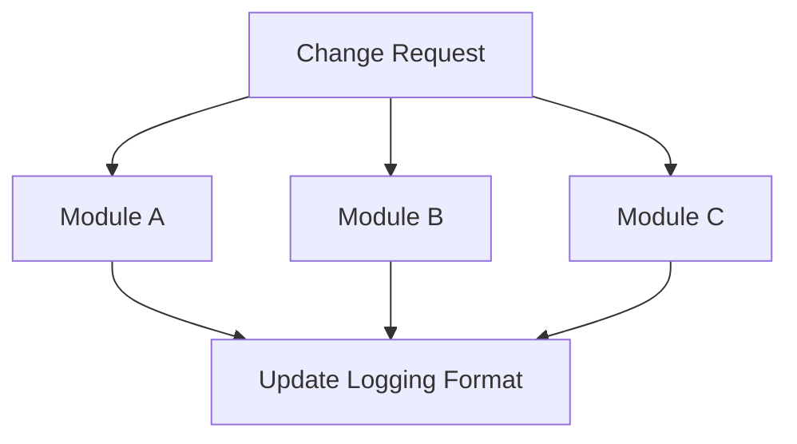

## 17.8 Refactoring Anti-Patterns

Refactoring is a critical aspect of software development, allowing us to improve the structure and readability of code without altering its external behavior. However, when done incorrectly, refactoring can introduce anti-patterns that degrade code quality and hinder project progress. In this section, we will explore common refactoring anti-patterns, such as Shotgun Surgery and Gold Plating, and provide best practices for effective refactoring in the D programming language.

### Understanding Refactoring Anti-Patterns

Refactoring anti-patterns are common pitfalls that developers encounter when attempting to improve code. These anti-patterns often result from a lack of planning, understanding, or discipline during the refactoring process. Let's delve into some of the most prevalent refactoring anti-patterns.

#### Shotgun Surgery

**Shotgun Surgery** occurs when a single change in the codebase requires modifications across multiple files or modules. This anti-pattern is often a symptom of poor modularization or tight coupling between components.

- **Widespread Changes**: Making frequent, small changes across many files can lead to increased complexity and a higher risk of introducing bugs. It also makes the codebase harder to maintain and understand.

**Example of Shotgun Surgery in D:**

Consider a scenario where you have a logging mechanism spread across various modules in your D application. If you decide to change the logging format, you might need to update multiple files, leading to Shotgun Surgery.

```d
// Module A
void logMessage(string message) {
    // Old logging format
    writeln("[INFO]: ", message);
}

// Module B
void logError(string error) {
    // Old logging format
    writeln("[ERROR]: ", error);
}

// Module C
void logWarning(string warning) {
    // Old logging format
    writeln("[WARNING]: ", warning);
}
```

To refactor and avoid Shotgun Surgery, centralize the logging logic:

```d
// Centralized Logging Module
module logging;

void log(string level, string message) {
    writeln("[", level, "]: ", message);
}

// Usage in other modules
import logging;

void logMessage(string message) {
    log("INFO", message);
}

void logError(string error) {
    log("ERROR", error);
}

void logWarning(string warning) {
    log("WARNING", warning);
}
```

By centralizing the logging logic, you reduce the need for widespread changes when modifying the logging format.

#### Gold Plating

**Gold Plating** refers to the practice of adding unnecessary features or complexity to the codebase. This anti-pattern often stems from overengineering or attempting to future-proof the software without clear requirements.

- **Overengineering**: Adding features or complexity without justification can lead to bloated code, increased maintenance costs, and potential performance issues.

**Example of Gold Plating in D:**

Imagine you are developing a simple calculator application. Instead of focusing on the core functionality, you decide to add advanced features like graph plotting and scientific calculations, which are not part of the initial requirements.

```d
// Basic Calculator
module calculator;

int add(int a, int b) {
    return a + b;
}

int subtract(int a, int b) {
    return a - b;
}

// Gold Plating: Adding unnecessary features
void plotGraph() {
    // Complex graph plotting logic
}

void scientificCalculation() {
    // Advanced scientific calculations
}
```

To avoid Gold Plating, adhere to the **YAGNI (You Aren't Gonna Need It)** principle, which emphasizes implementing only the necessary features.

### Best Practices for Refactoring

To refactor effectively and avoid anti-patterns, follow these best practices:

#### Incremental Refactoring

- **Make Manageable Changes**: Break down refactoring tasks into small, manageable changes that can be easily tested and verified. This approach reduces the risk of introducing errors and makes it easier to track progress.

- **Test-Driven Refactoring**: Write tests before refactoring to ensure that the code's behavior remains unchanged. Automated tests provide a safety net, allowing you to refactor with confidence.

#### YAGNI Principle

- **Avoid Unnecessary Enhancements**: Focus on implementing only the features that are currently needed. Resist the temptation to add speculative features that may never be used.

- **Prioritize Simplicity**: Strive for simplicity in your code. Simple code is easier to understand, maintain, and refactor.

### Use Cases and Examples

Let's explore some real-world scenarios where refactoring anti-patterns can impede project progress and how to address them.

#### Project Slowdown

When refactoring anti-patterns like Shotgun Surgery and Gold Plating are present, they can lead to project slowdowns. Developers may spend excessive time making changes across multiple files or maintaining unnecessary features, diverting focus from delivering value to users.

**Addressing Project Slowdown:**

- **Conduct Code Reviews**: Regular code reviews can help identify and address refactoring anti-patterns early. Encourage team members to provide constructive feedback and suggest improvements.

- **Refactor in Iterations**: Approach refactoring as an iterative process. Set clear goals for each iteration and measure progress against them.

- **Leverage D's Features**: Utilize D's powerful features, such as templates and mixins, to create reusable and modular code. This can help reduce the risk of Shotgun Surgery and promote code reuse.

### Visualizing Refactoring Anti-Patterns

To better understand the impact of refactoring anti-patterns, let's visualize the concept of Shotgun Surgery using a Mermaid.js diagram.



**Diagram Description:** The diagram illustrates how a single change request can lead to modifications across multiple modules, exemplifying Shotgun Surgery.

### Try It Yourself

To reinforce your understanding of refactoring anti-patterns, try the following exercises:

1. **Identify Anti-Patterns**: Review a codebase you are familiar with and identify any instances of Shotgun Surgery or Gold Plating. Document your findings and propose refactoring strategies.

2. **Refactor a Codebase**: Choose a small project and refactor it to eliminate any identified anti-patterns. Focus on centralizing logic and adhering to the YAGNI principle.

3. **Experiment with D Features**: Use D's templates and mixins to refactor a piece of code, promoting modularity and reducing duplication.

### Knowledge Check

- **What is Shotgun Surgery, and how can it be avoided?**
- **Explain the YAGNI principle and its importance in refactoring.**
- **Describe a scenario where Gold Plating might occur.**

### Embrace the Journey

Remember, refactoring is an ongoing process that requires discipline and attention to detail. By avoiding anti-patterns and following best practices, you can enhance the quality and maintainability of your code. Keep experimenting, stay curious, and enjoy the journey of mastering design patterns in D!

## Quiz Time!



### What is Shotgun Surgery?

- [x] A refactoring anti-pattern where changes are required across multiple files.
- [ ] A design pattern for modularizing code.
- [ ] A method for optimizing performance.
- [ ] A technique for improving code readability.

> **Explanation:** Shotgun Surgery is a refactoring anti-pattern characterized by the need to make changes across multiple files or modules.

### How can Gold Plating be avoided?

- [x] By adhering to the YAGNI principle.
- [ ] By adding more features to the codebase.
- [ ] By increasing code complexity.
- [ ] By ignoring user requirements.

> **Explanation:** Gold Plating can be avoided by following the YAGNI principle, which emphasizes implementing only necessary features.

### What does YAGNI stand for?

- [x] You Aren't Gonna Need It
- [ ] You Always Get New Ideas
- [ ] Your Application Grows Naturally
- [ ] Your Algorithms Generate New Insights

> **Explanation:** YAGNI stands for "You Aren't Gonna Need It," a principle that discourages adding unnecessary features.

### Which of the following is a symptom of Shotgun Surgery?

- [x] Frequent changes across many files.
- [ ] Single responsibility principle.
- [ ] High cohesion within modules.
- [ ] Low coupling between components.

> **Explanation:** Shotgun Surgery is characterized by frequent changes across many files, indicating poor modularization.

### What is the primary goal of refactoring?

- [x] To improve code structure without changing its behavior.
- [ ] To add new features to the software.
- [ ] To increase code complexity.
- [ ] To remove all comments from the code.

> **Explanation:** The primary goal of refactoring is to improve the code structure while maintaining its external behavior.

### Which D feature can help reduce Shotgun Surgery?

- [x] Templates and mixins
- [ ] Inline assembly
- [ ] Manual memory management
- [ ] Direct hardware access

> **Explanation:** D's templates and mixins can help create reusable and modular code, reducing the risk of Shotgun Surgery.

### What is a potential consequence of Gold Plating?

- [x] Increased maintenance costs
- [ ] Improved performance
- [ ] Simplified codebase
- [ ] Enhanced user satisfaction

> **Explanation:** Gold Plating can lead to increased maintenance costs due to unnecessary complexity and features.

### How can incremental refactoring be beneficial?

- [x] It reduces the risk of introducing errors.
- [ ] It speeds up the development process.
- [ ] It eliminates the need for testing.
- [ ] It allows for speculative feature additions.

> **Explanation:** Incremental refactoring reduces the risk of introducing errors by making small, manageable changes.

### What is the role of automated tests in refactoring?

- [x] To ensure code behavior remains unchanged.
- [ ] To eliminate the need for manual testing.
- [ ] To increase code complexity.
- [ ] To add new features to the software.

> **Explanation:** Automated tests provide a safety net during refactoring, ensuring that the code's behavior remains unchanged.

### True or False: Refactoring should always be done in large, sweeping changes.

- [ ] True
- [x] False

> **Explanation:** Refactoring should be done incrementally, with small, manageable changes to reduce the risk of errors.


