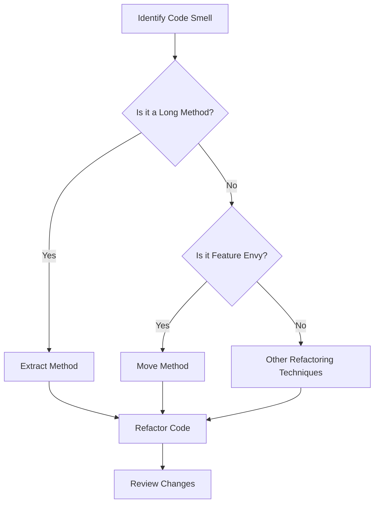

## 17.9 Recognizing and Eliminating Code Smells

In the realm of software development, code smells are subtle indicators of deeper problems within the codebase. They are not bugs or errors but rather symptoms of underlying issues that can lead to increased complexity, reduced maintainability, and potential defects if left unaddressed. Recognizing and eliminating these code smells is crucial for maintaining high-quality software, especially in a language like D, which offers powerful features for systems programming.

### Understanding Code Smells

**Code Smells** are characteristics in the source code that suggest the presence of deeper problems. They are often subjective and context-dependent, but they serve as valuable heuristics for identifying areas of the code that may benefit from refactoring.

#### Indicators of Deeper Problems

- **Complexity**: Code that is difficult to understand or modify.
- **Duplication**: Repeated code that violates the DRY (Don't Repeat Yourself) principle.
- **Rigidity**: Code that is hard to change due to tight coupling.
- **Fragility**: Code that breaks in unexpected ways when modified.
- **Immobility**: Code that is hard to reuse in other contexts.

### Common Code Smells

Let's delve into some of the most prevalent code smells and how they manifest in D programming.

#### Long Methods

**Long Methods** are functions that try to do too much. They often contain complex logic, making them hard to understand and maintain. In D, leveraging features like templates and mixins can help break down long methods into smaller, reusable components.

```d
// Example of a long method
void processData(string data) {
    // Parsing data
    auto parsedData = parse(data);
    // Validating data
    if (!validate(parsedData)) {
        throw new Exception("Invalid data");
    }
    // Processing data
    // ...
    // More processing
    // ...
}

// Refactored version using smaller methods
void processData(string data) {
    auto parsedData = parse(data);
    validateData(parsedData);
    processValidData(parsedData);
}

void validateData(auto parsedData) {
    if (!validate(parsedData)) {
        throw new Exception("Invalid data");
    }
}

void processValidData(auto parsedData) {
    // Processing logic
}
```

#### Feature Envy

**Feature Envy** occurs when a method in one class relies heavily on the data or methods of another class. This often indicates that the method might be better placed in the class it envies.

```d
class Order {
    Customer customer;
    double calculateDiscount() {
        // Feature envy: accessing customer details
        if (customer.isLoyal()) {
            return 0.1;
        }
        return 0.0;
    }
}

// Refactored to move the method to the Customer class
class Customer {
    bool isLoyal() {
        // Loyalty logic
    }
    double calculateDiscount() {
        if (isLoyal()) {
            return 0.1;
        }
        return 0.0;
    }
}
```

### Best Practices for Addressing Code Smells

#### Regular Review

Regularly reviewing code is essential for identifying and addressing code smells. Code reviews, pair programming, and static analysis tools can help in this process.

- **Code Reviews**: Encourage team members to review each other's code to catch smells early.
- **Static Analysis Tools**: Use tools that can automatically detect certain code smells and suggest improvements.

#### Refactoring Techniques

Refactoring is the process of restructuring existing code without changing its external behavior. It is a powerful technique for eliminating code smells.

- **Extract Method**: Break down long methods into smaller, more focused methods.
- **Move Method**: Relocate methods to the class where they logically belong.
- **Replace Temp with Query**: Replace temporary variables with method calls to improve clarity.
- **Introduce Parameter Object**: Use objects to group parameters that are frequently passed together.

### Use Cases and Examples

#### Improving Code Quality

Refactoring to eliminate code smells enhances code quality by making it more understandable, maintainable, and flexible. Let's explore a real-world example.

**Scenario**: A legacy system has a method that calculates the total price of an order, including discounts and taxes. The method is long and difficult to understand.

**Solution**: Refactor the method by extracting smaller methods for each step of the calculation.

```d
// Original method
double calculateTotalPrice(Order order) {
    double total = 0;
    foreach (item; order.items) {
        total += item.price;
    }
    if (order.customer.isLoyal()) {
        total *= 0.9; // Apply discount
    }
    total *= 1.2; // Apply tax
    return total;
}

// Refactored version
double calculateTotalPrice(Order order) {
    double subtotal = calculateSubtotal(order);
    double discount = applyDiscount(subtotal, order.customer);
    return applyTax(discount);
}

double calculateSubtotal(Order order) {
    double total = 0;
    foreach (item; order.items) {
        total += item.price;
    }
    return total;
}

double applyDiscount(double subtotal, Customer customer) {
    if (customer.isLoyal()) {
        return subtotal * 0.9;
    }
    return subtotal;
}

double applyTax(double amount) {
    return amount * 1.2;
}
```

### Visualizing Code Smells

To better understand how code smells can affect a codebase, let's visualize the process of identifying and refactoring a code smell using a flowchart.



### Try It Yourself

Experiment with the provided code examples by modifying them to introduce or eliminate code smells. For instance, try adding more logic to the `calculateTotalPrice` method and then refactor it to maintain clarity.

### References and Links

- [Martin Fowler's Refactoring](https://martinfowler.com/books/refactoring.html)
- [Code Smells and Refactoring](https://refactoring.guru/refactoring/smells)
- [D Programming Language](https://dlang.org/)

### Knowledge Check

- What are code smells, and why are they important to recognize?
- How can long methods be refactored to improve code quality?
- What is feature envy, and how can it be addressed?
- Why is regular code review important in identifying code smells?

### Embrace the Journey

Remember, recognizing and eliminating code smells is an ongoing process. As you continue to develop your skills in D programming, you'll become more adept at identifying these smells and applying the appropriate refactoring techniques. Keep experimenting, stay curious, and enjoy the journey!

## Quiz Time!



### What is a code smell?

- [x] An indicator of potential deeper problems in the code
- [ ] A syntax error in the code
- [ ] A feature of the D programming language
- [ ] A type of software bug

> **Explanation:** A code smell is a characteristic in the code that suggests there may be a deeper problem, but it is not a bug or error itself.

### Which of the following is a common code smell?

- [x] Long Methods
- [ ] Short Methods
- [ ] Well-Documented Code
- [ ] Efficient Algorithms

> **Explanation:** Long methods are a common code smell because they often contain too much logic, making them hard to understand and maintain.

### How can feature envy be addressed?

- [x] By moving the method to the class it envies
- [ ] By adding more features to the method
- [ ] By removing the method entirely
- [ ] By renaming the method

> **Explanation:** Feature envy can be addressed by relocating the method to the class that contains the data it heavily relies on.

### What is the purpose of refactoring?

- [x] To improve the structure of the code without changing its behavior
- [ ] To add new features to the code
- [ ] To fix bugs in the code
- [ ] To rewrite the code from scratch

> **Explanation:** Refactoring is the process of restructuring existing code to improve its readability and maintainability without altering its external behavior.

### Which refactoring technique involves breaking down long methods?

- [x] Extract Method
- [ ] Move Method
- [ ] Replace Temp with Query
- [ ] Introduce Parameter Object

> **Explanation:** The Extract Method technique involves breaking down long methods into smaller, more focused methods.

### Why is regular code review important?

- [x] It helps identify code smells early
- [ ] It increases the number of lines of code
- [ ] It makes the code run faster
- [ ] It reduces the need for documentation

> **Explanation:** Regular code reviews help in identifying code smells early, allowing for timely refactoring and improvement of code quality.

### What is the DRY principle?

- [x] Don't Repeat Yourself
- [ ] Do Repeat Yourself
- [ ] Don't Refactor Yourself
- [ ] Do Refactor Yourself

> **Explanation:** The DRY principle stands for "Don't Repeat Yourself," emphasizing the importance of reducing code duplication.

### What does the term "rigidity" refer to in code smells?

- [x] Code that is hard to change due to tight coupling
- [ ] Code that is easy to modify
- [ ] Code that is well-documented
- [ ] Code that is highly efficient

> **Explanation:** Rigidity refers to code that is difficult to change because of its tight coupling with other parts of the system.

### How can static analysis tools help in identifying code smells?

- [x] By automatically detecting certain code smells and suggesting improvements
- [ ] By writing new code
- [ ] By deleting old code
- [ ] By compiling the code faster

> **Explanation:** Static analysis tools can automatically detect certain code smells and suggest improvements, aiding in the refactoring process.

### True or False: Code smells are always bugs.

- [ ] True
- [x] False

> **Explanation:** Code smells are not bugs; they are indicators of potential deeper problems in the code that may lead to issues if not addressed.


