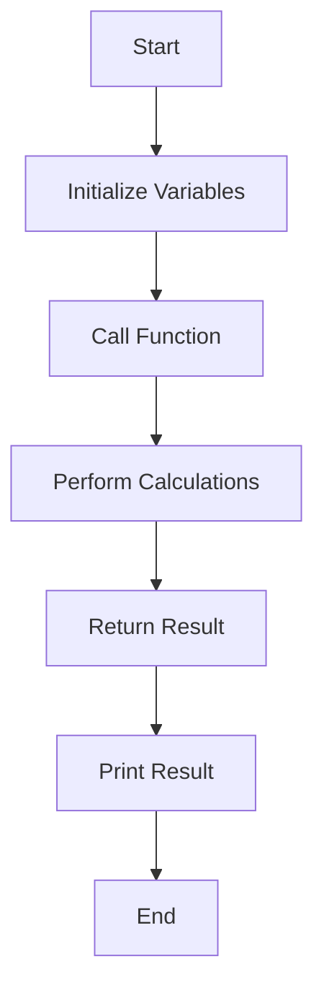

## 18.1 Writing Idiomatic D Code

Writing idiomatic code is essential for any programming language, and D is no exception. Idiomatic D code leverages the language's unique features, follows community conventions, and ensures that the code is both readable and maintainable. In this section, we will explore how to write idiomatic D code by embracing language features, maintaining consistency in style, and ensuring code readability and maintainability.

### Embracing Language Features

D is a powerful language that offers a variety of features to make your code more expressive and efficient. By embracing these features, you can write code that is not only idiomatic but also takes full advantage of what D has to offer.

#### Ranges and UFCS

Ranges and Uniform Function Call Syntax (UFCS) are two of D's most powerful constructs. They allow you to write concise and expressive code that is easy to read and maintain.

**Ranges** are a generalization of arrays and other collections. They provide a uniform way to iterate over sequences of elements. Ranges are lazy by default, meaning they only compute values as needed, which can lead to significant performance improvements.

**UFCS** allows you to call functions as if they were methods on the first argument. This can make your code more readable and expressive.

Here's an example of using ranges and UFCS in D:

```d
import std.algorithm;
import std.range;
import std.stdio;

void main() {
    auto numbers = iota(1, 10); // Create a range from 1 to 9
    auto evenNumbers = numbers.filter!(n => n % 2 == 0); // Filter even numbers
    auto squaredNumbers = evenNumbers.map!(n => n * n); // Square each number

    squaredNumbers.each!writeln; // Print each squared number
}
```

In this example, we use `iota` to create a range of numbers, `filter` to select only even numbers, and `map` to square each number. The `each` function is used to print each result. Notice how UFCS allows us to chain these operations together in a natural and readable way.

#### Templates and Mixins

Templates and mixins are powerful compile-time features in D that allow you to write generic and reusable code.

**Templates** enable you to write functions and types that can operate on a variety of data types. They are similar to generics in other languages but offer more flexibility.

**Mixins** allow you to include code from one part of your program into another at compile time. This can be useful for code generation and metaprogramming.

Here's an example of using templates and mixins in D:

```d
import std.stdio;

// A generic function that prints any type of array
void printArray(T)(T[] array) {
    foreach (element; array) {
        writeln(element);
    }
}

// A mixin that adds a method to a class
mixin template AddMethod() {
    void hello() {
        writeln("Hello from mixin!");
    }
}

class MyClass {
    mixin AddMethod; // Include the mixin
}

void main() {
    int[] numbers = [1, 2, 3, 4, 5];
    printArray(numbers); // Use the template function

    MyClass obj = new MyClass();
    obj.hello(); // Use the mixin method
}
```

In this example, we define a template function `printArray` that can print any type of array. We also define a mixin template `AddMethod` that adds a `hello` method to a class. This demonstrates how templates and mixins can be used to write generic and reusable code.

### Consistency in Style

Consistency in coding style is crucial for writing idiomatic D code. It ensures that your code is easy to read and understand, both for yourself and for others who may work on your code in the future.

#### Coding Conventions

Following community standards and coding conventions is an important aspect of writing idiomatic D code. Here are some key conventions to keep in mind:

- **Naming Conventions**: Use camelCase for variable and function names, and PascalCase for type names.
- **Indentation**: Use spaces instead of tabs for indentation, and maintain a consistent indentation level (typically 4 spaces).
- **Braces**: Place opening braces on the same line as the statement they belong to, and closing braces on a new line.
- **Comments**: Use comments to explain complex logic or important decisions in your code. Avoid redundant comments that simply restate what the code does.

Here's an example of code that follows these conventions:

```d
import std.stdio;

void calculateSum(int a, int b) {
    // Calculate the sum of two numbers
    int sum = a + b;
    writeln("The sum is: ", sum);
}

void main() {
    int firstNumber = 5;
    int secondNumber = 10;
    calculateSum(firstNumber, secondNumber);
}
```

In this example, we follow the naming conventions for variables and functions, use consistent indentation, and include a comment to explain the purpose of the `calculateSum` function.

### Use Cases and Examples

Writing idiomatic D code involves more than just following language features and coding conventions. It also requires writing code that is readable and maintainable.

#### Readable Code

Readable code is code that is easy to understand at a glance. It uses clear and descriptive names, avoids unnecessary complexity, and is well-organized.

Here are some tips for writing readable code:

- **Use Descriptive Names**: Choose names that clearly describe the purpose of variables, functions, and types.
- **Avoid Deep Nesting**: Keep your code flat and avoid deep nesting of loops and conditionals.
- **Break Down Complex Logic**: Split complex logic into smaller, more manageable functions.

Here's an example of readable code:

```d
import std.stdio;

// Calculate the factorial of a number
int factorial(int n) {
    if (n <= 1) {
        return 1;
    }
    return n * factorial(n - 1);
}

void main() {
    int number = 5;
    int result = factorial(number);
    writeln("The factorial of ", number, " is: ", result);
}
```

In this example, the `factorial` function is clearly named and uses a simple recursive algorithm to calculate the factorial of a number. The code is easy to read and understand.

#### Maintainability

Maintainable code is code that is easy to modify and extend. It is well-structured, follows best practices, and is thoroughly tested.

Here are some tips for writing maintainable code:

- **Modular Design**: Organize your code into modules and functions that have a single responsibility.
- **Consistent Style**: Follow a consistent coding style throughout your codebase.
- **Comprehensive Testing**: Write tests for your code to ensure it behaves as expected and to catch regressions.

Here's an example of maintainable code:

```d
import std.stdio;

// A module for mathematical operations
module math;

// Calculate the sum of two numbers
int add(int a, int b) {
    return a + b;
}

// Calculate the product of two numbers
int multiply(int a, int b) {
    return a * b;
}

void main() {
    int sum = math.add(5, 10);
    int product = math.multiply(5, 10);
    writeln("Sum: ", sum, ", Product: ", product);
}
```

In this example, we organize mathematical operations into a separate module, `math`, and define functions for addition and multiplication. This modular design makes the code easy to maintain and extend.

### Try It Yourself

To truly master idiomatic D code, it's important to experiment and practice. Try modifying the code examples provided in this section to see how different features and conventions affect the readability and maintainability of your code.

For example, try adding a new function to the `math` module, such as a function to calculate the difference between two numbers. Ensure that your new function follows the same conventions and style as the existing code.

### Visualizing Idiomatic D Code

To better understand how idiomatic D code is structured, let's visualize the flow of a simple D program using a flowchart. This will help you see how different parts of the code interact and how control flows through the program.



This flowchart represents the flow of a simple D program that initializes variables, calls a function to perform calculations, returns the result, and prints it. Visualizing your code in this way can help you understand its structure and flow.

### References and Links

For more information on writing idiomatic D code, check out the following resources:

- [D Programming Language Official Website](https://dlang.org/)
- [D Language Tour](https://tour.dlang.org/)
- [D Cookbook](https://www.packtpub.com/product/d-cookbook/9781783287215)

These resources provide additional information and examples to help you master idiomatic D code.

### Knowledge Check

To reinforce what you've learned in this section, try answering the following questions:

1. What are ranges and how do they improve performance in D?
2. How does UFCS enhance code readability in D?
3. What are the benefits of using templates and mixins in D?
4. Why is consistency in coding style important?
5. How can you ensure your code is readable and maintainable?

### Embrace the Journey

Remember, writing idiomatic D code is a journey, not a destination. As you continue to learn and practice, you'll become more comfortable with the language's features and conventions. Keep experimenting, stay curious, and enjoy the process of becoming a master of D programming.

## Quiz Time!



### What is the primary benefit of using ranges in D?

- [x] They provide a uniform way to iterate over sequences of elements.
- [ ] They allow for dynamic memory allocation.
- [ ] They enable direct hardware manipulation.
- [ ] They simplify error handling.

> **Explanation:** Ranges in D provide a uniform way to iterate over sequences of elements, making code more concise and expressive.

### How does UFCS improve code readability?

- [x] By allowing functions to be called as if they were methods on the first argument.
- [ ] By enforcing strict type checking.
- [ ] By reducing the need for comments.
- [ ] By automatically optimizing code.

> **Explanation:** UFCS allows functions to be called as if they were methods on the first argument, making code more readable and expressive.

### What is a key advantage of using templates in D?

- [x] They enable writing generic and reusable code.
- [ ] They simplify error handling.
- [ ] They improve runtime performance.
- [ ] They enforce strict type checking.

> **Explanation:** Templates in D enable writing generic and reusable code, allowing functions and types to operate on a variety of data types.

### Why is consistency in coding style important?

- [x] It ensures code is easy to read and understand.
- [ ] It improves runtime performance.
- [ ] It reduces memory usage.
- [ ] It simplifies error handling.

> **Explanation:** Consistency in coding style ensures that code is easy to read and understand, both for the original author and for others who may work on the code.

### What is a benefit of using mixins in D?

- [x] They allow for code inclusion at compile time.
- [ ] They improve runtime performance.
- [ ] They simplify error handling.
- [ ] They enforce strict type checking.

> **Explanation:** Mixins in D allow for code inclusion at compile time, which is useful for code generation and metaprogramming.

### How can you improve code readability?

- [x] Use descriptive names for variables and functions.
- [ ] Use deep nesting for loops and conditionals.
- [ ] Avoid breaking down complex logic.
- [ ] Use single-letter variable names.

> **Explanation:** Using descriptive names for variables and functions improves code readability by making it clear what each part of the code does.

### What is a key aspect of maintainable code?

- [x] Modular design with single responsibility functions.
- [ ] Deep nesting of loops and conditionals.
- [ ] Avoiding comments.
- [ ] Using single-letter variable names.

> **Explanation:** Modular design with single responsibility functions is a key aspect of maintainable code, making it easier to modify and extend.

### What is the purpose of comments in code?

- [x] To explain complex logic or important decisions.
- [ ] To increase runtime performance.
- [ ] To reduce memory usage.
- [ ] To enforce strict type checking.

> **Explanation:** Comments are used to explain complex logic or important decisions in code, helping others understand the code's purpose and functionality.

### How can you ensure your code is maintainable?

- [x] Write comprehensive tests for your code.
- [ ] Avoid using modules.
- [ ] Use deep nesting for loops and conditionals.
- [ ] Avoid breaking down complex logic.

> **Explanation:** Writing comprehensive tests for your code ensures it behaves as expected and helps catch regressions, contributing to maintainability.

### True or False: Writing idiomatic D code is a one-time effort.

- [ ] True
- [x] False

> **Explanation:** Writing idiomatic D code is an ongoing process that involves continuous learning and practice to master the language's features and conventions.


