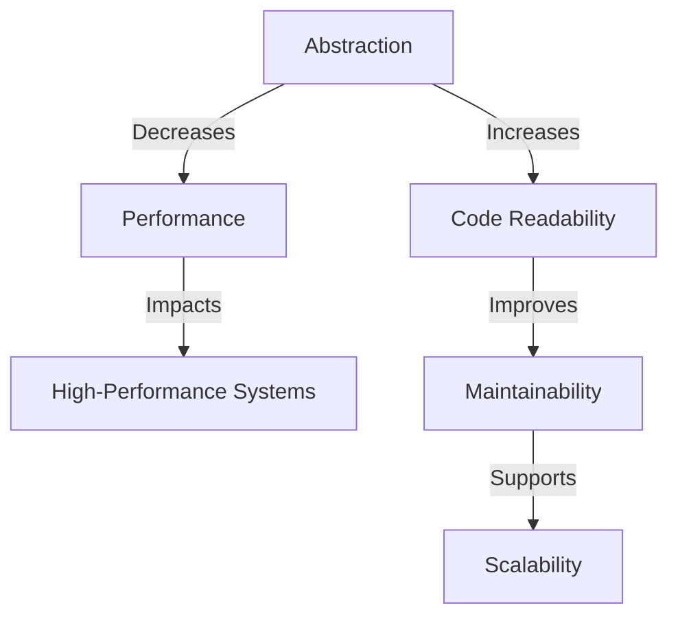

## 18.10 Balancing Abstraction and Performance

In the realm of software engineering, particularly in systems programming with the D language, finding the right balance between abstraction and performance is crucial. Abstraction allows us to manage complexity by hiding unnecessary details, while performance ensures that our systems run efficiently. In this section, we will delve into the principles of balancing these two aspects, providing insights into appropriate abstraction levels, avoiding over-engineering, and conducting trade-off analysis for high-performance systems.

### Appropriate Abstraction Levels

Abstraction is a powerful tool in software design, enabling developers to focus on high-level logic without getting bogged down by low-level details. However, it's essential to strike the right balance to avoid unnecessary complexity or performance degradation.

#### Avoiding Over-Engineering

Over-engineering occurs when a solution is more complex than necessary, often due to excessive abstraction. This can lead to increased maintenance costs and reduced performance. Here are some strategies to avoid over-engineering:

- **Keep Designs Practical**: Focus on solving the problem at hand without adding unnecessary layers of abstraction. Use abstraction to simplify, not complicate.
- **Use Abstraction Judiciously**: Apply abstraction where it adds value, such as improving code readability, reusability, or maintainability.
- **Evaluate the Need for Abstraction**: Before introducing a new abstraction layer, assess whether it genuinely simplifies the design or merely adds complexity.

#### Code Example: Avoiding Over-Engineering

Consider a simple logging system. Over-engineering might involve creating an elaborate hierarchy of classes and interfaces when a straightforward solution would suffice.

```d
// Over-engineered logging system
interface ILogger {
    void log(string message);
}

class ConsoleLogger : ILogger {
    void log(string message) {
        writeln("Console: ", message);
    }
}

class FileLogger : ILogger {
    void log(string message) {
        // Code to write to a file
    }
}

// Simple logging system
void log(string message) {
    writeln("Log: ", message);
}
```

In this example, the simple logging function serves the purpose without the overhead of multiple classes and interfaces.

### Trade-Off Analysis

Balancing abstraction and performance often involves trade-off analysis, where we weigh the benefits of abstraction against potential performance costs.

#### Cost-Benefit Considerations

When deciding on the level of abstraction, consider the following:

- **Performance Impact**: Assess how abstraction affects performance. Some abstractions may introduce overhead, such as additional function calls or memory usage.
- **Maintainability**: Consider how abstraction affects code maintainability. Well-designed abstractions can make code easier to understand and modify.
- **Scalability**: Evaluate whether the abstraction supports scalability. In some cases, abstraction can facilitate scaling by decoupling components.

#### Code Example: Trade-Off Analysis

Let's examine a scenario where abstraction impacts performance. Consider a matrix multiplication operation, which can be implemented with varying levels of abstraction.

```d
// High-level abstraction using templates
template MatrixMultiply(T) {
    T[][] multiply(T[][] a, T[][] b) {
        // Perform matrix multiplication
    }
}

// Low-level implementation for performance
void multiply(int[][] a, int[][] b, int[][] result) {
    foreach (i, row; a) {
        foreach (j, _; b[0]) {
            int sum = 0;
            foreach (k, _; row) {
                sum += a[i][k] * b[k][j];
            }
            result[i][j] = sum;
        }
    }
}
```

The template-based approach offers flexibility and reusability, while the low-level implementation focuses on performance optimization.

### Use Cases and Examples

Finding the right balance between abstraction and performance is context-dependent. Let's explore some use cases where this balance is critical.

#### High-Performance Systems

In high-performance systems, such as real-time applications or embedded systems, performance is paramount. Here, the balance often tips towards minimizing abstraction to achieve optimal performance.

- **Real-Time Systems**: In real-time systems, latency and response time are critical. Abstractions that introduce delays or unpredictability should be avoided.
- **Embedded Systems**: In resource-constrained environments, such as embedded systems, minimizing abstraction can reduce memory usage and processing overhead.

#### Code Example: High-Performance Systems

Consider a real-time audio processing application where performance is crucial.

```d
// Low-level audio processing for performance
void processAudioSample(int[] samples) {
    foreach (i, sample; samples) {
        // Perform low-level processing
        samples[i] = sample * 2; // Example operation
    }
}
```

In this example, the focus is on direct manipulation of audio samples to minimize latency.

### Visualizing Abstraction and Performance

To better understand the relationship between abstraction and performance, let's visualize the trade-offs using a diagram.



**Diagram Description**: This diagram illustrates how abstraction can improve code readability and maintainability but may decrease performance, impacting high-performance systems. It also shows how maintainability supports scalability.

### Balancing Abstraction and Performance in D

The D programming language offers several features that can help balance abstraction and performance effectively:

- **Templates and Mixins**: Use templates and mixins to create reusable abstractions without sacrificing performance. D's compile-time capabilities allow for efficient code generation.
- **Compile-Time Function Execution (CTFE)**: Leverage CTFE to perform computations at compile time, reducing runtime overhead.
- **Memory Safety**: Utilize D's memory safety features, such as `@safe`, `@trusted`, and `@system`, to ensure safe abstractions without compromising performance.

#### Code Example: Balancing Abstraction and Performance in D

Let's see how D's features can be used to balance abstraction and performance in a practical example.

```d
// Using templates for abstraction
template Add(T) {
    T add(T a, T b) {
        return a + b;
    }
}

// Compile-time function execution
enum int result = add(3, 4); // Computed at compile time

// Memory-safe abstraction
@safe void process(int[] data) {
    foreach (i, value; data) {
        data[i] = value * 2;
    }
}
```

In this example, templates provide abstraction, CTFE optimizes performance, and memory safety ensures safe operations.

### Try It Yourself

Experiment with the code examples provided. Try modifying the logging system to add file logging functionality or optimize the matrix multiplication for different data types. Explore how different levels of abstraction impact performance in your own projects.

### Knowledge Check

- **Question**: What are the benefits of using abstraction in software design?
- **Exercise**: Implement a simple caching mechanism using templates in D to improve performance.

### Embrace the Journey

Balancing abstraction and performance is an ongoing journey. As you gain experience, you'll develop an intuition for when to abstract and when to optimize. Remember, this is just the beginning. Keep experimenting, stay curious, and enjoy the journey!

## Quiz Time!



### What is the primary benefit of abstraction in software design?

- [x] Simplifies complex systems
- [ ] Increases performance
- [ ] Reduces memory usage
- [ ] Eliminates bugs

> **Explanation:** Abstraction simplifies complex systems by hiding unnecessary details, making them easier to understand and manage.

### What is a potential downside of excessive abstraction?

- [x] Performance degradation
- [ ] Improved readability
- [ ] Increased scalability
- [ ] Enhanced maintainability

> **Explanation:** Excessive abstraction can lead to performance degradation due to additional layers of indirection and overhead.

### In which scenario is minimizing abstraction most critical?

- [x] Real-time systems
- [ ] Web applications
- [ ] Desktop software
- [ ] Database management

> **Explanation:** In real-time systems, minimizing abstraction is critical to reduce latency and ensure timely responses.

### What feature of D allows computations to be performed at compile time?

- [x] Compile-Time Function Execution (CTFE)
- [ ] Mixins
- [ ] Templates
- [ ] Interfaces

> **Explanation:** Compile-Time Function Execution (CTFE) allows computations to be performed at compile time, reducing runtime overhead.

### How can templates help balance abstraction and performance in D?

- [x] By providing reusable abstractions without runtime cost
- [ ] By increasing memory usage
- [ ] By reducing code readability
- [ ] By eliminating compile-time errors

> **Explanation:** Templates provide reusable abstractions without runtime cost, allowing for efficient code generation.

### What is the role of `@safe` in D programming?

- [x] Ensures memory safety
- [ ] Increases performance
- [ ] Reduces code complexity
- [ ] Enhances scalability

> **Explanation:** `@safe` ensures memory safety by preventing unsafe operations, contributing to safe abstractions.

### Which D feature is useful for creating efficient code generation?

- [x] Mixins
- [ ] Interfaces
- [ ] Classes
- [ ] Exceptions

> **Explanation:** Mixins are useful for creating efficient code generation by allowing code to be inserted at compile time.

### What should be considered when introducing a new abstraction layer?

- [x] Whether it genuinely simplifies the design
- [ ] If it increases the number of classes
- [ ] If it reduces the number of functions
- [ ] Whether it adds more interfaces

> **Explanation:** Before introducing a new abstraction layer, consider whether it genuinely simplifies the design or adds unnecessary complexity.

### What is a common pitfall of over-engineering?

- [x] Increased maintenance costs
- [ ] Improved performance
- [ ] Enhanced user experience
- [ ] Reduced code size

> **Explanation:** Over-engineering can lead to increased maintenance costs due to unnecessary complexity.

### True or False: Abstraction always improves performance.

- [ ] True
- [x] False

> **Explanation:** Abstraction does not always improve performance; it can introduce overhead that may degrade performance.


