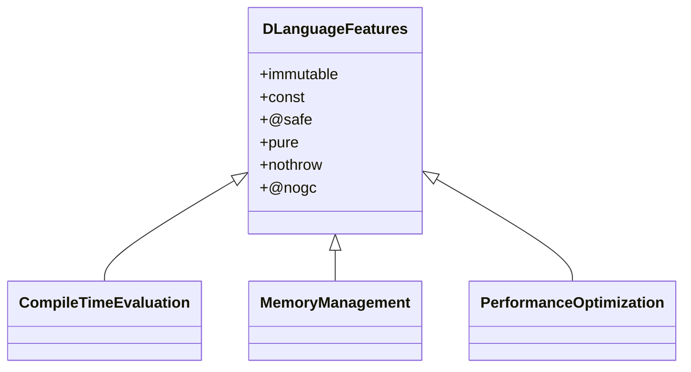

## 18.2 Effective Use of Language Features

In the realm of advanced systems programming, the D programming language offers a rich set of features that can significantly enhance the performance, safety, and maintainability of your software. This section delves into the effective use of D's language features, focusing on immutability, attributes, compile-time evaluation, and memory management. By mastering these features, you can unlock the full potential of D to build high-performance, scalable, and maintainable systems.

### Choosing the Right Tools

#### `immutable` and `const`: Ensuring Data Integrity

In systems programming, data integrity is paramount. D provides `immutable` and `const` to help you enforce data integrity and prevent unintended modifications.

- **`immutable`**: This keyword ensures that a variable's value cannot be changed after it is initialized. It is particularly useful for defining constants and ensuring that data remains unchanged throughout the program's execution.

```d
immutable int maxConnections = 100;

// Attempting to modify will result in a compile-time error
// maxConnections = 200; // Error: cannot modify immutable expression
```

- **`const`**: This keyword allows you to define variables that can be read but not modified. Unlike `immutable`, `const` can be used to reference both mutable and immutable data.

```d
void printData(const int[] data) {
    foreach (value; data) {
        writeln(value);
    }
}

int[] mutableData = [1, 2, 3];
printData(mutableData); // Works fine
```

**Key Takeaway**: Use `immutable` for data that should never change and `const` for read-only access to data that might change elsewhere.

#### Attributes: Applying `@safe`, `pure`, `nothrow`, `@nogc` Appropriately

D's attributes provide a way to enforce safety and performance guarantees in your code.

- **`@safe`**: Ensures that a function does not perform any unsafe operations, such as pointer arithmetic or unchecked casts.

```d
@safe void safeFunction() {
    int a = 10;
    int b = 20;
    writeln(a + b);
}
```

- **`pure`**: Indicates that a function has no side effects and its return value depends only on its parameters.

```d
pure int add(int a, int b) {
    return a + b;
}
```

- **`nothrow`**: Guarantees that a function will not throw any exceptions.

```d
nothrow void logMessage(string message) {
    // Logging logic here
}
```

- **`@nogc`**: Ensures that a function does not trigger garbage collection, which is crucial for real-time systems.

```d
@nogc void processData() {
    // Code that avoids GC allocations
}
```

**Key Takeaway**: Use these attributes to enforce safety and performance constraints, making your code more robust and predictable.

### Performance Optimization

#### Compile-Time Evaluation: Reducing Runtime Costs

Compile-time function execution (CTFE) is a powerful feature in D that allows certain computations to be performed at compile time, reducing runtime overhead.

- **Example**: Calculating factorial at compile time.

```d
enum factorial(int n) = n <= 1 ? 1 : n * factorial(n - 1);

void main() {
    writeln(factorial(5)); // Outputs: 120
}
```

By using CTFE, you can precompute values that are known at compile time, thus saving runtime resources.

**Key Takeaway**: Leverage CTFE to optimize performance by shifting computations from runtime to compile time.

#### Memory Management: Balancing GC and Manual Management

D provides a garbage collector (GC) for automatic memory management, but it also allows for manual memory management when needed.

- **Using the GC**: For most applications, the GC provides a convenient way to manage memory without worrying about leaks.

```d
void useGC() {
    int[] data = new int[](100); // Allocated on the GC heap
    // Use data
}
```

- **Manual Management**: For performance-critical sections, you can manage memory manually using `malloc` and `free`.

```d
import core.stdc.stdlib : malloc, free;

void manualMemory() {
    int* data = cast(int*)malloc(int.sizeof * 100);
    // Use data
    free(data);
}
```

**Key Takeaway**: Use the GC for convenience, but switch to manual management in performance-critical sections to avoid GC pauses.

### Use Cases and Examples

#### Efficient Applications: Achieving Performance Goals

Let's explore how these language features can be used to build efficient applications.

- **Case Study**: Building a High-Performance Web Server

In a web server, performance and reliability are crucial. By using `immutable` for configuration data, `@safe` for request handling, and `@nogc` for critical sections, you can build a robust and efficient server.

```d
immutable string serverName = "DServer";

@safe void handleRequest() {
    // Request handling logic
}

@nogc void processRequest() {
    // Critical section without GC allocations
}
```

**Key Takeaway**: Combine D's language features to build applications that meet your performance and reliability goals.

### Visualizing D's Language Features

To better understand how these features interact, let's visualize the relationships between them using a class diagram.



**Diagram Description**: This diagram illustrates the core language features of D and their relationships to compile-time evaluation, memory management, and performance optimization.

### References and Links

- [D Language Specification](https://dlang.org/spec/spec.html)
- [D Programming Language on Wikipedia](https://en.wikipedia.org/wiki/D_(programming_language))
- [MDN Web Docs on Immutability](https://developer.mozilla.org/en-US/docs/Glossary/Immutable)

### Knowledge Check

- **Question**: What is the primary benefit of using `immutable` in D?
- **Exercise**: Modify the factorial example to calculate the Fibonacci sequence at compile time.

### Embrace the Journey

Remember, mastering these language features is just the beginning. As you continue to explore D, you'll discover even more ways to optimize and enhance your systems. Keep experimenting, stay curious, and enjoy the journey!

### Formatting and Structure

- **Organize content with clear headings and subheadings**.
- **Use bullet points** to break down complex information.
- **Highlight important terms or concepts** using bold or italic text sparingly.

### Writing Style

- **Use first-person plural (we, let's)** to create a collaborative feel.
- **Avoid gender-specific pronouns**; use they/them or rewrite sentences to be inclusive.
- **Define acronyms and abbreviations** upon first use.

## Quiz Time!



### What is the primary purpose of the `immutable` keyword in D?

- [x] To ensure that a variable's value cannot be changed after initialization
- [ ] To allow a variable to be modified only once
- [ ] To enable runtime type checking
- [ ] To optimize memory usage

> **Explanation:** The `immutable` keyword ensures that a variable's value remains constant after it is initialized, providing data integrity.

### Which attribute guarantees that a function will not throw exceptions?

- [ ] `@safe`
- [ ] `pure`
- [x] `nothrow`
- [ ] `@nogc`

> **Explanation:** The `nothrow` attribute ensures that a function does not throw any exceptions, making it safer to use in certain contexts.

### How does compile-time function execution (CTFE) benefit performance?

- [x] By reducing runtime overhead through precomputed values
- [ ] By increasing the speed of garbage collection
- [ ] By allowing dynamic memory allocation
- [ ] By enabling multithreading

> **Explanation:** CTFE allows certain computations to be performed at compile time, reducing the need for runtime calculations and thus improving performance.

### What is the role of the `@nogc` attribute?

- [ ] To enable garbage collection
- [x] To prevent garbage collection
- [ ] To allow dynamic memory allocation
- [ ] To enforce type safety

> **Explanation:** The `@nogc` attribute ensures that a function does not trigger garbage collection, which is crucial for real-time systems.

### Which keyword should you use for read-only access to data that might change elsewhere?

- [ ] `immutable`
- [x] `const`
- [ ] `static`
- [ ] `volatile`

> **Explanation:** The `const` keyword allows for read-only access to data, even if the data might change elsewhere.

### What is the benefit of using `@safe` in D?

- [x] It ensures that a function does not perform unsafe operations
- [ ] It allows for dynamic memory allocation
- [ ] It enables compile-time evaluation
- [ ] It optimizes runtime performance

> **Explanation:** The `@safe` attribute ensures that a function does not perform any unsafe operations, such as pointer arithmetic or unchecked casts.

### How can you manually manage memory in D?

- [x] Using `malloc` and `free`
- [ ] Using `new` and `delete`
- [ ] Using `@nogc`
- [ ] Using `@safe`

> **Explanation:** Manual memory management in D can be done using `malloc` and `free`, which allows for more control over memory allocation and deallocation.

### What is the advantage of using `pure` functions?

- [x] They have no side effects and depend only on their parameters
- [ ] They can modify global variables
- [ ] They enable garbage collection
- [ ] They allow for dynamic memory allocation

> **Explanation:** `pure` functions have no side effects and their return values depend only on their parameters, making them predictable and easier to test.

### Which attribute should be used to avoid garbage collection in performance-critical sections?

- [ ] `@safe`
- [ ] `pure`
- [ ] `nothrow`
- [x] `@nogc`

> **Explanation:** The `@nogc` attribute is used to ensure that a function does not trigger garbage collection, which is important in performance-critical sections.

### True or False: The `const` keyword in D can be used to reference both mutable and immutable data.

- [x] True
- [ ] False

> **Explanation:** The `const` keyword allows for read-only access to data, regardless of whether the data itself is mutable or immutable.


