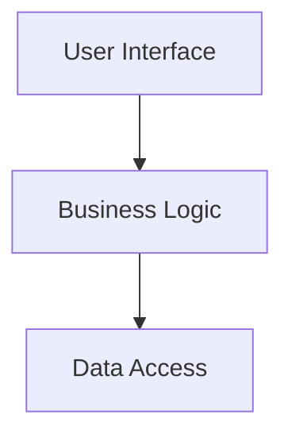
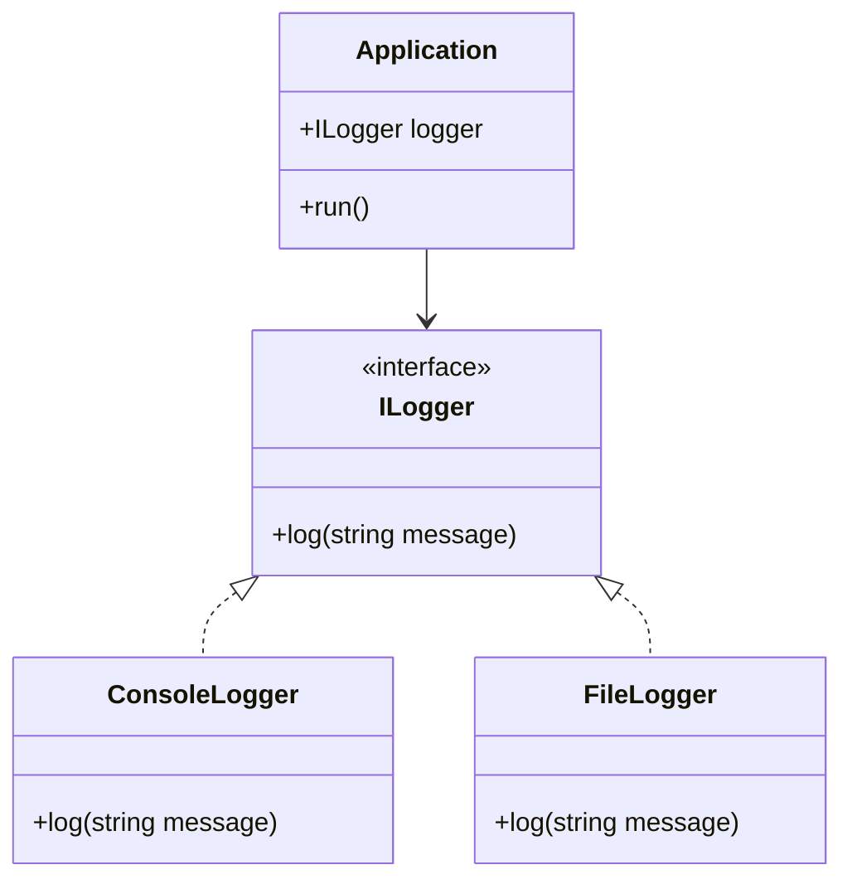

## 18.3 Designing Software for Testability and Maintainability in D

In the realm of software engineering, designing for testability and maintainability is crucial for ensuring that software systems are robust, scalable, and adaptable to change. This section delves into the principles and practices that can be employed in the D programming language to achieve these goals. We will explore modular design, dependency injection, and effective documentation strategies, providing code examples and visual aids to enhance understanding.

### Modular Design

Modular design is a cornerstone of software architecture that emphasizes the separation of concerns, enabling developers to create systems that are easier to understand, test, and maintain. By organizing code into distinct modules, each responsible for a specific aspect of the system, we can achieve greater flexibility and reusability.

#### Separation of Concerns

Separation of concerns is the practice of dividing a program into distinct sections, each addressing a separate concern or functionality. This approach not only simplifies the codebase but also enhances testability by allowing individual modules to be tested in isolation.

**Example: Implementing Separation of Concerns in D**

```d
// Define a module for data access
module dataAccess;

struct Database {
    void connect() {
        // Connect to the database
    }
    
    void disconnect() {
        // Disconnect from the database
    }
}

// Define a module for business logic
module businessLogic;

import dataAccess;

struct OrderProcessor {
    Database db;
    
    void processOrder(int orderId) {
        db.connect();
        // Process the order
        db.disconnect();
    }
}

// Define a module for user interface
module userInterface;

import businessLogic;

struct OrderUI {
    OrderProcessor processor;
    
    void displayOrder(int orderId) {
        processor.processOrder(orderId);
        // Display order details
    }
}
```

In this example, we have separated the concerns of data access, business logic, and user interface into distinct modules. This separation allows each module to be developed and tested independently, improving the overall maintainability of the system.

#### Visualizing Modular Design



**Caption:** This diagram illustrates the flow of control from the user interface to the business logic and finally to the data access layer, demonstrating the separation of concerns.

### Dependency Injection

Dependency injection is a design pattern that promotes loose coupling between components by injecting dependencies rather than hard-coding them. This approach facilitates testing and flexibility, as dependencies can be easily swapped or mocked during testing.

#### Loose Coupling

Loose coupling refers to the reduction of dependencies between components, allowing them to interact with each other through well-defined interfaces. This design principle enhances testability by enabling components to be tested in isolation.

**Example: Implementing Dependency Injection in D**

```d
interface ILogger {
    void log(string message);
}

class ConsoleLogger : ILogger {
    void log(string message) {
        writeln("Log: ", message);
    }
}

class FileLogger : ILogger {
    void log(string message) {
        // Write log to a file
    }
}

class Application {
    ILogger logger;
    
    this(ILogger logger) {
        this.logger = logger;
    }
    
    void run() {
        logger.log("Application started");
    }
}

void main() {
    auto logger = new ConsoleLogger();
    auto app = new Application(logger);
    app.run();
}
```

In this example, the `Application` class depends on an `ILogger` interface rather than a specific implementation. This allows us to inject different logger implementations, such as `ConsoleLogger` or `FileLogger`, making the application more flexible and easier to test.

#### Visualizing Dependency Injection



**Caption:** This class diagram shows the relationship between the `Application` class and the `ILogger` interface, illustrating how dependency injection promotes loose coupling.

### Documentation

Effective documentation is essential for maintaining a codebase over time. It ensures that developers can understand and work with the code, even if they were not involved in its original development. Documentation should be clear, concise, and integrated with the code.

#### Self-Documenting Code

Self-documenting code refers to writing code that is clear and understandable without requiring extensive comments. This can be achieved by using descriptive variable names, consistent formatting, and well-structured code.

**Example: Writing Self-Documenting Code in D**

```d
// Bad example
int a = 10;
int b = 20;
int c = a + b;

// Good example
int firstNumber = 10;
int secondNumber = 20;
int sum = firstNumber + secondNumber;
```

In the good example, the variable names `firstNumber`, `secondNumber`, and `sum` clearly convey their purpose, making the code easier to understand.

### Use Cases and Examples

Designing for testability and maintainability is particularly important in long-term projects, where code needs to remain robust and adaptable over time. By applying the principles discussed in this section, developers can create systems that are easier to test, maintain, and extend.

#### Long-Term Projects

In long-term projects, codebases can grow large and complex, making it challenging to manage and maintain. By adhering to best practices such as modular design, dependency injection, and effective documentation, developers can mitigate these challenges and ensure the longevity of their software systems.

**Example: Applying Best Practices in a Long-Term Project**

Consider a long-term project that involves developing a web application. By organizing the code into modules for data access, business logic, and user interface, and using dependency injection to manage dependencies, the project can be more easily maintained and extended over time.

```d
// Define a module for data access
module dataAccess;

struct Database {
    void connect() {
        // Connect to the database
    }
    
    void disconnect() {
        // Disconnect from the database
    }
}

// Define a module for business logic
module businessLogic;

import dataAccess;

struct OrderProcessor {
    Database db;
    
    void processOrder(int orderId) {
        db.connect();
        // Process the order
        db.disconnect();
    }
}

// Define a module for user interface
module userInterface;

import businessLogic;

struct OrderUI {
    OrderProcessor processor;
    
    void displayOrder(int orderId) {
        processor.processOrder(orderId);
        // Display order details
    }
}
```

By maintaining a clear separation of concerns and using dependency injection, the project can be more easily adapted to changing requirements and technologies.

### Try It Yourself

To reinforce your understanding of these concepts, try modifying the code examples provided in this section. Experiment with different module structures, dependency injection techniques, and documentation strategies to see how they affect the testability and maintainability of the code.

### Knowledge Check

- What is modular design, and why is it important for testability and maintainability?
- How does dependency injection promote loose coupling in software systems?
- What are some strategies for writing self-documenting code?
- How can the principles discussed in this section be applied to long-term projects?

### Embrace the Journey

Remember, designing for testability and maintainability is an ongoing process. As you continue to develop software systems, keep experimenting with different design patterns and techniques to find what works best for your projects. Stay curious, and enjoy the journey of creating robust and adaptable software.

## Quiz Time!



### What is the primary goal of modular design?

- [x] To separate concerns and organize code logically
- [ ] To increase code complexity
- [ ] To reduce the number of files in a project
- [ ] To make code harder to understand

> **Explanation:** Modular design aims to separate concerns and organize code logically, making it easier to understand, test, and maintain.

### How does dependency injection facilitate testing?

- [x] By allowing dependencies to be easily swapped or mocked
- [ ] By hard-coding dependencies into components
- [ ] By increasing the number of dependencies
- [ ] By making components tightly coupled

> **Explanation:** Dependency injection allows dependencies to be easily swapped or mocked, facilitating testing and flexibility.

### What is self-documenting code?

- [x] Code that is clear and understandable without extensive comments
- [ ] Code that requires detailed comments to understand
- [ ] Code that is written in a foreign language
- [ ] Code that is difficult to read

> **Explanation:** Self-documenting code is clear and understandable without requiring extensive comments, achieved through descriptive variable names and consistent formatting.

### Why is documentation important in software development?

- [x] It ensures that developers can understand and work with the code
- [ ] It increases the complexity of the codebase
- [ ] It makes the code harder to maintain
- [ ] It is only necessary for large projects

> **Explanation:** Documentation is important because it ensures that developers can understand and work with the code, even if they were not involved in its original development.

### What is the benefit of using descriptive variable names?

- [x] They make the code easier to understand
- [ ] They increase the length of the code
- [x] They reduce the need for comments
- [ ] They make the code harder to read

> **Explanation:** Descriptive variable names make the code easier to understand and reduce the need for comments.

### How can modular design improve maintainability?

- [x] By allowing individual modules to be developed and tested independently
- [ ] By increasing the interdependence of modules
- [ ] By reducing the number of modules in a project
- [ ] By making the codebase more complex

> **Explanation:** Modular design improves maintainability by allowing individual modules to be developed and tested independently, enhancing flexibility and reusability.

### What is the role of interfaces in dependency injection?

- [x] They define well-defined interfaces for components to interact
- [ ] They increase the coupling between components
- [x] They allow for different implementations to be injected
- [ ] They make the code harder to test

> **Explanation:** Interfaces define well-defined interfaces for components to interact, allowing for different implementations to be injected and promoting loose coupling.

### What is a key characteristic of long-term projects?

- [x] They require robust and adaptable code
- [ ] They are completed quickly
- [ ] They do not require documentation
- [ ] They involve only a small team

> **Explanation:** Long-term projects require robust and adaptable code to ensure they can be maintained and extended over time.

### How does separation of concerns enhance testability?

- [x] By allowing individual concerns to be tested in isolation
- [ ] By increasing the complexity of the codebase
- [ ] By making the code harder to understand
- [ ] By reducing the number of tests required

> **Explanation:** Separation of concerns enhances testability by allowing individual concerns to be tested in isolation, simplifying the testing process.

### True or False: Dependency injection makes components tightly coupled.

- [ ] True
- [x] False

> **Explanation:** False. Dependency injection promotes loose coupling by allowing dependencies to be injected rather than hard-coded, making components more flexible and easier to test.


