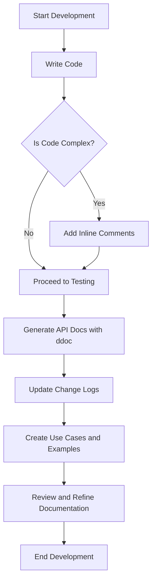

## 18.4 Documentation and Commenting Standards

In the realm of advanced systems programming, documentation and commenting are not mere afterthoughts but integral components of the software development lifecycle. For expert software engineers and architects working with the D programming language, mastering documentation and commenting standards is essential for creating high-performance, scalable, and maintainable software systems. This section delves into best practices for inline comments, API documentation, change logs, and use cases, providing a comprehensive guide to effective documentation in D.

### Inline Comments

#### Clarity Over Quantity

Inline comments are crucial for explaining the "why" behind the code, rather than the "what." While code should be self-explanatory, comments provide context and rationale that are not immediately apparent from the code itself. Here are some guidelines for effective inline commenting:

- **Explain Complex Logic**: Use comments to clarify complex algorithms or non-obvious code segments.
- **Avoid Redundancy**: Do not comment on obvious code. For example, avoid comments like `// increment i` for `i++`.
- **Use Descriptive Language**: Write comments in clear, concise language that conveys the intent of the code.
- **Update Comments**: Ensure comments are updated alongside code changes to prevent outdated or misleading information.

**Example:**

```d
// Calculate the factorial of a number using recursion
int factorial(int n) {
    // Base case: factorial of 0 is 1
    if (n == 0) return 1;
    // Recursive case: n * factorial of (n-1)
    return n * factorial(n - 1);
}
```

### API Documentation

#### Using `ddoc`

D provides a powerful tool called `ddoc` for generating documentation directly from code comments. This tool allows developers to maintain up-to-date documentation that is tightly coupled with the source code. Here’s how to effectively use `ddoc`:

- **Document Public Interfaces**: Focus on documenting public classes, functions, and modules.
- **Use `ddoc` Syntax**: Leverage `ddoc` tags such as `$(D ...)` for code snippets and `$(B ...)` for bold text.
- **Include Examples**: Provide usage examples to illustrate how to use the API effectively.
- **Highlight Parameters and Return Values**: Clearly describe the purpose and expected values of parameters and return types.

**Example:**

```d
/**
 * Calculates the power of a number.
 *
 * Params:
 *   base = The base number.
 *   exponent = The exponent to raise the base to.
 *
 * Returns:
 *   The result of base raised to the power of exponent.
 *
 * Example:
 *   auto result = power(2, 3); // result is 8
 */
double power(double base, int exponent) {
    return pow(base, exponent);
}
```

### Change Logs

#### Tracking Modifications

Change logs are essential for maintaining a history of modifications, which aids in transparency and accountability. They provide a chronological record of changes made to the codebase, including bug fixes, feature additions, and performance improvements.

- **Use Semantic Versioning**: Adopt a versioning scheme that reflects the nature of changes (e.g., major, minor, patch).
- **Be Descriptive**: Clearly describe the changes made, including the rationale and impact.
- **Include Dates and Authors**: Record the date of the change and the author responsible for it.
- **Automate Where Possible**: Use tools to automate the generation of change logs from commit messages.

**Example:**

```
## [1.2.0] - 2024-11-17
### Added
- Implemented new caching mechanism to improve performance.

### Fixed
- Resolved issue with incorrect user authentication.

### Changed
- Updated API documentation for the `power` function.
```

### Use Cases and Examples

#### Onboarding New Developers

Providing use cases and examples is a powerful way to facilitate knowledge transfer and onboard new developers. These resources help newcomers understand the practical application of the code and the design patterns employed.

- **Create Tutorials**: Develop step-by-step guides that walk through common tasks or features.
- **Include Code Samples**: Provide code snippets that demonstrate typical usage scenarios.
- **Highlight Best Practices**: Use examples to illustrate best practices in coding, design patterns, and documentation.
- **Encourage Experimentation**: Invite new developers to modify and extend examples to deepen their understanding.

**Example:**

```d
// Example of using the power function in a real-world scenario
void main() {
    double base = 5.0;
    int exponent = 3;
    double result = power(base, exponent);
    writeln("5 to the power of 3 is ", result); // Output: 5 to the power of 3 is 125
}
```

### Visualizing Documentation Workflow

To better understand how documentation fits into the software development process, let's visualize the workflow using a Mermaid.js diagram.



**Diagram Description:** This flowchart illustrates the documentation workflow in D programming, highlighting the steps from writing code to reviewing and refining documentation.

### References and Links

For further reading on documentation and commenting standards, consider the following resources:

- [D Language Documentation](https://dlang.org/documentation.html)
- [Semantic Versioning](https://semver.org/)
- [Ddoc Documentation](https://dlang.org/spec/ddoc.html)

### Knowledge Check

To reinforce your understanding of documentation and commenting standards, consider the following questions and exercises:

- **Question**: Why is it important to update comments alongside code changes?
- **Exercise**: Write a `ddoc` comment for a function that calculates the area of a circle.
- **Challenge**: Create a change log entry for a bug fix that resolves a memory leak issue.

### Embrace the Journey

Remember, effective documentation is a journey, not a destination. As you continue to develop your skills in D programming, keep experimenting with different documentation techniques, stay curious, and enjoy the process of creating clear, concise, and comprehensive documentation.

## Quiz Time!



### What is the primary purpose of inline comments?

- [x] To explain complex logic and provide context
- [ ] To describe every line of code
- [ ] To increase the length of the code
- [ ] To replace documentation

> **Explanation:** Inline comments are used to explain complex logic and provide context, not to describe every line of code or replace documentation.

### Which tool is used in D for generating documentation from code comments?

- [x] ddoc
- [ ] Javadoc
- [ ] Doxygen
- [ ] Sphinx

> **Explanation:** `ddoc` is the tool used in D for generating documentation from code comments.

### What should be included in a change log entry?

- [x] Description of changes, date, and author
- [ ] Only the date of change
- [ ] Only the author of the change
- [ ] Only the description of changes

> **Explanation:** A change log entry should include a description of changes, the date, and the author.

### Why is it important to provide use cases and examples?

- [x] To facilitate knowledge transfer and onboarding
- [ ] To make the documentation longer
- [ ] To confuse new developers
- [ ] To replace inline comments

> **Explanation:** Use cases and examples facilitate knowledge transfer and onboarding, helping new developers understand the code.

### What is the benefit of using semantic versioning in change logs?

- [x] It reflects the nature of changes (major, minor, patch)
- [ ] It makes the version number longer
- [ ] It replaces the need for a change log
- [ ] It is only useful for large projects

> **Explanation:** Semantic versioning reflects the nature of changes, such as major, minor, and patch updates.

### What is a key guideline for writing inline comments?

- [x] Avoid redundancy and explain complex logic
- [ ] Comment every line of code
- [ ] Use technical jargon
- [ ] Write comments in a different language

> **Explanation:** Inline comments should avoid redundancy and focus on explaining complex logic.

### How can `ddoc` enhance API documentation?

- [x] By generating documentation directly from code comments
- [ ] By replacing the need for comments
- [ ] By making the code run faster
- [ ] By adding more lines to the code

> **Explanation:** `ddoc` enhances API documentation by generating it directly from code comments.

### What should be the focus when documenting public interfaces?

- [x] Clarity and examples
- [ ] Length and complexity
- [ ] Technical jargon
- [ ] Redundancy

> **Explanation:** When documenting public interfaces, the focus should be on clarity and providing examples.

### What is the role of change logs in software development?

- [x] To maintain a history of modifications
- [ ] To replace inline comments
- [ ] To confuse developers
- [ ] To make the code run faster

> **Explanation:** Change logs maintain a history of modifications, aiding in transparency and accountability.

### True or False: Inline comments should describe every line of code.

- [ ] True
- [x] False

> **Explanation:** Inline comments should not describe every line of code; they should focus on explaining complex logic and providing context.




