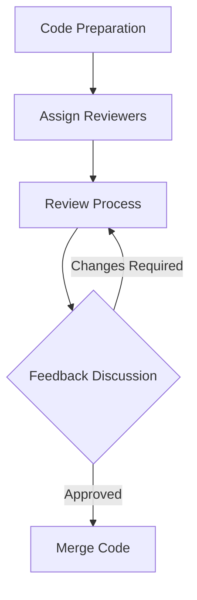

## 18.5 Code Review and Collaboration Techniques

In the realm of advanced systems programming, effective code review and collaboration are pivotal to the success of any software project. As expert developers and architects, we must leverage these practices to ensure code quality, maintainability, and team synergy. This section delves into the intricacies of code review and collaboration techniques tailored for the D programming language, focusing on peer reviews, version control practices, communication tools, and strategies for distributed teams.

### Peer Reviews

Peer reviews are a cornerstone of collaborative software development. They not only improve code quality but also foster knowledge sharing and team cohesion. Let's explore how to conduct effective peer reviews.

#### Constructive Feedback

Providing constructive feedback is essential for a successful peer review process. Here are some guidelines:

- **Be Specific**: Point out specific lines of code or sections that need improvement. Avoid vague comments like "This could be better."
- **Focus on the Code, Not the Person**: Critique the code, not the developer. Use language that is neutral and objective.
- **Highlight Positives**: Acknowledge well-written code and innovative solutions. Positive reinforcement encourages good practices.
- **Suggest Improvements**: Instead of just pointing out issues, offer suggestions for improvement. This helps the author learn and grow.
- **Encourage Discussion**: Foster an environment where developers feel comfortable discussing different approaches and solutions.

#### Code Review Workflow

Establishing a structured code review workflow can streamline the process and ensure consistency. Consider the following steps:

1. **Preparation**: The author prepares the code for review, ensuring it is complete and adheres to coding standards.
2. **Review Assignment**: Assign reviewers based on expertise and availability. Rotate reviewers to distribute knowledge across the team.
3. **Review Process**: Reviewers examine the code, leaving comments and suggestions. Use tools like GitHub or GitLab for inline comments.
4. **Feedback Discussion**: The author addresses feedback, engaging in discussions if clarification is needed.
5. **Approval and Merge**: Once all feedback is addressed, reviewers approve the changes, and the code is merged into the main branch.

### Version Control Practices

Version control is the backbone of collaborative development. It allows multiple developers to work on the same codebase without conflicts. Here, we focus on effective version control practices.

#### Branching Strategies

Branching strategies help manage changes and facilitate parallel development. Common strategies include:

- **Feature Branching**: Create a new branch for each feature or bug fix. This isolates changes until they are ready to be merged.
- **Git Flow**: A popular branching model that uses branches like `master`, `develop`, `feature`, `release`, and `hotfix` to organize work.
- **Trunk-Based Development**: Developers work on short-lived branches or directly on the main branch, integrating changes frequently.

#### Commit Practices

Effective commit practices enhance the clarity and traceability of changes. Follow these guidelines:

- **Atomic Commits**: Each commit should represent a single logical change. Avoid mixing unrelated changes in one commit.
- **Descriptive Messages**: Write clear and descriptive commit messages. Include the "what" and "why" of the change.
- **Regular Commits**: Commit changes frequently to avoid large, unwieldy commits that are difficult to review.

### Communication Tools

Effective communication is vital for collaboration, especially in distributed teams. Let's explore tools and techniques that facilitate communication.

#### Issue Trackers

Issue trackers like Jira, Trello, or GitHub Issues help coordinate work and track progress. They provide a centralized platform for:

- **Task Management**: Create and assign tasks, set priorities, and track progress.
- **Bug Tracking**: Report and manage bugs, ensuring they are addressed promptly.
- **Documentation**: Use issue descriptions and comments to document decisions and discussions.

#### Real-Time Communication

Real-time communication tools like Slack or Microsoft Teams enable instant collaboration. Use them for:

- **Quick Discussions**: Resolve minor issues or questions quickly without the need for lengthy emails.
- **Stand-Up Meetings**: Conduct daily stand-up meetings to synchronize team efforts and address blockers.
- **Announcements**: Share important updates or announcements with the entire team.

### Use Cases and Examples

To illustrate these concepts, let's examine some use cases and examples of collaboration techniques in action.

#### Distributed Teams

In today's globalized world, distributed teams are common. Here are some strategies for effective collaboration across locations:

- **Time Zone Awareness**: Be mindful of time zone differences when scheduling meetings or expecting responses.
- **Asynchronous Communication**: Use asynchronous communication methods like email or issue trackers to accommodate different working hours.
- **Cultural Sensitivity**: Be aware of cultural differences and adapt communication styles accordingly.

#### Code Review Example

Consider a scenario where a developer submits a pull request for a new feature. The code review process might look like this:

```d
// Example D code for a simple feature
module example;

class Calculator {
    // Adds two numbers
    int add(int a, int b) {
        return a + b;
    }
}

// Reviewer comments:
// - Consider adding error handling for overflow.
// - Add unit tests for edge cases.
```

In this example, the reviewer provides specific feedback on potential improvements and suggests additional tests.

### Visualizing Collaboration Processes

To better understand the collaboration process, let's visualize a typical code review workflow using a flowchart.



**Figure 1**: A flowchart illustrating the code review workflow.

### References and Links

For further reading on code review and collaboration techniques, consider the following resources:

- [GitHub Code Review Guide](https://docs.github.com/en/pull-requests/collaborating-with-pull-requests)
- [Atlassian's Guide to Code Review](https://www.atlassian.com/software/git/tutorials/comparing-workflows)
- [Effective Code Review Practices](https://martinfowler.com/articles/on-code-review.html)

### Knowledge Check

To reinforce your understanding, consider the following questions:

- What are the key components of a constructive code review?
- How can branching strategies improve collaboration in a team?
- What role do issue trackers play in managing software projects?

### Embrace the Journey

Remember, mastering code review and collaboration techniques is an ongoing journey. As you continue to refine these skills, you'll enhance your ability to work effectively in any team environment. Keep experimenting, stay curious, and enjoy the journey!

## Quiz Time!



### What is a key component of constructive feedback in code reviews?

- [x] Being specific about issues
- [ ] Criticizing the developer
- [ ] Ignoring positive aspects
- [ ] Avoiding suggestions

> **Explanation:** Constructive feedback should be specific about issues to help the developer understand what needs improvement.

### Which branching strategy involves creating a new branch for each feature or bug fix?

- [x] Feature Branching
- [ ] Trunk-Based Development
- [ ] Git Flow
- [ ] Mainline Development

> **Explanation:** Feature Branching involves creating a new branch for each feature or bug fix to isolate changes.

### What is the purpose of issue trackers in software development?

- [x] Coordinating work and tracking progress
- [ ] Sending real-time messages
- [ ] Hosting code repositories
- [ ] Managing server infrastructure

> **Explanation:** Issue trackers help coordinate work and track progress by providing a centralized platform for task management and bug tracking.

### Which tool is commonly used for real-time communication in distributed teams?

- [x] Slack
- [ ] GitHub
- [ ] Jira
- [ ] Trello

> **Explanation:** Slack is a popular tool for real-time communication, enabling instant collaboration among team members.

### What should a commit message include?

- [x] A clear description of the change
- [ ] The developer's personal opinion
- [ ] A summary of unrelated changes
- [ ] A list of all files changed

> **Explanation:** A commit message should include a clear description of the change, explaining the "what" and "why."

### How can distributed teams effectively collaborate across time zones?

- [x] Use asynchronous communication methods
- [ ] Schedule meetings at inconvenient times
- [ ] Ignore time zone differences
- [ ] Rely solely on real-time communication

> **Explanation:** Asynchronous communication methods accommodate different working hours, making collaboration across time zones more effective.

### What is the role of real-time communication tools in collaboration?

- [x] Facilitating quick discussions and stand-up meetings
- [ ] Replacing all other forms of communication
- [ ] Managing code repositories
- [ ] Tracking project progress

> **Explanation:** Real-time communication tools facilitate quick discussions and stand-up meetings, enhancing team collaboration.

### What is a benefit of using Git Flow as a branching strategy?

- [x] Organizes work with branches like `master`, `develop`, and `feature`
- [ ] Eliminates the need for version control
- [ ] Requires no branching at all
- [ ] Only works for small teams

> **Explanation:** Git Flow organizes work with branches like `master`, `develop`, and `feature`, providing a structured approach to version control.

### What should be the focus of a code review?

- [x] The quality of the code
- [ ] The developer's personal style
- [ ] The speed of development
- [ ] The number of lines changed

> **Explanation:** The focus of a code review should be on the quality of the code, ensuring it meets standards and is maintainable.

### True or False: Code reviews should only focus on finding errors.

- [ ] True
- [x] False

> **Explanation:** Code reviews should not only focus on finding errors but also on improving code quality, sharing knowledge, and fostering team collaboration.


