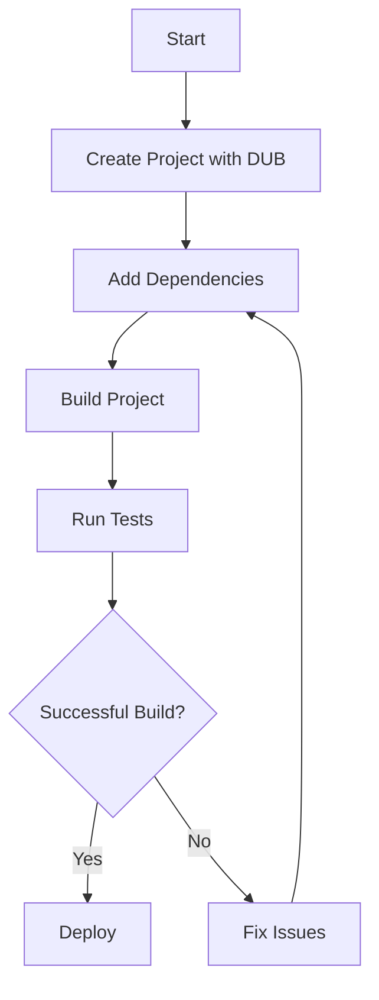

## 18.6 Managing Dependencies and Builds

In the realm of advanced systems programming, managing dependencies and builds efficiently is crucial for maintaining high-performance, scalable, and maintainable software systems. In this section, we will delve into the tools and practices that facilitate effective dependency management and build processes in the D programming language. We will explore DUB, semantic versioning, continuous integration, and reproducible builds, providing you with the knowledge to streamline your development workflow.

### Build Tools

#### Using DUB: Managing Dependencies and Builds

DUB is the de facto package and build manager for the D programming language. It simplifies the process of managing dependencies and building projects, making it an essential tool for D developers. Let's explore how to leverage DUB for efficient dependency management and build automation.

**Getting Started with DUB**

To begin using DUB, ensure that it is installed on your system. You can install DUB via the D language installer or package managers like Homebrew, APT, or Chocolatey, depending on your operating system.

```bash
curl -fsS https://dlang.org/install.sh | bash -s dmd

dub --version
```

**Creating a New Project**

DUB allows you to create a new project with a simple command, setting up the necessary directory structure and configuration files.

```bash
dub init myproject

cd myproject
```

This command generates a `dub.json` file, which is the configuration file for your project. It specifies project dependencies, build settings, and other metadata.

**Managing Dependencies**

DUB makes it easy to manage dependencies by specifying them in the `dub.json` file. You can add dependencies using the `dub add` command or manually editing the `dub.json` file.

```json
{
    "name": "myproject",
    "dependencies": {
        "vibe-d": "~>0.9.3"
    }
}
```

To install the dependencies, simply run:

```bash
dub fetch
```

**Building and Running Projects**

DUB automates the build process, allowing you to compile and run your project with a single command.

```bash
dub build

dub run
```

DUB supports various build configurations, such as `debug`, `release`, and `unittest`, which can be specified using the `--build` flag.

```bash
dub build --build=release
```

### Versioning

#### Semantic Versioning: Communicating Changes Effectively

Semantic Versioning (SemVer) is a versioning scheme that conveys meaning about the underlying changes with each new release. It consists of three numbers: MAJOR.MINOR.PATCH.

- **MAJOR**: Incremented for incompatible API changes.
- **MINOR**: Incremented for backward-compatible functionality.
- **PATCH**: Incremented for backward-compatible bug fixes.

**Implementing Semantic Versioning**

Adopting semantic versioning in your projects helps communicate changes clearly to users and maintainers. Update your `dub.json` file to reflect the current version of your project.

```json
{
    "name": "myproject",
    "version": "1.0.0"
}
```

**Version Constraints in Dependencies**

DUB supports version constraints to ensure compatibility between dependencies. Use version constraints like `~>`, `>=`, and `<=` to specify acceptable versions.

```json
{
    "dependencies": {
        "vibe-d": "~>0.9.3"
    }
}
```

This constraint allows any version from `0.9.3` up to, but not including, `1.0.0`.

### Automated Builds

#### Continuous Integration: Ensuring Consistent Build Processes

Continuous Integration (CI) is a practice where developers integrate code into a shared repository frequently, triggering automated builds and tests. This ensures that the codebase remains in a deployable state.

**Setting Up Continuous Integration**

To set up CI for your D projects, you can use services like GitHub Actions, Travis CI, or GitLab CI. These platforms provide the infrastructure to automate builds and tests.

**Example: GitHub Actions**

Create a `.github/workflows/ci.yml` file in your repository to define your CI pipeline.

```yaml
name: CI

on:
  push:
    branches:
      - main
  pull_request:
    branches:
      - main

jobs:
  build:
    runs-on: ubuntu-latest

    steps:
    - uses: actions/checkout@v2
    - name: Install D
      run: |
        curl -fsS https://dlang.org/install.sh | bash -s dmd
    - name: Build with DUB
      run: dub build
    - name: Run Tests
      run: dub test
```

This configuration triggers the build and test process on every push or pull request to the `main` branch.

### Use Cases and Examples

#### Reproducible Builds: Achieving Consistent Results Across Environments

Reproducible builds ensure that the same source code produces identical binaries across different environments. This is crucial for verifying the integrity and security of software.

**Achieving Reproducible Builds**

To achieve reproducible builds, consider the following practices:

- **Pin Dependencies**: Use exact version numbers in your `dub.json` file to avoid discrepancies caused by different dependency versions.
  
- **Environment Consistency**: Use containerization tools like Docker to create consistent build environments.

**Example: Dockerizing a D Project**

Create a `Dockerfile` to define your build environment.

```dockerfile
FROM dlang2/dmd-ubuntu

WORKDIR /app

COPY . .

RUN dub build --build=release

CMD ["./myproject"]
```

Build and run the Docker container to ensure consistent builds.

```bash
docker build -t myproject .

docker run myproject
```

### Visualizing Dependency Management and Build Processes

To better understand the flow of managing dependencies and builds, let's visualize the process using a Mermaid.js diagram.



**Diagram Description:** This flowchart illustrates the typical process of managing dependencies and builds using DUB. It starts with creating a project, adding dependencies, building the project, running tests, and deploying if the build is successful.

### References and Links

- [DUB Documentation](https://dub.pm/)
- [Semantic Versioning](https://semver.org/)
- [GitHub Actions Documentation](https://docs.github.com/en/actions)
- [Docker Documentation](https://docs.docker.com/)

### Knowledge Check

- Explain the role of DUB in managing dependencies and builds.
- Describe the components of semantic versioning and their significance.
- Outline the steps to set up a continuous integration pipeline using GitHub Actions.
- Discuss the importance of reproducible builds and how to achieve them.

### Embrace the Journey

Remember, mastering dependency management and build processes is a continuous journey. As you progress, you'll discover more efficient ways to streamline your workflow. Keep experimenting, stay curious, and enjoy the journey!

### Quiz Time!



### What is the primary purpose of DUB in D programming?

- [x] Managing dependencies and automating builds
- [ ] Providing a graphical user interface for D programming
- [ ] Debugging D applications
- [ ] Optimizing D code for performance

> **Explanation:** DUB is the package and build manager for D, used to manage dependencies and automate the build process.

### Which versioning scheme is recommended for communicating changes effectively in software projects?

- [x] Semantic Versioning
- [ ] Chronological Versioning
- [ ] Random Versioning
- [ ] Alphabetical Versioning

> **Explanation:** Semantic Versioning is a widely adopted versioning scheme that uses MAJOR.MINOR.PATCH to convey changes.

### What is the role of continuous integration in software development?

- [x] Automating builds and tests to ensure codebase integrity
- [ ] Designing user interfaces
- [ ] Writing documentation
- [ ] Managing project budgets

> **Explanation:** Continuous integration automates builds and tests to maintain a deployable codebase.

### How can reproducible builds be achieved?

- [x] Pinning dependencies and using consistent build environments
- [ ] Randomizing build settings
- [ ] Ignoring dependency versions
- [ ] Using different compilers for each build

> **Explanation:** Reproducible builds are achieved by pinning dependencies and ensuring consistent build environments.

### What command is used to create a new DUB project?

- [x] `dub init`
- [ ] `dub create`
- [ ] `dub new`
- [ ] `dub start`

> **Explanation:** The `dub init` command is used to create a new DUB project with the necessary configuration files.

### Which file in a DUB project specifies dependencies and build settings?

- [x] `dub.json`
- [ ] `build.xml`
- [ ] `Makefile`
- [ ] `package.json`

> **Explanation:** The `dub.json` file is the configuration file for a DUB project, specifying dependencies and build settings.

### What is the significance of the MAJOR version in semantic versioning?

- [x] Indicates incompatible API changes
- [ ] Represents backward-compatible functionality
- [ ] Denotes bug fixes
- [ ] Specifies the build number

> **Explanation:** The MAJOR version is incremented for incompatible API changes in semantic versioning.

### Which tool can be used to create consistent build environments for reproducible builds?

- [x] Docker
- [ ] Git
- [ ] SSH
- [ ] FTP

> **Explanation:** Docker is used to create consistent build environments, aiding in reproducible builds.

### What is the purpose of the `dub fetch` command?

- [x] Install project dependencies
- [ ] Compile the project
- [ ] Run unit tests
- [ ] Deploy the application

> **Explanation:** The `dub fetch` command installs the dependencies specified in the `dub.json` file.

### True or False: Continuous integration only involves running tests.

- [ ] True
- [x] False

> **Explanation:** Continuous integration involves automating builds and tests, ensuring the codebase remains in a deployable state.


