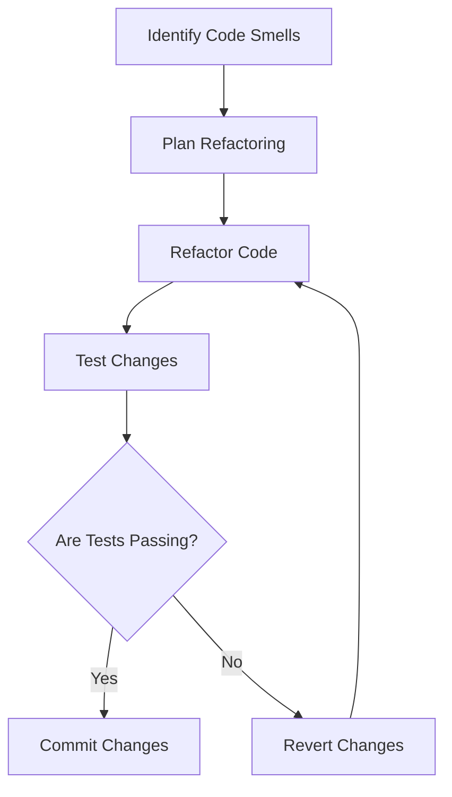

## 18.7 Keeping Codebase Clean and Refactored

Maintaining a clean and refactored codebase is crucial for the long-term success of any software project. In the context of D programming, this involves leveraging the language's unique features to ensure that code remains efficient, readable, and adaptable to change. In this section, we will delve into the best practices for keeping your D codebase clean and refactored, focusing on regular refactoring, dead code removal, static analysis, and project scalability.

### Regular Refactoring

Refactoring is the process of restructuring existing computer code without changing its external behavior. It is a disciplined way to clean up code that minimizes the chances of introducing bugs. In D programming, regular refactoring is essential to maintain code quality and ensure that the software remains flexible and easy to understand.

#### Incremental Improvements

Incremental improvements involve making small, continuous enhancements to the codebase. This approach helps in managing technical debt and prevents the code from becoming unwieldy over time.

- **Identify Code Smells**: Regularly review your code to identify "code smells"—symptoms of deeper problems in the code. Common code smells include duplicated code, long methods, and large classes.
  
- **Refactor in Small Steps**: Break down the refactoring process into small, manageable steps. This makes it easier to test and verify each change, reducing the risk of introducing errors.

- **Use Version Control**: Leverage version control systems like Git to track changes and revert to previous versions if necessary. This provides a safety net during the refactoring process.

- **Automated Testing**: Ensure that you have a comprehensive suite of automated tests to verify that refactoring does not alter the code's behavior. D's built-in `unittest` blocks are a powerful tool for this purpose.

#### Code Example: Refactoring a Function

Let's consider a simple example of refactoring a function in D. Suppose we have a function that calculates the factorial of a number:

```d
int factorial(int n) {
    if (n == 0) return 1;
    int result = 1;
    for (int i = 1; i <= n; i++) {
        result *= i;
    }
    return result;
}
```

We can refactor this function to use recursion, which can make the code more concise and easier to understand:

```d
int factorial(int n) {
    return n == 0 ? 1 : n * factorial(n - 1);
}
```

This refactoring simplifies the logic and reduces the number of lines of code, making it easier to maintain.

### Dead Code Removal

Dead code refers to parts of the codebase that are never executed or no longer needed. Removing dead code is essential for reducing clutter and confusion, which can lead to maintenance challenges.

#### Eliminating Unused Code

- **Identify Unused Code**: Use tools and techniques to identify unused code. This can include functions, variables, or entire modules that are no longer referenced anywhere in the codebase.

- **Remove Safely**: Before removing code, ensure that it is indeed unused. Use version control to track deletions, allowing you to restore code if necessary.

- **Document Changes**: Keep a record of why certain pieces of code were removed. This documentation can be invaluable for future developers who may wonder about the absence of certain functionalities.

#### Code Example: Removing Unused Variables

Consider the following code snippet with an unused variable:

```d
void processData(int[] data) {
    int unusedVariable = 42; // This variable is never used
    foreach (value; data) {
        // Process each value
    }
}
```

The `unusedVariable` serves no purpose and can be safely removed:

```d
void processData(int[] data) {
    foreach (value; data) {
        // Process each value
    }
}
```

### Static Analysis

Static analysis involves examining the code without executing it to identify potential issues. This can include syntax errors, type mismatches, and other common pitfalls.

#### Automated Checks

- **Use Static Analysis Tools**: Employ tools like D-Scanner or DCD (D Completion Daemon) to perform static analysis on your codebase. These tools can automatically detect a wide range of issues.

- **Integrate with CI/CD**: Incorporate static analysis into your continuous integration/continuous deployment (CI/CD) pipeline. This ensures that code quality checks are performed automatically with each commit.

- **Regular Reviews**: Schedule regular code reviews to complement automated checks. Human reviewers can catch issues that automated tools might miss, such as architectural concerns or code readability.

#### Code Example: Static Analysis with D-Scanner

D-Scanner is a popular tool for static analysis in D. Here's how you can use it to analyze your code:

```bash
dub fetch dscanner
dub run dscanner -- --help

dub run dscanner -- --styleCheck path/to/your/project
```

This command will check your project for style issues, helping you maintain a consistent and clean codebase.

### Use Cases and Examples

Keeping a codebase clean and refactored is not just about aesthetics; it has practical benefits that can significantly impact the project's success.

#### Project Scalability

A clean and well-refactored codebase is easier to scale. As projects grow, the complexity of the codebase can increase exponentially. By maintaining a clean codebase, you simplify the process of adding new features and adapting to changing requirements.

- **Simplify Growth**: A clean codebase allows for easier integration of new team members, as the code is easier to understand and navigate.

- **Adaptation to Change**: When the code is well-organized and free of unnecessary complexity, it is easier to adapt to new technologies or changing business needs.

#### Real-World Example: Refactoring for Scalability

Consider a scenario where a project initially designed for a single-threaded environment needs to be adapted for multi-threading to improve performance. A clean codebase with well-defined interfaces and minimal dependencies makes it easier to refactor the code to support concurrency.

```d
import std.concurrency;

void main() {
    auto tid = spawn(&worker);
    send(tid, "Hello, World!");
}

void worker() {
    receive((string msg) {
        writeln("Received message: ", msg);
    });
}
```

In this example, the use of D's `std.concurrency` module allows for easy adaptation to a multi-threaded environment, demonstrating the benefits of a clean and refactored codebase.

### Visualizing Code Refactoring

To better understand the process of code refactoring, let's visualize it using a flowchart. This flowchart outlines the steps involved in identifying and refactoring code smells.



**Figure 1: Code Refactoring Process**

This diagram illustrates the iterative nature of refactoring, emphasizing the importance of testing and version control.

### References and Links

For further reading on keeping your codebase clean and refactored, consider the following resources:

- [Refactoring: Improving the Design of Existing Code](https://martinfowler.com/books/refactoring.html) by Martin Fowler
- [Clean Code: A Handbook of Agile Software Craftsmanship](https://www.oreilly.com/library/view/clean-code-a/9780136083238/) by Robert C. Martin
- [D-Scanner GitHub Repository](https://github.com/dlang-community/D-Scanner)

### Knowledge Check

To reinforce your understanding of keeping a codebase clean and refactored, consider the following questions:

1. What are code smells, and why are they important to identify?
2. How can version control systems aid in the refactoring process?
3. What are the benefits of removing dead code from a codebase?
4. How does static analysis contribute to code quality?
5. Why is it important to maintain a clean codebase for project scalability?

### Embrace the Journey

Remember, maintaining a clean and refactored codebase is an ongoing journey. As you continue to develop and refine your skills in D programming, keep experimenting, stay curious, and enjoy the process of creating high-quality software.

## Quiz Time!



### What is the primary goal of refactoring?

- [x] To improve the structure of the code without changing its behavior
- [ ] To add new features to the code
- [ ] To increase the code's execution speed
- [ ] To reduce the code's memory usage

> **Explanation:** Refactoring aims to improve the internal structure of the code while preserving its external behavior.

### Which tool can be used for static analysis in D programming?

- [x] D-Scanner
- [ ] Git
- [ ] Docker
- [ ] Jenkins

> **Explanation:** D-Scanner is a tool specifically designed for static analysis in D programming.

### What is a code smell?

- [x] A symptom of deeper problems in the code
- [ ] A type of error in the code
- [ ] A feature of the programming language
- [ ] A tool for debugging

> **Explanation:** Code smells are indicators of potential issues in the code that may require refactoring.

### Why is it important to remove dead code?

- [x] To reduce clutter and confusion
- [ ] To increase the code's execution speed
- [ ] To add new features
- [ ] To improve memory usage

> **Explanation:** Removing dead code helps reduce clutter and confusion, making the codebase easier to maintain.

### How can version control systems aid in refactoring?

- [x] By tracking changes and allowing reversion if necessary
- [ ] By automatically refactoring the code
- [ ] By increasing code execution speed
- [ ] By reducing memory usage

> **Explanation:** Version control systems track changes, providing a safety net during refactoring by allowing reversion if needed.

### What is the benefit of incremental improvements in refactoring?

- [x] They minimize the risk of introducing errors
- [ ] They automatically optimize the code
- [ ] They increase the code's execution speed
- [ ] They add new features to the code

> **Explanation:** Incremental improvements help manage technical debt and minimize the risk of introducing errors.

### How does static analysis contribute to code quality?

- [x] By identifying potential issues without executing the code
- [ ] By executing the code to find errors
- [ ] By optimizing the code for performance
- [ ] By adding new features to the code

> **Explanation:** Static analysis examines the code without executing it to identify potential issues.

### What is the role of automated testing in refactoring?

- [x] To verify that refactoring does not alter the code's behavior
- [ ] To automatically refactor the code
- [ ] To increase the code's execution speed
- [ ] To reduce memory usage

> **Explanation:** Automated testing ensures that refactoring does not change the code's behavior.

### Why is a clean codebase important for project scalability?

- [x] It simplifies the process of adding new features and adapting to changes
- [ ] It automatically optimizes the code for performance
- [ ] It increases the code's execution speed
- [ ] It reduces memory usage

> **Explanation:** A clean codebase makes it easier to add new features and adapt to changes, supporting project scalability.

### True or False: Refactoring should only be done when new features are added.

- [ ] True
- [x] False

> **Explanation:** Refactoring should be a regular practice, not limited to when new features are added, to maintain code quality.


