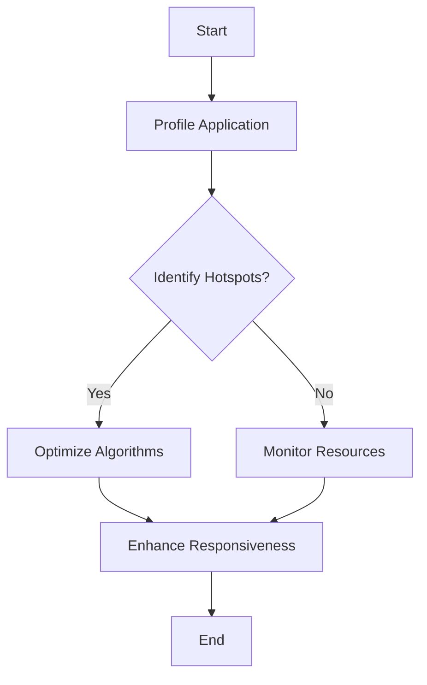

## 18.8 Performance and Memory Efficiency

In the realm of systems programming, performance and memory efficiency are paramount. The D programming language, with its blend of high-level and low-level features, offers unique opportunities to optimize both. In this section, we will explore strategies for profiling, optimizing algorithms, managing resources, and enhancing application responsiveness. By the end of this guide, you will have a comprehensive understanding of how to leverage D's capabilities to build high-performance, memory-efficient applications.

### Profiling: Identifying Hotspots

Profiling is the first step in performance optimization. It involves identifying the parts of your code that consume the most resources, allowing you to focus your optimization efforts where they will have the greatest impact.

#### Tools for Profiling in D

D provides several tools and libraries for profiling:

- **DMD's Built-in Profiler**: The DMD compiler includes a built-in profiler that can be enabled with the `-profile` flag. This tool provides insights into function call counts and execution times.
- **Visual Studio Code**: With the Dlang extension, you can use the integrated debugger and profiler to analyze your D applications.
- **Third-Party Tools**: Tools like Valgrind and gprof can also be used to profile D applications, especially when interfacing with C/C++ code.

#### Identifying Hotspots

To identify hotspots:

1. **Run the Profiler**: Execute your application with profiling enabled.
2. **Analyze the Output**: Look for functions with high call counts or long execution times.
3. **Focus on Critical Paths**: Prioritize optimization efforts on the most resource-intensive parts of your code.

### Optimizing Algorithms: Efficiency Over Premature Optimization

While optimization is crucial, it is important to avoid premature optimization. Focus on writing clear, maintainable code first, and optimize only when necessary.

#### Algorithmic Efficiency

- **Complexity Analysis**: Evaluate the time and space complexity of your algorithms. Aim for algorithms with lower complexity where possible.
- **Data Structures**: Choose appropriate data structures for your use case. For example, use hash tables for fast lookups and linked lists for dynamic data.

#### Example: Optimizing a Sorting Algorithm

Let's consider optimizing a sorting algorithm in D:

```d
import std.algorithm : sort;
import std.stdio : writeln;

void main() {
    int[] data = [5, 3, 8, 6, 2, 7, 4, 1];
    
    // Using built-in sort function
    data.sort();
    
    writeln("Sorted data: ", data);
}
```

In this example, we use D's built-in `sort` function, which is optimized for performance. However, if you need a custom sorting algorithm, consider the complexity and choose an efficient approach like quicksort or mergesort.

### Resource Management: Memory and CPU Usage

Efficient resource management is crucial for performance optimization. This involves monitoring and adjusting memory and CPU usage as needed.

#### Memory Management

- **Garbage Collection**: D uses a garbage collector by default. While convenient, it can introduce latency. Use `@nogc` to write garbage-collection-free code when necessary.
- **Manual Memory Management**: Use `malloc` and `free` for manual memory management, but be cautious of memory leaks and dangling pointers.

#### CPU Usage

- **Concurrency**: Utilize D's concurrency features, such as fibers and message passing, to distribute CPU load effectively.
- **Parallelism**: Leverage `std.parallelism` for parallel execution of tasks, especially in data-intensive applications.

### Use Cases and Examples: Responsive Applications

Responsive applications provide a better user experience by minimizing latency and maximizing efficiency.

#### Enhancing Responsiveness

- **Asynchronous I/O**: Use asynchronous I/O operations to prevent blocking the main thread.
- **Event-Driven Programming**: Implement event-driven architectures to handle user inputs and system events efficiently.

#### Example: Asynchronous File Reading

```d
import std.stdio;
import std.file;
import std.concurrency;

void main() {
    auto tid = spawn(&readFileAsync, "example.txt");
    writeln("Reading file asynchronously...");
    receiveOnly!string();
    writeln("File read complete.");
}

void readFileAsync(string filename) {
    string content = readText(filename);
    writeln("File content: ", content);
    send(ownerTid, "done");
}
```

In this example, we use D's `std.concurrency` module to read a file asynchronously, allowing the main thread to remain responsive.

### Visualizing Performance and Memory Efficiency

To better understand the flow of performance optimization, let's visualize the process using a flowchart.



This flowchart illustrates the iterative process of profiling, identifying hotspots, optimizing algorithms, monitoring resources, and enhancing responsiveness.

### References and Links

- [D Programming Language Official Site](https://dlang.org/)
- [Valgrind: Memory Debugging and Profiling](http://valgrind.org/)
- [gprof: GNU Profiler](https://sourceware.org/binutils/docs/gprof/)

### Knowledge Check

- What are the key tools for profiling in D?
- How can you identify hotspots in your code?
- Why is it important to avoid premature optimization?
- What are some strategies for managing memory and CPU usage?
- How can asynchronous I/O enhance application responsiveness?

### Embrace the Journey

Remember, mastering performance and memory efficiency is a journey. As you continue to explore and experiment with D's features, you'll discover new ways to optimize your applications. Stay curious, keep learning, and enjoy the process!

## Quiz Time!



### What is the primary purpose of profiling in D programming?

- [x] To identify resource-intensive parts of the code
- [ ] To automatically optimize the code
- [ ] To compile the code faster
- [ ] To generate documentation

> **Explanation:** Profiling helps identify which parts of the code consume the most resources, allowing developers to focus optimization efforts effectively.

### Which tool is NOT typically used for profiling D applications?

- [ ] DMD's Built-in Profiler
- [ ] Visual Studio Code
- [x] Microsoft Word
- [ ] Valgrind

> **Explanation:** Microsoft Word is not a profiling tool. DMD's Built-in Profiler, Visual Studio Code, and Valgrind are commonly used for profiling D applications.

### What is the benefit of using `@nogc` in D?

- [x] To write garbage-collection-free code
- [ ] To enable garbage collection
- [ ] To increase memory usage
- [ ] To slow down execution

> **Explanation:** The `@nogc` attribute in D allows developers to write code that does not trigger garbage collection, reducing latency.

### What is a common strategy for enhancing application responsiveness?

- [x] Using asynchronous I/O
- [ ] Increasing memory usage
- [ ] Disabling concurrency
- [ ] Using synchronous I/O

> **Explanation:** Asynchronous I/O prevents blocking the main thread, enhancing application responsiveness.

### Which of the following is a benefit of event-driven programming?

- [x] Efficient handling of user inputs and system events
- [ ] Increased memory usage
- [ ] Slower response times
- [ ] Reduced code readability

> **Explanation:** Event-driven programming efficiently handles user inputs and system events, improving responsiveness.

### What is the role of `std.parallelism` in D?

- [x] To enable parallel execution of tasks
- [ ] To disable concurrency
- [ ] To increase memory usage
- [ ] To reduce code readability

> **Explanation:** `std.parallelism` in D is used for parallel execution of tasks, especially in data-intensive applications.

### Why is it important to choose appropriate data structures?

- [x] To optimize time and space complexity
- [ ] To increase code complexity
- [ ] To reduce code readability
- [ ] To slow down execution

> **Explanation:** Choosing appropriate data structures helps optimize the time and space complexity of algorithms.

### What is a potential drawback of manual memory management?

- [x] Risk of memory leaks and dangling pointers
- [ ] Automatic garbage collection
- [ ] Increased memory usage
- [ ] Reduced code readability

> **Explanation:** Manual memory management can lead to memory leaks and dangling pointers if not handled carefully.

### What is the primary focus of algorithmic efficiency?

- [x] Time and space complexity
- [ ] Code readability
- [ ] Memory usage
- [ ] Code length

> **Explanation:** Algorithmic efficiency focuses on optimizing the time and space complexity of algorithms.

### True or False: Premature optimization is always beneficial.

- [ ] True
- [x] False

> **Explanation:** Premature optimization can lead to complex, hard-to-maintain code. It's important to focus on clear, maintainable code first and optimize only when necessary.


