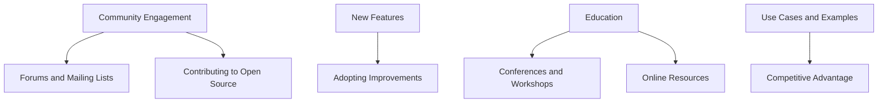

## 18.9 Staying Updated with Language Evolution

In the rapidly evolving world of software development, staying updated with the latest advancements in programming languages is crucial for maintaining a competitive edge. The D programming language, known for its powerful features and versatility, is no exception. As expert software engineers and architects, it is essential to keep abreast of the language's evolution to harness its full potential in building high-performance, scalable, and maintainable systems. In this section, we will explore various strategies to stay updated with the language evolution of D, focusing on community engagement, adopting new features, continuous education, and leveraging advancements for competitive advantage.

### Community Engagement

Engaging with the D programming community is one of the most effective ways to stay informed about the latest developments and trends. The community is a rich source of knowledge, offering insights into best practices, upcoming features, and real-world use cases.

#### Forums and Mailing Lists

Participating in forums and mailing lists is a great way to connect with other D developers and stay updated on the latest discussions. Platforms such as the D Language Forum and the Dlang mailing lists provide a space for developers to ask questions, share experiences, and discuss new features and improvements.

- **D Language Forum**: A vibrant community where developers discuss various topics related to D programming. Engaging in these discussions can provide valuable insights into the language's evolution and practical applications.
- **Dlang Mailing Lists**: Subscribing to mailing lists such as `dlang-announce` and `dlang-learn` can keep you informed about new releases, important announcements, and educational resources.

#### Contributing to Open Source Projects

Contributing to open-source projects is another excellent way to stay updated with the language's evolution. By participating in projects that use D, you can gain hands-on experience with the latest features and collaborate with other developers to solve complex problems.

- **Dlang GitHub Repository**: Explore and contribute to the official Dlang GitHub repository. Engaging with the codebase allows you to understand the language's internals and contribute to its development.

### New Features

Adopting new features and improvements in the D programming language can significantly enhance your development capabilities. Staying informed about these advancements ensures that you can leverage the latest tools and techniques to build more efficient and robust systems.

#### Adopting Improvements

Incorporating new language capabilities into your projects can lead to better performance, maintainability, and scalability. Here are some strategies to adopt new features effectively:

- **Experiment with New Features**: Regularly experiment with new features introduced in the language. This hands-on approach helps you understand their benefits and limitations.
- **Integrate Gradually**: When adopting new features, integrate them gradually into your existing codebase. This approach minimizes disruptions and allows you to evaluate their impact on your system.

#### Code Examples

Let's explore a code example that demonstrates the use of a new feature in D: the `@safe` attribute for memory safety.

```d
// Example of using @safe attribute in D
import std.stdio;

@safe void safeFunction() {
    writeln("This function is memory safe!");
}

void main() {
    safeFunction();
}
```

In this example, the `@safe` attribute ensures that the `safeFunction` is free from memory safety issues, such as buffer overflows and null pointer dereferences. By adopting such features, you can enhance the reliability and security of your applications.

### Education

Continuous education is vital for staying updated with the evolving D programming language. Attending conferences, workshops, and online courses can provide valuable learning opportunities and expose you to the latest advancements and best practices.

#### Conferences and Workshops

Participating in conferences and workshops allows you to learn from experts and gain insights into the latest trends and techniques in D programming.

- **DConf**: The annual D programming language conference is an excellent opportunity to learn from leading experts and network with other developers. Attendees can participate in talks, workshops, and panel discussions covering a wide range of topics related to D.
- **Online Workshops**: Many online platforms offer workshops and courses on D programming. These resources provide flexible learning opportunities and allow you to stay updated with the language's evolution at your own pace.

#### Online Resources

In addition to conferences and workshops, online resources such as blogs, tutorials, and documentation are valuable tools for continuous learning.

- **Dlang.org**: The official D programming language website offers comprehensive documentation and tutorials. Regularly reviewing these resources can help you stay informed about new features and best practices.
- **Community Blogs**: Many developers share their experiences and insights through blogs and articles. Following these blogs can provide practical tips and real-world examples of using D effectively.

### Use Cases and Examples

Leveraging the latest advancements in the D programming language can provide a competitive advantage in developing high-performance and scalable systems. By exploring real-world use cases and examples, you can gain insights into how these advancements can be applied to your projects.

#### Competitive Advantage

Staying updated with the language's evolution allows you to leverage the latest tools and techniques, giving you a competitive edge in the software development industry.

- **Performance Optimization**: New features and improvements in D can lead to significant performance gains. By adopting these advancements, you can build more efficient and responsive systems.
- **Scalability and Maintainability**: Incorporating the latest language capabilities can enhance the scalability and maintainability of your applications, making them easier to extend and adapt to changing requirements.

#### Real-World Examples

Let's explore a real-world example of using D's concurrency features to build a high-performance web server.

```d
import std.stdio;
import std.concurrency;
import std.socket;

void handleClient(TcpSocket client) {
    auto line = client.receiveLine();
    client.send("HTTP/1.1 200 OK\r\nContent-Type: text/plain\r\n\r\nHello, World!\r\n");
    client.close();
}

void main() {
    auto listener = new TcpListener(new InternetAddress("127.0.0.1", 8080));
    listener.listen();

    while (true) {
        auto client = listener.accept();
        spawn(&handleClient, client);
    }
}
```

In this example, we use D's `std.concurrency` module to handle multiple client connections concurrently. By leveraging D's concurrency features, we can build a high-performance web server capable of handling numerous requests efficiently.

### Visualizing Language Evolution

To better understand the process of staying updated with language evolution, let's visualize the key components involved in this journey.



This flowchart illustrates the interconnected components of staying updated with language evolution, highlighting the importance of community engagement, adopting new features, continuous education, and leveraging advancements for competitive advantage.

### Knowledge Check

To reinforce your understanding of staying updated with language evolution, consider the following questions:

- How can participating in forums and mailing lists benefit your understanding of D programming?
- What are some strategies for adopting new features in your projects?
- How can attending conferences and workshops enhance your knowledge of D programming?
- What are the benefits of leveraging the latest advancements in D for competitive advantage?

### Embrace the Journey

Remember, staying updated with the language evolution of D is an ongoing journey. By engaging with the community, adopting new features, pursuing continuous education, and leveraging advancements, you can enhance your expertise and build more efficient and robust systems. Keep experimenting, stay curious, and enjoy the journey of mastering D programming!

## Quiz Time!



### What is one benefit of participating in forums and mailing lists for D programming?

- [x] Gaining insights into best practices and upcoming features
- [ ] Receiving direct support from the language creators
- [ ] Avoiding the need for continuous education
- [ ] Eliminating the need for code reviews

> **Explanation:** Participating in forums and mailing lists allows developers to gain insights into best practices, upcoming features, and real-world use cases.

### How can contributing to open-source projects help you stay updated with D's evolution?

- [x] By gaining hands-on experience with the latest features
- [ ] By avoiding the need to read documentation
- [ ] By ensuring your code is always perfect
- [ ] By reducing the need for community engagement

> **Explanation:** Contributing to open-source projects provides hands-on experience with the latest features and allows collaboration with other developers.

### What is a recommended strategy for adopting new features in your projects?

- [x] Integrate them gradually into your existing codebase
- [ ] Implement them all at once for maximum impact
- [ ] Avoid using them until they are widely adopted
- [ ] Use them only in new projects

> **Explanation:** Integrating new features gradually minimizes disruptions and allows evaluation of their impact on the system.

### Which of the following is a benefit of attending conferences and workshops?

- [x] Learning from leading experts and networking with other developers
- [ ] Avoiding the need for online resources
- [ ] Guaranteeing immediate mastery of the language
- [ ] Eliminating the need for hands-on practice

> **Explanation:** Conferences and workshops provide opportunities to learn from experts and network with other developers, enhancing knowledge and skills.

### How can leveraging the latest advancements in D provide a competitive advantage?

- [x] By building more efficient and responsive systems
- [ ] By ensuring your code is always error-free
- [x] By enhancing scalability and maintainability
- [ ] By avoiding the need for performance optimization

> **Explanation:** Leveraging advancements in D can lead to performance gains and enhance scalability and maintainability, providing a competitive edge.

### What is the purpose of the `@safe` attribute in D?

- [x] To ensure memory safety in functions
- [ ] To optimize performance
- [ ] To enable concurrency
- [ ] To simplify error handling

> **Explanation:** The `@safe` attribute ensures that functions are free from memory safety issues, enhancing reliability and security.

### What is one way to leverage online resources for continuous learning in D programming?

- [x] Regularly reviewing documentation and tutorials
- [ ] Avoiding community blogs
- [x] Following blogs for practical tips and examples
- [ ] Relying solely on official documentation

> **Explanation:** Regularly reviewing documentation and following community blogs provide valuable insights and practical tips for continuous learning.

### What is a key component of staying updated with language evolution?

- [x] Community engagement
- [ ] Avoiding new features
- [ ] Disregarding educational resources
- [ ] Focusing only on legacy systems

> **Explanation:** Community engagement is a key component of staying updated with language evolution, providing insights and collaboration opportunities.

### How can experimenting with new features benefit your development process?

- [x] By understanding their benefits and limitations
- [ ] By ensuring immediate success
- [ ] By avoiding the need for testing
- [ ] By simplifying the development process

> **Explanation:** Experimenting with new features helps developers understand their benefits and limitations, enhancing the development process.

### True or False: Staying updated with language evolution is a one-time effort.

- [ ] True
- [x] False

> **Explanation:** Staying updated with language evolution is an ongoing journey that requires continuous engagement and learning.


