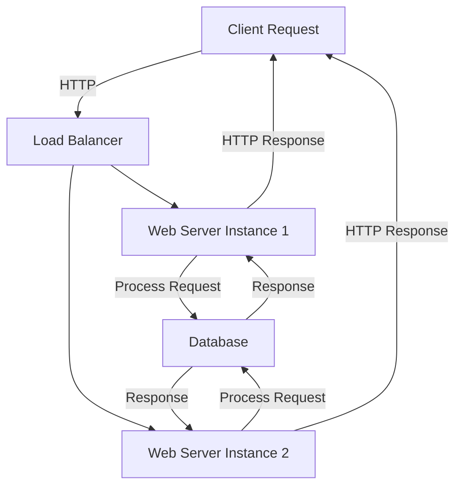

## 19.1 Building a High-Performance Web Server

In this section, we will delve into the process of building a high-performance web server using the D programming language. This case study will guide you through the design goals, implementation details, and lessons learned from creating a scalable and efficient web server. By leveraging D's unique features, such as its concurrency model and metaprogramming capabilities, we aim to achieve a server that can handle numerous concurrent connections with minimal latency.

### Design Goals

#### Scalability

Scalability is crucial for a web server to handle a growing number of concurrent connections without degrading performance. Our goal is to design a server that can efficiently manage thousands of simultaneous connections, ensuring that it can scale horizontally and vertically as needed.

#### Performance

Performance is measured by the server's ability to minimize latency and maximize throughput. We aim to achieve low response times and high data transfer rates by optimizing the server's architecture and leveraging D's performance-oriented features.

### Implementation Details

#### Asynchronous I/O

Asynchronous I/O is a key technique for building high-performance servers. By using non-blocking operations, we can handle multiple I/O operations concurrently without waiting for each to complete before starting the next. This approach reduces idle time and increases the server's responsiveness.

In D, asynchronous I/O can be implemented using the `std.concurrency` module, which provides a message-passing model for concurrent programming. Here's a basic example of how to set up an asynchronous I/O operation in D:

```d
import std.stdio;
import std.concurrency;
import std.socket;

void handleClient(TcpSocket client) {
    // Handle client connection
    writeln("Handling client: ", client.remoteAddress);
    // Perform non-blocking read/write operations
    // ...
}

void main() {
    auto listener = new TcpListener(new InternetAddress("127.0.0.1", 8080));
    listener.listen();

    while (true) {
        auto client = listener.accept();
        spawn(&handleClient, client);
    }
}
```

In this example, we use `TcpListener` to accept incoming connections and `spawn` to create a new thread for each client, allowing us to handle multiple clients concurrently.

#### Concurrency Models

Choosing the right concurrency model is essential for achieving high performance. In D, we have several options, including threads, fibers, and asynchronous programming. Each model has its advantages and trade-offs:

- **Threads**: Suitable for CPU-bound tasks but can be resource-intensive due to context switching.
- **Fibers**: Lightweight and efficient for I/O-bound tasks, allowing for cooperative multitasking.
- **Async/Await**: Provides a more intuitive way to handle asynchronous operations, reducing complexity.

For our web server, we will use fibers to manage I/O-bound tasks efficiently. Fibers allow us to write code that appears synchronous while benefiting from non-blocking I/O operations.

Here's an example of using fibers in D:

```d
import std.stdio;
import core.thread;

void fiberFunction() {
    writeln("Fiber started");
    // Perform I/O operations
    // ...
    writeln("Fiber finished");
}

void main() {
    auto fiber = new Fiber(&fiberFunction);
    fiber.call(); // Start the fiber
    writeln("Main function continues");
    fiber.call(); // Resume the fiber
}
```

### Outcomes and Lessons Learned

#### Optimization Techniques

Throughout the development of our web server, we experimented with various optimization techniques to enhance performance. Here are some key takeaways:

- **Efficient Memory Management**: Using D's garbage collector judiciously and employing manual memory management where necessary can significantly reduce latency.
- **Load Balancing**: Distributing incoming requests across multiple server instances helps prevent bottlenecks and ensures even resource utilization.
- **Caching**: Implementing caching mechanisms for frequently accessed data reduces the need for repeated computations and database queries.

#### Future Improvements

While our web server achieved impressive performance metrics, there are always areas for improvement. Some potential enhancements include:

- **Advanced Caching Strategies**: Exploring more sophisticated caching algorithms to further reduce latency.
- **Enhanced Security Features**: Implementing robust security measures to protect against common vulnerabilities.
- **Scalability Testing**: Conducting extensive scalability tests to identify potential bottlenecks under heavy load.

### Visualizing the Architecture

To better understand the architecture of our high-performance web server, let's visualize the flow of data and control using a Mermaid.js diagram:



**Diagram Description**: This diagram illustrates the flow of a client request through the load balancer to one of the web server instances, which then processes the request and interacts with the database before sending a response back to the client.

### Try It Yourself

To deepen your understanding, try modifying the code examples provided:

- Experiment with different concurrency models (threads, fibers, async/await) and observe their impact on performance.
- Implement a simple caching mechanism to store and retrieve frequently accessed data.
- Add logging to track the server's performance metrics and identify potential bottlenecks.

### References and Links

For further reading on building high-performance web servers and related topics, consider the following resources:

- [D Programming Language Official Documentation](https://dlang.org/)
- [Asynchronous Programming in D](https://dlang.org/phobos/std_concurrency.html)
- [High-Performance Web Servers](https://www.nginx.com/resources/glossary/high-performance-web-server/)

### Knowledge Check

To reinforce your learning, consider the following questions and challenges:

- What are the advantages of using asynchronous I/O in a web server?
- How do fibers differ from threads, and when should you use each?
- Implement a basic load balancer to distribute requests across multiple server instances.

### Embrace the Journey

Building a high-performance web server is a challenging yet rewarding endeavor. Remember, this is just the beginning. As you continue to explore and experiment, you'll uncover new techniques and optimizations that will further enhance your server's capabilities. Keep pushing the boundaries, stay curious, and enjoy the journey!

## Quiz Time!



### What is the primary goal of using asynchronous I/O in a web server?

- [x] To handle multiple I/O operations concurrently without blocking
- [ ] To simplify the server's architecture
- [ ] To reduce the server's memory usage
- [ ] To increase the server's CPU utilization

> **Explanation:** Asynchronous I/O allows a server to handle multiple I/O operations concurrently, improving responsiveness and throughput.

### Which concurrency model is most suitable for I/O-bound tasks in D?

- [ ] Threads
- [x] Fibers
- [ ] Async/Await
- [ ] Processes

> **Explanation:** Fibers are lightweight and efficient for I/O-bound tasks, allowing for cooperative multitasking.

### What is a key benefit of using fibers over threads?

- [x] Reduced context switching overhead
- [ ] Easier to implement
- [ ] Better for CPU-bound tasks
- [ ] Requires less memory

> **Explanation:** Fibers have reduced context switching overhead compared to threads, making them more efficient for certain tasks.

### What is one potential improvement for the web server discussed in this section?

- [ ] Increasing the number of server instances
- [x] Implementing advanced caching strategies
- [ ] Reducing the server's response time
- [ ] Simplifying the server's codebase

> **Explanation:** Implementing advanced caching strategies can further reduce latency and improve performance.

### What is the role of a load balancer in a web server architecture?

- [x] To distribute incoming requests across multiple server instances
- [ ] To handle database queries
- [ ] To manage client connections
- [ ] To perform security checks

> **Explanation:** A load balancer distributes incoming requests across multiple server instances to prevent bottlenecks.

### Which D module is used for message-passing concurrency?

- [ ] std.socket
- [x] std.concurrency
- [ ] std.parallelism
- [ ] std.async

> **Explanation:** The `std.concurrency` module provides a message-passing model for concurrent programming in D.

### What is one advantage of using caching in a web server?

- [x] Reduces the need for repeated computations and database queries
- [ ] Increases the server's memory usage
- [ ] Simplifies the server's architecture
- [ ] Improves the server's security

> **Explanation:** Caching reduces the need for repeated computations and database queries, improving performance.

### What is a key consideration when using D's garbage collector in a web server?

- [x] Using it judiciously to reduce latency
- [ ] Avoiding it entirely
- [ ] Relying on it for all memory management
- [ ] Using it to manage server connections

> **Explanation:** Using D's garbage collector judiciously can help reduce latency and improve performance.

### What is the primary focus of performance optimization in a web server?

- [x] Minimizing latency and maximizing throughput
- [ ] Reducing the server's code complexity
- [ ] Simplifying the server's architecture
- [ ] Increasing the server's memory usage

> **Explanation:** Performance optimization focuses on minimizing latency and maximizing throughput to improve the server's efficiency.

### True or False: Threads are always the best choice for concurrency in a web server.

- [ ] True
- [x] False

> **Explanation:** Threads are not always the best choice; the appropriate concurrency model depends on the specific tasks and requirements.


