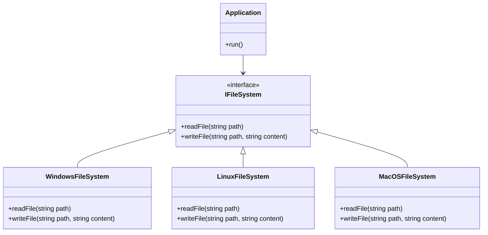

## 19.10 Cross-Platform Application Development

Cross-platform application development is a critical aspect of modern software engineering, enabling applications to run on multiple operating systems with minimal changes to the codebase. In this section, we delve into the strategies, challenges, and solutions for cross-platform development using the D programming language. We will explore how to leverage D's unique features to create efficient, maintainable, and scalable applications that can reach a broader audience.

### Application Goals

#### Platform Support

The primary goal of cross-platform application development is to support multiple operating systems, such as Windows, macOS, and Linux. This support ensures that applications can reach a wider audience, increasing their market potential and user base. By targeting multiple platforms, developers can maximize their application's reach and impact.

#### Cross-Platform Strategies

To achieve cross-platform compatibility, developers must employ various strategies that abstract platform-specific details and manage differences effectively.

##### Abstraction Layers

Abstraction layers are a fundamental strategy in cross-platform development. They involve creating a unified interface that hides platform-specific details, allowing the core application logic to remain unchanged across different operating systems. This approach simplifies maintenance and reduces the risk of platform-specific bugs.

###### Example: File System Abstraction

Consider a scenario where an application needs to interact with the file system. Different operating systems have different APIs for file operations. By creating an abstraction layer, we can provide a consistent interface for file operations, regardless of the underlying platform.

```d
// FileSystem.d
module FileSystem;

interface IFileSystem {
    void readFile(string path);
    void writeFile(string path, string content);
}

class WindowsFileSystem : IFileSystem {
    void readFile(string path) {
        // Windows-specific file reading logic
    }
    
    void writeFile(string path, string content) {
        // Windows-specific file writing logic
    }
}

class LinuxFileSystem : IFileSystem {
    void readFile(string path) {
        // Linux-specific file reading logic
    }
    
    void writeFile(string path, string content) {
        // Linux-specific file writing logic
    }
}

class MacOSFileSystem : IFileSystem {
    void readFile(string path) {
        // macOS-specific file reading logic
    }
    
    void writeFile(string path, string content) {
        // macOS-specific file writing logic
    }
}
```

In this example, we define an interface `IFileSystem` and implement platform-specific classes for Windows, Linux, and macOS. The application can use the `IFileSystem` interface without worrying about the underlying platform.

##### Conditional Compilation

Conditional compilation is another essential strategy for managing platform-specific differences. In D, the `version` statement allows developers to include or exclude code based on the target platform.

###### Example: Platform-Specific Code

```d
// PlatformSpecific.d
module PlatformSpecific;

void platformSpecificFunction() {
    version(Windows) {
        // Windows-specific code
    }
    else version(Posix) {
        // POSIX-compliant code (Linux and macOS)
    }
    else {
        static assert(0, "Unsupported platform");
    }
}
```

In this example, we use the `version` statement to include platform-specific code for Windows and POSIX-compliant systems. This approach ensures that only the relevant code is compiled for the target platform.

### Challenges and Solutions

Cross-platform development presents several challenges, including dependency management and testing across platforms. Let's explore these challenges and their solutions.

#### Dependency Management

Managing dependencies is a significant challenge in cross-platform development, especially when dealing with platform-specific libraries. Developers must ensure that their application can access the necessary libraries on each target platform.

##### Solution: Dependency Abstraction

One solution is to abstract dependencies using interfaces or factory patterns. This approach allows developers to swap out platform-specific implementations without affecting the core application logic.

###### Example: Dependency Injection

```d
// DependencyInjection.d
module DependencyInjection;

interface IDatabase {
    void connect();
    void disconnect();
}

class WindowsDatabase : IDatabase {
    void connect() {
        // Windows-specific database connection logic
    }
    
    void disconnect() {
        // Windows-specific database disconnection logic
    }
}

class LinuxDatabase : IDatabase {
    void connect() {
        // Linux-specific database connection logic
    }
    
    void disconnect() {
        // Linux-specific database disconnection logic
    }
}

void useDatabase(IDatabase db) {
    db.connect();
    // Perform database operations
    db.disconnect();
}
```

By using dependency injection, we can pass platform-specific implementations of the `IDatabase` interface to the `useDatabase` function, allowing the application to work seamlessly across platforms.

#### Testing Across Platforms

Ensuring consistent behavior across platforms is crucial for cross-platform applications. Testing on multiple platforms can be time-consuming and challenging.

##### Solution: Automated Testing and Continuous Integration

Automated testing and continuous integration (CI) pipelines can help streamline the testing process. By setting up CI pipelines that run tests on multiple platforms, developers can quickly identify and fix platform-specific issues.

###### Example: CI Pipeline Configuration

```yaml
name: CI

on: [push, pull_request]

jobs:
  build:
    runs-on: ${{ matrix.os }}
    strategy:
      matrix:
        os: [ubuntu-latest, windows-latest, macos-latest]
    
    steps:
    - uses: actions/checkout@v2
    - name: Set up D
      uses: dlang-community/setup-dlang@v1
    - name: Build
      run: dub build
    - name: Test
      run: dub test
```

In this example, we configure a GitHub Actions CI pipeline to run tests on Ubuntu, Windows, and macOS. This setup ensures that the application is tested on all target platforms, providing confidence in its cross-platform compatibility.

### Outcomes

Cross-platform development offers several benefits, including expanded market reach and maintenance considerations.

#### Market Reach

By supporting multiple platforms, applications can reach a broader audience, increasing their market potential and user base. This expanded reach can lead to higher adoption rates and increased revenue opportunities.

#### Maintenance Considerations

Managing platform diversity can be challenging, but it also offers opportunities for code reuse and modular design. By abstracting platform-specific details and using conditional compilation, developers can maintain a single codebase that supports multiple platforms, reducing maintenance overhead.

### Try It Yourself

To gain hands-on experience with cross-platform development in D, try modifying the code examples provided in this section. Experiment with adding support for additional platforms or implementing new features using abstraction layers and conditional compilation.

### Visualizing Cross-Platform Development

To better understand the architecture of a cross-platform application, let's visualize the interaction between the core application logic and platform-specific components using a class diagram.



**Diagram Description:** This class diagram illustrates the relationship between the `Application` class and the `IFileSystem` interface, along with its platform-specific implementations. The `Application` class interacts with the `IFileSystem` interface, allowing it to perform file operations without worrying about the underlying platform.

### References and Links

For further reading on cross-platform development and the D programming language, consider the following resources:

- [D Programming Language Official Website](https://dlang.org/)
- [DUB Package Manager](https://code.dlang.org/)
- [GitHub Actions Documentation](https://docs.github.com/en/actions)
- [Cross-Platform Development Best Practices](https://www.techopedia.com/definition/30156/cross-platform-development)

### Knowledge Check

To reinforce your understanding of cross-platform development in D, consider the following questions and exercises:

- What are the benefits of using abstraction layers in cross-platform development?
- How can conditional compilation help manage platform-specific differences?
- Implement a cross-platform logging system using the strategies discussed in this section.
- Set up a CI pipeline for a D project that targets multiple platforms.

### Embrace the Journey

Cross-platform development is a rewarding journey that opens up new opportunities for your applications. By mastering the strategies and techniques discussed in this section, you'll be well-equipped to build applications that run seamlessly across multiple platforms. Remember, this is just the beginning. Keep experimenting, stay curious, and enjoy the journey!

## Quiz Time!



### What is the primary goal of cross-platform application development?

- [x] To support multiple operating systems
- [ ] To increase application size
- [ ] To reduce code complexity
- [ ] To limit application features

> **Explanation:** The primary goal of cross-platform application development is to support multiple operating systems, allowing applications to reach a wider audience.

### Which strategy involves creating a unified interface to hide platform-specific details?

- [x] Abstraction Layers
- [ ] Conditional Compilation
- [ ] Dependency Injection
- [ ] Automated Testing

> **Explanation:** Abstraction layers involve creating a unified interface that hides platform-specific details, simplifying maintenance and reducing platform-specific bugs.

### What is the purpose of the `version` statement in D?

- [x] To include or exclude code based on the target platform
- [ ] To define new data types
- [ ] To manage memory allocation
- [ ] To handle exceptions

> **Explanation:** The `version` statement in D is used for conditional compilation, allowing developers to include or exclude code based on the target platform.

### How can dependency management be addressed in cross-platform development?

- [x] By using interfaces or factory patterns
- [ ] By hardcoding platform-specific libraries
- [ ] By ignoring platform differences
- [ ] By using global variables

> **Explanation:** Dependency management can be addressed by using interfaces or factory patterns, allowing developers to swap out platform-specific implementations without affecting the core application logic.

### What is a benefit of automated testing and continuous integration in cross-platform development?

- [x] Ensures consistent behavior across platforms
- [ ] Increases code complexity
- [ ] Reduces application performance
- [ ] Limits platform support

> **Explanation:** Automated testing and continuous integration ensure consistent behavior across platforms by running tests on multiple platforms, quickly identifying and fixing platform-specific issues.

### What is the role of the `IFileSystem` interface in the provided example?

- [x] To provide a consistent interface for file operations across platforms
- [ ] To manage memory allocation
- [ ] To handle user input
- [ ] To define new data types

> **Explanation:** The `IFileSystem` interface provides a consistent interface for file operations across platforms, allowing the application to interact with the file system without worrying about the underlying platform.

### Which platforms are targeted in the provided CI pipeline example?

- [x] Ubuntu, Windows, and macOS
- [ ] Android, iOS, and Windows
- [ ] Linux, Solaris, and AIX
- [ ] FreeBSD, NetBSD, and OpenBSD

> **Explanation:** The provided CI pipeline example targets Ubuntu, Windows, and macOS, ensuring that the application is tested on all target platforms.

### What is a key outcome of cross-platform development?

- [x] Expanded market reach
- [ ] Increased application size
- [ ] Reduced code readability
- [ ] Limited platform support

> **Explanation:** A key outcome of cross-platform development is expanded market reach, as supporting multiple platforms allows applications to reach a broader audience.

### What is the benefit of using abstraction layers in cross-platform development?

- [x] Simplifies maintenance and reduces platform-specific bugs
- [ ] Increases code complexity
- [ ] Limits application features
- [ ] Reduces application size

> **Explanation:** Abstraction layers simplify maintenance and reduce platform-specific bugs by providing a unified interface that hides platform-specific details.

### True or False: Cross-platform development can lead to higher adoption rates and increased revenue opportunities.

- [x] True
- [ ] False

> **Explanation:** True. By supporting multiple platforms, applications can reach a broader audience, leading to higher adoption rates and increased revenue opportunities.


