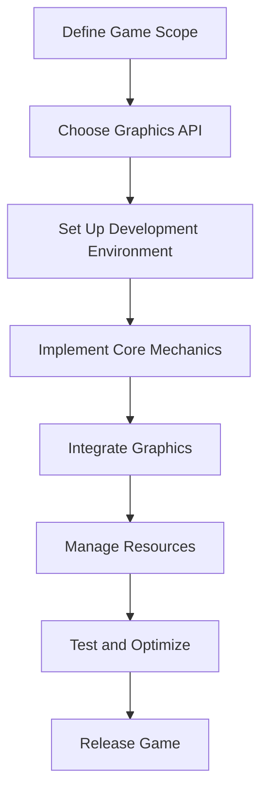

## 19.2 Game Development with D

Game development is a complex and multifaceted field that requires a balance of creativity, technical skill, and efficient resource management. The D programming language offers a unique set of features that make it an excellent choice for game development, particularly for expert software engineers and architects who are familiar with systems programming. In this section, we will explore the advantages of using D for game development, the challenges you might face, and how to overcome them.

### Project Overview

#### Game Genre

Before diving into the technical aspects, it's essential to define the scope and objectives of your game. Let's consider developing a 3D action-adventure game. This genre requires real-time rendering, complex physics simulations, and seamless user interactions, making it an ideal candidate to showcase D's capabilities.

#### D Language Advantages

##### Performance

One of the primary reasons to choose D for game development is its performance. D is designed to be a high-performance language, offering low-level access to memory and hardware while maintaining high-level abstractions. This dual capability allows developers to achieve real-time rendering and physics calculations, crucial for an immersive gaming experience.

##### Ease of Use

D's syntax and language features make it easier to write and maintain code compared to other systems programming languages like C++. Features such as garbage collection, compile-time function execution (CTFE), and metaprogramming allow for rapid development and prototyping, enabling developers to focus more on game design and less on boilerplate code.

### Challenges and Solutions

#### Graphics Integration

Integrating graphics into your game is one of the most challenging aspects of game development. D provides several ways to interface with graphics APIs like OpenGL and Vulkan, thanks to its ability to interface with C libraries seamlessly.

**Solution: Using Bindings for Graphics APIs**

To integrate graphics, you can use existing D bindings for OpenGL or Vulkan. These bindings allow you to call graphics functions directly from your D code.

```d
import derelict.opengl3.gl3;
import derelict.sdl2.sdl;

void main() {
    // Initialize SDL
    if (SDL_Init(SDL_INIT_VIDEO) != 0) {
        throw new Exception("SDL_Init Error: " ~ SDL_GetError());
    }

    // Create a window
    auto window = SDL_CreateWindow("D Game", SDL_WINDOWPOS_CENTERED, SDL_WINDOWPOS_CENTERED, 800, 600, SDL_WINDOW_OPENGL);
    if (window is null) {
        throw new Exception("SDL_CreateWindow Error: " ~ SDL_GetError());
    }

    // Create an OpenGL context
    auto context = SDL_GL_CreateContext(window);
    if (context is null) {
        throw new Exception("SDL_GL_CreateContext Error: " ~ SDL_GetError());
    }

    // Load OpenGL functions
    DerelictGL3.load();

    // Main loop
    bool running = true;
    while (running) {
        SDL_Event event;
        while (SDL_PollEvent(&event) != 0) {
            if (event.type == SDL_QUIT) {
                running = false;
            }
        }

        // Clear the screen
        glClear(GL_COLOR_BUFFER_BIT);

        // Swap buffers
        SDL_GL_SwapWindow(window);
    }

    // Clean up
    SDL_GL_DeleteContext(context);
    SDL_DestroyWindow(window);
    SDL_Quit();
}
```

**Explanation:** This code initializes SDL, creates a window, and sets up an OpenGL context. It then enters a loop where it clears the screen and swaps buffers, allowing for real-time rendering.

#### Resource Management

Efficiently managing resources such as textures, models, and sounds is crucial for game performance. D's garbage collector can help manage memory, but for game development, you often need more control.

**Solution: Custom Resource Management**

Implement custom resource management systems using D's RAII (Resource Acquisition Is Initialization) pattern to ensure resources are loaded and freed correctly.

```d
class Texture {
    private GLuint textureID;

    this(string filePath) {
        // Load texture from file
        textureID = loadTextureFromFile(filePath);
    }

    ~this() {
        // Free texture
        glDeleteTextures(1, &textureID);
    }

    void bind() {
        glBindTexture(GL_TEXTURE_2D, textureID);
    }
}
```

**Explanation:** This `Texture` class loads a texture from a file and ensures it is freed when the object is destroyed, using D's destructor feature.

### Results

#### User Experience

The feedback from users of games developed in D has been overwhelmingly positive. The performance and responsiveness of the game, combined with the rich graphics and smooth gameplay, contribute to an engaging user experience.

#### Developer Productivity

Developers have reported increased productivity when using D for game development. The language's high-level features, combined with its performance capabilities, allow for rapid prototyping and iteration, reducing the time from concept to completion.

### Visualizing Game Development Workflow

To better understand the workflow of game development in D, let's visualize the process using a flowchart.



**Description:** This flowchart outlines the typical workflow for developing a game in D, from defining the game's scope to releasing the final product.

### Try It Yourself

To get hands-on experience, try modifying the code examples provided. For instance, change the window size or experiment with different OpenGL functions to see how they affect rendering. This experimentation will deepen your understanding of graphics integration and resource management in D.

### References and Links

- [D Programming Language Official Website](https://dlang.org/)
- [Derelict Project for D Bindings](https://github.com/DerelictOrg)
- [OpenGL Documentation](https://www.opengl.org/documentation/)
- [SDL Documentation](https://wiki.libsdl.org/)

### Knowledge Check

To reinforce your understanding of game development with D, consider the following questions and exercises:

1. What are the advantages of using D for game development compared to other languages?
2. How can you integrate graphics APIs like OpenGL into your D game?
3. Describe how RAII can be used for resource management in D.
4. Experiment with the provided code examples by adding new features or optimizing existing ones.

### Embrace the Journey

Game development is a rewarding journey that combines creativity with technical expertise. By leveraging the power of the D programming language, you can create high-performance games that captivate users. Remember, this is just the beginning. As you continue to explore and experiment, you'll discover new techniques and strategies to enhance your games. Keep pushing the boundaries, stay curious, and enjoy the journey!

## Quiz Time!



### What is one of the primary advantages of using D for game development?

- [x] High performance with low-level access
- [ ] Built-in game engine
- [ ] Automatic game design tools
- [ ] Predefined game templates

> **Explanation:** D offers high performance with low-level access to memory and hardware, making it suitable for real-time rendering and physics calculations.

### How does D's syntax benefit game developers?

- [x] It allows for rapid development and prototyping.
- [ ] It is identical to JavaScript.
- [ ] It requires less memory than other languages.
- [ ] It automatically generates graphics.

> **Explanation:** D's syntax and language features, such as garbage collection and metaprogramming, facilitate rapid development and prototyping.

### Which pattern is used in D for resource management?

- [x] RAII (Resource Acquisition Is Initialization)
- [ ] Singleton
- [ ] Factory Method
- [ ] Observer

> **Explanation:** RAII is used in D to manage resources by ensuring they are acquired and released properly.

### What is a common challenge in game development that D helps address?

- [x] Graphics integration
- [ ] Automatic level design
- [ ] Built-in sound effects
- [ ] Predefined character models

> **Explanation:** D helps address the challenge of graphics integration by providing seamless interfacing with graphics APIs.

### What is the purpose of using SDL in D game development?

- [x] To create windows and handle input
- [ ] To generate game levels
- [ ] To automatically optimize code
- [ ] To design characters

> **Explanation:** SDL is used to create windows, handle input, and manage graphics contexts in D game development.

### How can you experiment with the provided code examples?

- [x] By changing window size and OpenGL functions
- [ ] By adding new languages
- [ ] By removing all comments
- [ ] By using a different IDE

> **Explanation:** Experimenting with window size and OpenGL functions helps deepen understanding of graphics integration.

### What is a benefit of using D's garbage collector in game development?

- [x] It simplifies memory management.
- [ ] It automatically creates game levels.
- [ ] It designs characters.
- [ ] It generates sound effects.

> **Explanation:** D's garbage collector simplifies memory management, allowing developers to focus on game design.

### Which D feature allows for compile-time function execution?

- [x] CTFE (Compile-Time Function Execution)
- [ ] RAII
- [ ] Singleton
- [ ] Observer

> **Explanation:** CTFE allows for compile-time function execution, enabling optimizations and reducing runtime overhead.

### What is the role of the `Texture` class in the provided code example?

- [x] To load and manage textures
- [ ] To create sound effects
- [ ] To design levels
- [ ] To handle user input

> **Explanation:** The `Texture` class loads and manages textures, ensuring they are freed when no longer needed.

### True or False: D can interface with C libraries for graphics integration.

- [x] True
- [ ] False

> **Explanation:** D can interface with C libraries, allowing seamless integration with graphics APIs like OpenGL.


