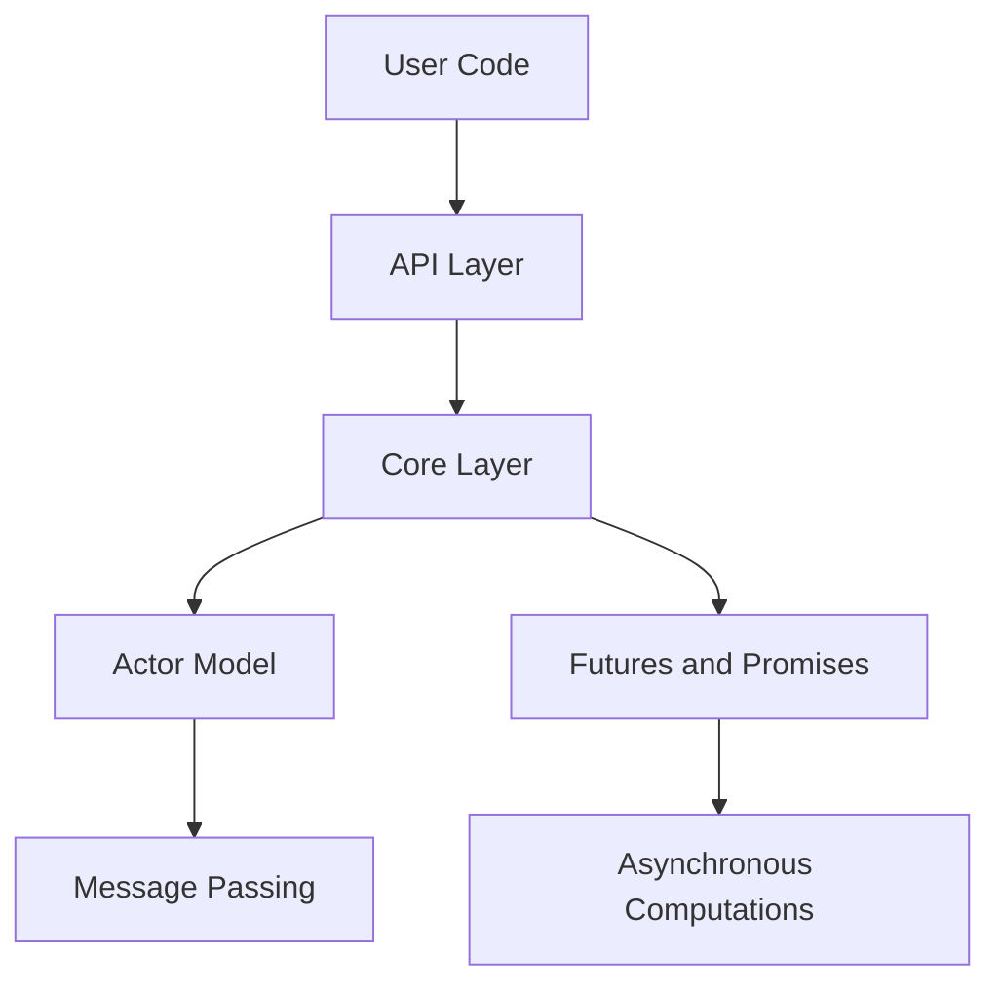

## 19.3 Implementing a Concurrent Framework

In the world of systems programming, concurrency is a critical aspect that can significantly enhance the performance and responsiveness of applications. The D programming language, with its powerful features, provides an excellent platform for implementing a concurrent framework. In this section, we will explore how to build a concurrent framework using the Actor Model and Futures and Promises, focusing on simplifying concurrency and managing asynchronous results effectively.

### Framework Purpose

The primary purpose of this framework is to simplify concurrency by providing developers with easy-to-use tools that abstract away the complexities of concurrent programming. By leveraging design patterns such as the Actor Model and Futures and Promises, we aim to create a robust and scalable framework that can be adopted by the community and extended through contributions.

#### Simplify Concurrency

Concurrency can be daunting due to the complexity of managing multiple threads, synchronization, and potential race conditions. Our framework aims to simplify these challenges by:

- **Encapsulating State and Behavior**: Using the Actor Model to encapsulate state and behavior, allowing actors to communicate via message passing.
- **Managing Asynchronous Results**: Utilizing Futures and Promises to handle asynchronous computations and results seamlessly.

### Design Patterns Used

#### Actor Model

The Actor Model is a conceptual model that treats "actors" as the fundamental units of computation. In this model, actors can:

- **Receive Messages**: Actors communicate by sending and receiving messages.
- **Create New Actors**: Actors can create other actors to delegate tasks.
- **Change State**: Actors can change their state based on the messages they receive.

The Actor Model provides a natural way to think about concurrency, as it abstracts the complexities of thread management and synchronization.

#### Futures and Promises

Futures and Promises are abstractions used to manage asynchronous computations. They allow developers to:

- **Represent Asynchronous Results**: Futures represent a value that may not yet be available.
- **Chain Asynchronous Operations**: Promises can be used to chain operations that depend on the completion of previous tasks.
- **Handle Errors Gracefully**: Futures and Promises provide mechanisms to handle errors in asynchronous computations.

### Implementation Strategies

#### Abstraction Layers

To hide the complexity from users, the framework will be designed with multiple abstraction layers:

- **Core Layer**: Implements the fundamental concurrency mechanisms using D's low-level capabilities.
- **API Layer**: Provides a user-friendly interface for developers to interact with the framework.
- **Utility Layer**: Offers additional utilities and helpers to facilitate common concurrency tasks.

#### Performance Considerations

Ensuring scalability and performance is crucial for any concurrent framework. Our implementation will focus on:

- **Efficient Message Passing**: Optimizing the communication between actors to minimize overhead.
- **Non-blocking Operations**: Using non-blocking I/O and algorithms to prevent bottlenecks.
- **Resource Management**: Implementing strategies for efficient resource allocation and deallocation.

### Outcomes

#### Adoption

The framework's success will be measured by its adoption within the developer community. We aim to create comprehensive documentation and examples to facilitate easy adoption.

#### Community Contributions

Encouraging community contributions is vital for the framework's growth and evolution. We will provide guidelines and tools for developers to contribute extensions and improvements.

### Code Examples

Let's dive into some code examples to illustrate the concepts discussed.

#### Actor Model Implementation

```d
import std.concurrency;
import std.stdio;

// Define a simple actor
void actorFunction(Tid parentTid) {
    while (true) {
        receive(
            (string msg) {
                writeln("Received message: ", msg);
                if (msg == "stop") {
                    break;
                }
            }
        );
    }
}

void main() {
    // Spawn an actor
    auto actorTid = spawn(&actorFunction, thisTid);

    // Send messages to the actor
    send(actorTid, "Hello, Actor!");
    send(actorTid, "stop");

    // Wait for the actor to finish
    receiveOnly!void;
}
```

In this example, we define a simple actor that receives messages and prints them. The actor stops when it receives the "stop" message.

#### Futures and Promises Implementation

```d
import std.concurrency;
import std.stdio;
import std.parallelism;

// Function to perform an asynchronous computation
int asyncComputation(int x) {
    return x * x;
}

void main() {
    // Create a future for the asynchronous computation
    auto future = async!asyncComputation(10);

    // Wait for the result
    int result = future.get();
    writeln("Result: ", result);
}
```

This example demonstrates how to use futures to perform an asynchronous computation and retrieve the result.

### Visualizing the Framework

To better understand the architecture of our concurrent framework, let's visualize the components using a Mermaid.js diagram.



**Diagram Description**: This diagram illustrates the architecture of the concurrent framework. The user code interacts with the API Layer, which communicates with the Core Layer. The Core Layer implements the Actor Model and Futures and Promises, which handle message passing and asynchronous computations, respectively.

### Try It Yourself

Experiment with the code examples provided by modifying them to suit your needs. For instance, try creating multiple actors and have them communicate with each other, or chain multiple asynchronous computations using futures and promises.

### References and Links

For further reading on concurrency and the Actor Model, consider the following resources:

- [Actor Model on Wikipedia](https://en.wikipedia.org/wiki/Actor_model)
- [Futures and Promises on Wikipedia](https://en.wikipedia.org/wiki/Futures_and_promises)
- [D Programming Language Documentation](https://dlang.org/documentation.html)

### Knowledge Check

To reinforce your understanding, consider the following questions:

- What are the key benefits of using the Actor Model for concurrency?
- How do Futures and Promises simplify asynchronous programming?
- What are some potential challenges when implementing a concurrent framework?

### Embrace the Journey

Remember, implementing a concurrent framework is a complex but rewarding task. As you progress, you'll gain a deeper understanding of concurrency and how to leverage D's features to build efficient and scalable systems. Keep experimenting, stay curious, and enjoy the journey!

### Quiz Time!



### What is the primary purpose of the concurrent framework discussed in this section?

- [x] Simplify concurrency by providing easy-to-use tools
- [ ] Increase the complexity of concurrent programming
- [ ] Replace all existing concurrency models
- [ ] Eliminate the need for asynchronous programming

> **Explanation:** The framework aims to simplify concurrency by providing tools that abstract away the complexities of concurrent programming.

### Which design pattern is used to encapsulate state and behavior in the framework?

- [x] Actor Model
- [ ] Singleton Pattern
- [ ] Observer Pattern
- [ ] Factory Pattern

> **Explanation:** The Actor Model is used to encapsulate state and behavior, allowing actors to communicate via message passing.

### What do Futures and Promises represent in asynchronous programming?

- [x] Asynchronous results
- [ ] Synchronous computations
- [ ] Blocking operations
- [ ] Static values

> **Explanation:** Futures and Promises represent asynchronous results, allowing developers to manage computations that may not yet be available.

### What is a key strategy for hiding complexity from users in the framework?

- [x] Abstraction Layers
- [ ] Direct Thread Management
- [ ] Global Variables
- [ ] Hardcoding Values

> **Explanation:** Abstraction layers are used to hide complexity from users, providing a user-friendly interface.

### Which of the following is a performance consideration for the framework?

- [x] Efficient Message Passing
- [ ] Increasing Overhead
- [ ] Blocking I/O
- [ ] Reducing Scalability

> **Explanation:** Efficient message passing is crucial for optimizing communication between actors and minimizing overhead.

### How can community contributions benefit the framework?

- [x] By providing extensions and improvements
- [ ] By increasing the complexity
- [ ] By limiting its usage
- [ ] By removing features

> **Explanation:** Community contributions can provide valuable extensions and improvements, enhancing the framework's capabilities.

### What is a potential challenge when implementing a concurrent framework?

- [x] Managing multiple threads and synchronization
- [ ] Eliminating all concurrency
- [ ] Avoiding asynchronous programming
- [ ] Using only synchronous operations

> **Explanation:** Managing multiple threads and synchronization is a common challenge in concurrent programming.

### Which D feature is leveraged for non-blocking operations in the framework?

- [x] std.parallelism
- [ ] std.string
- [ ] std.math
- [ ] std.file

> **Explanation:** The `std.parallelism` module is used for non-blocking operations and parallel computations.

### What is the role of the Core Layer in the framework?

- [x] Implements fundamental concurrency mechanisms
- [ ] Provides user documentation
- [ ] Manages user accounts
- [ ] Handles network requests

> **Explanation:** The Core Layer implements the fundamental concurrency mechanisms using D's low-level capabilities.

### True or False: The Actor Model eliminates the need for message passing.

- [ ] True
- [x] False

> **Explanation:** The Actor Model relies on message passing as a fundamental mechanism for communication between actors.


