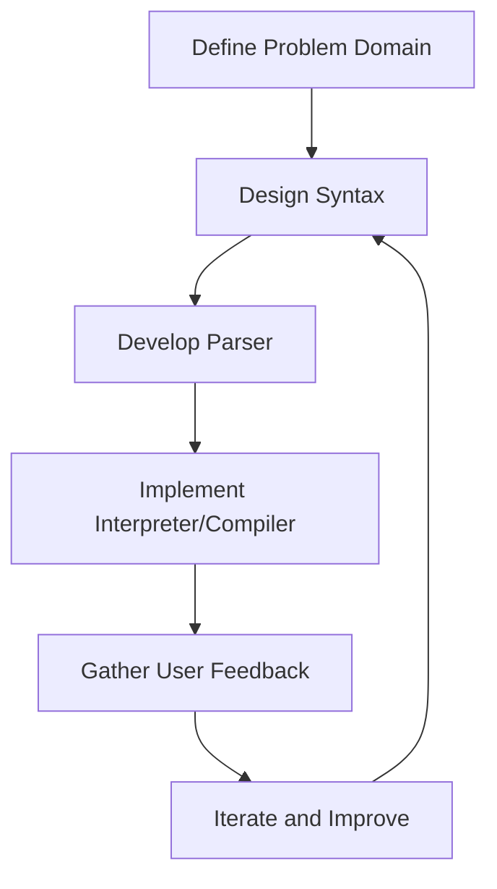

## 19.4 Developing a Domain-Specific Language (DSL)

In the realm of software engineering, a Domain-Specific Language (DSL) is a specialized language designed to solve problems within a specific domain. Unlike general-purpose programming languages, DSLs are tailored to particular tasks, offering higher abstraction and expressiveness for domain-specific problems. In this section, we will explore the process of developing a DSL using the D programming language, leveraging its powerful features such as metaprogramming, templates, and compile-time function execution.

### DSL Objectives

#### Problem Domain

The primary objective of a DSL is to address specific needs within a problem domain. This involves understanding the domain's intricacies and identifying the tasks that can be simplified or automated through a specialized language. For instance, a DSL for financial modeling might focus on expressing complex financial formulas and transactions succinctly.

**Key Considerations:**
- **Domain Analysis**: Thoroughly analyze the problem domain to identify common patterns and repetitive tasks that can be abstracted.
- **User Needs**: Engage with domain experts to understand their requirements and pain points.
- **Expressiveness**: Ensure the DSL provides constructs that are intuitive and expressive for the domain.

### Implementation Steps

#### Syntax Design

Designing the syntax of a DSL involves defining its grammar and the constructs it will support. The syntax should be intuitive for domain experts, allowing them to express domain concepts naturally.

**Steps for Syntax Design:**
1. **Identify Core Constructs**: Determine the essential elements and operations needed for the domain.
2. **Define Grammar**: Use a formal grammar to specify the syntax rules. This can be done using tools like BNF (Backus-Naur Form).
3. **Design Syntax**: Create a syntax that is both expressive and easy to read for domain experts.

**Example:**
Let's consider a simple DSL for arithmetic expressions:

```plaintext
expression ::= term (('+' | '-') term)*
term       ::= factor (('*' | '/') factor)*
factor     ::= NUMBER | '(' expression ')'
```

#### Parser Development

Once the syntax is defined, the next step is to develop a parser that can interpret and execute the DSL code. The parser translates the DSL code into an abstract syntax tree (AST), which can then be evaluated or transformed.

**Steps for Parser Development:**
1. **Tokenization**: Break down the input code into tokens using a lexer.
2. **Parsing**: Use a parser to construct the AST from the tokens.
3. **Evaluation**: Implement an interpreter or compiler to execute the AST.

**Code Example:**
Here's a simple parser for arithmetic expressions in D:

```d
import std.stdio;
import std.regex;
import std.conv;

enum TokenType {
    Number,
    Plus,
    Minus,
    Multiply,
    Divide,
    LParen,
    RParen,
    EOF
}

struct Token {
    TokenType type;
    string value;
}

class Lexer {
    string text;
    size_t pos = 0;
    char currentChar;

    this(string text) {
        this.text = text;
        currentChar = text[0];
    }

    void advance() {
        pos++;
        if (pos < text.length) {
            currentChar = text[pos];
        } else {
            currentChar = '\0';
        }
    }

    Token getNextToken() {
        while (currentChar != '\0') {
            if (currentChar.isDigit) {
                return Token(TokenType.Number, integer());
            }
            if (currentChar == '+') {
                advance();
                return Token(TokenType.Plus, "+");
            }
            if (currentChar == '-') {
                advance();
                return Token(TokenType.Minus, "-");
            }
            if (currentChar == '*') {
                advance();
                return Token(TokenType.Multiply, "*");
            }
            if (currentChar == '/') {
                advance();
                return Token(TokenType.Divide, "/");
            }
            if (currentChar == '(') {
                advance();
                return Token(TokenType.LParen, "(");
            }
            if (currentChar == ')') {
                advance();
                return Token(TokenType.RParen, ")");
            }
            advance();
        }
        return Token(TokenType.EOF, "");
    }

    string integer() {
        string result;
        while (currentChar.isDigit) {
            result ~= currentChar;
            advance();
        }
        return result;
    }
}

void main() {
    auto lexer = new Lexer("3 + 5 * (10 - 4)");
    Token token;
    do {
        token = lexer.getNextToken();
        writeln("Token: ", token.type, " Value: ", token.value);
    } while (token.type != TokenType.EOF);
}
```

### Metaprogramming Techniques

D's metaprogramming capabilities allow for powerful compile-time code generation, which can be leveraged in DSL development. This involves using templates and mixins to generate code based on the DSL's constructs.

#### Compile-Time Code Generation

Compile-time code generation involves creating code during the compilation process, which can optimize performance and ensure type safety.

**Using Mixins and Templates:**
- **Mixins**: Use mixins to inject code into the program at compile time.
- **Templates**: Define templates that can be instantiated with different types or values.

**Example:**
Here's an example of using mixins for a simple DSL:

```d
import std.stdio;
import std.string;

template Add(T...) {
    mixin("return " ~ T[0] ~ " + " ~ T[1] ~ ";");
}

void main() {
    int result = mixin(Add!("5", "10"));
    writeln("Result: ", result); // Output: Result: 15
}
```

### Results and Insights

#### Usability

The usability of a DSL is crucial for its adoption. It should be intuitive for domain experts and provide clear error messages and documentation.

**User Feedback:**
- Gather feedback from domain experts to refine the DSL.
- Conduct usability testing to identify pain points.

#### Maintenance

Maintaining a DSL involves updating its syntax and semantics as the domain evolves. This can be challenging, especially if the DSL is widely used.

**Challenges:**
- **Backward Compatibility**: Ensure changes do not break existing code.
- **Documentation**: Keep documentation up-to-date with changes.
- **Tooling**: Develop tools to assist with migration and refactoring.

### Visualizing DSL Development

To better understand the process of developing a DSL, let's visualize the key components and their interactions using a flowchart.



**Diagram Description:** This flowchart illustrates the iterative process of developing a DSL, starting from defining the problem domain, designing the syntax, developing the parser, implementing the interpreter or compiler, gathering user feedback, and iterating to improve the DSL.

### Try It Yourself

To deepen your understanding of DSL development in D, try modifying the code examples provided. Here are some suggestions:

- **Extend the Lexer**: Add support for additional operators or constructs.
- **Enhance the Parser**: Implement more complex parsing logic, such as handling precedence and associativity.
- **Experiment with Mixins**: Create more complex code generation logic using mixins and templates.

### Knowledge Check

Before moving on, let's reinforce what we've learned with a few questions:

1. What is the primary objective of a DSL?
2. How does syntax design differ from parser development?
3. What are some challenges associated with maintaining a DSL?
4. How can metaprogramming be used in DSL development?

### Embrace the Journey

Developing a DSL is a rewarding journey that combines creativity with technical expertise. Remember, this is just the beginning. As you progress, you'll build more complex and powerful DSLs. Keep experimenting, stay curious, and enjoy the journey!

## Quiz Time!



### What is the primary objective of a DSL?

- [x] To address specific needs within a problem domain
- [ ] To replace general-purpose programming languages
- [ ] To increase the complexity of software systems
- [ ] To reduce the need for domain experts

> **Explanation:** The primary objective of a DSL is to address specific needs within a problem domain, providing higher abstraction and expressiveness for domain-specific problems.

### What is the first step in developing a DSL?

- [x] Domain Analysis
- [ ] Syntax Design
- [ ] Parser Development
- [ ] Compile-Time Code Generation

> **Explanation:** Domain analysis is the first step in developing a DSL, as it involves understanding the problem domain and identifying common patterns and tasks.

### Which D feature is used for compile-time code generation?

- [x] Mixins
- [ ] Interfaces
- [ ] Classes
- [ ] Structs

> **Explanation:** Mixins are used in D for compile-time code generation, allowing code to be injected into the program during compilation.

### What is the role of a parser in DSL development?

- [x] To translate DSL code into an abstract syntax tree (AST)
- [ ] To execute the DSL code directly
- [ ] To design the syntax of the DSL
- [ ] To gather user feedback

> **Explanation:** The parser's role in DSL development is to translate DSL code into an abstract syntax tree (AST), which can then be evaluated or transformed.

### What is a challenge associated with maintaining a DSL?

- [x] Ensuring backward compatibility
- [ ] Designing the syntax
- [ ] Developing the parser
- [ ] Implementing mixins

> **Explanation:** Ensuring backward compatibility is a challenge associated with maintaining a DSL, as changes should not break existing code.

### What is the purpose of user feedback in DSL development?

- [x] To refine the DSL and identify pain points
- [ ] To replace the parser
- [ ] To design the syntax
- [ ] To implement mixins

> **Explanation:** User feedback is used to refine the DSL and identify pain points, ensuring it meets the needs of domain experts.

### How can metaprogramming enhance DSL development?

- [x] By enabling compile-time code generation
- [ ] By simplifying syntax design
- [ ] By replacing the parser
- [ ] By gathering user feedback

> **Explanation:** Metaprogramming can enhance DSL development by enabling compile-time code generation, optimizing performance, and ensuring type safety.

### What is a benefit of using templates in DSL development?

- [x] They allow for code reuse and flexibility
- [ ] They simplify syntax design
- [ ] They replace the parser
- [ ] They gather user feedback

> **Explanation:** Templates allow for code reuse and flexibility in DSL development, enabling the creation of generic and reusable components.

### What is a key consideration when designing a DSL's syntax?

- [x] It should be intuitive for domain experts
- [ ] It should be complex and verbose
- [ ] It should mimic general-purpose languages
- [ ] It should avoid using formal grammar

> **Explanation:** A key consideration when designing a DSL's syntax is that it should be intuitive for domain experts, allowing them to express domain concepts naturally.

### True or False: A DSL is intended to replace general-purpose programming languages.

- [ ] True
- [x] False

> **Explanation:** False. A DSL is not intended to replace general-purpose programming languages but to complement them by providing specialized solutions for specific domains.


