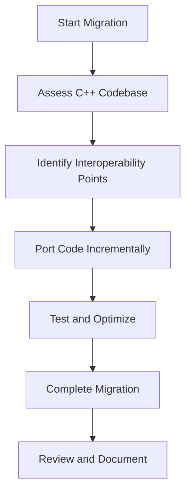

## 19.5 Migrating a Project from C++ to D

Migrating a project from C++ to D can be a transformative journey that leverages the modern features of the D programming language to enhance productivity, maintainability, and performance. This section provides a comprehensive guide to understanding the motivations, processes, challenges, and outcomes of such a migration.

### Project Background

#### Reasons for Migration

When considering a migration from C++ to D, it's essential to understand the driving factors behind this decision. Here are some common reasons:

- **Modern Language Features**: D offers advanced features like garbage collection, built-in unit testing, and compile-time function execution, which can simplify development and reduce boilerplate code.
- **Improved Productivity**: D's expressive syntax and powerful standard library can lead to faster development cycles and easier maintenance.
- **Enhanced Safety**: D provides memory safety features and better error handling mechanisms, reducing the risk of common programming errors.
- **Interoperability**: D's ability to interface with C and C++ code allows for a gradual transition, making it easier to migrate large codebases incrementally.

### Migration Process

Migrating a project from C++ to D involves several key steps, each requiring careful planning and execution.

#### Interfacing with C++

One of the strengths of D is its ability to interface with existing C++ code, allowing for a gradual migration. This interoperability is crucial for large projects where a complete rewrite is impractical.

- **Using `extern(C++)`**: D provides the `extern(C++)` linkage attribute, which allows D code to call C++ functions and vice versa. This feature is essential for maintaining functionality during the migration process.

```d
extern(C++) void cppFunction();

void callCppFunction() {
    cppFunction(); // Call a C++ function from D
}
```

- **Linking C++ Libraries**: You can link existing C++ libraries with D code, enabling you to reuse existing components while gradually rewriting them in D.

- **Handling C++ Classes**: D can interact with C++ classes by defining equivalent D classes with the same layout. This approach requires careful attention to class hierarchies and virtual functions.

#### Code Conversion

Porting code from C++ to D involves translating C++ constructs into their D equivalents. Here are some strategies:

- **Data Types**: D's type system is similar to C++, but with some differences. For instance, D uses `int` for 32-bit integers and `long` for 64-bit integers, which may differ from C++ on some platforms.

- **Templates and Generics**: D's template system is more powerful and flexible than C++'s. You can leverage D's compile-time features to simplify template code.

```d
// C++ Template
template<typename T>
T add(T a, T b) {
    return a + b;
}

// D Template
T add(T)(T a, T b) {
    return a + b;
}
```

- **Memory Management**: D uses garbage collection by default, but you can also manage memory manually using `malloc` and `free` if needed. This flexibility allows you to optimize performance-critical sections.

- **Error Handling**: D's exception handling is similar to C++, but with additional features like `nothrow` and `@safe` attributes to enhance safety.

### Challenges Encountered

Migrating a project from C++ to D is not without its challenges. Here are some common issues and how to address them:

#### Compatibility Issues

- **Language Features**: Some C++ features, such as multiple inheritance and certain template metaprogramming techniques, may not have direct equivalents in D. You'll need to refactor these parts of the codebase.

- **Standard Library Differences**: D's standard library, Phobos, differs from C++'s STL. While Phobos offers many similar functionalities, you'll need to adapt your code to use D's idiomatic constructs.

#### Performance Considerations

- **Garbage Collection**: While D's garbage collector simplifies memory management, it can introduce latency in performance-critical applications. Consider using `@nogc` code and manual memory management in such cases.

- **Compile-Time Features**: D's compile-time features can optimize performance, but they require a different mindset compared to C++. Leverage `static if` and `CTFE` to reduce runtime overhead.

### Outcomes

Despite the challenges, migrating to D can yield significant benefits.

#### Benefits Realized

- **Productivity Gains**: D's expressive syntax and powerful features can lead to faster development and easier maintenance. The built-in unit testing and documentation generation tools further enhance productivity.

- **Code Clarity**: D's design encourages clear and concise code, reducing complexity and improving readability.

- **Safety and Reliability**: D's memory safety features and robust error handling mechanisms reduce the risk of bugs and improve software reliability.

#### Lessons Learned

- **Plan Gradually**: A phased migration approach, leveraging D's interoperability with C++, allows for a smoother transition and minimizes disruptions.

- **Leverage D's Strengths**: Take advantage of D's unique features, such as compile-time function execution and metaprogramming, to optimize and simplify your codebase.

- **Test Thoroughly**: Use D's built-in `unittest` blocks to ensure that your migrated code functions correctly and meets performance expectations.

### Visualizing the Migration Process

To better understand the migration process, let's visualize the workflow using a flowchart.



**Diagram Description**: This flowchart illustrates the key steps in migrating a project from C++ to D, starting with assessing the existing codebase, identifying interoperability points, porting code incrementally, testing and optimizing, completing the migration, and finally reviewing and documenting the process.

### Try It Yourself

To gain hands-on experience, try modifying the provided code examples. Experiment with different D features, such as templates and compile-time function execution, to see how they can enhance your code.

### References and Links

For further reading, consider exploring the following resources:

- [D Programming Language Official Website](https://dlang.org/)
- [D Language Tour](https://tour.dlang.org/)
- [Dlang GitHub Repository](https://github.com/dlang)

### Knowledge Check

To reinforce your understanding, consider the following questions:

- What are the key reasons for migrating a project from C++ to D?
- How can D's interoperability with C++ facilitate a gradual migration?
- What are some common challenges encountered during the migration process?
- How can D's compile-time features be leveraged to optimize performance?

### Embrace the Journey

Remember, migrating a project from C++ to D is a journey that offers opportunities for learning and growth. As you progress, you'll discover new ways to leverage D's features to build high-performance, maintainable software. Keep experimenting, stay curious, and enjoy the journey!

## Quiz Time!



### What is one of the primary reasons for migrating a project from C++ to D?

- [x] To leverage modern language features like garbage collection and compile-time function execution.
- [ ] To reduce the number of available libraries.
- [ ] To increase the complexity of the codebase.
- [ ] To eliminate the need for unit testing.

> **Explanation:** D offers modern language features that can simplify development and enhance productivity, making it an attractive option for migration.

### How does D facilitate a gradual migration from C++?

- [x] By providing interoperability with C++ through `extern(C++)`.
- [ ] By requiring a complete rewrite of the codebase.
- [ ] By eliminating the need for linking with C++ libraries.
- [ ] By using a different syntax for all constructs.

> **Explanation:** D's `extern(C++)` attribute allows for interoperability with C++ code, enabling a gradual transition.

### What is a common challenge when migrating from C++ to D?

- [x] Compatibility issues with language features.
- [ ] Lack of support for object-oriented programming.
- [ ] Inability to handle exceptions.
- [ ] Requirement to use only manual memory management.

> **Explanation:** Some C++ features may not have direct equivalents in D, requiring refactoring during migration.

### How can performance be optimized in D during migration?

- [x] By using `@nogc` code and manual memory management.
- [ ] By avoiding the use of templates.
- [ ] By disabling compile-time function execution.
- [ ] By using only dynamic memory allocation.

> **Explanation:** Using `@nogc` code and manual memory management can help optimize performance in D.

### What is a benefit realized from migrating to D?

- [x] Improved code clarity and readability.
- [ ] Increased complexity of error handling.
- [ ] Reduced safety and reliability.
- [ ] Decreased productivity.

> **Explanation:** D's design encourages clear and concise code, improving readability and maintainability.

### What is a recommended strategy for migrating a project from C++ to D?

- [x] A phased migration approach leveraging interoperability.
- [ ] A complete rewrite of the codebase from the start.
- [ ] Avoiding the use of D's unique features.
- [ ] Ignoring existing C++ libraries.

> **Explanation:** A phased migration approach allows for a smoother transition and minimizes disruptions.

### How can D's compile-time features be leveraged during migration?

- [x] By using `static if` and `CTFE` to reduce runtime overhead.
- [ ] By avoiding compile-time checks.
- [ ] By disabling all compile-time optimizations.
- [ ] By using only runtime evaluations.

> **Explanation:** D's compile-time features can optimize performance by reducing runtime overhead.

### What is a key takeaway from migrating a project to D?

- [x] Leveraging D's strengths can optimize and simplify the codebase.
- [ ] Avoiding the use of D's standard library.
- [ ] Increasing the complexity of the code.
- [ ] Reducing the use of unit tests.

> **Explanation:** Taking advantage of D's unique features can lead to a more optimized and simplified codebase.

### What is an important consideration when interfacing with C++ during migration?

- [x] Defining equivalent D classes with the same layout.
- [ ] Completely avoiding the use of C++ classes.
- [ ] Using only D's garbage collector for memory management.
- [ ] Disabling all C++ functions.

> **Explanation:** Defining equivalent D classes with the same layout allows for seamless interaction with C++ classes.

### True or False: D's garbage collector can introduce latency in performance-critical applications.

- [x] True
- [ ] False

> **Explanation:** While D's garbage collector simplifies memory management, it can introduce latency in performance-critical applications, requiring careful consideration.


