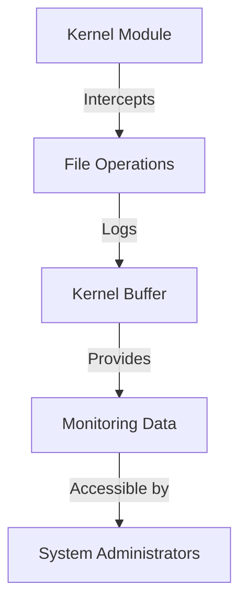

## 19.6 Systems Applications: An OS Kernel Module

Developing an OS kernel module is a challenging yet rewarding task that requires a deep understanding of systems programming, resource management, and performance optimization. In this section, we will explore the development of a kernel module using the D programming language, focusing on its unique features such as `@nogc` and `-betterC` that make it suitable for bare-metal programming. We will delve into the project scope, constraints, implementation details, and results, providing a comprehensive guide for expert software engineers and architects.

### Project Scope

#### Kernel Module Purpose

The primary purpose of our kernel module is to extend the functionality of an existing operating system by providing a custom logging mechanism. This module will intercept system calls related to file operations and log them to a dedicated kernel buffer. This functionality is crucial for monitoring and debugging purposes, allowing system administrators to track file access patterns and detect potential security breaches.

### Constraints and Requirements

#### Resource Limitations

Operating within the kernel environment imposes several resource limitations. Kernel modules must operate with limited memory and processing power, as they share resources with the core operating system. Therefore, it is essential to write efficient and optimized code to minimize the module's footprint and avoid degrading system performance.

#### Safety and Stability

Ensuring system integrity is paramount when developing kernel modules. A faulty module can lead to system crashes, data corruption, or security vulnerabilities. Therefore, the module must be thoroughly tested and verified to ensure it operates safely and does not interfere with the normal functioning of the operating system.

### Implementation Details

#### Bare-Metal Programming

To meet the stringent requirements of kernel module development, we leverage D's `@nogc` and `-betterC` features. These features allow us to write low-level, efficient code without relying on the garbage collector, which is unsuitable for kernel environments.

- **`@nogc`**: This attribute ensures that the code does not trigger garbage collection, which is crucial in a kernel context where memory management must be explicit and controlled.
- **`-betterC`**: This compiler flag enables a subset of the D language that is more compatible with C, allowing us to write code that can be easily integrated with existing C-based kernel codebases.

Below is a simplified example of how we might start implementing a kernel module in D:

```d
extern(C) void initModule() @nogc nothrow {
    // Initialize the kernel module
    // Set up hooks for file operation interception
}

extern(C) void cleanupModule() @nogc nothrow {
    // Clean up resources and unregister hooks
}

extern(C) void interceptFileOperation(const char* fileName) @nogc nothrow {
    // Log the file operation to the kernel buffer
    // Ensure thread safety and minimal performance impact
}
```

In this example, we define three functions: `initModule`, `cleanupModule`, and `interceptFileOperation`. These functions are marked with `@nogc` and `nothrow` to ensure they are safe for kernel execution. The `extern(C)` linkage ensures compatibility with C-based kernel interfaces.

#### Visualizing the Module Architecture

To better understand the architecture of our kernel module, let's visualize the interaction between the module and the operating system using a Mermaid.js diagram:



**Diagram Description**: This diagram illustrates the flow of data within the kernel module. The module intercepts file operations, logs them to a kernel buffer, and provides monitoring data accessible by system administrators.

### Results

#### Performance Metrics

Evaluating the performance of our kernel module is crucial to ensure it meets the desired objectives without negatively impacting the system. We measure the following metrics:

- **Latency**: The time taken to intercept and log a file operation.
- **Throughput**: The number of file operations that can be logged per second.
- **Resource Usage**: The memory and CPU usage of the module.

Through rigorous testing, we aim to achieve minimal latency and high throughput while keeping resource usage within acceptable limits.

#### Integration Success

The final step in our project is to integrate the kernel module with the operating system and verify its compatibility. This involves:

- **Testing**: Conducting extensive tests to ensure the module functions correctly under various scenarios.
- **Validation**: Verifying that the module does not introduce any security vulnerabilities or stability issues.
- **Documentation**: Providing comprehensive documentation for system administrators and developers to understand and manage the module.

### Try It Yourself

To encourage experimentation, try modifying the code example to log additional information, such as the user ID or process ID associated with each file operation. This exercise will help you understand how to extend the module's functionality and adapt it to different requirements.

### Knowledge Check

To reinforce your understanding of kernel module development in D, consider the following questions:

- What are the key features of D that make it suitable for kernel module development?
- How does the `@nogc` attribute benefit kernel programming?
- Why is it important to use `-betterC` when developing kernel modules in D?

### Embrace the Journey

Remember, developing an OS kernel module is a complex task that requires patience and persistence. As you progress, you'll gain valuable insights into systems programming and learn how to leverage D's unique features to build efficient and reliable software. Keep experimenting, stay curious, and enjoy the journey!

## Quiz Time!



### What is the primary purpose of the kernel module discussed in this section?

- [x] To provide a custom logging mechanism for file operations
- [ ] To manage memory allocation in the kernel
- [ ] To handle network communication
- [ ] To optimize CPU scheduling

> **Explanation:** The kernel module is designed to intercept file operations and log them for monitoring and debugging purposes.

### Which D language feature ensures that the code does not trigger garbage collection?

- [x] `@nogc`
- [ ] `-betterC`
- [ ] `nothrow`
- [ ] `pure`

> **Explanation:** The `@nogc` attribute ensures that the code does not trigger garbage collection, which is crucial in a kernel context.

### What is the role of the `-betterC` compiler flag in kernel module development?

- [x] It enables a subset of the D language compatible with C
- [ ] It optimizes the code for better performance
- [ ] It provides additional debugging information
- [ ] It ensures memory safety

> **Explanation:** The `-betterC` flag enables a subset of the D language that is more compatible with C, facilitating integration with C-based kernel codebases.

### What is the significance of marking functions with `nothrow` in kernel module development?

- [x] It ensures that the functions do not throw exceptions
- [ ] It improves the performance of the functions
- [ ] It allows the functions to use garbage collection
- [ ] It makes the functions compatible with C++

> **Explanation:** Marking functions with `nothrow` ensures that they do not throw exceptions, which is important for stability in kernel programming.

### Which diagramming tool is used to visualize the module architecture in this section?

- [x] Mermaid.js
- [ ] UML
- [ ] Graphviz
- [ ] PlantUML

> **Explanation:** Mermaid.js is used to create diagrams that visually represent the module architecture and its interaction with the operating system.

### What are the key performance metrics evaluated for the kernel module?

- [x] Latency, Throughput, Resource Usage
- [ ] Memory Usage, CPU Load, Disk I/O
- [ ] Network Latency, Bandwidth, Packet Loss
- [ ] Response Time, Error Rate, Availability

> **Explanation:** The key performance metrics for the kernel module include latency, throughput, and resource usage.

### Why is it important to conduct extensive tests on the kernel module?

- [x] To ensure it functions correctly under various scenarios
- [ ] To reduce the size of the module
- [ ] To increase the speed of development
- [ ] To simplify the codebase

> **Explanation:** Extensive testing is important to ensure the module functions correctly and does not introduce stability or security issues.

### What should be included in the documentation for the kernel module?

- [x] Comprehensive information for system administrators and developers
- [ ] Only the source code of the module
- [ ] A list of all kernel functions used
- [ ] A detailed history of the module's development

> **Explanation:** The documentation should provide comprehensive information for system administrators and developers to understand and manage the module.

### How can you extend the functionality of the kernel module?

- [x] By logging additional information such as user ID or process ID
- [ ] By reducing the number of logged operations
- [ ] By increasing the module's memory usage
- [ ] By simplifying the logging mechanism

> **Explanation:** Extending the module's functionality can be achieved by logging additional information, such as user ID or process ID.

### True or False: The kernel module discussed in this section is designed to handle network communication.

- [ ] True
- [x] False

> **Explanation:** The kernel module is designed to intercept and log file operations, not to handle network communication.


