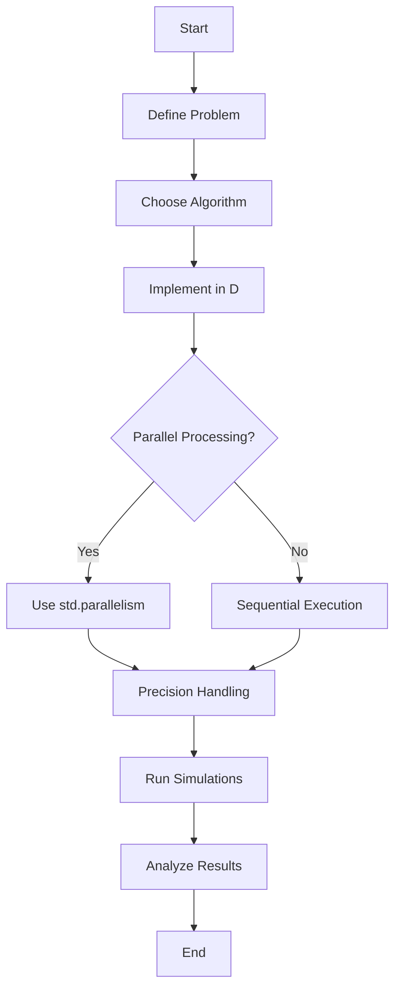

## 19.7 Scientific Computing and Numerical Analysis

Scientific computing and numerical analysis are critical fields that require handling complex computations with high precision and efficiency. The D programming language, with its unique blend of high-level and low-level features, offers a compelling choice for developers and researchers working in these domains. In this section, we will explore how D can be leveraged for scientific computing, focusing on performance, numeric libraries, parallel processing, and precision handling.

### Project Overview

Scientific computing often involves solving complex mathematical problems that require significant computational resources. These problems can range from simulating physical phenomena to analyzing large datasets in fields such as physics, chemistry, biology, and engineering. Numerical analysis, a subset of scientific computing, focuses on developing algorithms to obtain numerical solutions to mathematical problems.

#### Complex Computations

The nature of scientific problems addressed in this domain often involves:

- **Differential Equations**: Solving ordinary and partial differential equations that model real-world phenomena.
- **Linear Algebra**: Performing operations on matrices and vectors, which are fundamental in many scientific applications.
- **Optimization**: Finding the best solution from a set of possible solutions, often subject to constraints.
- **Statistical Analysis**: Analyzing data to extract meaningful insights and patterns.

### D Language Benefits

The D programming language offers several benefits that make it well-suited for scientific computing and numerical analysis:

#### Performance

D is designed for high performance, making it ideal for handling intensive calculations efficiently. It provides:

- **Compiled Code**: D compiles to native machine code, offering performance comparable to C and C++.
- **Low-Level Access**: Direct access to memory and hardware resources allows for fine-tuned optimizations.
- **Efficient Memory Management**: Features like garbage collection and manual memory management provide flexibility in handling memory-intensive applications.

#### Numeric Libraries

D's ecosystem includes several numeric libraries that can be utilized or extended to develop specialized tools for scientific computing:

- **Mir**: A powerful library for numerical computing in D, offering features like linear algebra, statistics, and optimization.
- **SciD**: A scientific computing library that provides tools for data analysis and visualization.

### Implementation Strategies

When implementing scientific computing solutions in D, several strategies can be employed to maximize performance and accuracy:

#### Parallel Processing

Parallel processing is essential for accelerating computations in scientific applications. D provides robust support for concurrency and parallelism through:

- **Fibers and Asynchronous Programming**: Lightweight threads that allow for efficient multitasking.
- **Message Passing**: Using `std.concurrency` for safe communication between threads.
- **Parallel Algorithms**: Utilizing `std.parallelism` to execute algorithms concurrently.

```d
import std.parallelism;
import std.stdio;

void main() {
    auto results = parallel([1, 2, 3, 4, 5], (int x) => x * x);
    writeln(results); // Output: [1, 4, 9, 16, 25]
}
```

#### Precision Handling

Managing floating-point accuracy is crucial in scientific computing to ensure reliable results. D offers:

- **High Precision Types**: Support for `real` type, which provides extended precision on platforms that support it.
- **Custom Numeric Types**: Ability to define custom numeric types for specific precision requirements.

```d
import std.stdio;

void main() {
    real highPrecisionValue = 1.234567890123456789;
    writeln(highPrecisionValue); // Output: 1.2345678901234567 (platform-dependent)
}
```

### Outcomes

The outcomes of using D for scientific computing and numerical analysis can be significant, both in terms of scientific discoveries and efficiency gains:

#### Results Achieved

By leveraging D's performance and precision capabilities, researchers can achieve breakthroughs in various scientific fields. For example:

- **Simulating Complex Systems**: Accurately modeling physical systems to predict behavior and outcomes.
- **Data Analysis**: Processing large datasets to uncover patterns and insights that drive scientific advancements.

#### Efficiency Gains

When compared with other languages or tools, D often provides superior performance and efficiency due to its compiled nature and low-level capabilities. This can lead to:

- **Reduced Computation Time**: Faster execution of complex algorithms and simulations.
- **Resource Optimization**: Efficient use of memory and processing power, reducing the need for expensive hardware.

### Try It Yourself

To get hands-on experience with scientific computing in D, try modifying the code examples provided. Experiment with different parallel algorithms or precision types to see how they affect performance and accuracy. Consider implementing a simple numerical method, such as the Newton-Raphson method for finding roots, to deepen your understanding of D's capabilities in this domain.

### Visualizing Scientific Computing in D

To better understand the flow of scientific computing tasks in D, let's visualize a typical workflow using a flowchart:



This diagram illustrates the typical steps involved in solving a scientific computing problem using D, from defining the problem to analyzing the results.

### References and Links

For further reading and resources on scientific computing and numerical analysis in D, consider exploring the following:

- [Mir Library Documentation](https://mir.dlang.io/)
- [SciD Library on GitHub](https://github.com/DlangScience/scid)
- [D Programming Language Official Site](https://dlang.org/)

### Knowledge Check

To reinforce your understanding of scientific computing and numerical analysis in D, consider the following questions:

1. What are the key benefits of using D for scientific computing?
2. How does D handle parallel processing, and why is it important for scientific applications?
3. What strategies can be employed to manage precision in numerical computations?
4. How can D's numeric libraries be utilized in scientific computing projects?

### Embrace the Journey

Remember, mastering scientific computing and numerical analysis in D is a journey. As you progress, you'll gain deeper insights into the language's capabilities and how they can be applied to solve complex scientific problems. Keep experimenting, stay curious, and enjoy the process of discovery!

## Quiz Time!



### What is a key benefit of using D for scientific computing?

- [x] High performance due to compiled code
- [ ] Built-in support for machine learning
- [ ] Automatic parallel processing
- [ ] Native support for quantum computing

> **Explanation:** D's compiled nature allows it to achieve high performance, making it suitable for intensive scientific computations.


### Which library is commonly used for numerical computing in D?

- [x] Mir
- [ ] NumPy
- [ ] TensorFlow
- [ ] SciPy

> **Explanation:** Mir is a powerful library for numerical computing in D, offering features like linear algebra and statistics.


### How does D support parallel processing?

- [x] Through fibers and message passing
- [ ] By default in all loops
- [ ] Using built-in GPU acceleration
- [ ] With automatic thread management

> **Explanation:** D supports parallel processing through fibers, message passing, and parallel algorithms, allowing efficient multitasking.


### What type in D provides extended precision for floating-point calculations?

- [x] real
- [ ] float
- [ ] double
- [ ] int

> **Explanation:** The `real` type in D provides extended precision for floating-point calculations on platforms that support it.


### What is a common strategy for managing precision in numerical computations?

- [x] Using high precision types
- [ ] Rounding all results
- [ ] Avoiding floating-point operations
- [ ] Using integer arithmetic only

> **Explanation:** Using high precision types, such as `real`, is a common strategy for managing precision in numerical computations.


### Which feature of D allows for efficient multitasking in scientific computing?

- [x] Fibers
- [ ] Garbage collection
- [ ] Inline assembly
- [ ] Static typing

> **Explanation:** Fibers are lightweight threads in D that allow for efficient multitasking, making them useful in scientific computing.


### What is the purpose of the `std.parallelism` module in D?

- [x] To execute algorithms concurrently
- [ ] To manage memory allocation
- [ ] To handle exceptions
- [ ] To provide GUI components

> **Explanation:** The `std.parallelism` module in D is used to execute algorithms concurrently, enhancing performance in scientific applications.


### How can D's numeric libraries be extended for scientific computing?

- [x] By developing specialized tools
- [ ] By using them without modification
- [ ] By converting them to Python
- [ ] By integrating them with Java

> **Explanation:** D's numeric libraries can be extended by developing specialized tools tailored to specific scientific computing needs.


### What is a typical outcome of using D for scientific computing?

- [x] Reduced computation time
- [ ] Increased hardware requirements
- [ ] Decreased code readability
- [ ] Limited precision

> **Explanation:** Using D for scientific computing often results in reduced computation time due to its high performance and efficient resource usage.


### True or False: D provides built-in support for quantum computing.

- [ ] True
- [x] False

> **Explanation:** D does not provide built-in support for quantum computing; it is focused on high-performance systems programming.


