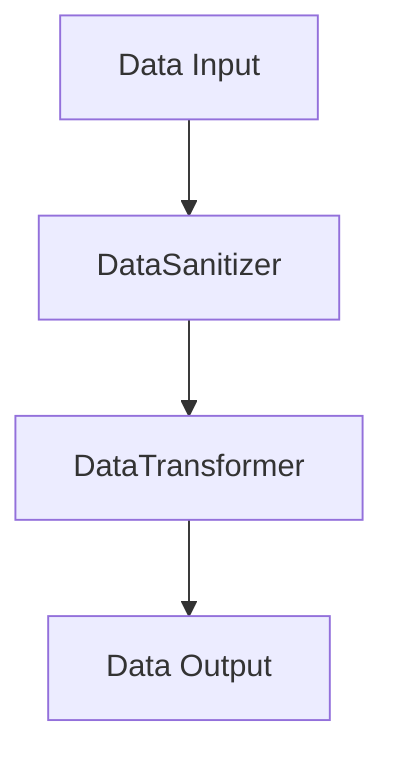

## 19.8 Real-Time Data Processing Pipeline

In this section, we delve into the construction of a real-time data processing pipeline using the D programming language. Our focus will be on achieving high throughput and low latency, essential for processing large volumes of data efficiently. We will explore the application of design patterns such as the Pipeline and Observer patterns, and discuss technical implementations involving concurrency models, error handling, and performance metrics.

### Project Goals

The primary goals of this project are to ensure that the data processing pipeline can handle large volumes of data with minimal delay (latency) and maintain a high rate of data processing (throughput). Additionally, the system should be reliable, with minimal downtime and error rates.

#### Throughput and Latency

- **Throughput**: The amount of data processed in a given time frame. High throughput ensures that the system can handle large volumes of data efficiently.
- **Latency**: The time taken to process a single unit of data. Low latency is crucial for real-time applications where timely data processing is essential.

### Design Patterns Applied

To achieve these goals, we will employ several design patterns that are well-suited for real-time data processing.

#### Pipeline Pattern

The Pipeline pattern is ideal for structuring the stages of data processing. It allows data to flow through a series of processing stages, each performing a specific task. This pattern is particularly useful for breaking down complex processing tasks into manageable steps.

```d
// Define a simple pipeline stage interface
interface PipelineStage {
    void process(ref Data data);
}

// Example of a pipeline stage implementation
class DataSanitizer : PipelineStage {
    void process(ref Data data) {
        // Sanitize data
    }
}

class DataTransformer : PipelineStage {
    void process(ref Data data) {
        // Transform data
    }
}

// Pipeline execution
void executePipeline(Data data, PipelineStage[] stages) {
    foreach (stage; stages) {
        stage.process(data);
    }
}
```

#### Observer Pattern

The Observer pattern is used to react to changes in data. It allows different parts of the system to be notified of data changes, enabling real-time updates and actions.

```d
// Define an observer interface
interface DataObserver {
    void update(Data data);
}

// Subject that notifies observers
class DataSubject {
    private DataObserver[] observers;

    void addObserver(DataObserver observer) {
        observers ~= observer;
    }

    void notifyObservers(Data data) {
        foreach (observer; observers) {
            observer.update(data);
        }
    }
}
```

### Technical Implementation

#### Concurrency Models

Concurrency is crucial for real-time data processing. In D, we can use fibers or threads to achieve concurrency.

- **Fibers**: Lightweight, cooperative threads that can be used for non-blocking operations.
- **Threads**: Preemptive threads suitable for parallel processing.

```d
import std.concurrency;
import std.stdio;

// Using fibers for concurrency
void fiberFunction() {
    writeln("Fiber running");
}

void main() {
    auto fiber = new Fiber(&fiberFunction);
    fiber.call();
    fiber.yield();
}
```

#### Error Handling

Ensuring data integrity is vital in a real-time system. We must handle errors gracefully to maintain system reliability.

```d
try {
    // Code that might throw an exception
} catch (Exception e) {
    writeln("Error: ", e.msg);
    // Handle error
}
```

### Results

#### Performance Metrics

To evaluate the effectiveness of our pipeline, we measure throughput, latency, and scalability.

- **Throughput**: Measured in data units processed per second.
- **Latency**: Measured in milliseconds per data unit.
- **Scalability**: The ability to handle increasing data volumes without performance degradation.

#### System Reliability

Reliability is assessed based on system uptime and error rates.

- **Up-time**: The percentage of time the system is operational.
- **Error Rates**: The frequency of errors occurring during data processing.

### Visualizing the Pipeline

To better understand the flow of data through the pipeline, let's visualize it using a Mermaid.js diagram.



This diagram illustrates the sequential flow of data through the pipeline stages.

### Try It Yourself

Experiment with the provided code examples by modifying the pipeline stages or adding new observers. Consider implementing additional concurrency models or error handling strategies to see how they affect performance.

### References and Links

- [D Programming Language](https://dlang.org/)
- [Concurrency in D](https://dlang.org/phobos/std_concurrency.html)
- [Design Patterns in D](https://wiki.dlang.org/Design_Patterns)

### Knowledge Check

1. What are the primary goals of a real-time data processing pipeline?
2. How does the Pipeline pattern help in structuring data processing stages?
3. What is the role of the Observer pattern in a real-time system?
4. Explain the difference between fibers and threads in D.
5. Why is error handling crucial in real-time data processing?

### Embrace the Journey

Remember, building a real-time data processing pipeline is a complex task that requires careful planning and execution. As you progress, you'll gain a deeper understanding of how to optimize for performance and reliability. Keep experimenting, stay curious, and enjoy the journey!

## Quiz Time!



### What is the primary goal of a real-time data processing pipeline?

- [x] High throughput and low latency
- [ ] High latency and low throughput
- [ ] Low throughput and high latency
- [ ] None of the above

> **Explanation:** The primary goal is to achieve high throughput and low latency to efficiently process large volumes of data in real-time.

### Which design pattern is used to structure stages of data processing?

- [x] Pipeline Pattern
- [ ] Observer Pattern
- [ ] Singleton Pattern
- [ ] Factory Pattern

> **Explanation:** The Pipeline pattern is used to structure the stages of data processing, allowing data to flow through a series of processing steps.

### What is the role of the Observer pattern in a real-time system?

- [x] Reacting to data changes
- [ ] Structuring data processing stages
- [ ] Managing concurrency
- [ ] Handling errors

> **Explanation:** The Observer pattern is used to react to data changes, enabling real-time updates and actions in the system.

### What is the difference between fibers and threads in D?

- [x] Fibers are lightweight, cooperative threads; threads are preemptive
- [ ] Fibers are preemptive; threads are cooperative
- [ ] Both are preemptive
- [ ] Both are cooperative

> **Explanation:** Fibers are lightweight, cooperative threads suitable for non-blocking operations, while threads are preemptive and suitable for parallel processing.

### Why is error handling crucial in real-time data processing?

- [x] To ensure data integrity and system reliability
- [ ] To increase latency
- [ ] To decrease throughput
- [ ] To add complexity

> **Explanation:** Error handling is crucial to ensure data integrity and maintain system reliability, preventing disruptions in real-time processing.

### What is measured to evaluate the effectiveness of a pipeline?

- [x] Throughput, latency, and scalability
- [ ] Only throughput
- [ ] Only latency
- [ ] Only scalability

> **Explanation:** The effectiveness of a pipeline is evaluated by measuring throughput, latency, and scalability.

### What does system reliability assess?

- [x] System uptime and error rates
- [ ] Only system uptime
- [ ] Only error rates
- [ ] None of the above

> **Explanation:** System reliability is assessed based on system uptime and error rates, indicating how often the system is operational and error-free.

### What is the purpose of using concurrency models in real-time data processing?

- [x] To achieve parallel processing and non-blocking operations
- [ ] To increase latency
- [ ] To decrease throughput
- [ ] To add complexity

> **Explanation:** Concurrency models are used to achieve parallel processing and non-blocking operations, enhancing the performance of real-time data processing.

### How can you visualize the flow of data through a pipeline?

- [x] Using a Mermaid.js diagram
- [ ] Using a pie chart
- [ ] Using a bar graph
- [ ] Using a scatter plot

> **Explanation:** A Mermaid.js diagram is used to visually represent the flow of data through a pipeline, illustrating the sequential processing stages.

### True or False: The Observer pattern is used to structure the stages of data processing.

- [ ] True
- [x] False

> **Explanation:** False. The Observer pattern is used to react to data changes, not to structure the stages of data processing. The Pipeline pattern is used for structuring stages.


