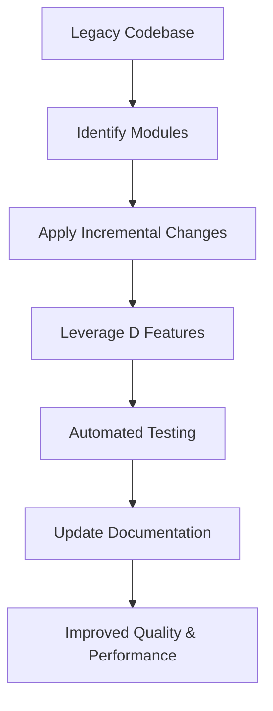

## 19.9 Refactoring Legacy Codebases with D

Refactoring legacy codebases is a critical task for software engineers and architects, especially when dealing with systems that have been in operation for years or even decades. The D programming language, with its modern features and capabilities, offers a powerful toolkit for transforming these old systems into efficient, maintainable, and scalable solutions. In this section, we will explore the challenges of legacy systems, the strategies for refactoring them using D, and the outcomes that can be achieved through this process.

### Project Context

#### Legacy Challenges

Legacy systems often come with a host of challenges that can hinder development and maintenance. These challenges include:

- **Outdated Technologies**: Many legacy systems are built on outdated technologies that are no longer supported or efficient.
- **Complex Code Structures**: Over time, codebases can become convoluted, with complex interdependencies and lack of modularity.
- **Lack of Documentation**: Documentation may be sparse or outdated, making it difficult to understand the system's architecture and functionality.
- **Performance Bottlenecks**: Older systems may not be optimized for modern hardware, leading to performance issues.
- **Security Vulnerabilities**: Legacy code may not adhere to current security standards, posing risks to data integrity and privacy.

### Refactoring Approach

Refactoring a legacy codebase requires a careful and strategic approach to ensure that improvements are made without introducing new issues. The following strategies are essential:

#### Incremental Changes

- **Minimizing Disruption**: Implement changes incrementally to avoid disrupting the entire system. This approach allows for testing and validation at each step, ensuring that functionality is preserved.
- **Modular Refactoring**: Focus on refactoring individual modules or components, gradually improving the overall system.

#### Code Modernization

- **Leveraging D's Features**: Utilize D's modern features such as templates, mixins, and compile-time function execution to simplify and enhance the codebase.
- **Improving Readability and Maintainability**: Refactor code to improve readability and maintainability, making it easier for future developers to work with.

### Techniques Used

#### Automated Testing

- **Ensuring Functionality**: Implement automated tests to verify that the system's functionality remains intact during the refactoring process. This includes unit tests, integration tests, and regression tests.
- **Continuous Integration**: Use continuous integration tools to automate testing and deployment, ensuring that changes are tested in a consistent environment.

#### Documentation Updates

- **Keeping Records Accurate**: Update documentation to reflect changes made during refactoring. This includes code comments, architectural diagrams, and user manuals.
- **Creating New Documentation**: Where documentation is lacking, create new records to aid future development and maintenance efforts.

### Outcomes

#### Improved Quality

- **Code Maintainability**: Refactoring improves code maintainability by simplifying complex structures and reducing technical debt.
- **Readability**: Enhanced readability makes it easier for developers to understand and modify the codebase.

#### Performance Enhancements

- **Measurable Improvements**: Refactoring can lead to significant performance improvements, such as faster execution times and reduced resource consumption.
- **Scalability**: Modernizing the codebase can improve scalability, allowing the system to handle increased loads and new features.

### Code Examples

Let's explore some code examples that demonstrate how D can be used to refactor legacy codebases.

#### Example 1: Refactoring with Templates

Legacy code often contains repetitive patterns that can be simplified using D's template system.

```d
// Legacy code with repetitive functions
int addInt(int a, int b) {
    return a + b;
}

float addFloat(float a, float b) {
    return a + b;
}

// Refactored code using templates
template add(T) {
    T add(T a, T b) {
        return a + b;
    }
}

// Usage
int resultInt = add!int(3, 4);
float resultFloat = add!float(3.5, 4.5);
```

In this example, we refactor repetitive functions into a single template function, reducing code duplication and improving maintainability.

#### Example 2: Using Mixins for Code Reuse

Mixins in D allow for code reuse and can simplify complex legacy code structures.

```d
// Legacy code with similar structures
struct LegacyStruct1 {
    int a;
    void doSomething() {
        // Implementation
    }
}

struct LegacyStruct2 {
    int b;
    void doSomethingElse() {
        // Implementation
    }
}

// Refactored code using mixins
mixin template CommonBehavior() {
    void doSomething() {
        // Common implementation
    }
}

struct RefactoredStruct1 {
    int a;
    mixin CommonBehavior;
}

struct RefactoredStruct2 {
    int b;
    mixin CommonBehavior;
}
```

By using mixins, we can encapsulate common behavior and apply it to multiple structures, reducing redundancy and improving code clarity.

### Visualizing the Refactoring Process

To better understand the refactoring process, let's visualize the transformation of a legacy codebase into a modernized system using D.



This diagram illustrates the step-by-step process of refactoring a legacy codebase, highlighting the key stages and outcomes.

### Try It Yourself

To gain hands-on experience with refactoring legacy codebases using D, try modifying the code examples provided. Experiment with different templates and mixins to see how they can simplify and improve your code. Consider creating your own legacy code scenarios and applying the refactoring techniques discussed.

### Knowledge Check

- **What are the common challenges associated with legacy codebases?**
- **How can D's features be leveraged to modernize legacy code?**
- **What role does automated testing play in the refactoring process?**
- **How can documentation be effectively updated during refactoring?**

### Embrace the Journey

Refactoring legacy codebases is a rewarding journey that can significantly enhance the quality and performance of software systems. By leveraging the power of the D programming language, you can transform outdated systems into modern, efficient solutions. Remember, this is just the beginning. As you continue to explore and experiment with D, you'll discover even more ways to optimize and improve your code. Keep learning, stay curious, and enjoy the journey!

## Quiz Time!



### What is a common challenge associated with legacy codebases?

- [x] Outdated technologies
- [ ] Modern architectures
- [ ] Simple code structures
- [ ] Comprehensive documentation

> **Explanation:** Legacy codebases often rely on outdated technologies that can hinder development and maintenance.

### How can D's template system help in refactoring legacy code?

- [x] By reducing code duplication
- [ ] By increasing code complexity
- [ ] By removing all functions
- [ ] By adding more dependencies

> **Explanation:** D's template system allows for the creation of generic functions, reducing code duplication and improving maintainability.

### What is the benefit of using mixins in D?

- [x] Code reuse and simplification
- [ ] Increasing redundancy
- [ ] Complicating code structures
- [ ] Removing functionality

> **Explanation:** Mixins enable code reuse and can simplify complex code structures by encapsulating common behavior.

### What role does automated testing play in refactoring?

- [x] Ensures functionality remains intact
- [ ] Increases the risk of errors
- [ ] Eliminates the need for documentation
- [ ] Slows down the development process

> **Explanation:** Automated testing verifies that the system's functionality remains intact during the refactoring process.

### How can documentation be effectively updated during refactoring?

- [x] By reflecting changes made
- [ ] By ignoring new features
- [ ] By removing old records
- [ ] By creating redundant documents

> **Explanation:** Documentation should be updated to reflect changes made during refactoring, ensuring accuracy and aiding future development.

### What is a key outcome of refactoring legacy codebases?

- [x] Improved code maintainability
- [ ] Increased technical debt
- [ ] Reduced performance
- [ ] More complex code

> **Explanation:** Refactoring improves code maintainability by simplifying complex structures and reducing technical debt.

### How does incremental refactoring minimize disruption?

- [x] By implementing changes gradually
- [ ] By making all changes at once
- [ ] By ignoring testing
- [ ] By removing features

> **Explanation:** Incremental refactoring involves making changes gradually, allowing for testing and validation at each step.

### What is a benefit of leveraging D's modern features?

- [x] Enhanced code readability
- [ ] Increased code complexity
- [ ] Reduced functionality
- [ ] More dependencies

> **Explanation:** Leveraging D's modern features can enhance code readability and maintainability.

### What is the purpose of continuous integration in refactoring?

- [x] Automating testing and deployment
- [ ] Increasing manual testing
- [ ] Removing automated tests
- [ ] Slowing down development

> **Explanation:** Continuous integration automates testing and deployment, ensuring changes are tested in a consistent environment.

### True or False: Refactoring can lead to performance enhancements.

- [x] True
- [ ] False

> **Explanation:** Refactoring can lead to performance enhancements by optimizing code and reducing resource consumption.


