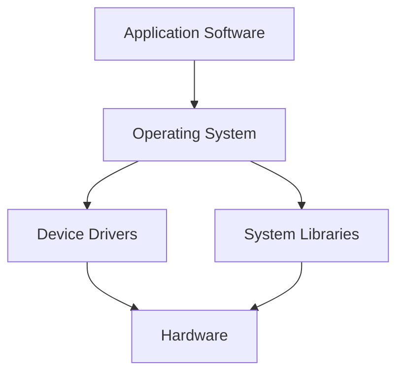

## 2.1 Systems Programming Fundamentals

Systems programming is a critical domain in software engineering that involves creating software to provide services to other software. This includes operating systems, device drivers, and embedded systems. In this section, we will delve into the fundamentals of systems programming, focusing on the D programming language's capabilities to handle low-level operations, performance, and efficiency.

### Definition: What Constitutes Systems Programming?

Systems programming is the practice of writing software that interacts closely with hardware and manages system resources. It is distinct from application programming, which focuses on creating software for end-users. Systems programming requires a deep understanding of the underlying hardware architecture, memory management, and concurrency.

#### Key Characteristics of Systems Programming:

- **Low-Level Operations**: Direct interaction with hardware components and memory.
- **Performance and Efficiency**: Prioritization of speed and resource management.
- **Resource Management**: Efficient handling of CPU, memory, and I/O resources.
- **Concurrency and Parallelism**: Managing multiple tasks simultaneously.
- **Robustness and Reliability**: Ensuring stability and fault tolerance.

### Low-Level Operations

Low-level operations are at the heart of systems programming. These operations involve direct manipulation of hardware resources, such as CPU registers, memory addresses, and I/O ports. The D programming language provides several features that facilitate low-level programming while maintaining safety and efficiency.

#### Interacting Directly with Hardware and Memory

In systems programming, interacting with hardware often requires writing code that can manipulate memory directly. This includes reading from and writing to specific memory addresses, managing memory allocation, and ensuring data integrity.

**Example: Direct Memory Access in D**

```d
import core.stdc.stdio;

void main() {
    // Allocate a block of memory
    size_t size = 1024;
    void* buffer = malloc(size);

    // Check if allocation was successful
    if (buffer is null) {
        printf("Memory allocation failed\n");
        return;
    }

    // Access the memory directly
    ubyte* byteBuffer = cast(ubyte*) buffer;
    for (size_t i = 0; i < size; ++i) {
        byteBuffer[i] = cast(ubyte) i;
    }

    // Print some values
    printf("First byte: %d\n", byteBuffer[0]);
    printf("Last byte: %d\n", byteBuffer[size - 1]);

    // Free the allocated memory
    free(buffer);
}
```

In this example, we allocate a block of memory using `malloc`, access it directly, and then free it. This demonstrates how D can be used for low-level memory manipulation, a common requirement in systems programming.

### Performance and Efficiency

Performance and efficiency are paramount in systems programming. The goal is to maximize the use of system resources while minimizing latency and overhead. D offers several features that help achieve these goals, such as compile-time function execution, efficient memory management, and support for concurrency.

#### Emphasis on Speed, Resource Management, and Efficiency

Efficient resource management involves optimizing CPU usage, minimizing memory footprint, and ensuring fast I/O operations. D's design allows for both high-level abstractions and low-level optimizations, making it suitable for performance-critical systems programming tasks.

**Example: Optimizing Performance with Compile-Time Function Execution (CTFE)**

```d
import std.stdio;

// Compile-time calculation of factorial
enum factorial(int n) = n <= 1 ? 1 : n * factorial(n - 1);

void main() {
    // Use the compile-time calculated value
    writeln("Factorial of 5 is ", factorial(5));
}
```

In this example, the factorial of a number is calculated at compile time using D's CTFE feature. This reduces runtime overhead and improves performance, which is crucial in systems programming.

### Examples of Systems Software

Systems software includes a wide range of applications that require direct interaction with hardware and efficient resource management. Some common examples include:

- **Operating Systems**: Software that manages hardware resources and provides services to applications.
- **Device Drivers**: Programs that allow the operating system to communicate with hardware devices.
- **Embedded Systems**: Specialized computing systems that perform dedicated functions within larger systems.

#### Building an Embedded System with D

Embedded systems are a key area of systems programming. They require efficient use of resources and often operate under strict constraints. D's ability to interface with C and C++ makes it a suitable choice for embedded systems development.

**Example: Simple Embedded System Simulation**

```d
import std.stdio;

// Simulate a simple embedded system task
void controlLED(bool state) {
    if (state) {
        writeln("LED is ON");
    } else {
        writeln("LED is OFF");
    }
}

void main() {
    // Simulate turning the LED on and off
    controlLED(true);
    controlLED(false);
}
```

This example simulates a simple task in an embedded system, such as controlling an LED. In a real-world scenario, this would involve interfacing with hardware registers to control the LED state.

### Visualizing Systems Programming Concepts

To better understand the concepts of systems programming, let's visualize the interaction between software and hardware components.



**Diagram Description**: This diagram illustrates the hierarchy of systems software. Application software interacts with the operating system, which in turn communicates with device drivers and hardware. System libraries provide additional functionality to the operating system.

### References and Links

For further reading on systems programming and the D programming language, consider the following resources:

- [D Language Official Documentation](https://dlang.org/)
- [Operating Systems: Three Easy Pieces](http://pages.cs.wisc.edu/~remzi/OSTEP/)
- [Embedded Systems - Shape The World](https://www.edx.org/course/embedded-systems-shape-the-world-microcontroller-inputoutput)

### Knowledge Check

To reinforce your understanding of systems programming fundamentals, consider the following questions:

1. What are the key characteristics of systems programming?
2. How does D facilitate low-level operations?
3. Why is performance optimization crucial in systems programming?
4. What are some examples of systems software?
5. How can D's compile-time function execution improve performance?

### Embrace the Journey

Remember, mastering systems programming is a journey. As you explore the capabilities of the D programming language, you'll gain the skills needed to build efficient, high-performance systems software. Keep experimenting, stay curious, and enjoy the process!

## Quiz Time!



### What is a primary focus of systems programming?

- [x] Interacting directly with hardware and memory
- [ ] Creating user interfaces
- [ ] Developing web applications
- [ ] Designing databases

> **Explanation:** Systems programming focuses on interacting directly with hardware and memory to manage system resources efficiently.

### Which D feature allows for compile-time calculations?

- [x] Compile-Time Function Execution (CTFE)
- [ ] Garbage Collection
- [ ] Mixins
- [ ] Templates

> **Explanation:** Compile-Time Function Execution (CTFE) in D allows for calculations to be performed at compile time, reducing runtime overhead.

### What is an example of systems software?

- [x] Operating System
- [ ] Web Browser
- [ ] Word Processor
- [ ] Spreadsheet

> **Explanation:** An operating system is a type of systems software that manages hardware resources and provides services to applications.

### How does D handle low-level memory manipulation?

- [x] By allowing direct memory access and manipulation
- [ ] By abstracting memory management
- [ ] By using only high-level constructs
- [ ] By preventing all direct memory access

> **Explanation:** D allows for direct memory access and manipulation, which is essential for low-level systems programming tasks.

### What is a key benefit of using D for systems programming?

- [x] Combination of high-level abstractions and low-level optimizations
- [ ] Exclusive focus on web development
- [ ] Lack of concurrency support
- [ ] Limited hardware interaction

> **Explanation:** D provides a combination of high-level abstractions and low-level optimizations, making it suitable for systems programming.

### Which of the following is NOT a characteristic of systems programming?

- [ ] Low-Level Operations
- [x] Focus on graphical user interfaces
- [ ] Performance and Efficiency
- [ ] Resource Management

> **Explanation:** Systems programming does not primarily focus on graphical user interfaces; it focuses on low-level operations, performance, and resource management.

### What is a common task in embedded systems programming?

- [x] Controlling hardware components like LEDs
- [ ] Designing complex user interfaces
- [ ] Developing cloud-based applications
- [ ] Creating multimedia content

> **Explanation:** Embedded systems programming often involves controlling hardware components, such as LEDs, under strict resource constraints.

### How can D's CTFE feature benefit systems programming?

- [x] By reducing runtime overhead through compile-time calculations
- [ ] By increasing memory usage
- [ ] By complicating code readability
- [ ] By limiting hardware access

> **Explanation:** CTFE reduces runtime overhead by performing calculations at compile time, which is beneficial for performance-critical systems programming.

### What is a key challenge in systems programming?

- [x] Efficient resource management
- [ ] Designing user-friendly interfaces
- [ ] Developing social media applications
- [ ] Creating marketing strategies

> **Explanation:** Efficient resource management is a key challenge in systems programming, as it involves optimizing CPU, memory, and I/O usage.

### True or False: Systems programming is primarily concerned with high-level application development.

- [ ] True
- [x] False

> **Explanation:** Systems programming is primarily concerned with low-level operations and managing system resources, not high-level application development.




