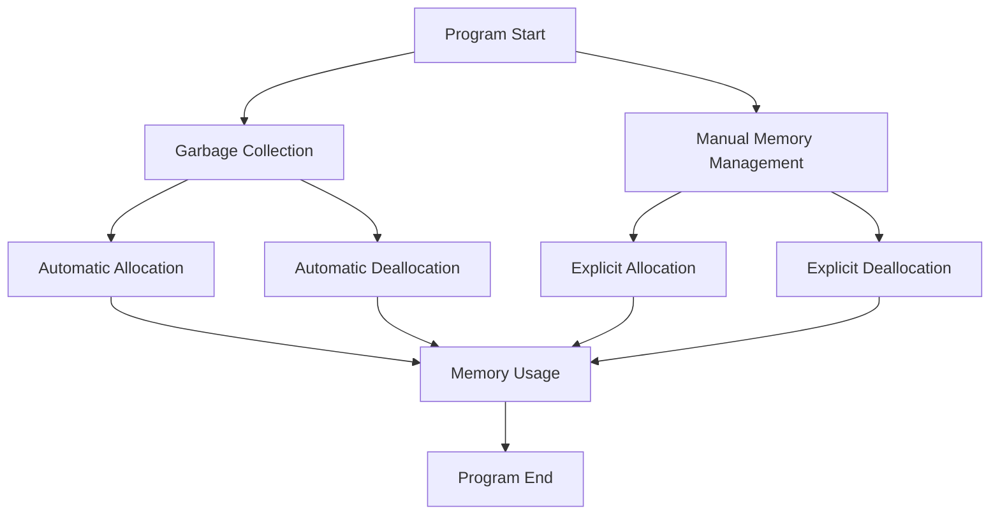

## 2.2 Memory Management and Safety in D

In the realm of systems programming, efficient and safe memory management is paramount. The D programming language offers a unique blend of high-level features and low-level control, making it an excellent choice for systems programming. In this section, we will delve into D's approach to memory management, explore its safety attributes, and provide best practices for writing memory-safe systems code. We'll also discuss common pitfalls and how to avoid them.

### Memory Models in D

D provides a flexible memory model that combines automatic memory management through garbage collection with the ability to perform manual memory management when needed. This dual approach allows developers to choose the best strategy for their specific use case.

#### Garbage Collection

D's garbage collector (GC) is a conservative, stop-the-world collector that automatically manages memory allocation and deallocation. It simplifies memory management by automatically reclaiming memory that is no longer in use, reducing the risk of memory leaks. However, reliance on the GC can introduce latency, which may not be acceptable in performance-critical systems.

```d
import std.stdio;

void main() {
    // Automatic memory management with garbage collection
    int[] numbers = new int[](5); // Memory is allocated on the heap
    numbers[0] = 42;
    writeln(numbers);
    // Memory is automatically reclaimed when no longer in use
}
```

#### Manual Memory Management

For scenarios where performance is critical, D allows manual memory management using the `core.memory` module. This approach gives developers fine-grained control over memory allocation and deallocation, enabling optimizations that are not possible with automatic garbage collection.

```d
import core.memory;
import std.stdio;

void main() {
    // Manual memory management
    void* ptr = GC.malloc(100); // Allocate 100 bytes
    // Use the allocated memory
    GC.free(ptr); // Free the allocated memory
}
```

### Safety Attributes

D provides safety attributes to categorize code based on its memory safety guarantees. These attributes help developers write safer code by enforcing constraints at compile time.

#### `@safe`

The `@safe` attribute ensures that code does not perform any operations that could lead to memory corruption. It restricts the use of pointers and disallows unsafe casts, making it ideal for writing robust and secure code.

```d
@safe void safeFunction() {
    int a = 10;
    int* p = &a; // Error: cannot take address of local variable in @safe code
}
```

#### `@trusted`

The `@trusted` attribute is used to mark code that is safe to use but cannot be verified by the compiler. It acts as a bridge between `@safe` and `@system` code, allowing developers to include low-level operations that are manually verified to be safe.

```d
@trusted void trustedFunction() {
    int a = 10;
    int* p = &a; // Allowed: developer asserts this is safe
}
```

#### `@system`

The `@system` attribute is the default for D code and allows all operations, including those that can lead to memory corruption. It is suitable for low-level code where the developer takes full responsibility for ensuring safety.

```d
@system void systemFunction() {
    int a = 10;
    int* p = &a; // Allowed: developer must ensure safety
}
```

### Best Practices for Memory-Safe Systems Code

To write memory-safe systems code in D, follow these best practices:

1. **Prefer `@safe` Code**: Use `@safe` wherever possible to leverage compile-time checks and reduce the risk of memory errors.

2. **Use `@trusted` Sparingly**: Only use `@trusted` for code that cannot be verified by the compiler but has been manually checked for safety.

3. **Minimize `@system` Code**: Limit the use of `@system` code to low-level operations that require manual memory management.

4. **Leverage RAII**: Use Resource Acquisition Is Initialization (RAII) to manage resources and ensure they are properly released.

5. **Avoid Global State**: Minimize the use of global variables to reduce the risk of unintended side effects and memory corruption.

6. **Use Immutable Data**: Prefer immutable data structures to prevent accidental modification and improve thread safety.

7. **Regularly Test and Profile**: Continuously test and profile your code to identify and address memory-related issues.

### Avoiding Common Pitfalls

Despite D's safety features, developers can still encounter memory-related issues. Here are some common pitfalls and how to avoid them:

#### Memory Leaks

Memory leaks occur when allocated memory is not properly deallocated, leading to increased memory usage over time. To avoid memory leaks, ensure that all allocated memory is freed when no longer needed.

```d
void leakExample() {
    int[] numbers = new int[](5);
    // Forgetting to free memory can lead to leaks
    // Use RAII or manual deallocation to prevent leaks
}
```

#### Buffer Overflows

Buffer overflows happen when data is written beyond the bounds of allocated memory, potentially leading to memory corruption. Use bounds checking and prefer safe data structures to prevent buffer overflows.

```d
void overflowExample() {
    int[] numbers = new int[](5);
    numbers[5] = 42; // Error: index out of bounds
}
```

#### Dangling Pointers

Dangling pointers refer to pointers that point to memory that has already been deallocated. Avoid using pointers to deallocated memory and prefer safe references.

```d
void danglingPointerExample() {
    int* p;
    {
        int a = 10;
        p = &a;
    }
    // p is now a dangling pointer
}
```

### Visualizing Memory Management in D

To better understand D's memory management model, let's visualize the interaction between garbage collection and manual memory management.



**Figure 1: Visualizing Memory Management in D**

### Try It Yourself

Experiment with the code examples provided in this section. Try modifying the memory allocation sizes, use different safety attributes, and observe how the compiler enforces safety constraints. This hands-on approach will deepen your understanding of memory management in D.

### References and Links

For further reading on memory management and safety in D, consider the following resources:

- [D Programming Language Official Documentation](https://dlang.org/)
- [Memory Management in D](https://dlang.org/articles/memory.html)
- [SafeD: Memory Safety in D](https://dlang.org/spec/memory-safe-d.html)

### Knowledge Check

To reinforce your understanding of memory management and safety in D, consider the following questions and exercises:

1. What are the differences between `@safe`, `@trusted`, and `@system` code in D?
2. How does D's garbage collector work, and what are its limitations?
3. Write a function that demonstrates manual memory management using `core.memory`.
4. Identify potential memory leaks in a given code snippet and suggest improvements.
5. Explain how RAII can be used to manage resources in D.

### Embrace the Journey

Remember, mastering memory management and safety in D is a journey. As you continue to explore and experiment with these concepts, you'll gain the skills needed to write efficient and safe systems code. Stay curious, keep learning, and enjoy the process!

## Quiz Time!



### What is the primary purpose of D's garbage collector?

- [x] To automatically manage memory allocation and deallocation
- [ ] To provide manual memory management capabilities
- [ ] To enforce memory safety at compile time
- [ ] To optimize performance for low-level operations

> **Explanation:** D's garbage collector automatically manages memory allocation and deallocation, reducing the risk of memory leaks.

### Which safety attribute in D ensures that code does not perform operations leading to memory corruption?

- [x] `@safe`
- [ ] `@trusted`
- [ ] `@system`
- [ ] `@nogc`

> **Explanation:** The `@safe` attribute restricts operations that could lead to memory corruption, ensuring safer code.

### How can you manually manage memory in D?

- [x] Using the `core.memory` module
- [ ] By relying solely on the garbage collector
- [ ] By using `@safe` code
- [ ] By using `@trusted` code

> **Explanation:** The `core.memory` module provides functions for manual memory management, allowing explicit allocation and deallocation.

### What is a common pitfall that can lead to memory leaks?

- [x] Forgetting to free allocated memory
- [ ] Using `@safe` code
- [ ] Using immutable data structures
- [ ] Performing bounds checking

> **Explanation:** Forgetting to free allocated memory can lead to memory leaks, as the memory is not reclaimed.

### Which attribute should be used sparingly and only for code that cannot be verified by the compiler?

- [x] `@trusted`
- [ ] `@safe`
- [ ] `@system`
- [ ] `@nogc`

> **Explanation:** The `@trusted` attribute is used for code that cannot be verified by the compiler but is manually checked for safety.

### What is a buffer overflow?

- [x] Writing data beyond the bounds of allocated memory
- [ ] Forgetting to free memory
- [ ] Using `@safe` code
- [ ] Using immutable data structures

> **Explanation:** A buffer overflow occurs when data is written beyond the bounds of allocated memory, potentially leading to memory corruption.

### How can RAII help in memory management?

- [x] By ensuring resources are properly released
- [ ] By providing manual memory management functions
- [ ] By enforcing memory safety at compile time
- [ ] By optimizing performance for low-level operations

> **Explanation:** RAII ensures resources are properly released by tying resource management to object lifetime.

### What is a dangling pointer?

- [x] A pointer that points to deallocated memory
- [ ] A pointer that points to allocated memory
- [ ] A pointer that is never used
- [ ] A pointer that is always null

> **Explanation:** A dangling pointer points to memory that has already been deallocated, leading to potential errors.

### What is the default safety attribute for D code?

- [x] `@system`
- [ ] `@safe`
- [ ] `@trusted`
- [ ] `@nogc`

> **Explanation:** The default safety attribute for D code is `@system`, which allows all operations, including unsafe ones.

### True or False: D's garbage collector is a stop-the-world collector.

- [x] True
- [ ] False

> **Explanation:** D's garbage collector is a conservative, stop-the-world collector, which can introduce latency in performance-critical systems.


