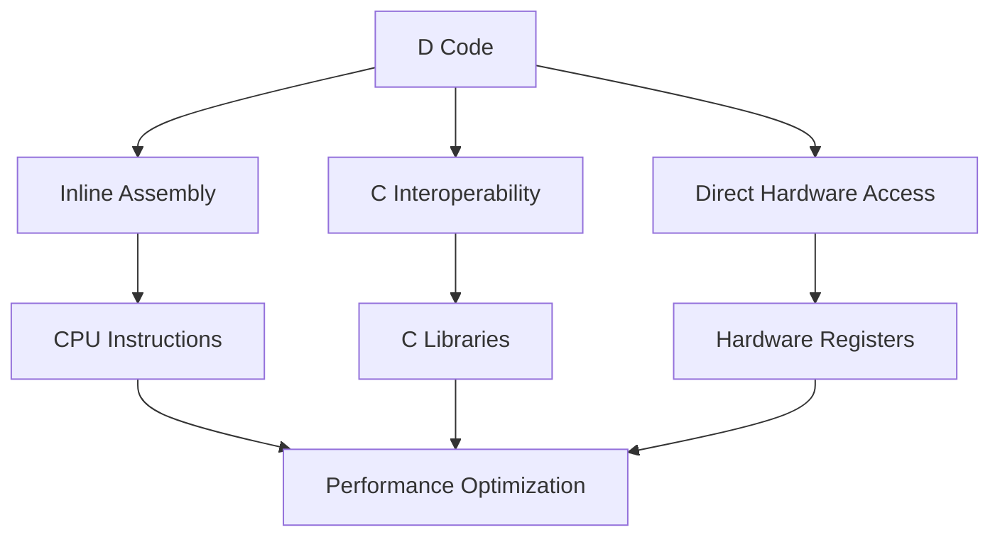

## 2.3 Leveraging D's Low-Level Capabilities

In this section, we delve into the low-level capabilities of the D programming language, which make it a powerful tool for systems programming. We'll explore how D allows you to incorporate inline assembly, interface with C code, access hardware directly, and optimize for performance. These capabilities enable you to write efficient, high-performance systems code while still benefiting from D's high-level features.

### Inline Assembly

Inline assembly allows you to embed assembly language instructions directly within your D code. This can be particularly useful for performance-critical sections where you need to optimize beyond what the compiler can achieve.

#### Why Use Inline Assembly?

- **Performance**: Achieve maximum performance by writing critical sections in assembly.
- **Hardware-Specific Instructions**: Utilize specific CPU instructions not exposed by the D language.
- **Fine-Grained Control**: Gain precise control over the CPU and memory operations.

#### Using Inline Assembly in D

D provides the `asm` keyword to include assembly code. Here's a simple example:

```d
import std.stdio;

void main() {
    int a = 10;
    int b = 20;
    int result;

    asm {
        mov EAX, a; // Move the value of 'a' into EAX register
        add EAX, b; // Add the value of 'b' to EAX
        mov result, EAX; // Move the result back to 'result'
    }

    writeln("The result is: ", result); // Output: The result is: 30
}
```

In this example, we use inline assembly to add two integers. The `mov` and `add` instructions are used to manipulate the CPU registers directly.

#### Considerations for Inline Assembly

- **Portability**: Inline assembly is not portable across different architectures.
- **Complexity**: Assembly language is complex and error-prone.
- **Debugging**: Debugging assembly code can be challenging.

### C Interoperability

Interfacing with C code is a crucial aspect of systems programming. D provides seamless interoperability with C, allowing you to leverage existing C libraries and codebases.

#### Why Interoperate with C?

- **Leverage Existing Libraries**: Use well-tested C libraries to avoid reinventing the wheel.
- **Performance**: C libraries are often highly optimized for performance.
- **Compatibility**: Interact with systems and hardware interfaces that provide C APIs.

#### Interfacing with C Code

To call C functions from D, you need to declare them using `extern(C)`. Here's an example:

```d
extern(C) int printf(const char* format, ...);

void main() {
    printf("Hello, %s!\n", "World");
}
```

In this example, we declare the `printf` function from the C standard library and use it in our D program.

#### Handling C Data Types

D provides equivalent types for C data types, but you must ensure compatibility. For instance, use `int` for `int`, `char*` for `char*`, and so on.

#### Linking with C Libraries

When compiling your D program, you may need to link against C libraries using the `-L` flag:

```bash
dmd myprogram.d -L-lc
```

This command links the C standard library with your D program.

### Direct Hardware Access

Direct hardware access is essential for systems programming, especially in embedded systems and operating system development. D allows you to interact with hardware directly, providing the control needed for low-level programming.

#### Techniques for Direct Hardware Access

- **Memory-Mapped I/O**: Access hardware registers by mapping them to memory addresses.
- **Port I/O**: Use special CPU instructions to read and write to hardware ports.
- **Interrupt Handling**: Write interrupt service routines (ISRs) to handle hardware interrupts.

#### Example: Memory-Mapped I/O

Here's an example of accessing a hardware register using memory-mapped I/O:

```d
import std.stdio;

enum uint REGISTER_ADDRESS = 0x40000000;

void main() {
    // Cast the address to a pointer and dereference it
    uint* registerPtr = cast(uint*)REGISTER_ADDRESS;
    *registerPtr = 0x12345678; // Write a value to the register

    writeln("Register value set.");
}
```

In this example, we define a memory address for a hardware register and write a value to it.

#### Considerations for Hardware Access

- **Safety**: Direct hardware access can lead to system instability if not handled carefully.
- **Permissions**: Ensure your program has the necessary permissions to access hardware.
- **Portability**: Hardware access code is not portable across different platforms.

### Optimizing for Performance

Performance optimization is a critical aspect of systems programming. D provides several features to help you write highly optimized code.

#### Techniques for Performance Optimization

- **Compile-Time Function Execution (CTFE)**: Execute functions at compile time to reduce runtime overhead.
- **Templates and Generics**: Use templates to write type-safe, reusable code without sacrificing performance.
- **Memory Management**: Optimize memory usage with manual memory management and custom allocators.
- **Concurrency**: Utilize D's concurrency features to write parallel code.

#### Example: Compile-Time Function Execution

Here's an example of using CTFE to optimize performance:

```d
import std.stdio;

enum int factorial(int n) {
    return n <= 1 ? 1 : n * factorial(n - 1);
}

void main() {
    enum result = factorial(5); // Computed at compile time
    writeln("Factorial of 5 is: ", result); // Output: Factorial of 5 is: 120
}
```

In this example, the `factorial` function is executed at compile time, reducing runtime overhead.

#### Considerations for Performance Optimization

- **Profiling**: Use profiling tools to identify performance bottlenecks.
- **Trade-offs**: Balance between code readability and performance.
- **Testing**: Ensure optimizations do not introduce bugs or instability.

### Visualizing D's Low-Level Capabilities

To better understand how D's low-level capabilities fit into the systems programming landscape, let's visualize the interaction between D code, assembly, C interoperability, and hardware access.



**Diagram Description**: This diagram illustrates how D code interacts with inline assembly, C interoperability, and direct hardware access to achieve performance optimization.

### Try It Yourself

Experiment with the code examples provided in this section. Try modifying the inline assembly code to perform different arithmetic operations. Explore interfacing with different C libraries and accessing various hardware registers. Remember, the key to mastering these low-level capabilities is practice and experimentation.

### Knowledge Check

- What are the benefits of using inline assembly in D?
- How do you declare a C function in D for interoperability?
- What are some techniques for direct hardware access in D?
- How can compile-time function execution improve performance?
- What are the considerations when optimizing for performance in D?

### Embrace the Journey

Remember, mastering D's low-level capabilities is a journey. As you progress, you'll gain a deeper understanding of systems programming and how to leverage D's features to write efficient, high-performance code. Keep experimenting, stay curious, and enjoy the journey!

## Quiz Time!



### What is one of the primary benefits of using inline assembly in D?

- [x] Achieving maximum performance in critical sections
- [ ] Improving code readability
- [ ] Enhancing portability across different architectures
- [ ] Simplifying debugging

> **Explanation:** Inline assembly allows for maximum performance by enabling direct manipulation of CPU instructions.

### How do you declare a C function in D for interoperability?

- [x] Using `extern(C)`
- [ ] Using `import(C)`
- [ ] Using `link(C)`
- [ ] Using `include(C)`

> **Explanation:** The `extern(C)` keyword is used to declare C functions in D for interoperability.

### What is a common technique for direct hardware access in D?

- [x] Memory-Mapped I/O
- [ ] Using high-level APIs
- [ ] Virtualization
- [ ] Cloud computing

> **Explanation:** Memory-Mapped I/O is a technique for accessing hardware registers by mapping them to memory addresses.

### What feature of D allows functions to be executed at compile time?

- [x] Compile-Time Function Execution (CTFE)
- [ ] Inline Assembly
- [ ] Memory-Mapped I/O
- [ ] Port I/O

> **Explanation:** Compile-Time Function Execution (CTFE) allows functions to be executed at compile time, reducing runtime overhead.

### Which of the following is a consideration when optimizing for performance in D?

- [x] Profiling to identify bottlenecks
- [ ] Ignoring code readability
- [ ] Avoiding testing
- [ ] Prioritizing portability over performance

> **Explanation:** Profiling is essential to identify performance bottlenecks and optimize effectively.

### What is a potential downside of using inline assembly?

- [x] Lack of portability
- [ ] Improved performance
- [ ] Easier debugging
- [ ] Simplified code

> **Explanation:** Inline assembly is not portable across different architectures, which can be a downside.

### Which keyword is used to include assembly code in D?

- [x] `asm`
- [ ] `assembly`
- [ ] `inline`
- [ ] `code`

> **Explanation:** The `asm` keyword is used to include assembly code in D.

### What is a benefit of C interoperability in D?

- [x] Leveraging existing C libraries
- [ ] Increased code complexity
- [ ] Reduced performance
- [ ] Limited compatibility

> **Explanation:** C interoperability allows leveraging existing C libraries, which are often well-tested and optimized.

### What is a common use case for direct hardware access in D?

- [x] Embedded systems programming
- [ ] Web development
- [ ] Cloud computing
- [ ] Mobile app development

> **Explanation:** Direct hardware access is commonly used in embedded systems programming for low-level control.

### True or False: D's low-level capabilities allow for both high-level and low-level programming.

- [x] True
- [ ] False

> **Explanation:** D's low-level capabilities enable both high-level and low-level programming, providing flexibility and control.


