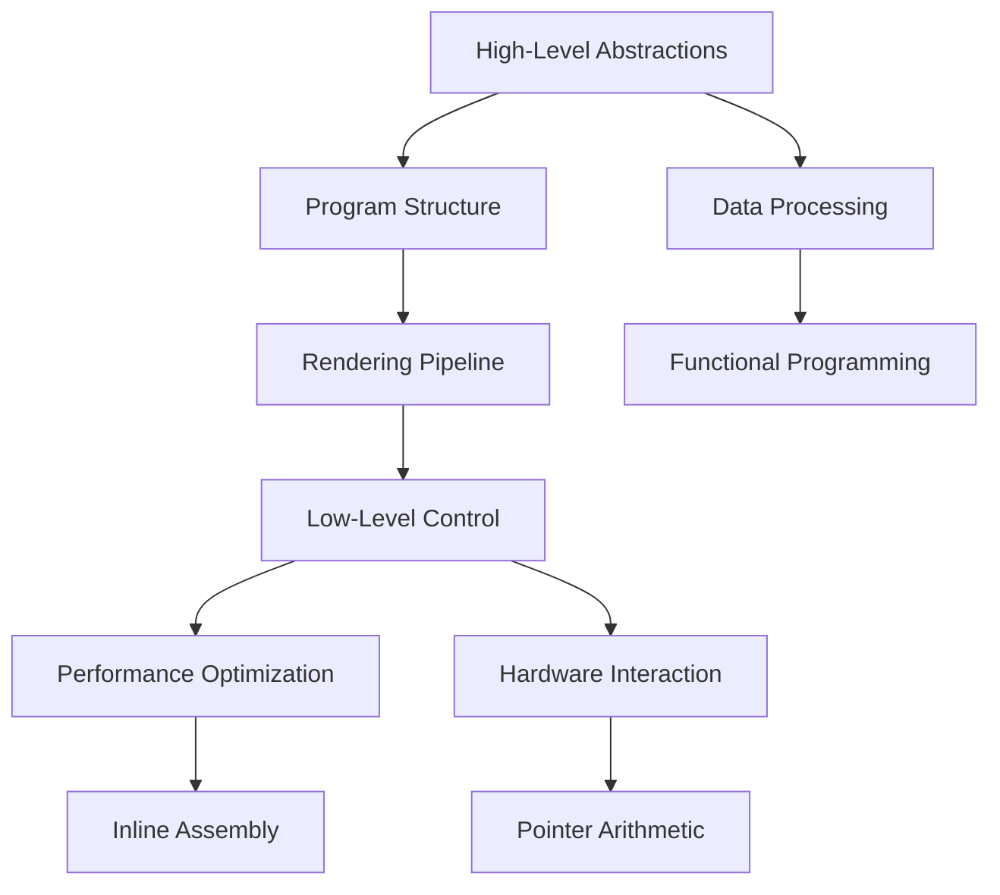

## 2.4 Combining High-Level and Low-Level Programming

In the realm of systems programming, the ability to seamlessly combine high-level abstractions with low-level control is a powerful asset. The D programming language excels in this dual paradigm approach, offering developers the flexibility to write expressive, maintainable code without sacrificing the performance and control needed for systems-level tasks. In this section, we will explore how D achieves this balance, providing practical techniques and insights into when and how to leverage each paradigm effectively.

### Dual Paradigm Strength

D's strength lies in its ability to blend high-level and low-level programming paradigms. This duality allows developers to harness the productivity and expressiveness of high-level constructs while retaining the fine-grained control and efficiency of low-level operations.

#### High-Level Abstractions

High-level programming in D involves using constructs that abstract away the complexity of underlying hardware and system interactions. These abstractions include:

- **Classes and Interfaces**: Enable object-oriented design, promoting code reuse and modularity.
- **Templates and Generics**: Allow for type-safe, reusable code components.
- **Functional Programming Features**: Include higher-order functions, immutability, and lazy evaluation.

#### Low-Level Control

Low-level programming in D provides direct access to hardware and system resources, essential for performance-critical applications. Key features include:

- **Inline Assembly**: Allows embedding of assembly code for performance optimization.
- **Pointer Arithmetic**: Provides direct memory manipulation capabilities.
- **Manual Memory Management**: Offers control over memory allocation and deallocation.

### Productivity and Efficiency

Combining high-level and low-level programming in D enables developers to achieve rapid development without sacrificing performance. This section will demonstrate how D's features facilitate this balance.

#### High-Level Productivity

High-level constructs in D enhance productivity by simplifying complex tasks. For example, D's range-based algorithms allow for concise and expressive data processing:

```d
import std.algorithm;
import std.range;

void main() {
    auto data = [1, 2, 3, 4, 5];
    auto result = data.filter!(x => x % 2 == 0).map!(x => x * x).array;
    writeln(result); // Output: [4, 16]
}
```

In this example, the use of ranges and functional programming paradigms enables concise and readable code, abstracting away the underlying iteration logic.

#### Low-Level Efficiency

For performance-critical sections, D provides low-level control. Consider the following example using inline assembly to optimize a mathematical operation:

```d
import std.stdio;

void main() {
    int a = 5, b = 10, result;
    asm {
        mov EAX, a;
        add EAX, b;
        mov result, EAX;
    }
    writeln("Result: ", result); // Output: Result: 15
}
```

Here, inline assembly is used to perform an addition operation directly on CPU registers, showcasing D's capability to optimize performance-critical code paths.

### Practical Techniques

Let's explore practical techniques for effectively combining high-level and low-level programming in D.

#### Interfacing High-Level and Low-Level Code

One common technique is to use high-level abstractions for overall program structure and low-level code for performance-critical sections. Consider a graphics rendering application where high-level code manages the rendering pipeline, while low-level code handles pixel manipulation:

```d
class Renderer {
    void renderFrame() {
        // High-level rendering logic
        prepareScene();
        drawObjects();
        applyPostProcessing();
    }

    void drawObjects() {
        // Low-level pixel manipulation
        foreach (object; sceneObjects) {
            drawObject(object);
        }
    }

    void drawObject(Object obj) {
        // Inline assembly for pixel manipulation
        asm {
            // Assembly code for drawing pixels
        }
    }
}
```

In this example, the `Renderer` class uses high-level methods to manage rendering, while inline assembly is employed for low-level pixel operations.

#### Balancing Abstractions and Control

Understanding when to use high-level abstractions versus low-level control is crucial. High-level code is ideal for maintainability and rapid development, while low-level code is necessary for optimizing performance-critical paths. Consider the following guidelines:

- **Use High-Level Abstractions**: For code that requires flexibility, maintainability, and rapid development.
- **Employ Low-Level Control**: For sections where performance is critical, such as tight loops or hardware interactions.

### Balance and Trade-offs

Combining high-level and low-level programming involves trade-offs. While high-level code enhances productivity and maintainability, low-level code offers performance and control. Understanding these trade-offs is essential for making informed decisions.

#### Performance vs. Maintainability

High-level code is generally more maintainable but may introduce performance overhead. Conversely, low-level code can optimize performance but may be harder to maintain. Striking the right balance involves:

- **Profiling and Optimization**: Identify performance bottlenecks and optimize only where necessary.
- **Modular Design**: Use high-level abstractions for overall structure and low-level code for isolated, performance-critical sections.

#### Safety vs. Control

High-level code often includes safety features such as type checking and memory management, while low-level code provides greater control but may introduce safety risks. Consider the following strategies:

- **Leverage D's Safety Features**: Use `@safe` and `@trusted` annotations to enforce safety where possible.
- **Isolate Unsafe Code**: Encapsulate low-level operations in well-defined modules or functions to minimize risk.

### Visualizing the Dual Paradigm Approach

To better understand how D combines high-level and low-level programming, let's visualize the interaction between these paradigms using a flowchart.



**Figure 1**: Visualizing the interaction between high-level abstractions and low-level control in D programming.

### Try It Yourself

To deepen your understanding, try modifying the code examples provided. Experiment with different high-level abstractions and low-level optimizations. For instance, replace the inline assembly in the pixel manipulation example with D's native operations and compare performance.

### References and Links

For further reading on combining high-level and low-level programming in D, consider the following resources:

- [D Programming Language Official Website](https://dlang.org/)
- [D Language Specification](https://dlang.org/spec/spec.html)
- [D Cookbook by Adam D. Ruppe](https://www.packtpub.com/product/d-cookbook/9781783287215)

### Knowledge Check

To reinforce your understanding, consider the following questions and exercises:

- What are the benefits of combining high-level and low-level programming in D?
- How can you identify sections of code that would benefit from low-level optimization?
- Experiment with the provided code examples and measure performance differences.

### Embrace the Journey

Remember, mastering the art of combining high-level and low-level programming in D is a journey. As you continue to explore and experiment, you'll gain a deeper understanding of how to leverage D's unique features to build efficient, maintainable systems. Keep experimenting, stay curious, and enjoy the journey!

## Quiz Time!



### What is a key benefit of combining high-level and low-level programming in D?

- [x] Achieving both productivity and performance
- [ ] Simplifying code to a single paradigm
- [ ] Eliminating the need for manual memory management
- [ ] Avoiding the use of inline assembly

> **Explanation:** Combining high-level and low-level programming in D allows developers to achieve both productivity and performance by leveraging the strengths of each paradigm.

### Which feature of D allows for direct memory manipulation?

- [x] Pointer Arithmetic
- [ ] Classes and Interfaces
- [ ] Functional Programming
- [ ] Ranges

> **Explanation:** Pointer arithmetic in D provides direct memory manipulation capabilities, essential for low-level programming.

### What is the purpose of using inline assembly in D?

- [x] To optimize performance-critical code paths
- [ ] To simplify high-level abstractions
- [ ] To enhance code readability
- [ ] To enforce type safety

> **Explanation:** Inline assembly is used in D to optimize performance-critical code paths by allowing direct manipulation of CPU registers.

### When should high-level abstractions be preferred in D?

- [x] For code that requires flexibility and maintainability
- [ ] For performance-critical sections
- [ ] For hardware interactions
- [ ] For manual memory management

> **Explanation:** High-level abstractions should be preferred for code that requires flexibility, maintainability, and rapid development.

### What is a trade-off of using low-level code in D?

- [x] Reduced maintainability
- [ ] Increased safety
- [ ] Enhanced readability
- [ ] Simplified debugging

> **Explanation:** Low-level code can optimize performance but may reduce maintainability due to its complexity and direct hardware interactions.

### How can you isolate unsafe code in D?

- [x] Encapsulate it in well-defined modules or functions
- [ ] Use high-level abstractions
- [ ] Avoid using inline assembly
- [ ] Implement functional programming paradigms

> **Explanation:** Encapsulating unsafe code in well-defined modules or functions helps minimize risk and maintain safety.

### What is a benefit of using D's range-based algorithms?

- [x] Concise and expressive data processing
- [ ] Direct hardware interaction
- [ ] Manual memory management
- [ ] Inline assembly optimization

> **Explanation:** D's range-based algorithms allow for concise and expressive data processing, enhancing productivity and readability.

### Which D feature enhances productivity by simplifying complex tasks?

- [x] High-Level Abstractions
- [ ] Low-Level Control
- [ ] Inline Assembly
- [ ] Pointer Arithmetic

> **Explanation:** High-level abstractions in D enhance productivity by simplifying complex tasks and abstracting away low-level details.

### What is the role of `@safe` annotations in D?

- [x] To enforce safety in code
- [ ] To optimize performance
- [ ] To enable inline assembly
- [ ] To simplify high-level abstractions

> **Explanation:** `@safe` annotations in D are used to enforce safety in code by preventing unsafe operations.

### True or False: D allows for both high-level and low-level programming within the same application.

- [x] True
- [ ] False

> **Explanation:** True. D allows for both high-level and low-level programming within the same application, providing flexibility and control.


