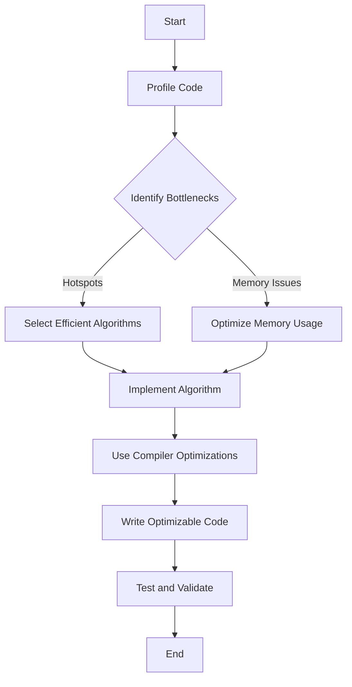

## 2.5 Performance Optimization Strategies

In the realm of systems programming, performance is paramount. The D programming language, with its blend of high-level expressiveness and low-level control, offers a unique platform for crafting efficient software. In this section, we will explore various performance optimization strategies that leverage D's capabilities. Our focus will be on profiling tools, efficient algorithms, compiler optimizations, and code optimization techniques. Let's dive in!

### Profiling Tools

Before optimizing, it's crucial to understand where the bottlenecks lie. Profiling tools help us identify these areas by providing insights into how our program executes.

#### Using D's Profiling Tools

D offers several tools and libraries for profiling:

1. **DMD's Built-in Profiler**: The DMD compiler includes a built-in profiler that can be enabled with the `-profile` flag. This tool provides a detailed report of function call counts and execution times.

   ```bash
   dmd -profile myProgram.d
   ./myProgram
   ```

   After running the program, a `trace.log` file is generated, containing profiling information.

2. **VisualD**: An extension for Visual Studio, VisualD provides integrated profiling capabilities, allowing you to visualize performance data directly within the IDE.

3. **Third-Party Tools**: Tools like `gprof` and `valgrind` can be used with D programs, especially when interfacing with C/C++ code.

#### Analyzing Profiling Data

Once profiling data is collected, analyze it to identify functions or sections of code that consume the most resources. Look for:

- **Hotspots**: Functions that are called frequently or take a long time to execute.
- **Inefficient Loops**: Loops that iterate more than necessary or perform costly operations.
- **Memory Usage**: Areas where excessive memory allocation or deallocation occurs.

### Efficient Algorithms

Choosing the right algorithm is often the most significant factor in optimizing performance. Let's explore some strategies for selecting and implementing efficient algorithms in D.

#### Algorithm Selection

1. **Complexity Analysis**: Evaluate the time and space complexity of potential algorithms. Opt for algorithms with lower complexity for large data sets.

2. **Data Structures**: Choose appropriate data structures that complement your algorithm. For instance, use hash tables for fast lookups or trees for sorted data.

3. **Parallel Algorithms**: Leverage D's `std.parallelism` module to implement parallel algorithms, which can significantly reduce execution time on multi-core systems.

#### Implementing Efficient Algorithms

Let's consider an example of optimizing a sorting algorithm using D's features:

```d
import std.algorithm : sort;
import std.parallelism : parallel;

void optimizedSort(int[] data) {
    // Use parallel sorting for large data sets
    if (data.length > 1000) {
        data.parallel.sort();
    } else {
        data.sort();
    }
}
```

In this example, we use D's `parallel` module to sort large arrays concurrently, improving performance on multi-core processors.

### Compiler Optimizations

The D compiler provides several options to optimize code during compilation. Understanding and utilizing these options can lead to significant performance gains.

#### Leveraging Compiler Settings and Flags

1. **Optimization Flags**: Use the `-O` flag to enable general optimizations, and `-release` to remove runtime checks for assertions and contracts.

   ```bash
   dmd -O -release myProgram.d
   ```

2. **Inlining**: The `-inline` flag instructs the compiler to inline functions, reducing function call overhead.

3. **Link-Time Optimization (LTO)**: Use the `-flto` flag to enable link-time optimizations, which can further optimize the final executable.

#### Understanding Compiler Output

To ensure the compiler is optimizing effectively, examine the generated assembly code using the `-output-s` flag. This can provide insights into how the compiler translates your code and whether optimizations are applied.

### Code Optimization

Writing code that the compiler can optimize effectively is an art. Here are some strategies to achieve this:

#### Writing Optimizable Code

1. **Avoid Premature Optimization**: Focus on writing clear and maintainable code first. Optimize only after identifying bottlenecks through profiling.

2. **Use Built-in Functions**: D's standard library provides highly optimized functions. Use these instead of writing custom implementations.

3. **Minimize Memory Allocations**: Frequent memory allocations can degrade performance. Use stack allocation or memory pools where possible.

4. **Leverage Immutability**: Immutable data can be optimized more aggressively by the compiler. Use `immutable` and `const` keywords to declare immutable data.

#### Example: Optimizing a Matrix Multiplication

Let's optimize a matrix multiplication operation using D's features:

```d
import std.stdio;
import std.parallelism;

void matrixMultiply(int[][] a, int[][] b, int[][] result) {
    auto rows = a.length;
    auto cols = b[0].length;
    auto innerDim = b.length;

    foreach (i; 0 .. rows) {
        foreach (j; 0 .. cols) {
            int sum = 0;
            foreach (k; 0 .. innerDim) {
                sum += a[i][k] * b[k][j];
            }
            result[i][j] = sum;
        }
    }
}

void optimizedMatrixMultiply(int[][] a, int[][] b, int[][] result) {
    auto rows = a.length;
    auto cols = b[0].length;
    auto innerDim = b.length;

    // Use parallelism for large matrices
    foreach (i; 0 .. rows) {
        parallel foreach (j; 0 .. cols) {
            int sum = 0;
            foreach (k; 0 .. innerDim) {
                sum += a[i][k] * b[k][j];
            }
            result[i][j] = sum;
        }
    }
}

void main() {
    int[][] a = [[1, 2], [3, 4]];
    int[][] b = [[5, 6], [7, 8]];
    int[][] result = new int[2][2];

    optimizedMatrixMultiply(a, b, result);
    writeln(result);
}
```

In this example, we use `parallel` to distribute the workload across multiple threads, significantly improving performance for large matrices.

### Visualizing Performance Optimization

To better understand the flow of performance optimization, let's visualize the process using a flowchart:



**Diagram Description**: This flowchart illustrates the performance optimization process, starting with profiling the code, identifying bottlenecks, selecting efficient algorithms, optimizing memory usage, and leveraging compiler optimizations.

### Try It Yourself

Experiment with the provided code examples by:

- Modifying the size of the matrices in the matrix multiplication example to observe performance changes.
- Enabling and disabling compiler flags to see their impact on execution time.
- Implementing a different sorting algorithm and comparing its performance with the provided example.

### Knowledge Check

- What are the key steps in the performance optimization process?
- How can profiling tools help identify performance bottlenecks?
- Why is it important to choose efficient algorithms?
- What are some compiler flags that can optimize D programs?
- How does parallelism improve performance in D?

### Embrace the Journey

Remember, performance optimization is an iterative process. Start by writing clear and maintainable code, profile to identify bottlenecks, and apply optimizations judiciously. Keep experimenting, stay curious, and enjoy the journey of mastering performance optimization in D programming!

## Quiz Time!



### What is the primary purpose of profiling tools in performance optimization?

- [x] To identify performance bottlenecks
- [ ] To write more efficient code
- [ ] To compile code faster
- [ ] To reduce memory usage

> **Explanation:** Profiling tools help identify areas in the code that consume the most resources, allowing developers to focus their optimization efforts effectively.

### Which D compiler flag enables general optimizations?

- [x] `-O`
- [ ] `-g`
- [ ] `-debug`
- [ ] `-profile`

> **Explanation:** The `-O` flag enables general optimizations in the D compiler.

### What is a key benefit of using parallel algorithms in D?

- [x] Reduced execution time on multi-core systems
- [ ] Simplified code structure
- [ ] Increased memory usage
- [ ] Improved code readability

> **Explanation:** Parallel algorithms can significantly reduce execution time by distributing workloads across multiple cores.

### Which keyword in D is used to declare immutable data?

- [x] `immutable`
- [ ] `const`
- [ ] `static`
- [ ] `final`

> **Explanation:** The `immutable` keyword is used to declare data that cannot be modified after initialization.

### What is the purpose of the `-inline` flag in the D compiler?

- [x] To inline functions and reduce function call overhead
- [ ] To enable debugging information
- [ ] To profile the code
- [ ] To optimize memory usage

> **Explanation:** The `-inline` flag instructs the compiler to inline functions, reducing the overhead associated with function calls.

### How can memory allocations be minimized in D?

- [x] Use stack allocation or memory pools
- [ ] Use more global variables
- [ ] Increase the heap size
- [ ] Avoid using arrays

> **Explanation:** Minimizing memory allocations can be achieved by using stack allocation or memory pools, which are more efficient than heap allocations.

### What is a common strategy for optimizing matrix multiplication in D?

- [x] Use parallelism to distribute workload
- [ ] Use recursive functions
- [ ] Increase matrix size
- [ ] Use global variables

> **Explanation:** Using parallelism allows the workload to be distributed across multiple threads, improving performance for large matrices.

### Which of the following is NOT a profiling tool for D?

- [x] `gdb`
- [ ] `gprof`
- [ ] `valgrind`
- [ ] DMD's built-in profiler

> **Explanation:** `gdb` is a debugger, not a profiling tool. The other options are profiling tools that can be used with D.

### What is the benefit of using D's standard library functions?

- [x] They are highly optimized
- [ ] They are easier to write
- [ ] They require less memory
- [ ] They are always faster

> **Explanation:** D's standard library functions are highly optimized, making them a good choice for performance-critical applications.

### True or False: Premature optimization should be avoided in software development.

- [x] True
- [ ] False

> **Explanation:** Premature optimization can lead to complex and hard-to-maintain code. It's best to optimize only after identifying actual performance bottlenecks.


