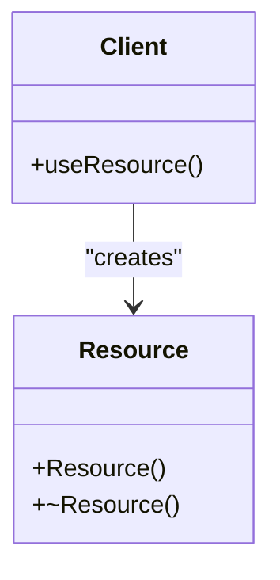
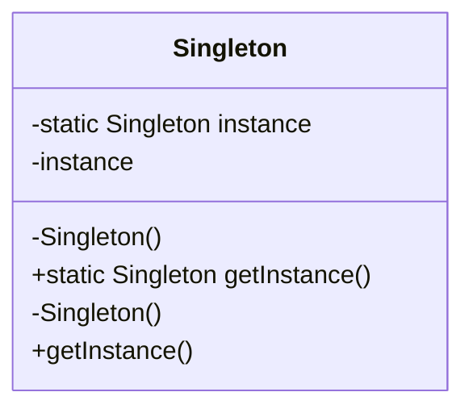

## 2.6 The Role of Design Patterns in Systems Programming

In the realm of systems programming, where performance, reliability, and maintainability are paramount, design patterns emerge as invaluable tools. They provide proven solutions to recurring problems, enabling developers to create robust and efficient systems. In this section, we will delve into how design patterns can be effectively applied in systems programming using the D programming language. We will explore their role in addressing common challenges, organizing code, and enhancing the overall quality of systems software.

### Pattern Application: Addressing Common Systems Programming Challenges

Systems programming often involves dealing with complex, low-level operations, such as memory management, concurrency, and hardware interactions. Design patterns offer structured approaches to these challenges, allowing developers to focus on solving problems rather than reinventing solutions.

#### Memory Management

Memory management is a critical aspect of systems programming. Patterns like the **Resource Acquisition Is Initialization (RAII)** pattern help manage resources by tying their lifecycle to the scope of objects. This pattern ensures that resources are acquired and released in a predictable manner, reducing memory leaks and dangling pointers.

```d
class Resource {
    this() {
        // Acquire resource
    }
    ~this() {
        // Release resource
    }
}

void useResource() {
    Resource res = new Resource();
    // Use the resource
} // Resource is automatically released here
```

#### Concurrency

Concurrency is another significant challenge in systems programming. Patterns such as the **Actor Model** and **Message Passing** provide frameworks for managing concurrent operations safely and efficiently. These patterns help avoid common pitfalls like race conditions and deadlocks.

```d
import std.concurrency;

void worker() {
    receive(
        (int msg) {
            writeln("Received message: ", msg);
        }
    );
}

void main() {
    auto tid = spawn(&worker);
    send(tid, 42);
}
```

### Code Organization: Structuring Systems Code for Maintainability

Design patterns play a crucial role in organizing systems code, making it more maintainable and scalable. By providing a clear structure, patterns help developers understand and modify code with ease.

#### Modular Design

Patterns like the **Facade** and **Adapter** help create modular systems by encapsulating complex subsystems and providing simple interfaces. This modularity enhances code readability and maintainability.

```d
class ComplexSubsystem {
    void operationA() { /* ... */ }
    void operationB() { /* ... */ }
}

class Facade {
    ComplexSubsystem subsystem;

    this() {
        subsystem = new ComplexSubsystem();
    }

    void simpleOperation() {
        subsystem.operationA();
        subsystem.operationB();
    }
}

void main() {
    Facade facade = new Facade();
    facade.simpleOperation();
}
```

#### Extensibility

The **Decorator** pattern allows for adding new functionalities to existing objects without altering their structure. This pattern is particularly useful in systems programming, where extending functionality without disrupting existing code is often required.

```d
interface Component {
    void operation();
}

class ConcreteComponent : Component {
    void operation() {
        writeln("ConcreteComponent operation");
    }
}

class Decorator : Component {
    Component component;

    this(Component component) {
        this.component = component;
    }

    void operation() {
        component.operation();
        writeln("Decorator operation");
    }
}

void main() {
    Component component = new ConcreteComponent();
    Component decorated = new Decorator(component);
    decorated.operation();
}
```

### Examples in Systems Programming: Specific Design Patterns

Certain design patterns are particularly well-suited for systems programming. Let's explore a few examples and their applications.

#### Singleton Pattern

The **Singleton** pattern ensures that a class has only one instance and provides a global point of access to it. This pattern is useful in systems programming for managing shared resources like configuration settings or logging mechanisms.

```d
class Singleton {
    private static Singleton instance;

    private this() {}

    static Singleton getInstance() {
        if (instance is null) {
            instance = new Singleton();
        }
        return instance;
    }
}

void main() {
    auto singleton = Singleton.getInstance();
}
```

#### Proxy Pattern

The **Proxy** pattern provides a surrogate or placeholder for another object to control access to it. This pattern is beneficial in systems programming for implementing lazy loading, access control, and logging.

```d
interface Subject {
    void request();
}

class RealSubject : Subject {
    void request() {
        writeln("RealSubject request");
    }
}

class Proxy : Subject {
    RealSubject realSubject;

    void request() {
        if (realSubject is null) {
            realSubject = new RealSubject();
        }
        realSubject.request();
    }
}

void main() {
    Subject proxy = new Proxy();
    proxy.request();
}
```

### Benefits: Enhancing Readability, Reliability, and Scalability

Design patterns offer numerous benefits in systems programming, including enhanced readability, reliability, and scalability.

#### Readability

By providing a common vocabulary and structure, design patterns make code more readable and understandable. Developers familiar with patterns can quickly grasp the architecture and flow of a system.

#### Reliability

Patterns like **RAII** and **Singleton** contribute to the reliability of systems by ensuring proper resource management and consistent state management.

#### Scalability

Patterns such as **Decorator** and **Facade** enable systems to scale by allowing new functionalities to be added without disrupting existing code. This scalability is crucial in systems programming, where requirements often evolve over time.

### Visualizing Design Patterns in Systems Programming

To better understand the role of design patterns in systems programming, let's visualize some of the key patterns using Mermaid.js diagrams.

#### RAII Pattern



#### Singleton Pattern



### Try It Yourself

Experiment with the code examples provided in this section. Try modifying the **Decorator** pattern to add multiple layers of decoration or implement a **Proxy** pattern with additional logging functionality. These exercises will help solidify your understanding of how design patterns can be applied in systems programming.

### Knowledge Check

- What are the key benefits of using design patterns in systems programming?
- How does the **RAII** pattern help with memory management?
- In what scenarios would you use the **Proxy** pattern?
- How can the **Decorator** pattern enhance code extensibility?

### Embrace the Journey

Remember, mastering design patterns in systems programming is a journey. As you continue to explore and apply these patterns, you'll gain deeper insights into creating efficient, maintainable, and scalable systems. Keep experimenting, stay curious, and enjoy the process!

## Quiz Time!



### What is the primary benefit of using the RAII pattern in systems programming?

- [x] Automatic resource management
- [ ] Improved performance
- [ ] Enhanced security
- [ ] Simplified user interface

> **Explanation:** The RAII pattern ties resource management to object lifetimes, ensuring resources are automatically released when objects go out of scope.

### Which design pattern is best suited for managing shared resources like configuration settings?

- [x] Singleton Pattern
- [ ] Proxy Pattern
- [ ] Decorator Pattern
- [ ] Adapter Pattern

> **Explanation:** The Singleton pattern ensures a class has only one instance, making it ideal for managing shared resources.

### How does the Decorator pattern enhance code extensibility?

- [x] By adding new functionalities without altering existing structures
- [ ] By simplifying code complexity
- [ ] By improving performance
- [ ] By enforcing strict type checking

> **Explanation:** The Decorator pattern allows new functionalities to be added dynamically to objects without modifying their structure.

### What is a common use case for the Proxy pattern in systems programming?

- [x] Implementing lazy loading
- [ ] Managing memory allocation
- [ ] Enhancing user interfaces
- [ ] Simplifying algorithm design

> **Explanation:** The Proxy pattern provides a surrogate for another object, making it useful for implementing lazy loading and access control.

### Which pattern is often used to encapsulate complex subsystems and provide simple interfaces?

- [x] Facade Pattern
- [ ] Singleton Pattern
- [ ] Strategy Pattern
- [ ] Observer Pattern

> **Explanation:** The Facade pattern provides a simplified interface to a complex subsystem, making it easier to use.

### What is the primary role of design patterns in systems programming?

- [x] Addressing common challenges and organizing code
- [ ] Improving user interface design
- [ ] Enhancing database performance
- [ ] Simplifying network protocols

> **Explanation:** Design patterns provide structured solutions to common challenges and help organize code for maintainability.

### How does the Singleton pattern contribute to system reliability?

- [x] By ensuring consistent state management
- [ ] By improving execution speed
- [ ] By reducing code size
- [ ] By enhancing user experience

> **Explanation:** The Singleton pattern ensures a single instance of a class, maintaining consistent state across the system.

### What is a key advantage of using design patterns in systems programming?

- [x] Enhanced readability and maintainability
- [ ] Increased code complexity
- [ ] Reduced development time
- [ ] Improved graphical interfaces

> **Explanation:** Design patterns provide a common structure and vocabulary, enhancing code readability and maintainability.

### Which pattern is useful for adding new functionalities to existing objects?

- [x] Decorator Pattern
- [ ] Proxy Pattern
- [ ] Singleton Pattern
- [ ] Adapter Pattern

> **Explanation:** The Decorator pattern allows for dynamic addition of functionalities to objects without altering their structure.

### True or False: The Proxy pattern can be used for access control in systems programming.

- [x] True
- [ ] False

> **Explanation:** The Proxy pattern can control access to an object, making it useful for access control scenarios.


