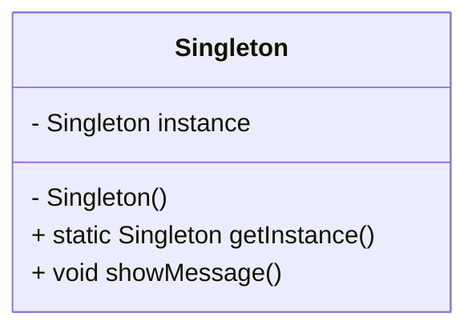
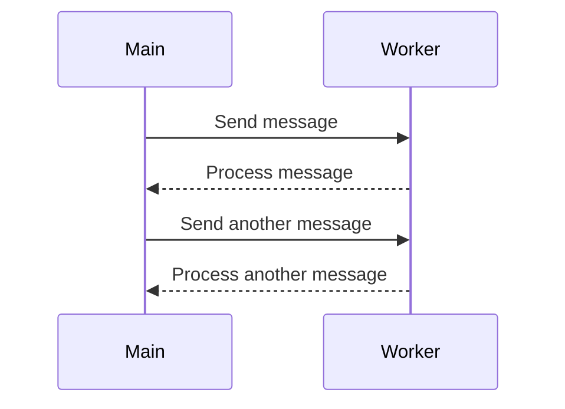

## 20.1 Recap of Key Concepts

As we conclude our journey through mastering design patterns in the D programming language, it's essential to revisit and reinforce the key concepts that have been covered. This recap will serve as a comprehensive summary, highlighting the importance of design patterns, the strengths of the D language, and how to integrate this knowledge into real-world applications.

### Summarizing Learnings

#### Design Patterns: Reinforcing the Importance and Application in D

Design patterns are proven solutions to common problems in software design. They provide a template for how to solve a problem in a way that is both reusable and adaptable to different situations. In the context of the D programming language, design patterns take on a unique flavor due to D's powerful features such as templates, mixins, and compile-time function execution.

**Key Design Patterns in D:**

1. **Creational Patterns**: These patterns deal with object creation mechanisms, trying to create objects in a manner suitable to the situation. In D, patterns like Singleton, Factory Method, and Builder are enhanced by the language's support for templates and mixins, allowing for more flexible and reusable code.

2. **Structural Patterns**: These patterns ease the design by identifying a simple way to realize relationships between entities. The Adapter, Composite, and Proxy patterns in D benefit from the language's ability to interface seamlessly with C and C++ code, as well as its powerful module system.

3. **Behavioral Patterns**: These patterns are concerned with algorithms and the assignment of responsibilities between objects. D's support for ranges and lazy evaluation makes patterns like Iterator and Observer particularly effective.

4. **Concurrency Patterns**: With D's robust concurrency model, patterns such as the Actor Model and Task-Based Concurrency are implemented efficiently, leveraging `std.concurrency` and `std.parallelism`.

**Code Example: Singleton Pattern in D**

```d
module singleton;

class Singleton {
    private static Singleton instance;
    private this() {} // Private constructor

    static Singleton getInstance() {
        if (instance is null) {
            instance = new Singleton();
        }
        return instance;
    }

    void showMessage() {
        writeln("Hello from Singleton!");
    }
}

void main() {
    auto singleton = Singleton.getInstance();
    singleton.showMessage();
}
```

> **Explanation**: This example demonstrates the Singleton pattern in D, ensuring that only one instance of the class is created.

#### D Language Strengths: Highlighting Features That Aid Development

The D programming language is uniquely positioned to leverage design patterns effectively due to its rich feature set. Here are some of the strengths that make D an excellent choice for advanced systems programming:

- **Templates and Mixins**: D's template system is more powerful than that of many other languages, allowing for compile-time polymorphism and code generation. Mixins enable embedding code within other code, facilitating metaprogramming.

- **Compile-Time Function Execution (CTFE)**: This feature allows functions to be executed at compile time, enabling optimizations and reducing runtime overhead.

- **Memory Safety**: With attributes like `@safe`, `@trusted`, and `@system`, D provides fine-grained control over memory safety, crucial for systems programming.

- **Concurrency and Parallelism**: D's standard library includes robust support for concurrency and parallelism, making it easier to write efficient, multi-threaded applications.

- **Interfacing with C and C++**: D can seamlessly interface with C and C++ code, allowing for easy integration with existing systems and libraries.

### Integration of Knowledge

#### Applying Patterns: Encouraging Thoughtful Use in Projects

The true power of design patterns lies in their thoughtful application. As expert developers, it's crucial to recognize when a pattern is appropriate and how it can be adapted to fit the specific needs of a project. Here are some guidelines for applying design patterns in D:

- **Understand the Problem**: Before selecting a pattern, ensure you fully understand the problem you're trying to solve. Patterns are not one-size-fits-all solutions.

- **Leverage D's Features**: Use D's unique features to enhance the implementation of design patterns. For example, use templates for creating flexible and reusable components.

- **Avoid Overengineering**: While design patterns are powerful, they can lead to unnecessary complexity if overused. Apply them judiciously.

- **Refactor and Iterate**: As your understanding of the problem evolves, be prepared to refactor your code and adapt the patterns you use.

#### Continuous Improvement: Adapting to New Challenges

The field of software development is constantly evolving, and staying current with new patterns, practices, and technologies is essential. Here are some strategies for continuous improvement:

- **Stay Informed**: Regularly read industry publications, attend conferences, and participate in online communities to stay up-to-date with the latest trends and best practices.

- **Experiment and Innovate**: Don't be afraid to experiment with new patterns and techniques. Innovation often comes from trying new approaches.

- **Learn from Others**: Collaborate with peers and learn from their experiences. Code reviews and pair programming are excellent opportunities for knowledge sharing.

- **Reflect and Adapt**: After completing a project, take the time to reflect on what worked well and what could be improved. Use these insights to adapt your approach in future projects.

### Visualizing Key Concepts

To further solidify your understanding, let's visualize some of the key concepts using diagrams.

#### Visualizing the Singleton Pattern



> **Description**: This class diagram illustrates the Singleton pattern, showing the private constructor and the static method used to access the single instance.

#### Visualizing D's Concurrency Model



> **Description**: This sequence diagram demonstrates message passing in D's concurrency model, highlighting the interaction between the main thread and a worker thread.

### References and Links

For further reading and deeper dives into the topics covered in this guide, consider the following resources:

- [D Language Documentation](https://dlang.org/)
- [Design Patterns: Elements of Reusable Object-Oriented Software](https://en.wikipedia.org/wiki/Design_Patterns)
- [Concurrency in D](https://dlang.org/phobos/std_concurrency.html)

### Knowledge Check

To reinforce your understanding, consider the following questions and challenges:

1. **Identify a Real-World Problem**: Think of a problem you've encountered in your projects. Which design pattern would be most suitable to solve it, and why?

2. **Experiment with Templates**: Modify the Singleton pattern example to use templates for creating different types of singletons.

3. **Concurrency Challenge**: Implement a simple producer-consumer model using D's `std.concurrency` module.

### Embrace the Journey

Remember, mastering design patterns in D is a continuous journey. As you progress, you'll build more complex and efficient systems. Keep experimenting, stay curious, and enjoy the process of learning and growing as a software engineer.

### Quiz Time!



### What is the primary purpose of design patterns in software development?

- [x] To provide reusable solutions to common problems
- [ ] To enforce strict coding standards
- [ ] To replace the need for documentation
- [ ] To eliminate the need for testing

> **Explanation:** Design patterns offer reusable solutions to common problems, helping developers create more efficient and maintainable code.

### Which D language feature allows functions to be executed at compile time?

- [x] Compile-Time Function Execution (CTFE)
- [ ] Mixins
- [ ] Templates
- [ ] Metaprogramming

> **Explanation:** CTFE allows functions to be executed at compile time, optimizing performance and reducing runtime overhead.

### How does the Singleton pattern ensure only one instance of a class is created?

- [x] By using a private constructor and a static method
- [ ] By using a public constructor
- [ ] By using multiple instances
- [ ] By using a global variable

> **Explanation:** The Singleton pattern uses a private constructor and a static method to control the creation of a single instance.

### What is a key benefit of using templates in D?

- [x] They enable compile-time polymorphism
- [ ] They simplify error handling
- [ ] They improve runtime performance
- [ ] They enforce memory safety

> **Explanation:** Templates in D enable compile-time polymorphism, allowing for flexible and reusable code.

### Which pattern is particularly effective in D due to its support for ranges and lazy evaluation?

- [x] Iterator Pattern
- [ ] Singleton Pattern
- [ ] Factory Method Pattern
- [ ] Observer Pattern

> **Explanation:** The Iterator pattern is effective in D due to its support for ranges and lazy evaluation, facilitating efficient data traversal.

### What is a potential pitfall of overusing design patterns?

- [x] Unnecessary complexity
- [ ] Improved code readability
- [ ] Enhanced performance
- [ ] Increased maintainability

> **Explanation:** Overusing design patterns can lead to unnecessary complexity, making the code harder to understand and maintain.

### How can D's mixins enhance the implementation of design patterns?

- [x] By enabling code generation and reuse
- [ ] By simplifying error handling
- [ ] By enforcing strict typing
- [ ] By improving runtime performance

> **Explanation:** Mixins in D enable code generation and reuse, enhancing the implementation of design patterns by reducing boilerplate code.

### What is the role of `std.concurrency` in D?

- [x] To facilitate message passing and concurrency
- [ ] To enforce memory safety
- [ ] To simplify error handling
- [ ] To improve compile-time performance

> **Explanation:** `std.concurrency` facilitates message passing and concurrency, allowing for efficient multi-threaded programming in D.

### Which attribute in D provides fine-grained control over memory safety?

- [x] `@safe`
- [ ] `@nogc`
- [ ] `nothrow`
- [ ] `pure`

> **Explanation:** The `@safe` attribute in D provides fine-grained control over memory safety, ensuring that code adheres to safe memory practices.

### True or False: D can seamlessly interface with C and C++ code.

- [x] True
- [ ] False

> **Explanation:** True. D can seamlessly interface with C and C++ code, allowing for easy integration with existing systems and libraries.



By revisiting these key concepts, you're well-equipped to apply design patterns in D effectively, leveraging the language's strengths to build high-performance, scalable, and maintainable software systems. Keep pushing the boundaries of what's possible with D, and continue to refine your skills as an expert software engineer and architect.
