## 20.2 The Future of D Programming Language

As we delve into the future of the D programming language, we explore its potential evolution, the growth of its community, and its place in the broader programming landscape. This section aims to provide expert software engineers and architects with insights into what lies ahead for D, equipping them with the knowledge to leverage D's capabilities in advanced systems programming.

### Language Evolution

The D programming language has always been at the forefront of innovation, combining the power of systems programming with modern language features. As we look to the future, several key areas of evolution are anticipated:

#### Upcoming Features

1. **Enhanced Metaprogramming Capabilities**: D is renowned for its metaprogramming prowess, and future enhancements are expected to further streamline compile-time code generation and manipulation. This includes more intuitive syntax for templates and mixins, making metaprogramming more accessible and powerful.

2. **Improved Concurrency Models**: With the increasing demand for concurrent and parallel processing, D is poised to enhance its concurrency models. This includes better support for asynchronous programming and improvements in the `std.concurrency` and `std.parallelism` modules to facilitate more efficient task management and execution.

3. **Advanced Memory Management**: While D already offers a robust garbage collector, future iterations may introduce more sophisticated memory management techniques, such as region-based memory management, to provide developers with greater control over memory allocation and deallocation.

4. **Expanded Standard Library**: The D standard library is expected to grow, incorporating more modules for common tasks, such as networking, data processing, and cryptography. This expansion will reduce the need for third-party libraries and enhance the language's out-of-the-box capabilities.

5. **Language Interoperability**: D's ability to interface with C and C++ is one of its strengths. Future developments may focus on improving interoperability with other languages, such as Rust and Python, to facilitate seamless integration in multi-language projects.

6. **Refined Error Handling**: Enhancements in error handling mechanisms, including more expressive exception types and better integration with functional programming paradigms, are anticipated to improve code robustness and maintainability.

7. **Tooling and IDE Support**: As the language evolves, so too will the tools that support it. Expect advancements in integrated development environments (IDEs) and build systems that offer better debugging, profiling, and code analysis capabilities.

### Community Growth

The strength of any programming language lies in its community. The D language community is vibrant and growing, with several initiatives aimed at fostering collaboration and innovation:

#### Contributions

1. **Open Source Development**: The D language is open source, and contributions from the community are vital to its evolution. Encouraging more developers to participate in the language's development will ensure that D continues to meet the needs of its users.

2. **Community Events and Conferences**: Events such as DConf provide a platform for developers to share their experiences, learn from each other, and discuss the future direction of the language. These gatherings are crucial for building a sense of community and driving innovation.

3. **Educational Resources**: As more developers adopt D, the demand for educational resources grows. Community-driven initiatives to create tutorials, documentation, and courses will play a significant role in lowering the barrier to entry for new users.

4. **Mentorship Programs**: Establishing mentorship programs can help new developers get up to speed with D more quickly. Experienced developers can guide newcomers, sharing best practices and insights gained from real-world projects.

5. **Online Forums and Collaboration Platforms**: Platforms like Reddit, Discord, and GitHub provide spaces for developers to collaborate, ask questions, and share knowledge. These forums are invaluable for fostering a collaborative and supportive community.

### Industry Trends

The programming landscape is constantly evolving, and D is well-positioned to adapt to and influence these changes:

#### Adoption

1. **Systems Programming**: D's combination of low-level control and high-level abstractions makes it ideal for systems programming. As industries continue to demand high-performance, scalable systems, D's adoption in this domain is likely to increase.

2. **Game Development**: With its powerful metaprogramming capabilities and efficient memory management, D is gaining traction in the game development industry. Its ability to interface with C++ makes it a strong candidate for game engines and performance-critical applications.

3. **Scientific Computing**: D's support for numerical computing and its ability to handle large datasets efficiently make it a suitable choice for scientific applications. As the demand for data-driven solutions grows, D's role in scientific computing is expected to expand.

4. **Web Development**: Frameworks like Vibe.d demonstrate D's potential in web development. As more developers seek alternatives to traditional web technologies, D's performance and concurrency features make it an attractive option for building high-performance web applications.

5. **Embedded Systems**: D's ability to produce efficient, low-level code makes it suitable for embedded systems programming. As the Internet of Things (IoT) continues to grow, D's role in developing firmware and embedded applications is likely to increase.

6. **Cross-Platform Development**: D's cross-platform capabilities allow developers to write code that runs on multiple operating systems with minimal changes. This feature is particularly valuable in today's diverse computing environments.

### Visualizing D's Future

To better understand the future trajectory of the D programming language, let's visualize its evolution, community growth, and industry trends using a flowchart.

```mermaid
flowchart TD
    A[Language Evolution] --> B[Enhanced Metaprogramming]
    A --> C[Improved Concurrency Models]
    A --> D[Advanced Memory Management]
    A --> E[Expanded Standard Library]
    A --> F[Language Interoperability]
    A --> G[Refined Error Handling]
    A --> H[Tooling and IDE Support]
    
    I[Community Growth] --> J[Open Source Development]
    I --> K[Community Events and Conferences]
    I --> L[Educational Resources]
    I --> M[Mentorship Programs]
    I --> N[Online Forums and Collaboration Platforms]
    
    O[Industry Trends] --> P[Systems Programming]
    O --> Q[Game Development]
    O --> R[Scientific Computing]
    O --> S[Web Development]
    O --> T[Embedded Systems]
    O --> U[Cross-Platform Development]
```

### Try It Yourself

To truly grasp the potential of D's future, we encourage you to experiment with the language. Try implementing a small project using D's metaprogramming features or explore its concurrency models. Modify existing code examples to see how different features interact and enhance your understanding of D's capabilities.

### References and Links

For further reading and to stay updated on the latest developments in the D programming language, consider exploring the following resources:

- [D Language Official Website](https://dlang.org/)
- [D Language GitHub Repository](https://github.com/dlang)
- [DConf - The D Programming Language Conference](https://dconf.org/)
- [Vibe.d Web Framework](https://vibed.org/)

### Knowledge Check

Before we conclude, let's reinforce our understanding of the future of D with a few questions:

1. What are some anticipated features in the future evolution of the D programming language?
2. How can the community contribute to the growth of the D language?
3. In which industries is D expected to see increased adoption?
4. What role do community events play in the development of the D language?
5. How does D's ability to interface with other languages impact its future?

### Embrace the Journey

As we look to the future of the D programming language, remember that this is just the beginning. The language's evolution, community growth, and industry trends all point to a bright future for D. Keep experimenting, stay curious, and enjoy the journey as you explore the full potential of D in advanced systems programming.

## Quiz Time!



### What is one of the anticipated future features of the D programming language?

- [x] Enhanced metaprogramming capabilities
- [ ] Removal of garbage collection
- [ ] Elimination of templates
- [ ] Discontinuation of concurrency support

> **Explanation:** Enhanced metaprogramming capabilities are expected to streamline compile-time code generation and manipulation in future versions of D.

### How can the community contribute to the growth of the D language?

- [x] By participating in open source development
- [ ] By avoiding community events
- [ ] By discouraging new developers
- [ ] By limiting educational resources

> **Explanation:** Community contributions through open source development, events, and educational resources are vital for the growth of the D language.

### In which industry is D expected to see increased adoption due to its metaprogramming capabilities?

- [x] Game Development
- [ ] Textile Manufacturing
- [ ] Agriculture
- [ ] Retail

> **Explanation:** D's metaprogramming capabilities make it suitable for game development, where performance and efficiency are critical.

### What role do community events play in the development of the D language?

- [x] They provide a platform for sharing experiences and discussing the language's future.
- [ ] They discourage collaboration.
- [ ] They focus solely on marketing.
- [ ] They are unrelated to language development.

> **Explanation:** Community events like DConf allow developers to share experiences, learn from each other, and discuss the future direction of the language.

### How does D's ability to interface with other languages impact its future?

- [x] It facilitates seamless integration in multi-language projects.
- [ ] It restricts the language's capabilities.
- [ ] It makes the language less versatile.
- [ ] It complicates the development process.

> **Explanation:** D's interoperability with other languages allows for seamless integration in multi-language projects, enhancing its versatility and adoption.

### What is a potential benefit of D's improved concurrency models?

- [x] More efficient task management and execution
- [ ] Increased complexity in code
- [ ] Reduced performance
- [ ] Limited scalability

> **Explanation:** Improved concurrency models in D are expected to facilitate more efficient task management and execution, enhancing performance and scalability.

### Why is D's expanded standard library important for its future?

- [x] It reduces the need for third-party libraries.
- [ ] It increases dependency on external tools.
- [ ] It complicates the language's syntax.
- [ ] It limits the language's functionality.

> **Explanation:** An expanded standard library provides more modules for common tasks, reducing the need for third-party libraries and enhancing D's out-of-the-box capabilities.

### What is a key factor in D's potential growth in scientific computing?

- [x] Its support for numerical computing and efficient data handling
- [ ] Its lack of support for large datasets
- [ ] Its focus on graphical user interfaces
- [ ] Its limited mathematical functions

> **Explanation:** D's support for numerical computing and efficient data handling makes it suitable for scientific applications, contributing to its growth in this field.

### How does D's cross-platform capability benefit developers?

- [x] It allows code to run on multiple operating systems with minimal changes.
- [ ] It restricts code to a single platform.
- [ ] It complicates the development process.
- [ ] It limits the language's versatility.

> **Explanation:** D's cross-platform capabilities enable developers to write code that runs on multiple operating systems with minimal changes, enhancing versatility and efficiency.

### True or False: D's future developments are expected to focus solely on high-level abstractions.

- [ ] True
- [x] False

> **Explanation:** D's future developments are expected to balance both low-level control and high-level abstractions, maintaining its versatility in systems programming.



