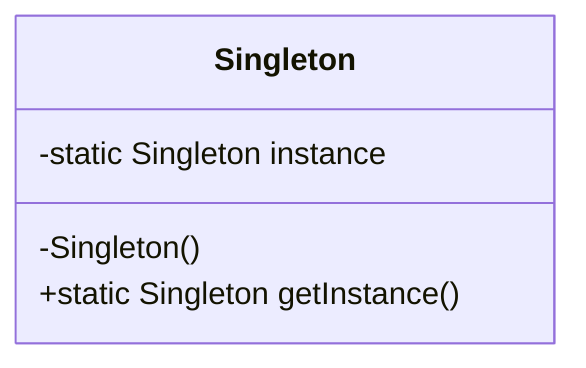

## 20.3 Continuing Education and Resources

As expert software engineers and architects, the journey of mastering design patterns in the D programming language is both exciting and ongoing. Staying updated with the latest advancements, best practices, and community insights is crucial for maintaining a competitive edge. This section provides a comprehensive guide to continuing education and resources that will empower you to deepen your understanding and application of design patterns in D.

### Learning Materials

#### Books and Tutorials

Books and tutorials are invaluable resources for gaining in-depth knowledge and practical insights into design patterns and the D programming language. Here are some recommended readings:

1. **"The D Programming Language" by Andrei Alexandrescu**: This book is a definitive guide to the D language, written by one of its creators. It covers the language's features, idioms, and best practices, making it an essential read for anyone serious about D programming.

2. **"Design Patterns: Elements of Reusable Object-Oriented Software" by Erich Gamma, Richard Helm, Ralph Johnson, and John Vlissides**: Known as the "Gang of Four" book, this classic text introduces the concept of design patterns and provides a catalog of 23 patterns that have become foundational in software design.

3. **"Programming in D" by Ali Çehreli**: This book offers a comprehensive introduction to D, with a focus on practical examples and exercises. It is particularly useful for those transitioning from other programming languages.

4. **Online Tutorials and Documentation**: Websites like [Dlang.org](https://dlang.org/) provide extensive documentation and tutorials that cover various aspects of the D language, including design patterns, concurrency, and systems programming.

#### Online Courses

Online courses offer structured learning experiences that can help you master design patterns in D at your own pace. Consider the following platforms:

1. **Coursera and edX**: These platforms offer courses on software design and architecture that include modules on design patterns. While not specific to D, the principles taught can be applied to D programming.

2. **Udemy and Pluralsight**: Look for courses specifically focused on D programming. These courses often include video lectures, hands-on exercises, and quizzes to reinforce learning.

3. **YouTube Channels**: Channels like "D Programming Language" and "Ali Çehreli" provide free video tutorials and lectures on various D programming topics, including design patterns.

### Community Engagement

Engaging with the community is a powerful way to enhance your learning experience. By participating in forums, discussions, conferences, and meetups, you can share knowledge, ask questions, and network with peers.

#### Forums and Discussions

1. **Dlang Forum**: The official D programming language forum is a vibrant community where you can ask questions, share insights, and discuss the latest developments in D programming.

2. **Reddit's r/d_language**: This subreddit is a great place to engage with other D enthusiasts, share projects, and get feedback on your work.

3. **Stack Overflow**: While not specific to D, Stack Overflow has a dedicated tag for D programming where you can find answers to technical questions and contribute your expertise.

#### Conferences and Meetups

1. **DConf**: The annual D programming language conference is an excellent opportunity to learn from experts, attend workshops, and network with other D developers.

2. **Local Meetups**: Check platforms like Meetup.com for local D programming meetups in your area. These events provide a chance to connect with other developers and share experiences.

3. **Online Webinars and Workshops**: Many organizations and communities host online events that focus on design patterns, systems programming, and the D language. These events are accessible from anywhere and often feature industry experts.

### Code Examples and Experimentation

To solidify your understanding of design patterns in D, it's essential to practice by writing and experimenting with code. Here are some tips for effective experimentation:

- **Start with Simple Examples**: Begin by implementing basic design patterns, such as Singleton or Factory Method, in D. Use these implementations as a foundation for more complex patterns.

- **Modify and Extend Code**: Once you have a basic implementation, try modifying it to add new features or improve performance. This will help you understand the flexibility and limitations of each pattern.

- **Collaborate with Peers**: Share your code with peers or mentors and seek feedback. Collaborative coding can lead to new insights and improvements.

- **Participate in Open Source Projects**: Contributing to open source projects written in D is a great way to apply your skills in real-world scenarios and learn from experienced developers.

### Visualizing Design Patterns

Visual aids can enhance your understanding of design patterns and their applications. Consider using tools like Mermaid.js to create diagrams that illustrate the structure and flow of your code. Here is an example of how you might visualize the Singleton pattern:

**Description**: This class diagram represents the Singleton pattern, where a single instance of a class is created and accessed through a static method.

### References and Links

To further your learning, explore these reputable external resources:

- **[Dlang.org](https://dlang.org/)**: The official website for the D programming language, offering documentation, tutorials, and community links.

- **[GitHub](https://github.com/dlang)**: Explore the D language's official repositories and contribute to open source projects.

- **[MDN Web Docs](https://developer.mozilla.org/)**: While focused on web technologies, MDN provides excellent resources on general programming concepts that can be applied to D.

### Knowledge Check

To reinforce your learning, consider these questions and challenges:

- **What are the key differences between the Factory Method and Abstract Factory patterns?**

- **Implement a simple Observer pattern in D and explain how it can be used in a real-world application.**

- **How can you leverage D's metaprogramming capabilities to enhance the flexibility of design patterns?**

### Embrace the Journey

Remember, mastering design patterns in D is a journey, not a destination. Stay curious, keep experimenting, and don't hesitate to reach out to the community for support. As you continue to learn and grow, you'll find new ways to apply design patterns to create high-performance, scalable, and maintainable software systems.

## Quiz Time!



### What is a recommended book for learning the D programming language?

- [x] "The D Programming Language" by Andrei Alexandrescu
- [ ] "JavaScript: The Good Parts" by Douglas Crockford
- [ ] "Clean Code" by Robert C. Martin
- [ ] "Effective Java" by Joshua Bloch

> **Explanation:** "The D Programming Language" by Andrei Alexandrescu is a definitive guide to the D language, written by one of its creators.

### Which online platform offers courses specifically focused on D programming?

- [ ] Coursera
- [ ] edX
- [x] Udemy
- [ ] Khan Academy

> **Explanation:** Udemy offers courses specifically focused on D programming, providing video lectures and hands-on exercises.

### What is the official forum for the D programming language community?

- [ ] Stack Overflow
- [x] Dlang Forum
- [ ] Reddit
- [ ] GitHub

> **Explanation:** The Dlang Forum is the official forum for the D programming language community.

### Which conference is dedicated to the D programming language?

- [ ] JavaOne
- [ ] PyCon
- [x] DConf
- [ ] WWDC

> **Explanation:** DConf is the annual conference dedicated to the D programming language.

### What is a benefit of participating in open source projects written in D?

- [x] Applying skills in real-world scenarios
- [ ] Learning a new programming language
- [ ] Earning a certification
- [ ] Receiving financial compensation

> **Explanation:** Contributing to open source projects written in D allows you to apply your skills in real-world scenarios and learn from experienced developers.

### Which tool can be used to create diagrams for visualizing design patterns?

- [x] Mermaid.js
- [ ] Photoshop
- [ ] Excel
- [ ] PowerPoint

> **Explanation:** Mermaid.js is a tool that can be used to create diagrams for visualizing design patterns.

### What is a key feature of the Singleton pattern?

- [x] Ensures a class has only one instance
- [ ] Allows multiple instances of a class
- [ ] Facilitates communication between objects
- [ ] Provides a way to create objects

> **Explanation:** The Singleton pattern ensures a class has only one instance and provides a global point of access to it.

### Which subreddit is dedicated to discussions about the D programming language?

- [ ] r/programming
- [x] r/d_language
- [ ] r/coding
- [ ] r/softwaredevelopment

> **Explanation:** r/d_language is a subreddit dedicated to discussions about the D programming language.

### What is a common use case for the Observer pattern?

- [x] Implementing event-driven systems
- [ ] Managing memory allocation
- [ ] Optimizing performance
- [ ] Securing data transmission

> **Explanation:** The Observer pattern is commonly used to implement event-driven systems where objects need to be notified of changes in other objects.

### True or False: Engaging with the community is not necessary for mastering design patterns in D.

- [ ] True
- [x] False

> **Explanation:** Engaging with the community is crucial for mastering design patterns in D, as it provides opportunities to share knowledge, ask questions, and network with peers.


