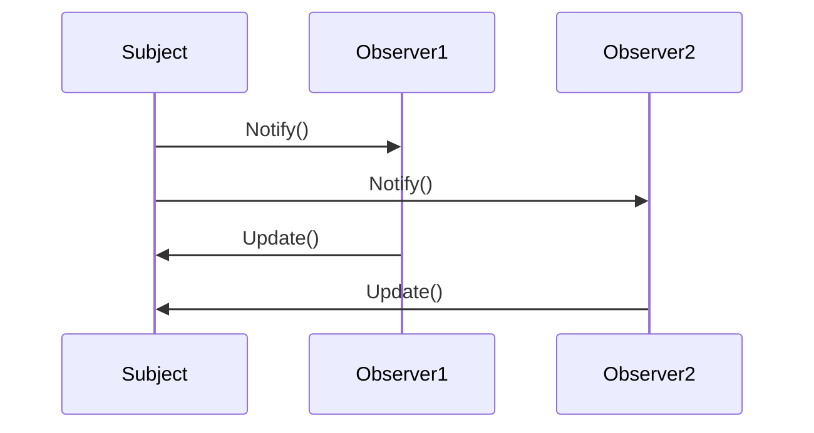

## 20.4 Final Thoughts on Design Patterns in D

As we conclude our comprehensive exploration of design patterns in the D programming language, it's essential to reflect on the journey we've undertaken and the insights we've gained. Design patterns are not just abstract concepts; they are powerful tools that enable us to solve complex problems, enhance code maintainability, and foster collaboration among developers. In this final section, we will delve into the importance of design patterns, the adaptability of these patterns to meet specific needs, and the encouragement to embrace continuous learning and contribute to the community.

### Importance of Patterns

#### Problem-Solving Tools

Design patterns serve as a toolkit for software engineers, providing tried-and-tested solutions to common challenges encountered in software development. By leveraging these patterns, developers can avoid reinventing the wheel and instead focus on crafting robust and efficient systems. The D programming language, with its unique features like templates, mixins, and compile-time function execution, offers a fertile ground for implementing these patterns effectively.

Consider the Singleton pattern, a creational pattern that ensures a class has only one instance and provides a global point of access to it. In D, this pattern can be elegantly implemented using templates and static constructors, as shown in the following example:

```d
module singletonExample;

// Singleton class
class Singleton {
    private static Singleton instance;

    // Private constructor to prevent instantiation
    private this() {}

    // Static method to get the instance
    static Singleton getInstance() {
        if (instance is null) {
            instance = new Singleton();
        }
        return instance;
    }
}

void main() {
    auto singleton1 = Singleton.getInstance();
    auto singleton2 = Singleton.getInstance();

    assert(singleton1 is singleton2); // Both references point to the same instance
}
```

In this example, the Singleton pattern is implemented using a static method `getInstance`, which ensures that only one instance of the `Singleton` class is created. This pattern is particularly useful in scenarios where a single point of control is needed, such as managing a connection pool or a configuration manager.

#### Visualizing Design Patterns

To further illustrate the role of design patterns, let's visualize the interaction between objects in a typical Observer pattern scenario using a Mermaid.js sequence diagram:



In this diagram, the `Subject` notifies its observers (`Observer1` and `Observer2`) of a change, and each observer updates itself accordingly. This pattern is invaluable in event-driven systems where changes in one part of the system need to be communicated to other parts.

### Adapting Patterns

#### Customization

While design patterns provide a solid foundation, they are not one-size-fits-all solutions. The true power of patterns lies in their adaptability. As expert developers, we must be adept at customizing patterns to suit the specific needs of our projects. This involves understanding the underlying principles of each pattern and applying them creatively to address unique challenges.

For instance, the Factory Method pattern can be customized to accommodate different product hierarchies. In D, we can leverage templates to create a flexible factory method that can produce various types of objects based on the input parameters:

```d
module factoryMethodExample;

// Product interface
interface Product {
    void use();
}

// Concrete Product A
class ProductA : Product {
    override void use() {
        writeln("Using Product A");
    }
}

// Concrete Product B
class ProductB : Product {
    override void use() {
        writeln("Using Product B");
    }
}

// Factory Method
Product createProduct(string type) {
    static if (type == "A") {
        return new ProductA();
    } else static if (type == "B") {
        return new ProductB();
    } else {
        throw new Exception("Unknown product type");
    }
}

void main() {
    auto productA = createProduct("A");
    productA.use();

    auto productB = createProduct("B");
    productB.use();
}
```

In this example, the `createProduct` function uses compile-time conditions to determine which product to instantiate. This approach allows for easy extension and modification of the factory method to support new product types.

### Encouragement

#### Personal Growth

The journey of mastering design patterns in D is not just about acquiring technical skills; it's about personal growth and embracing continuous learning. As technology evolves, so do the challenges we face as software engineers. Staying updated with the latest trends and advancements in the field is crucial for maintaining our expertise and delivering high-quality solutions.

We encourage you to explore beyond the patterns covered in this guide. Experiment with new patterns, adapt existing ones, and even create your own. The D programming language offers a rich set of features that can be harnessed to push the boundaries of what's possible in software design.

#### Contribution

As you grow in your understanding of design patterns, consider sharing your insights and experiences with the community. Contributing to open-source projects, writing blog posts, or presenting at conferences are excellent ways to give back and inspire others. By sharing knowledge, we collectively elevate the field of software engineering and foster a culture of collaboration and innovation.

### Try It Yourself

To solidify your understanding of design patterns in D, we encourage you to experiment with the code examples provided in this guide. Try modifying the Singleton pattern to support lazy initialization or adapt the Factory Method pattern to include additional product types. By actively engaging with the material, you'll gain a deeper appreciation for the power and flexibility of design patterns.

### Knowledge Check

Before we conclude, let's reinforce our learning with a few questions:

- How can design patterns enhance code maintainability?
- In what scenarios would you use the Singleton pattern?
- How can you customize the Factory Method pattern to support new product types?

### Embrace the Journey

Remember, this is just the beginning. As you progress, you'll build more complex and scalable systems using design patterns in D. Keep experimenting, stay curious, and enjoy the journey!

### Quiz Time!



### What is the primary benefit of using design patterns in software development?

- [x] They provide proven solutions to common problems.
- [ ] They eliminate the need for testing.
- [ ] They make code execution faster.
- [ ] They reduce the need for documentation.

> **Explanation:** Design patterns offer established solutions to recurring problems, enhancing code reliability and maintainability.

### How does the Singleton pattern ensure only one instance of a class is created?

- [x] By using a private constructor and a static method.
- [ ] By using multiple constructors.
- [ ] By creating a new instance every time.
- [ ] By using global variables.

> **Explanation:** The Singleton pattern uses a private constructor to prevent direct instantiation and a static method to control instance creation.

### What feature of D can be used to customize the Factory Method pattern?

- [x] Templates and compile-time conditions.
- [ ] Inline assembly.
- [ ] Garbage collection.
- [ ] Dynamic arrays.

> **Explanation:** D's templates and compile-time conditions allow for flexible and customizable factory methods.

### What is a key advantage of adapting design patterns to specific needs?

- [x] It allows for more tailored and efficient solutions.
- [ ] It makes patterns less reliable.
- [ ] It complicates the code unnecessarily.
- [ ] It reduces code readability.

> **Explanation:** Adapting patterns ensures they meet the unique requirements of a project, leading to more effective solutions.

### How can developers contribute to the community after mastering design patterns?

- [x] By sharing insights and experiences.
- [ ] By keeping knowledge to themselves.
- [ ] By avoiding open-source projects.
- [ ] By not participating in conferences.

> **Explanation:** Sharing knowledge through contributions to open-source projects, writing, and speaking helps advance the community.

### What is the role of design patterns in event-driven systems?

- [x] They facilitate communication between different parts of the system.
- [ ] They slow down event processing.
- [ ] They eliminate the need for event handling.
- [ ] They make systems less responsive.

> **Explanation:** Patterns like Observer enhance communication and coordination in event-driven architectures.

### Why is continuous learning important for software engineers?

- [x] To stay updated with evolving technologies and challenges.
- [ ] To avoid learning new things.
- [ ] To maintain outdated skills.
- [ ] To reduce career growth opportunities.

> **Explanation:** Continuous learning ensures engineers remain proficient and adaptable in a rapidly changing field.

### What is a potential outcome of overusing design patterns?

- [x] Increased complexity and reduced code clarity.
- [ ] Simplified code and enhanced clarity.
- [ ] Elimination of all bugs.
- [ ] Faster code execution.

> **Explanation:** Overusing patterns can lead to unnecessary complexity, making code harder to understand and maintain.

### How can design patterns contribute to code scalability?

- [x] By providing a structured approach to handle growth.
- [ ] By limiting the ability to scale.
- [ ] By making code rigid and inflexible.
- [ ] By reducing the need for future changes.

> **Explanation:** Patterns offer frameworks that accommodate growth and change, supporting scalable architectures.

### True or False: Design patterns are only applicable to object-oriented programming.

- [ ] True
- [x] False

> **Explanation:** While many patterns originate from object-oriented programming, they can be adapted to other paradigms, including functional and procedural programming.



By embracing design patterns, adapting them to our needs, and sharing our knowledge, we contribute to a vibrant and innovative software engineering community. Let's continue to explore, learn, and grow together.
