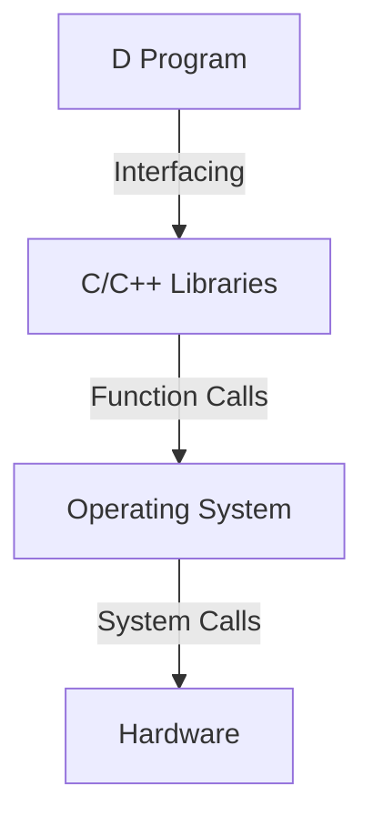

## 21.10 Comparison of D with Other Languages

The D programming language is a powerful tool for systems programming and software architecture, offering a unique blend of features that set it apart from other languages. In this section, we will explore how D compares to other popular programming languages, focusing on its language features, use cases, and suitability for various projects. By understanding these comparisons, expert software engineers and architects can make informed decisions about when to choose D for their projects.

### Language Features

#### Similarities and Differences: Understanding D in Context

D is often compared to languages like C++, Java, Rust, and Go due to its systems programming capabilities and modern language features. Let's delve into the similarities and differences between D and these languages.

##### D vs. C++

**Similarities:**

- **Systems Programming:** Both D and C++ are designed for systems programming, offering low-level access to memory and hardware.
- **Object-Oriented Programming (OOP):** Both languages support OOP, allowing developers to create classes, interfaces, and inheritance hierarchies.
- **Templates and Generics:** D and C++ both provide powerful template systems for generic programming.

**Differences:**

- **Memory Safety:** D offers optional garbage collection and memory safety features (`@safe`, `@trusted`, `@system`), whereas C++ relies on manual memory management.
- **Compile-Time Features:** D supports compile-time function execution (CTFE) and metaprogramming with mixins, which are more advanced than C++'s template metaprogramming.
- **Simplicity and Readability:** D aims for simplicity and readability, reducing the complexity often associated with C++.

##### D vs. Java

**Similarities:**

- **Garbage Collection:** Both D and Java use garbage collection to manage memory automatically.
- **Cross-Platform Support:** Both languages are designed to be cross-platform, running on various operating systems.

**Differences:**

- **Performance:** D offers better performance for systems programming due to its ability to write low-level code and optimize performance-critical sections.
- **Compile-Time Features:** D's compile-time features, such as CTFE and mixins, provide more flexibility and power than Java's reflection and annotations.
- **Concurrency:** D provides more advanced concurrency primitives, such as fibers and message passing, compared to Java's thread-based model.

##### D vs. Rust

**Similarities:**

- **Memory Safety:** Both D and Rust emphasize memory safety, with D offering optional safety features and Rust enforcing strict safety rules.
- **Systems Programming:** Both languages are suitable for systems programming, providing low-level access and performance optimization.

**Differences:**

- **Ease of Use:** D is generally easier to learn and use, with a simpler syntax and more familiar programming model for developers coming from C++ or Java.
- **Garbage Collection:** D includes a garbage collector, while Rust relies on ownership and borrowing for memory management.
- **Metaprogramming:** D's metaprogramming capabilities with templates and mixins are more advanced than Rust's procedural macros.

##### D vs. Go

**Similarities:**

- **Concurrency:** Both D and Go provide strong support for concurrency, with D offering fibers and message passing and Go using goroutines and channels.
- **Simplicity:** Both languages prioritize simplicity and readability in their syntax and design.

**Differences:**

- **Performance:** D offers better performance for systems programming due to its ability to write low-level code and optimize performance-critical sections.
- **Compile-Time Features:** D's compile-time features, such as CTFE and mixins, provide more flexibility and power than Go's limited compile-time capabilities.
- **Memory Management:** D includes a garbage collector, while Go's garbage collector is more advanced and optimized for concurrent workloads.

### Use Case Evaluation

#### When to Choose D: Assessing Project Suitability

Choosing the right programming language for a project is crucial for its success. Let's explore when D is the most suitable choice and how it compares to other languages in various scenarios.

##### High-Performance Systems Programming

D is an excellent choice for high-performance systems programming due to its low-level access, performance optimization capabilities, and optional memory safety features. It is particularly suitable for:

- **Operating Systems and Kernels:** D's ability to interface with C and C++ code makes it ideal for developing operating systems and kernel modules.
- **Embedded Systems:** D's low-level capabilities and performance optimizations make it suitable for embedded systems programming.
- **Network and Protocol Development:** D's concurrency features and performance optimizations make it a strong candidate for network programming and protocol implementation.

##### Modern Software Architecture

D's modern language features, such as templates, mixins, and compile-time function execution, make it a great choice for modern software architecture. It is particularly suitable for:

- **Domain-Specific Languages (DSLs):** D's metaprogramming capabilities allow for the creation of powerful DSLs tailored to specific domains.
- **Concurrent Frameworks:** D's concurrency features make it ideal for developing concurrent frameworks and libraries.
- **Cross-Platform Applications:** D's cross-platform support and ability to interface with C and C++ code make it suitable for developing cross-platform applications.

##### Real-World Case Studies

To illustrate D's suitability for various projects, let's explore some real-world case studies:

- **High-Performance Web Server:** D's performance optimizations and concurrency features make it an excellent choice for building high-performance web servers.
- **Game Development:** D's low-level access and performance optimizations make it suitable for game development, where performance is critical.
- **Scientific Computing:** D's ability to interface with C and C++ libraries makes it a strong candidate for scientific computing and numerical analysis.

### Code Examples

To further illustrate D's capabilities, let's explore some code examples that highlight its unique features.

#### Example 1: Compile-Time Function Execution (CTFE)

```d
import std.stdio;

// Compile-time function to calculate factorial
int factorial(int n) {
    return n <= 1 ? 1 : n * factorial(n - 1);
}

void main() {
    // Compile-time calculation of factorial
    enum fact5 = factorial(5);
    writeln("Factorial of 5 is ", fact5); // Output: Factorial of 5 is 120
}
```

**Explanation:** This example demonstrates D's compile-time function execution, allowing us to calculate the factorial of a number at compile time.

#### Example 2: Concurrency with Fibers

```d
import std.concurrency;
import std.stdio;

// Function to run in a fiber
void fiberFunction() {
    writeln("Hello from fiber!");
}

void main() {
    // Create and run a fiber
    auto fiber = new Fiber(&fiberFunction);
    fiber.call();
    writeln("Hello from main!");
}
```

**Explanation:** This example demonstrates D's concurrency capabilities using fibers, allowing us to run functions concurrently.

### Visualizing D's Interaction with Other Languages

To better understand how D interacts with other languages, let's visualize its interaction with C and C++ code.



**Diagram Description:** This flowchart illustrates how a D program can interface with C and C++ libraries, making function calls to the operating system and interacting with hardware.

### References and Links

For further reading on the D programming language and its comparison with other languages, consider the following resources:

- [D Language Official Website](https://dlang.org/)
- [C++ Reference](https://en.cppreference.com/)
- [Java Documentation](https://docs.oracle.com/en/java/)
- [Rust Programming Language](https://www.rust-lang.org/)
- [Go Programming Language](https://golang.org/)

### Knowledge Check

To reinforce your understanding of D's comparison with other languages, consider the following questions:

1. What are the key differences between D and C++ in terms of memory management?
2. How does D's compile-time function execution (CTFE) compare to Java's reflection capabilities?
3. In what scenarios is D more suitable than Rust for systems programming?
4. How does D's concurrency model differ from Go's goroutines and channels?
5. What are the advantages of using D for developing domain-specific languages (DSLs)?

### Embrace the Journey

Remember, this is just the beginning of your journey with the D programming language. As you explore its unique features and capabilities, you'll discover new ways to leverage its power for your projects. Keep experimenting, stay curious, and enjoy the journey!

## Quiz Time!



### What is a key advantage of D over C++ in terms of memory management?

- [x] Optional garbage collection
- [ ] Mandatory garbage collection
- [ ] No garbage collection
- [ ] Only manual memory management

> **Explanation:** D offers optional garbage collection, providing flexibility in memory management.

### How does D's compile-time function execution (CTFE) enhance its capabilities?

- [x] Allows calculations at compile time
- [ ] Enables runtime reflection
- [ ] Provides dynamic typing
- [ ] Supports only runtime execution

> **Explanation:** CTFE allows D to perform calculations at compile time, enhancing performance and flexibility.

### In what scenario is D more suitable than Rust?

- [x] When ease of use and familiar syntax are priorities
- [ ] When strict memory safety is required
- [ ] When no garbage collection is desired
- [ ] When procedural macros are needed

> **Explanation:** D is more suitable when ease of use and familiar syntax are priorities, as it is generally easier to learn and use than Rust.

### What concurrency model does D use?

- [x] Fibers and message passing
- [ ] Threads and locks
- [ ] Goroutines and channels
- [ ] Asynchronous callbacks

> **Explanation:** D uses fibers and message passing for concurrency, providing advanced concurrency primitives.

### Which feature makes D suitable for developing domain-specific languages (DSLs)?

- [x] Metaprogramming with templates and mixins
- [ ] Dynamic typing
- [ ] Reflection and annotations
- [ ] Procedural macros

> **Explanation:** D's metaprogramming capabilities with templates and mixins make it suitable for developing DSLs.

### How does D's performance compare to Java's for systems programming?

- [x] D offers better performance
- [ ] Java offers better performance
- [ ] Both have similar performance
- [ ] Performance is not a consideration

> **Explanation:** D offers better performance for systems programming due to its low-level access and optimization capabilities.

### What is a key difference between D and Go in terms of memory management?

- [x] D includes a garbage collector, while Go's is more advanced
- [ ] Both use manual memory management
- [ ] Go includes a garbage collector, while D's is more advanced
- [ ] Neither uses a garbage collector

> **Explanation:** D includes a garbage collector, while Go's garbage collector is more advanced and optimized for concurrent workloads.

### What is a benefit of using D for high-performance web servers?

- [x] Performance optimizations and concurrency features
- [ ] Dynamic typing and reflection
- [ ] Built-in web server libraries
- [ ] No concurrency support

> **Explanation:** D's performance optimizations and concurrency features make it suitable for high-performance web servers.

### Which language feature allows D to interface with C and C++ code?

- [x] Interfacing capabilities
- [ ] Dynamic typing
- [ ] Reflection and annotations
- [ ] Procedural macros

> **Explanation:** D's interfacing capabilities allow it to interface with C and C++ code, making it suitable for systems programming.

### True or False: D is generally easier to learn and use than Rust.

- [x] True
- [ ] False

> **Explanation:** D is generally easier to learn and use than Rust, with a simpler syntax and more familiar programming model.


