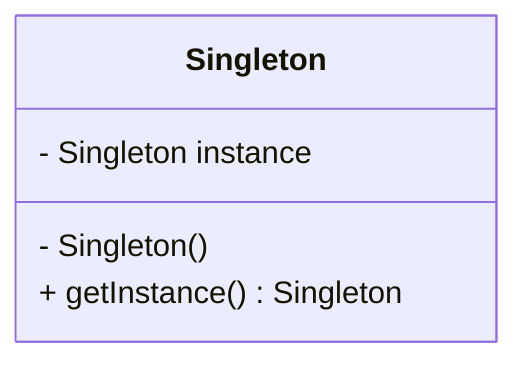
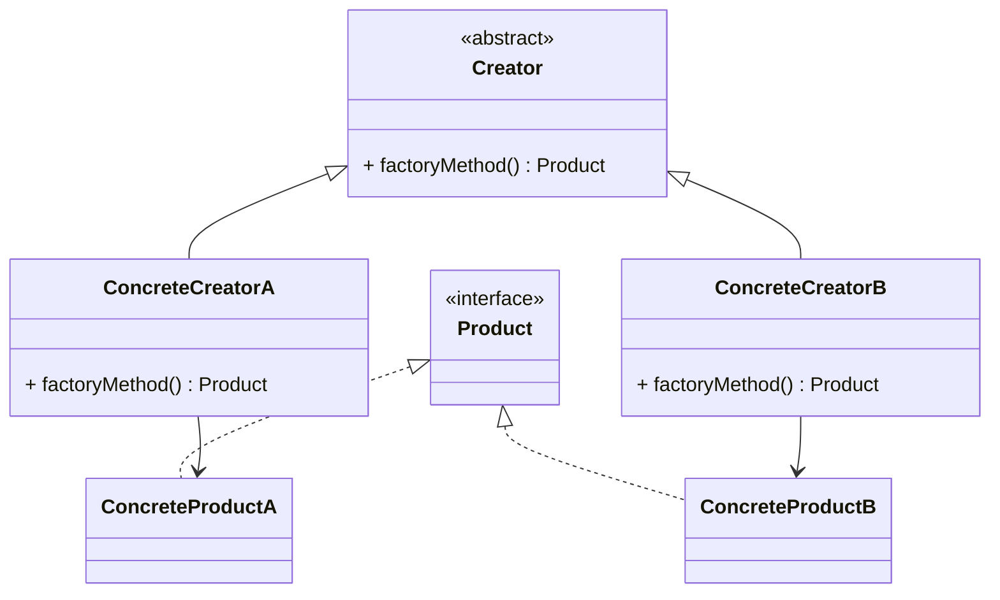
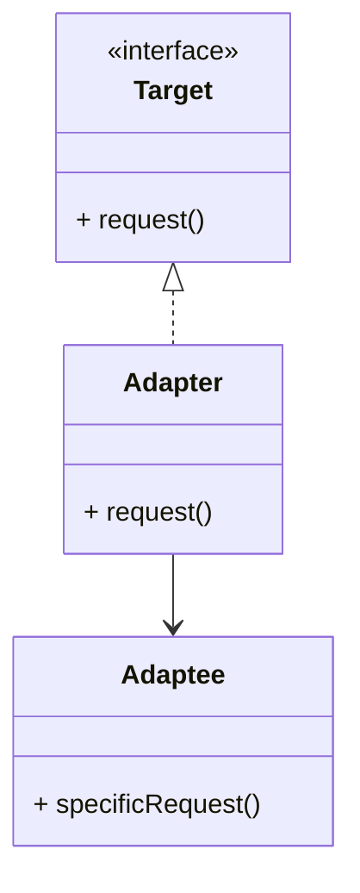

## 21.3 Design Pattern Reference Cheat Sheet

Welcome to the Design Pattern Reference Cheat Sheet, a comprehensive guide tailored for expert software engineers and architects working with the D programming language. This section provides a quick reference to various design patterns, complete with UML diagrams, pattern summaries, and implementation tips. Our goal is to help you leverage these patterns effectively in your systems programming projects.

### Quick Reference

#### UML Diagrams

UML (Unified Modeling Language) diagrams are essential tools for visualizing the structure and behavior of design patterns. In this section, we will use Hugo-compatible Mermaid.js diagrams to illustrate each pattern.

#### Pattern Summaries

Each design pattern is summarized with its intent, key participants, and applicability. This will help you quickly understand the purpose and use cases of each pattern.

#### Implementation Tips

For each pattern, we provide key implementation tips, including considerations specific to the D programming language. This includes code snippets and best practices to ensure efficient and effective use of patterns in your projects.

---

### Creational Design Patterns

#### Singleton Pattern

- **Category**: Creational
- **Intent**: Ensure a class has only one instance and provide a global point of access to it.
- **Key Participants**: Singleton class
- **Applicability**: Use when exactly one instance of a class is needed to coordinate actions across the system.

```d
class Singleton {
    private static Singleton instance;

    private this() {
        // Private constructor to prevent instantiation
    }

    static Singleton getInstance() {
        if (instance is null) {
            instance = new Singleton();
        }
        return instance;
    }
}
```

- **Design Considerations**: Ensure thread safety if the Singleton is accessed by multiple threads. In D, you can use `synchronized` blocks or other concurrency mechanisms.
- **Differences and Similarities**: Often confused with static classes, but Singletons can be subclassed.

#### Factory Method Pattern

- **Category**: Creational
- **Intent**: Define an interface for creating an object, but let subclasses alter the type of objects that will be created.
- **Key Participants**: Creator, ConcreteCreator, Product, ConcreteProduct
- **Applicability**: Use when a class cannot anticipate the class of objects it must create.

```d
interface Product {
    void use();
}

class ConcreteProductA : Product {
    void use() { writeln("Using Product A"); }
}

class ConcreteProductB : Product {
    void use() { writeln("Using Product B"); }
}

abstract class Creator {
    abstract Product factoryMethod();
}

class ConcreteCreatorA : Creator {
    Product factoryMethod() { return new ConcreteProductA(); }
}

class ConcreteCreatorB : Creator {
    Product factoryMethod() { return new ConcreteProductB(); }
}
```

- **Design Considerations**: Use templates in D to create more flexible factory methods.
- **Differences and Similarities**: Similar to Abstract Factory, but focuses on a single product.

#### Abstract Factory Pattern

- **Category**: Creational
- **Intent**: Provide an interface for creating families of related or dependent objects without specifying their concrete classes.
- **Key Participants**: AbstractFactory, ConcreteFactory, AbstractProduct, ConcreteProduct
- **Applicability**: Use when the system needs to be independent of how its products are created.

```d
interface GUIFactory {
    Button createButton();
    Checkbox createCheckbox();
}

class WinFactory : GUIFactory {
    Button createButton() { return new WinButton(); }
    Checkbox createCheckbox() { return new WinCheckbox(); }
}

class MacFactory : GUIFactory {
    Button createButton() { return new MacButton(); }
    Checkbox createCheckbox() { return new MacCheckbox(); }
}
```

- **Design Considerations**: Use D's interfaces and classes to implement product families.
- **Differences and Similarities**: Often used with Factory Method; Abstract Factory creates multiple products.

#### Builder Pattern

- **Category**: Creational
- **Intent**: Separate the construction of a complex object from its representation, allowing the same construction process to create different representations.
- **Key Participants**: Builder, ConcreteBuilder, Director, Product
- **Applicability**: Use when the algorithm for creating a complex object should be independent of the parts that make up the object.

```d
class Product {
    string partA;
    string partB;
}

interface Builder {
    void buildPartA();
    void buildPartB();
    Product getResult();
}

class ConcreteBuilder : Builder {
    private Product product = new Product();

    void buildPartA() { product.partA = "Part A"; }
    void buildPartB() { product.partB = "Part B"; }
    Product getResult() { return product; }
}

class Director {
    void construct(Builder builder) {
        builder.buildPartA();
        builder.buildPartB();
    }
}
```

- **Design Considerations**: Use D's structs for lightweight builders.
- **Differences and Similarities**: Similar to Factory Method, but focuses on step-by-step construction.

#### Prototype Pattern

- **Category**: Creational
- **Intent**: Specify the kinds of objects to create using a prototypical instance, and create new objects by copying this prototype.
- **Key Participants**: Prototype, ConcretePrototype
- **Applicability**: Use when the classes to instantiate are specified at runtime.

```d
interface Prototype {
    Prototype clone();
}

class ConcretePrototype : Prototype {
    int field;

    this(int field) {
        this.field = field;
    }

    Prototype clone() {
        return new ConcretePrototype(this.field);
    }
}
```

- **Design Considerations**: Use D's `dup` method for array copying.
- **Differences and Similarities**: Similar to Factory Method, but uses cloning.

#### Object Pool Pattern

- **Category**: Creational
- **Intent**: Manage a pool of reusable objects to avoid costly resource acquisition and release.
- **Key Participants**: Pool, Reusable
- **Applicability**: Use when object creation is expensive and the number of objects in use at any one time is small.

```d
class ObjectPool {
    private Reusable[] pool;
    private bool[] inUse;

    this(int size) {
        pool = new Reusable[size];
        inUse = new bool[size];
        for (int i = 0; i < size; i++) {
            pool[i] = new Reusable();
        }
    }

    Reusable acquire() {
        for (int i = 0; i < pool.length; i++) {
            if (!inUse[i]) {
                inUse[i] = true;
                return pool[i];
            }
        }
        return null; // or throw an exception
    }

    void release(Reusable obj) {
        for (int i = 0; i < pool.length; i++) {
            if (pool[i] == obj) {
                inUse[i] = false;
                break;
            }
        }
    }
}
```

- **Design Considerations**: Ensure thread safety when accessing the pool.
- **Differences and Similarities**: Similar to Singleton, but manages multiple instances.

---

### Structural Design Patterns

#### Adapter Pattern

- **Category**: Structural
- **Intent**: Convert the interface of a class into another interface clients expect. Adapter lets classes work together that couldn't otherwise because of incompatible interfaces.
- **Key Participants**: Target, Adapter, Adaptee
- **Applicability**: Use when you want to use an existing class, and its interface does not match the one you need.

```d
interface Target {
    void request();
}

class Adaptee {
    void specificRequest() {
        writeln("Specific request");
    }
}

class Adapter : Target {
    private Adaptee adaptee;

    this(Adaptee adaptee) {
        this.adaptee = adaptee;
    }

    void request() {
        adaptee.specificRequest();
    }
}
```

- **Design Considerations**: Use D's interfaces to define the target interface.
- **Differences and Similarities**: Similar to Decorator, but focuses on interface conversion.

#### Bridge Pattern

- **Category**: Structural
- **Intent**: Decouple an abstraction from its implementation so that the two can vary independently.
- **Key Participants**: Abstraction, RefinedAbstraction, Implementor, ConcreteImplementor
- **Applicability**: Use when you want to avoid a permanent binding between an abstraction and its implementation.

```d
interface Implementor {
    void operationImpl();
}

class ConcreteImplementorA : Implementor {
    void operationImpl() {
        writeln("ConcreteImplementorA operation");
    }
}

class ConcreteImplementorB : Implementor {
    void operationImpl() {
        writeln("ConcreteImplementorB operation");
    }
}

class Abstraction {
    protected Implementor implementor;

    this(Implementor implementor) {
        this.implementor = implementor;
    }

    void operation() {
        implementor.operationImpl();
    }
}
```

- **Design Considerations**: Use D's interfaces and classes to separate abstraction and implementation.
- **Differences and Similarities**: Similar to Adapter, but focuses on decoupling abstraction and implementation.

#### Composite Pattern

- **Category**: Structural
- **Intent**: Compose objects into tree structures to represent part-whole hierarchies. Composite lets clients treat individual objects and compositions of objects uniformly.
- **Key Participants**: Component, Leaf, Composite
- **Applicability**: Use when you want to represent part-whole hierarchies of objects.

```d
interface Component {
    void operation();
}

class Leaf : Component {
    void operation() {
        writeln("Leaf operation");
    }
}

class Composite : Component {
    private Component[] children;

    void add(Component component) {
        children ~= component;
    }

    void operation() {
        foreach (child; children) {
            child.operation();
        }
    }
}
```

- **Design Considerations**: Use D's arrays for managing children.
- **Differences and Similarities**: Similar to Decorator, but focuses on tree structures.

#### Decorator Pattern

- **Category**: Structural
- **Intent**: Attach additional responsibilities to an object dynamically. Decorators provide a flexible alternative to subclassing for extending functionality.
- **Key Participants**: Component, ConcreteComponent, Decorator, ConcreteDecorator
- **Applicability**: Use when you want to add responsibilities to individual objects dynamically and transparently.

```d
interface Component {
    void operation();
}

class ConcreteComponent : Component {
    void operation() {
        writeln("ConcreteComponent operation");
    }
}

class Decorator : Component {
    protected Component component;

    this(Component component) {
        this.component = component;
    }

    void operation() {
        component.operation();
    }
}

class ConcreteDecorator : Decorator {
    this(Component component) {
        super(component);
    }

    void operation() {
        super.operation();
        writeln("ConcreteDecorator operation");
    }
}
```

- **Design Considerations**: Use D's interfaces to define the component interface.
- **Differences and Similarities**: Similar to Adapter, but focuses on adding responsibilities.

---

### Behavioral Design Patterns

#### Strategy Pattern

- **Category**: Behavioral
- **Intent**: Define a family of algorithms, encapsulate each one, and make them interchangeable. Strategy lets the algorithm vary independently from clients that use it.
- **Key Participants**: Strategy, ConcreteStrategy, Context
- **Applicability**: Use when you want to define a family of algorithms and make them interchangeable.

```d
interface Strategy {
    void execute();
}

class ConcreteStrategyA : Strategy {
    void execute() {
        writeln("Executing strategy A");
    }
}

class ConcreteStrategyB : Strategy {
    void execute() {
        writeln("Executing strategy B");
    }
}

class Context {
    private Strategy strategy;

    this(Strategy strategy) {
        this.strategy = strategy;
    }

    void executeStrategy() {
        strategy.execute();
    }
}
```

- **Design Considerations**: Use D's interfaces to define the strategy interface.
- **Differences and Similarities**: Similar to State, but focuses on algorithms.

#### Observer Pattern

- **Category**: Behavioral
- **Intent**: Define a one-to-many dependency between objects so that when one object changes state, all its dependents are notified and updated automatically.
- **Key Participants**: Subject, Observer, ConcreteSubject, ConcreteObserver
- **Applicability**: Use when a change to one object requires changing others, and you don't know how many objects need to be changed.

```d
interface Observer {
    void update();
}

class ConcreteObserver : Observer {
    void update() {
        writeln("Observer updated");
    }
}

class Subject {
    private Observer[] observers;

    void attach(Observer observer) {
        observers ~= observer;
    }

    void notify() {
        foreach (observer; observers) {
            observer.update();
        }
    }
}
```

- **Design Considerations**: Use D's arrays for managing observers.
- **Differences and Similarities**: Similar to Mediator, but focuses on one-to-many dependencies.

---

### Visualizing Design Patterns

#### Visualizing the Singleton Pattern



**Description**: This diagram illustrates the Singleton pattern, showing the private instance and the public method to access it.

#### Visualizing the Factory Method Pattern



**Description**: This diagram shows the Factory Method pattern, highlighting the relationship between creators and products.

#### Visualizing the Adapter Pattern



**Description**: This diagram represents the Adapter pattern, showing how the Adapter class implements the Target interface and uses the Adaptee.

---

### Try It Yourself

Experiment with the provided code examples by modifying them to suit different scenarios. For instance, try creating a new ConcreteProduct in the Factory Method pattern or adding a new operation in the Decorator pattern. This hands-on approach will deepen your understanding of each pattern's flexibility and applicability.

---

### Knowledge Check

- **What is the primary purpose of the Singleton pattern?**
- **How does the Factory Method pattern differ from the Abstract Factory pattern?**
- **When would you use the Adapter pattern?**
- **What is a key benefit of the Strategy pattern?**

---

## Quiz Time!



### What is the primary purpose of the Singleton pattern?

- [x] Ensure a class has only one instance and provide a global point of access to it.
- [ ] Define a family of algorithms and make them interchangeable.
- [ ] Convert the interface of a class into another interface clients expect.
- [ ] Compose objects into tree structures to represent part-whole hierarchies.

> **Explanation:** The Singleton pattern ensures a class has only one instance and provides a global point of access to it.

### How does the Factory Method pattern differ from the Abstract Factory pattern?

- [x] Factory Method focuses on a single product, while Abstract Factory creates multiple products.
- [ ] Factory Method uses cloning, while Abstract Factory uses subclassing.
- [ ] Factory Method is used for tree structures, while Abstract Factory is used for algorithms.
- [ ] Factory Method is a behavioral pattern, while Abstract Factory is a creational pattern.

> **Explanation:** The Factory Method pattern focuses on creating a single product, whereas the Abstract Factory pattern is used to create families of related or dependent objects.

### When would you use the Adapter pattern?

- [x] When you want to use an existing class, and its interface does not match the one you need.
- [ ] When you want to ensure a class has only one instance.
- [ ] When you want to define a family of algorithms.
- [ ] When you want to compose objects into tree structures.

> **Explanation:** The Adapter pattern is used to convert the interface of a class into another interface that clients expect.

### What is a key benefit of the Strategy pattern?

- [x] It allows the algorithm to vary independently from clients that use it.
- [ ] It ensures a class has only one instance.
- [ ] It converts the interface of a class into another interface clients expect.
- [ ] It composes objects into tree structures to represent part-whole hierarchies.

> **Explanation:** The Strategy pattern allows the algorithm to vary independently from clients that use it, making it flexible and interchangeable.

### Which pattern is used to manage a pool of reusable objects?

- [x] Object Pool Pattern
- [ ] Singleton Pattern
- [ ] Factory Method Pattern
- [ ] Adapter Pattern

> **Explanation:** The Object Pool pattern manages a pool of reusable objects to avoid costly resource acquisition and release.

### What is the intent of the Composite pattern?

- [x] Compose objects into tree structures to represent part-whole hierarchies.
- [ ] Ensure a class has only one instance.
- [ ] Define a family of algorithms and make them interchangeable.
- [ ] Convert the interface of a class into another interface clients expect.

> **Explanation:** The Composite pattern is used to compose objects into tree structures to represent part-whole hierarchies.

### Which pattern is often confused with static classes?

- [x] Singleton Pattern
- [ ] Factory Method Pattern
- [ ] Adapter Pattern
- [ ] Strategy Pattern

> **Explanation:** The Singleton pattern is often confused with static classes, but Singletons can be subclassed.

### What is the primary purpose of the Decorator pattern?

- [x] Attach additional responsibilities to an object dynamically.
- [ ] Ensure a class has only one instance.
- [ ] Define a family of algorithms and make them interchangeable.
- [ ] Convert the interface of a class into another interface clients expect.

> **Explanation:** The Decorator pattern is used to attach additional responsibilities to an object dynamically.

### Which pattern is used to define a one-to-many dependency between objects?

- [x] Observer Pattern
- [ ] Singleton Pattern
- [ ] Factory Method Pattern
- [ ] Adapter Pattern

> **Explanation:** The Observer pattern defines a one-to-many dependency between objects so that when one object changes state, all its dependents are notified and updated automatically.

### True or False: The Bridge pattern is used to decouple an abstraction from its implementation.

- [x] True
- [ ] False

> **Explanation:** The Bridge pattern is used to decouple an abstraction from its implementation so that the two can vary independently.



---

Remember, this is just the beginning. As you progress, you'll build more complex and interactive systems using these patterns. Keep experimenting, stay curious, and enjoy the journey!
