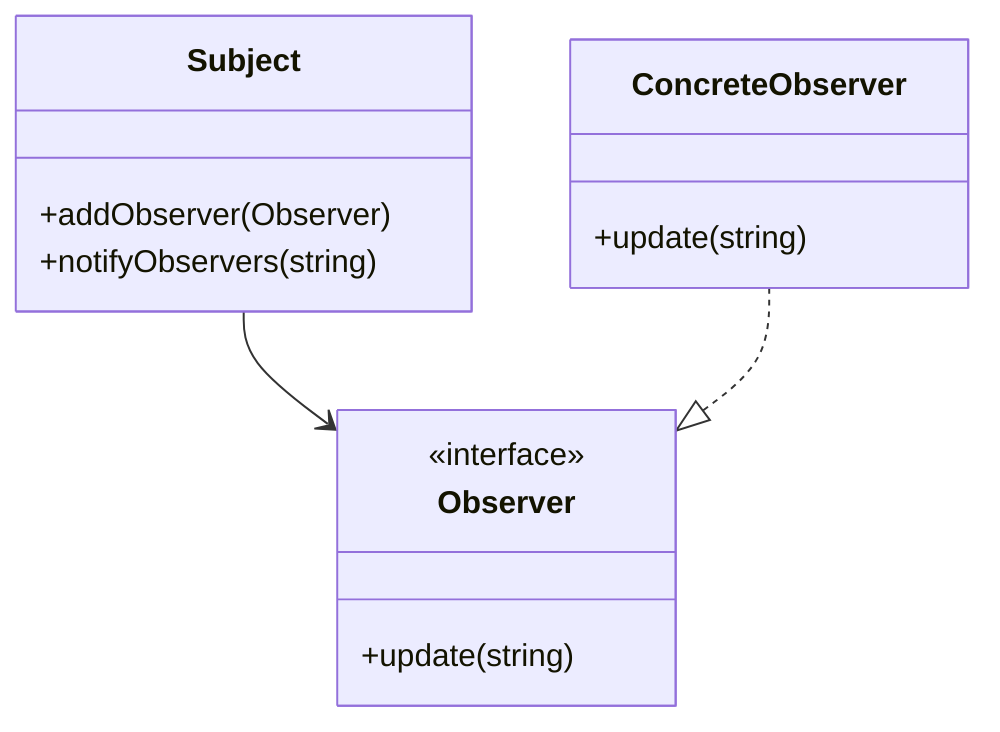

## 21.4 Common Interview Questions on D and Design Patterns

In the competitive field of software engineering, especially when dealing with advanced systems programming, understanding both the D programming language and design patterns is crucial. This section provides a comprehensive guide to common interview questions you might encounter, along with guidance on how to answer them effectively. Whether you're preparing for a job interview or simply looking to deepen your understanding, this guide will equip you with the knowledge and confidence you need.

### Preparation

Before diving into specific questions, it's important to understand the context and purpose of these interviews. Interviewers typically assess your problem-solving skills, understanding of design patterns, and proficiency in the D programming language. Here are some general tips for preparation:

- **Understand the Basics**: Ensure you have a solid grasp of D's syntax, features, and standard library.
- **Study Design Patterns**: Familiarize yourself with creational, structural, behavioral, and concurrency patterns, and understand how they can be implemented in D.
- **Practice Coding**: Regularly write and review code to improve your fluency in D.
- **Mock Interviews**: Conduct mock interviews with peers to simulate the interview environment.

### Typical Questions

Below are some typical interview questions you might encounter, along with guidance on how to approach them.

#### 1. What are the key features of the D programming language that make it suitable for systems programming?

**Answer Guidance**: Highlight D's performance, memory safety, and concurrency capabilities. Discuss features like compile-time function execution (CTFE), templates, and the ability to interface with C and C++.

#### 2. Explain the Singleton pattern and how you would implement it in D.

**Answer Guidance**: Describe the intent of the Singleton pattern, which is to ensure a class has only one instance. Provide a code example in D, using `static` variables and `synchronized` blocks for thread safety.

```d
class Singleton {
    private static Singleton instance;
    private this() {} // Private constructor

    public static Singleton getInstance() {
        synchronized {
            if (instance is null) {
                instance = new Singleton();
            }
        }
        return instance;
    }
}
```

#### 3. How does D's template system differ from C++ templates, and how can it be used in design patterns?

**Answer Guidance**: Explain that D's templates are more flexible and can be used for compile-time reflection and metaprogramming. Discuss how templates can be used to implement patterns like Factory or Strategy.

#### 4. Describe the Observer pattern and provide an example of its implementation in D.

**Answer Guidance**: The Observer pattern allows an object to notify other objects about changes in its state. Provide a D code example using delegates or interfaces.

```d
interface Observer {
    void update(string message);
}

class Subject {
    private Observer[] observers;

    void addObserver(Observer observer) {
        observers ~= observer;
    }

    void notifyObservers(string message) {
        foreach (observer; observers) {
            observer.update(message);
        }
    }
}
```

#### 5. What is RAII and how is it implemented in D?

**Answer Guidance**: RAII (Resource Acquisition Is Initialization) is a pattern for resource management. In D, it can be implemented using `scope` guards and destructors.

```d
class Resource {
    this() {
        // Acquire resource
    }

    ~this() {
        // Release resource
    }
}

void main() {
    auto resource = new Resource();
    // Resource is automatically released when it goes out of scope
}
```

#### 6. How do you handle concurrency in D, and what patterns are useful for concurrent programming?

**Answer Guidance**: Discuss D's `std.concurrency` and `std.parallelism` modules. Mention patterns like the Actor model and message passing for safe concurrency.

#### 7. Explain the Factory Method pattern and its application in D.

**Answer Guidance**: The Factory Method pattern defines an interface for creating an object but lets subclasses alter the type of objects that will be created. Provide a D example using interfaces and classes.

```d
interface Product {
    void use();
}

class ConcreteProduct : Product {
    void use() {
        writeln("Using ConcreteProduct");
    }
}

abstract class Creator {
    abstract Product factoryMethod();
}

class ConcreteCreator : Creator {
    Product factoryMethod() {
        return new ConcreteProduct();
    }
}
```

#### 8. What are mixins in D, and how can they be used in design patterns?

**Answer Guidance**: Explain that mixins allow code to be included in multiple classes. Discuss their use in patterns like Decorator or Adapter for code reuse.

#### 9. Describe the Strategy pattern and how you would implement it in D.

**Answer Guidance**: The Strategy pattern defines a family of algorithms, encapsulates each one, and makes them interchangeable. Provide a D example using interfaces.

```d
interface Strategy {
    void execute();
}

class ConcreteStrategyA : Strategy {
    void execute() {
        writeln("Executing Strategy A");
    }
}

class Context {
    private Strategy strategy;

    void setStrategy(Strategy strategy) {
        this.strategy = strategy;
    }

    void executeStrategy() {
        strategy.execute();
    }
}
```

#### 10. How does D support functional programming, and how can functional patterns be applied?

**Answer Guidance**: Discuss D's support for higher-order functions, immutability, and lazy evaluation. Mention patterns like MapReduce and how they can be implemented using D's functional features.

### Answer Guidance

When formulating responses, consider the following tips:

- **Be Concise**: Provide clear and direct answers, focusing on the key points.
- **Use Examples**: Whenever possible, illustrate your answers with code examples or real-world scenarios.
- **Show Understanding**: Demonstrate a deep understanding of the concepts, not just surface-level knowledge.
- **Be Honest**: If you're unsure about an answer, it's better to admit it and discuss how you would find the solution.

### Try It Yourself

To deepen your understanding, try modifying the code examples provided:

- **Singleton Pattern**: Implement a thread-safe Singleton using `synchronized` blocks.
- **Observer Pattern**: Create a concrete observer class and test the notification mechanism.
- **Factory Method**: Add another product type and modify the factory method to create it.

### Visualizing Design Patterns

To better understand the relationships and interactions in design patterns, let's visualize the Observer pattern using a class diagram.



This diagram illustrates how the `Subject` maintains a list of `Observer` objects and notifies them of changes.

### Knowledge Check

As you study these questions and answers, periodically test your understanding by asking yourself:

- Can I explain these concepts to someone else?
- How would I implement these patterns in a real-world project?
- What are the advantages and disadvantages of each pattern?

### Embrace the Journey

Remember, mastering D and design patterns is a journey. Keep experimenting, stay curious, and enjoy the process of learning and discovery. As you progress, you'll build more complex and efficient systems, leveraging the power of D and design patterns to their fullest potential.

## Quiz Time!



### What is the primary purpose of the Singleton pattern?

- [x] To ensure a class has only one instance
- [ ] To create multiple instances of a class
- [ ] To allow a class to inherit from multiple classes
- [ ] To encapsulate a group of algorithms

> **Explanation:** The Singleton pattern ensures that a class has only one instance and provides a global point of access to it.

### How does D's template system differ from C++ templates?

- [x] D's templates are more flexible and support compile-time reflection
- [ ] D's templates are less flexible than C++ templates
- [ ] D's templates do not support metaprogramming
- [ ] D's templates are identical to C++ templates

> **Explanation:** D's templates are more flexible and support advanced features like compile-time reflection and metaprogramming.

### Which pattern allows an object to notify other objects about changes in its state?

- [x] Observer pattern
- [ ] Singleton pattern
- [ ] Factory Method pattern
- [ ] Strategy pattern

> **Explanation:** The Observer pattern allows an object to notify other objects about changes in its state.

### What is RAII in D?

- [x] Resource Acquisition Is Initialization
- [ ] Random Access Is Immediate
- [ ] Resource Allocation Is Immediate
- [ ] Random Acquisition Is Initialization

> **Explanation:** RAII stands for Resource Acquisition Is Initialization, a pattern for resource management.

### How can concurrency be handled in D?

- [x] Using `std.concurrency` and `std.parallelism`
- [ ] Using only threads
- [ ] Using only processes
- [ ] Using only fibers

> **Explanation:** D provides `std.concurrency` and `std.parallelism` modules for handling concurrency.

### What is the intent of the Factory Method pattern?

- [x] To define an interface for creating an object, but let subclasses alter the type of objects that will be created
- [ ] To create a single instance of a class
- [ ] To encapsulate a group of algorithms
- [ ] To allow an object to notify other objects about changes

> **Explanation:** The Factory Method pattern defines an interface for creating an object, but lets subclasses alter the type of objects that will be created.

### What are mixins in D used for?

- [x] Including code in multiple classes
- [ ] Creating a single instance of a class
- [ ] Encapsulating a group of algorithms
- [ ] Notifying other objects about changes

> **Explanation:** Mixins in D allow code to be included in multiple classes, promoting code reuse.

### Which pattern defines a family of algorithms and makes them interchangeable?

- [x] Strategy pattern
- [ ] Observer pattern
- [ ] Singleton pattern
- [ ] Factory Method pattern

> **Explanation:** The Strategy pattern defines a family of algorithms, encapsulates each one, and makes them interchangeable.

### How does D support functional programming?

- [x] Through higher-order functions, immutability, and lazy evaluation
- [ ] Through only object-oriented programming
- [ ] Through only procedural programming
- [ ] Through only imperative programming

> **Explanation:** D supports functional programming through features like higher-order functions, immutability, and lazy evaluation.

### D's templates are more flexible than C++ templates.

- [x] True
- [ ] False

> **Explanation:** D's templates are indeed more flexible, supporting features like compile-time reflection and metaprogramming.


