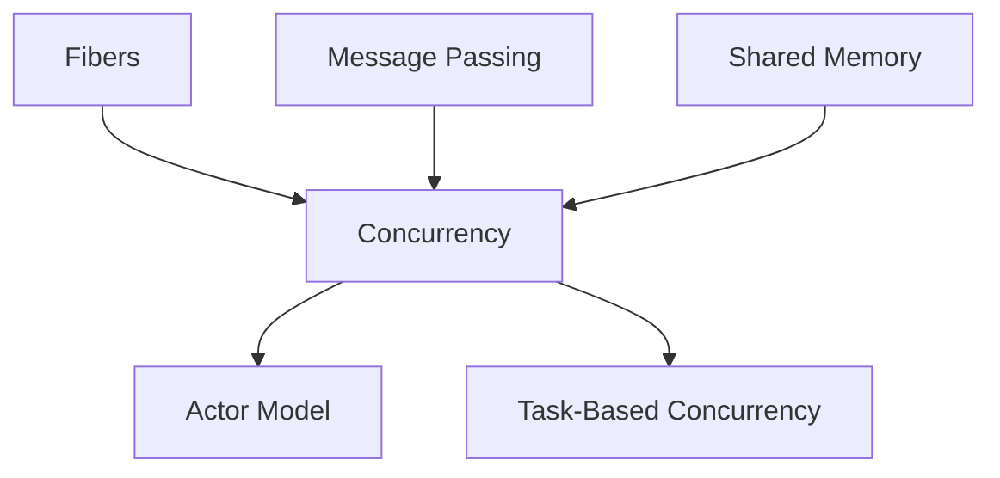

## 21.6 Frequently Asked Questions (FAQ)

Welcome to the Frequently Asked Questions (FAQ) section of the "Mastering Design Patterns in D: Advanced Systems Programming for Expert Software Engineers and Architects" guide. This section is designed to address common inquiries and troubleshooting tips for mastering design patterns in the D programming language, specifically tailored for advanced systems programming. Whether you're encountering challenges or seeking clarity on specific topics, this FAQ aims to provide comprehensive answers and insights.

### Common Inquiries

#### General Questions

**Q1: What are the key benefits of using design patterns in D?**

Design patterns in D offer several advantages, including:

- **Reusability**: Patterns provide proven solutions that can be reused across different projects.
- **Scalability**: They help in designing systems that can scale efficiently.
- **Maintainability**: Patterns promote clean and organized code, making maintenance easier.
- **Efficiency**: Leveraging D's features like templates and metaprogramming enhances performance.
- **Best Practices**: Patterns encapsulate industry best practices, reducing the risk of errors.

**Q2: How do D's unique features enhance design patterns?**

D's unique features such as templates, mixins, and compile-time function execution (CTFE) allow for more flexible and efficient implementation of design patterns. Templates enable generic programming, mixins facilitate code reuse, and CTFE allows computations at compile time, reducing runtime overhead.

**Q3: Can you explain the difference between `@safe`, `@trusted`, and `@system` in D?**

- **`@safe`**: Ensures that the code does not perform any unsafe operations, providing memory safety guarantees.
- **`@trusted`**: Marks code as safe, even if it contains operations that are not checked by the compiler. The developer guarantees its safety.
- **`@system`**: Indicates that the code may perform unsafe operations and is not checked by the compiler for memory safety.

**Q4: What is the role of metaprogramming in D, and how does it relate to design patterns?**

Metaprogramming in D allows for code that can generate other code at compile time. This is particularly useful for implementing design patterns that require repetitive or boilerplate code, as it reduces redundancy and potential errors. It also enables more dynamic and adaptable pattern implementations.

**Q5: How does D handle concurrency, and what patterns are most effective?**

D provides several concurrency mechanisms, including fibers, message passing with `std.concurrency`, and shared memory concurrency. Effective patterns include the Actor Model, which uses message passing to avoid shared state, and Task-Based Concurrency, which simplifies parallel execution.

### Troubleshooting

#### Solutions to Common Problems

**Q6: I'm experiencing performance issues with my D application. What optimization strategies should I consider?**

Consider the following optimization strategies:

- **Profile Your Code**: Use profiling tools to identify bottlenecks.
- **Optimize Algorithms**: Ensure that algorithms are efficient and appropriate for the task.
- **Reduce Memory Footprint**: Use slices and avoid unnecessary allocations.
- **Leverage CTFE**: Perform computations at compile time where possible.
- **Use SIMD**: Utilize SIMD instructions for data parallelism.

**Q7: How can I effectively manage memory in D to avoid leaks and inefficiencies?**

Effective memory management in D involves:

- **Understanding the Garbage Collector**: Know when and how it operates.
- **Writing `@nogc` Code**: Avoid garbage collection for performance-critical sections.
- **Using RAII**: Manage resources with RAII to ensure proper cleanup.
- **Implementing Reference Counting**: Use smart pointers for manual memory management.
- **Profiling Memory Usage**: Regularly profile and optimize memory usage.

**Q8: What are common pitfalls when using templates in D, and how can I avoid them?**

Common pitfalls include:

- **Complexity**: Templates can become overly complex. Keep them simple and focused.
- **Compilation Time**: Excessive use of templates can increase compilation time. Use them judiciously.
- **Error Messages**: Template errors can be cryptic. Use static assertions and clear constraints to improve readability.

**Q9: How do I handle errors and exceptions effectively in D?**

Effective error handling involves:

- **Using Exceptions**: Use exceptions for error conditions that are truly exceptional.
- **Error Codes**: For performance-critical code, consider using error codes.
- **Contracts**: Use contracts to enforce preconditions and postconditions.
- **Scope Guards**: Ensure resources are released properly using scope guards.

**Q10: What are the best practices for testing and debugging D applications?**

Best practices include:

- **Unit Testing**: Use `unittest` blocks for comprehensive unit testing.
- **Behavior-Driven Development**: Consider BDD for complex systems.
- **Mocking**: Use mocking frameworks to test components in isolation.
- **Debugging Tools**: Utilize D's debugging tools and techniques for efficient debugging.
- **Continuous Integration**: Implement CI pipelines to automate testing and ensure code quality.

### Visualizing Concepts

To further enhance understanding, let's visualize some of the concepts discussed using Mermaid.js diagrams.

#### Visualizing D's Memory Safety Attributes

```mermaid
graph TD;
    A[@safe] --> B[Memory Safety]
    C[@trusted] --> B
    D[@system] --> E[Unsafe Operations]
    B --> F[Compile-Time Checks]
    E --> F
```

*Description*: This diagram illustrates the relationship between D's memory safety attributes and their impact on compile-time checks.

#### Visualizing Concurrency Patterns in D



*Description*: This diagram shows the different concurrency mechanisms in D and how they relate to common concurrency patterns.

### References and Links

For further reading and deeper dives into specific topics, consider the following resources:

- [D Programming Language Official Documentation](https://dlang.org/)
- [MDN Web Docs on Design Patterns](https://developer.mozilla.org/en-US/docs/Web/JavaScript/Guide/Design_Patterns)
- [W3Schools on Programming Concepts](https://www.w3schools.com/)

### Knowledge Check

To reinforce your understanding, consider the following questions and challenges:

- **Challenge**: Implement a simple design pattern in D using templates and mixins.
- **Question**: How does D's compile-time function execution (CTFE) enhance performance?
- **Exercise**: Profile a D application and identify potential performance bottlenecks.

### Embrace the Journey

Remember, mastering design patterns in D is a journey. As you progress, you'll build more complex and efficient systems. Keep experimenting, stay curious, and enjoy the process!

### Formatting and Structure

This FAQ section is organized with clear headings and subheadings to facilitate easy navigation. Bullet points are used to break down complex information, and important terms are highlighted for emphasis.

### Writing Style

This guide uses first-person plural to create a collaborative feel and avoids gender-specific pronouns to ensure inclusivity. Acronyms and abbreviations are defined upon first use to aid understanding.

## Quiz Time!



### What are the benefits of using design patterns in D?

- [x] Reusability, scalability, maintainability
- [ ] Increased complexity, reduced performance
- [ ] Limited applicability, increased errors
- [ ] None of the above

> **Explanation:** Design patterns in D offer reusability, scalability, and maintainability, among other benefits.

### How does D's `@safe` attribute ensure memory safety?

- [x] By preventing unsafe operations
- [ ] By allowing unchecked operations
- [ ] By marking code as trusted
- [ ] By disabling garbage collection

> **Explanation:** The `@safe` attribute ensures memory safety by preventing unsafe operations.

### What is the primary role of metaprogramming in D?

- [x] To generate code at compile time
- [ ] To execute code at runtime
- [ ] To simplify syntax
- [ ] To enhance debugging

> **Explanation:** Metaprogramming in D is primarily used to generate code at compile time.

### Which concurrency pattern in D uses message passing?

- [x] Actor Model
- [ ] Shared Memory
- [ ] Task-Based Concurrency
- [ ] None of the above

> **Explanation:** The Actor Model in D uses message passing to manage concurrency.

### What is a common pitfall when using templates in D?

- [x] Increased complexity
- [ ] Reduced flexibility
- [ ] Limited reusability
- [ ] None of the above

> **Explanation:** A common pitfall when using templates in D is increased complexity.

### How can you optimize performance in a D application?

- [x] Profile code, optimize algorithms, reduce memory footprint
- [ ] Increase memory usage, avoid profiling, use complex algorithms
- [ ] Ignore bottlenecks, use more templates, avoid CTFE
- [ ] None of the above

> **Explanation:** Optimizing performance involves profiling code, optimizing algorithms, and reducing memory footprint.

### What is the purpose of RAII in D?

- [x] To manage resources and ensure proper cleanup
- [ ] To increase memory usage
- [ ] To complicate code
- [ ] To disable garbage collection

> **Explanation:** RAII is used to manage resources and ensure proper cleanup in D.

### How does D handle errors and exceptions?

- [x] Using exceptions, error codes, contracts, and scope guards
- [ ] By ignoring errors
- [ ] By using only error codes
- [ ] By disabling error handling

> **Explanation:** D handles errors and exceptions using exceptions, error codes, contracts, and scope guards.

### What is the best practice for testing D applications?

- [x] Use `unittest` blocks, BDD, mocking, and CI pipelines
- [ ] Avoid testing
- [ ] Use only manual testing
- [ ] Ignore CI pipelines

> **Explanation:** Best practices for testing D applications include using `unittest` blocks, BDD, mocking, and CI pipelines.

### True or False: Metaprogramming in D can reduce redundancy and potential errors.

- [x] True
- [ ] False

> **Explanation:** Metaprogramming in D can indeed reduce redundancy and potential errors by generating code at compile time.


