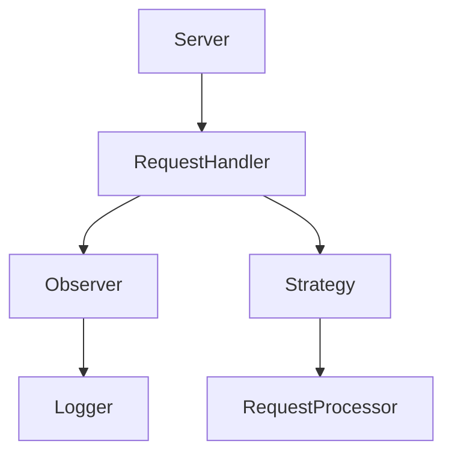

## 21.7 Sample Projects and Code Repositories

In this section, we delve into the practical side of mastering design patterns in D by exploring sample projects and code repositories. These resources are invaluable for understanding how theoretical concepts are applied in real-world scenarios. By examining these projects, you can gain insights into best practices, common pitfalls, and innovative solutions in systems programming using the D language.

### Learning by Example: Studying Real-World Applications

One of the most effective ways to learn and master design patterns is by studying real-world applications. This approach allows you to see how experienced developers structure their code, manage complexity, and implement design patterns to solve specific problems. Below, we explore several sample projects that demonstrate the use of design patterns in D.

#### 1. **D-HTTP: A High-Performance Web Server**

**Project Overview:**
D-HTTP is a high-performance web server written in D. It leverages the language's concurrency features and efficient memory management to handle thousands of simultaneous connections.

**Key Design Patterns:**
- **Singleton Pattern**: Used for managing the server instance.
- **Observer Pattern**: Implements event-driven architecture for handling HTTP requests.
- **Strategy Pattern**: Allows for flexible request processing strategies.

**Code Example:**

```d
module dhttp;

import std.concurrency;
import std.stdio;

class Server {
    private static Server instance;
    private this() {}

    public static Server getInstance() {
        if (instance is null) {
            instance = new Server();
        }
        return instance;
    }

    void start() {
        writeln("Server started...");
        // Handle connections
    }
}

void main() {
    auto server = Server.getInstance();
    server.start();
}
```

**Try It Yourself:**
- Modify the `start` method to handle different types of HTTP requests.
- Implement a logging mechanism using the Observer pattern.

#### 2. **D-GameEngine: A 2D Game Engine**

**Project Overview:**
D-GameEngine is a simple 2D game engine that demonstrates the use of design patterns in game development. It focuses on rendering, physics, and input handling.

**Key Design Patterns:**
- **Component Pattern**: Used for game object composition.
- **State Pattern**: Manages game states like menu, play, and pause.
- **Command Pattern**: Handles user input and game actions.

**Code Example:**

```d
module dgameengine;

import std.stdio;

interface Component {
    void update();
}

class PhysicsComponent : Component {
    void update() {
        writeln("Updating physics...");
    }
}

class GameObject {
    Component[] components;

    void addComponent(Component component) {
        components ~= component;
    }

    void update() {
        foreach (component; components) {
            component.update();
        }
    }
}

void main() {
    auto player = new GameObject();
    player.addComponent(new PhysicsComponent());
    player.update();
}
```

**Try It Yourself:**
- Add a `RenderComponent` to handle graphics rendering.
- Implement a `StateManager` to switch between game states.

#### 3. **D-DataAnalyzer: A Data Analysis Tool**

**Project Overview:**
D-DataAnalyzer is a tool for processing and analyzing large datasets. It showcases the use of design patterns for data manipulation and visualization.

**Key Design Patterns:**
- **Builder Pattern**: Constructs complex data processing pipelines.
- **Iterator Pattern**: Traverses datasets efficiently.
- **Decorator Pattern**: Adds functionality to data processing components.

**Code Example:**

```d
module ddataanalyzer;

import std.stdio;

class DataSet {
    int[] data;

    this(int[] data) {
        this.data = data;
    }

    void process() {
        writeln("Processing data...");
    }
}

class DataSetBuilder {
    private int[] data;

    DataSetBuilder addData(int value) {
        data ~= value;
        return this;
    }

    DataSet build() {
        return new DataSet(data);
    }
}

void main() {
    auto builder = new DataSetBuilder();
    auto dataSet = builder.addData(1).addData(2).addData(3).build();
    dataSet.process();
}
```

**Try It Yourself:**
- Extend the `DataSet` class to support different data processing algorithms.
- Implement a `Decorator` to add logging to the data processing steps.

### Contribution Opportunities: Open Source Projects

Contributing to open source projects is an excellent way to apply your skills, learn from others, and give back to the community. Here are some notable open source projects in D that welcome contributions.

#### 1. **Vibe.d: Asynchronous I/O Framework**

**Project Overview:**
Vibe.d is a high-performance asynchronous I/O framework for D. It is widely used for building web applications and services.

**Contribution Areas:**
- Implement new features or improve existing ones.
- Write documentation and tutorials.
- Fix bugs and optimize performance.

**Getting Started:**
- Fork the repository on GitHub.
- Explore the issue tracker for open issues.
- Join the community discussions on the D forums.

#### 2. **Mir: Numerical Library for D**

**Project Overview:**
Mir is a comprehensive numerical library for D, providing tools for scientific computing, data analysis, and machine learning.

**Contribution Areas:**
- Develop new algorithms and data structures.
- Enhance the performance of existing modules.
- Contribute to the documentation and examples.

**Getting Started:**
- Clone the repository and set up your development environment.
- Review the contribution guidelines.
- Participate in community meetings and discussions.

#### 3. **DlangUI: Cross-Platform GUI Toolkit**

**Project Overview:**
DlangUI is a cross-platform GUI toolkit for D, enabling developers to create native-looking applications on multiple platforms.

**Contribution Areas:**
- Design and implement new widgets.
- Improve cross-platform compatibility.
- Address user-reported issues and feature requests.

**Getting Started:**
- Check out the project's GitHub page.
- Read through the documentation and codebase.
- Engage with the community on the project's chat channels.

### Visualizing Project Structures and Workflows

Understanding the structure and workflow of a project is crucial for effective contribution and learning. Below, we use Mermaid.js diagrams to visualize the architecture of a sample project.

#### Visualizing D-HTTP Project Architecture



**Diagram Description:**
This diagram represents the architecture of the D-HTTP project. The `Server` component manages the `RequestHandler`, which uses the `Observer` pattern for logging and the `Strategy` pattern for processing requests.

### References and Links

- [D Language Official Website](https://dlang.org/)
- [Dlang Tour](https://tour.dlang.org/)
- [Vibe.d Documentation](https://vibed.org/docs)
- [Mir Library GitHub](https://github.com/libmir/mir)
- [DlangUI GitHub](https://github.com/buggins/dlangui)

### Knowledge Check

To reinforce your understanding of the concepts covered in this section, consider the following questions and exercises:

- What are the benefits of studying real-world projects when learning design patterns?
- How can you contribute to an open source project in D?
- Implement a new feature in one of the sample projects provided.

### Embrace the Journey

Remember, exploring sample projects and contributing to open source is just the beginning. As you progress, you'll gain deeper insights into the D language and its application in systems programming. Keep experimenting, stay curious, and enjoy the journey!

## Quiz Time!



### Which design pattern is used in the D-HTTP project to manage the server instance?

- [x] Singleton Pattern
- [ ] Observer Pattern
- [ ] Strategy Pattern
- [ ] Factory Pattern

> **Explanation:** The Singleton Pattern is used to ensure that only one instance of the server is created and managed.

### What pattern is used in D-GameEngine for game object composition?

- [x] Component Pattern
- [ ] State Pattern
- [ ] Command Pattern
- [ ] Builder Pattern

> **Explanation:** The Component Pattern is used to allow flexible composition of game objects with various components.

### Which design pattern is demonstrated by the DataSetBuilder in D-DataAnalyzer?

- [x] Builder Pattern
- [ ] Iterator Pattern
- [ ] Decorator Pattern
- [ ] Singleton Pattern

> **Explanation:** The Builder Pattern is used to construct complex objects step by step.

### What is a key benefit of contributing to open source projects?

- [x] Learning from experienced developers
- [ ] Gaining financial rewards
- [ ] Avoiding collaboration
- [ ] Working in isolation

> **Explanation:** Contributing to open source projects allows you to learn from experienced developers and collaborate with the community.

### Which project is a high-performance asynchronous I/O framework for D?

- [x] Vibe.d
- [ ] Mir
- [ ] DlangUI
- [ ] D-HTTP

> **Explanation:** Vibe.d is known for its high-performance asynchronous I/O capabilities.

### What is the primary focus of the Mir library?

- [x] Numerical computing
- [ ] Web development
- [ ] Game development
- [ ] GUI design

> **Explanation:** Mir is a numerical library for scientific computing and data analysis.

### Which pattern is used in D-HTTP for handling HTTP requests?

- [x] Observer Pattern
- [ ] Singleton Pattern
- [ ] Factory Pattern
- [ ] Decorator Pattern

> **Explanation:** The Observer Pattern is used to implement event-driven architecture for handling HTTP requests.

### What is the role of the Strategy Pattern in D-HTTP?

- [x] Allows flexible request processing strategies
- [ ] Manages server instance
- [ ] Handles user input
- [ ] Constructs complex objects

> **Explanation:** The Strategy Pattern allows for flexible request processing strategies in the D-HTTP project.

### Which project is a cross-platform GUI toolkit for D?

- [x] DlangUI
- [ ] Vibe.d
- [ ] Mir
- [ ] D-GameEngine

> **Explanation:** DlangUI is a cross-platform GUI toolkit for creating native-looking applications.

### True or False: Studying real-world projects helps in understanding the practical application of design patterns.

- [x] True
- [ ] False

> **Explanation:** Studying real-world projects provides insights into how design patterns are applied in practical scenarios.


