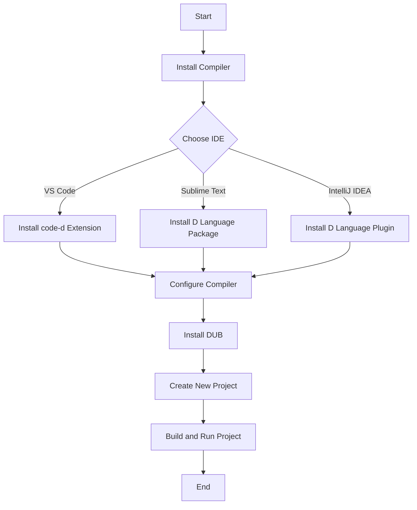

## 21.8 Setting Up the D Programming Language Development Environment

Setting up a robust development environment is crucial for any software engineer or architect looking to leverage the D programming language for advanced systems programming. This guide will walk you through the process of installing necessary compilers, configuring integrated development environments (IDEs), and managing projects with build tools like DUB and Makefiles. By the end of this guide, you'll have a fully functional D development environment ready for building high-performance, scalable, and maintainable software systems.

### Installation Guides

#### Compilers and Tools

The D programming language offers several compilers, each with its own strengths. The three primary compilers are DMD, LDC, and GDC. Let's explore how to set up each of these compilers.

##### DMD (Digital Mars D Compiler)

DMD is the reference compiler for the D programming language, known for its fast compilation times and ease of use. It is ideal for development and testing.

1. **Download and Install DMD**:
   - Visit the [DMD download page](https://dlang.org/download.html).
   - Choose the appropriate installer for your operating system (Windows, macOS, or Linux).
   - Follow the installation instructions provided on the website.

2. **Verify Installation**:
   - Open a terminal or command prompt.
   - Run the command `dmd --version` to ensure DMD is installed correctly.

```bash
$ dmd --version
DMD64 D Compiler v2.098.0
```

##### LDC (LLVM-based D Compiler)

LDC is a D compiler based on the LLVM backend, offering excellent optimization capabilities and cross-platform support.

1. **Download and Install LDC**:
   - Visit the [LDC download page](https://github.com/ldc-developers/ldc/releases).
   - Download the appropriate package for your operating system.
   - Extract the package and follow the installation instructions.

2. **Verify Installation**:
   - Open a terminal or command prompt.
   - Run the command `ldc2 --version` to ensure LDC is installed correctly.

```bash
$ ldc2 --version
LDC - the LLVM D compiler (1.28.0)
```

##### GDC (GNU D Compiler)

GDC is a D compiler that integrates with the GCC toolchain, providing compatibility with a wide range of platforms.

1. **Install GDC**:
   - On Linux, GDC can often be installed via the package manager. For example, on Ubuntu, use:
     ```bash
     sudo apt-get install gdc
     ```
   - For other systems, refer to the [GDC installation guide](https://gdcproject.org/downloads).

2. **Verify Installation**:
   - Open a terminal or command prompt.
   - Run the command `gdc --version` to ensure GDC is installed correctly.

```bash
$ gdc --version
gdc (GCC) 10.2.0
```

### Integrated Development Environments (IDEs)

A good IDE can significantly enhance your productivity by providing features like syntax highlighting, code completion, and debugging tools. Here, we'll cover configuring popular IDEs and editors for D programming.

#### Editor Support

##### Visual Studio Code

Visual Studio Code (VS Code) is a popular, lightweight editor with excellent support for D through extensions.

1. **Install Visual Studio Code**:
   - Download and install VS Code from the [official website](https://code.visualstudio.com/).

2. **Install D Language Support**:
   - Open VS Code and go to the Extensions view (`Ctrl+Shift+X`).
   - Search for "D Language" and install the `code-d` extension.

3. **Configure DMD, LDC, or GDC**:
   - Open the Command Palette (`Ctrl+Shift+P`) and type `D: Configure workspace`.
   - Select the compiler you installed (DMD, LDC, or GDC).

##### Sublime Text

Sublime Text is another popular editor known for its speed and simplicity.

1. **Install Sublime Text**:
   - Download and install Sublime Text from the [official website](https://www.sublimetext.com/).

2. **Install D Language Support**:
   - Open Sublime Text and install the `D Language` package via Package Control.

3. **Configure Build System**:
   - Go to `Tools > Build System > New Build System`.
   - Add the following configuration for DMD:

```json
{
    "cmd": ["dmd", "$file"],
    "file_regex": "^(...*?):([0-9]*):?([0-9]*)",
    "selector": "source.d"
}
```

##### IntelliJ IDEA

IntelliJ IDEA offers robust support for D through plugins.

1. **Install IntelliJ IDEA**:
   - Download and install IntelliJ IDEA from the [official website](https://www.jetbrains.com/idea/).

2. **Install D Language Plugin**:
   - Open IntelliJ IDEA and go to `File > Settings > Plugins`.
   - Search for "D Language" and install the plugin.

3. **Configure Project SDK**:
   - Go to `File > Project Structure > SDKs`.
   - Add the path to your D compiler (DMD, LDC, or GDC).

### Build Tools

Managing projects effectively is essential for any software development process. DUB and Makefiles are two popular tools for managing D projects.

#### DUB (D's Package and Build Manager)

DUB is the official package and build manager for D, simplifying dependency management and project configuration.

1. **Install DUB**:
   - DUB is included with the DMD installer. If you installed DMD, you likely already have DUB.
   - Verify installation by running `dub --version` in the terminal.

```bash
$ dub --version
DUB version 1.24.0
```

2. **Create a New Project**:
   - Use DUB to create a new project with the command:
     ```bash
     dub init myproject
     ```
   - This command creates a new directory with a basic project structure.

3. **Build and Run the Project**:
   - Navigate to the project directory and run:
     ```bash
     dub build
     dub run
     ```

#### Makefiles

Makefiles provide a flexible way to manage complex build processes, especially for larger projects.

1. **Create a Makefile**:
   - In your project directory, create a file named `Makefile`.
   - Define build rules. For example, to compile a D program with DMD:

```makefile
all: main

main: main.d
    dmd main.d -ofmain
```

2. **Build the Project**:
   - Run `make` in the terminal to build the project.

```bash
$ make
dmd main.d -ofmain
```

3. **Clean Up**:
   - Add a clean rule to remove generated files:

```makefile
clean:
    rm -f main
```

### Try It Yourself

Now that you have your D development environment set up, try creating a simple "Hello, World!" program to test your setup.

1. **Create a New File**:
   - Open your preferred editor and create a new file named `hello.d`.

2. **Write the Code**:

```d
import std.stdio;

void main() {
    writeln("Hello, World!");
}
```

3. **Compile and Run**:
   - Use your chosen compiler to compile and run the program. For example, with DMD:

```bash
$ dmd hello.d
$ ./hello
Hello, World!
```

### Visualizing the Setup Process

To better understand the setup process, let's visualize the workflow using a flowchart.



### References and Links

- [D Programming Language Official Website](https://dlang.org/)
- [DMD Compiler Download](https://dlang.org/download.html)
- [LDC Compiler Releases](https://github.com/ldc-developers/ldc/releases)
- [GDC Project Downloads](https://gdcproject.org/downloads)
- [Visual Studio Code](https://code.visualstudio.com/)
- [Sublime Text](https://www.sublimetext.com/)
- [IntelliJ IDEA](https://www.jetbrains.com/idea/)

### Knowledge Check

- What are the three primary compilers available for D programming?
- How do you verify the installation of a D compiler?
- What is the purpose of DUB in D programming?
- How can you configure Visual Studio Code for D development?
- What are the benefits of using Makefiles for project management?

### Embrace the Journey

Remember, setting up your development environment is just the beginning. As you progress, you'll explore more complex projects and leverage the power of D to its fullest. Keep experimenting, stay curious, and enjoy the journey!

## Quiz Time!



### Which compiler is known for its fast compilation times and ease of use?

- [x] DMD
- [ ] LDC
- [ ] GDC
- [ ] GCC

> **Explanation:** DMD is the reference compiler for the D programming language, known for its fast compilation times and ease of use.

### What is the primary advantage of using LDC?

- [ ] Fast compilation times
- [x] Excellent optimization capabilities
- [ ] Integration with GCC toolchain
- [ ] Built-in package manager

> **Explanation:** LDC is based on the LLVM backend, offering excellent optimization capabilities and cross-platform support.

### How can you verify the installation of DMD?

- [ ] Run `dmd --install`
- [x] Run `dmd --version`
- [ ] Check the system PATH
- [ ] Use `dub --version`

> **Explanation:** Running `dmd --version` in the terminal will display the version of DMD installed, verifying the installation.

### What is the purpose of DUB in D programming?

- [ ] To compile D code
- [x] To manage packages and build projects
- [ ] To provide syntax highlighting
- [ ] To debug D applications

> **Explanation:** DUB is the official package and build manager for D, simplifying dependency management and project configuration.

### Which IDE requires the installation of the `code-d` extension for D support?

- [x] Visual Studio Code
- [ ] Sublime Text
- [ ] IntelliJ IDEA
- [ ] Eclipse

> **Explanation:** Visual Studio Code requires the installation of the `code-d` extension to support D programming.

### What command is used to create a new D project with DUB?

- [ ] dub create
- [x] dub init
- [ ] dub new
- [ ] dub start

> **Explanation:** The command `dub init myproject` is used to create a new D project with DUB.

### Which of the following is a build tool for managing complex build processes?

- [ ] DUB
- [x] Makefiles
- [ ] GDC
- [ ] LDC

> **Explanation:** Makefiles provide a flexible way to manage complex build processes, especially for larger projects.

### How do you add a clean rule in a Makefile?

- [ ] clean: remove files
- [ ] clean: delete files
- [x] clean: rm -f main
- [ ] clean: clear files

> **Explanation:** The `clean` rule in a Makefile typically uses `rm -f` to remove generated files.

### What is the first step in setting up a D development environment?

- [ ] Install an IDE
- [ ] Configure DUB
- [x] Install a D compiler
- [ ] Create a new project

> **Explanation:** The first step in setting up a D development environment is to install a D compiler.

### True or False: DUB is included with the DMD installer.

- [x] True
- [ ] False

> **Explanation:** DUB is included with the DMD installer, so if you installed DMD, you likely already have DUB.


