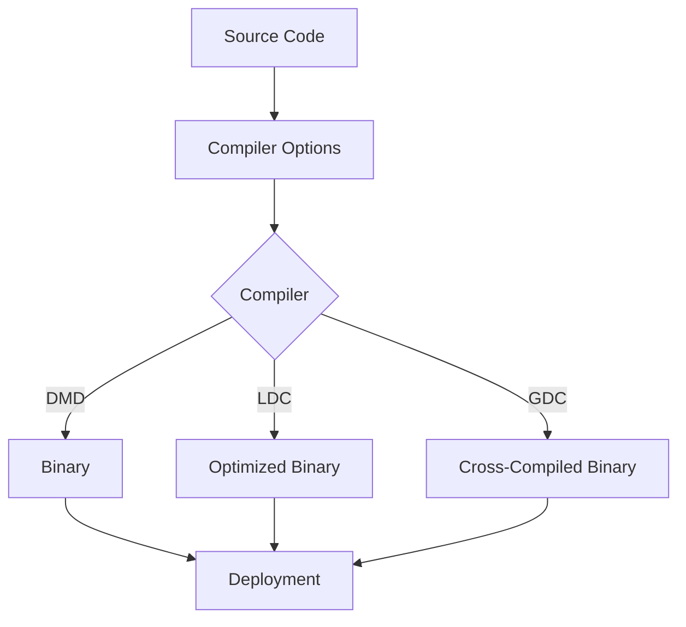

## 21.9 Compiler Options and Toolchains

In the realm of advanced systems programming, mastering compiler options and toolchains is crucial for optimizing performance and ensuring compatibility across different platforms. This section delves into the intricacies of D compiler options, focusing on optimization techniques and cross-compilation strategies. By understanding these concepts, you can unlock the full potential of the D programming language, creating high-performance and scalable software systems.

### Understanding Compiler Options

Compiler options are parameters that control the behavior of the compiler during the compilation process. They can influence various aspects such as optimization levels, debugging information, and target architecture. In D, the most commonly used compiler is DMD (Digital Mars D), but others like LDC (LLVM D Compiler) and GDC (GNU D Compiler) are also popular for their unique features and optimizations.

#### Key Compiler Options

1. **Optimization Options**: These options are crucial for enhancing the performance of your compiled code. They include:
   - `-O`: Enables basic optimizations.
   - `-release`: Removes runtime checks for array bounds and asserts, improving performance.
   - `-inline`: Allows function inlining, reducing function call overhead.
   - `-boundscheck=off`: Disables bounds checking, which can significantly speed up array operations.

2. **Debugging Options**: Useful for development and troubleshooting.
   - `-g`: Generates debugging information.
   - `-debug`: Compiles in debug mode, enabling assertions and debug statements.

3. **Code Generation Options**: Control the output of the compiler.
   - `-c`: Compiles without linking, producing object files.
   - `-of=<filename>`: Specifies the output file name.

4. **Linking Options**: Manage the linking process.
   - `-L<flag>`: Passes flags to the linker.
   - `-shared`: Produces a shared library.

5. **Target Architecture Options**: Specify the architecture for which the code is compiled.
   - `-m32` or `-m64`: Compiles for 32-bit or 64-bit architectures.

### Optimization Techniques

Optimization is a critical aspect of systems programming, where performance and efficiency are paramount. The D language provides several compiler options to optimize your code effectively.

#### Basic Optimization Levels

- **Level 0 (`-O0`)**: No optimization. This level is typically used during development for faster compilation times and easier debugging.
- **Level 1 (`-O1`)**: Basic optimizations that do not significantly increase compilation time.
- **Level 2 (`-O2`)**: More aggressive optimizations that improve performance without compromising code size.
- **Level 3 (`-O3`)**: Maximum optimization, potentially increasing code size and compilation time.

#### Advanced Optimization Strategies

1. **Function Inlining**: Use the `-inline` option to reduce the overhead of function calls by embedding the function's code directly at the call site.

2. **Loop Unrolling**: Manually unroll loops or rely on the compiler's optimization capabilities to reduce loop overhead.

3. **Vectorization**: Utilize SIMD (Single Instruction, Multiple Data) instructions to process multiple data points simultaneously.

4. **Profile-Guided Optimization (PGO)**: Collect runtime data to guide the compiler in optimizing frequently executed paths.

5. **Link-Time Optimization (LTO)**: Optimize across translation units during the linking phase, enabling more aggressive optimizations.

### Cross-Compilation

Cross-compilation is the process of building software on one platform to run on another. This is particularly useful in systems programming, where software needs to be deployed across various architectures and operating systems.

#### Building for Different Targets

To cross-compile D programs, you need a cross-compiler and appropriate libraries for the target platform. The following steps outline the process:

1. **Set Up the Cross-Compiler**: Install a cross-compiler that supports your target architecture. For example, use LDC for its robust cross-compilation capabilities.

2. **Configure the Build Environment**: Set environment variables to point to the cross-compiler and target libraries.

3. **Specify Target Options**: Use compiler flags to specify the target architecture, such as `-m32` or `-m64`, and the target operating system.

4. **Compile and Link**: Run the compiler with the appropriate options to generate binaries for the target platform.

#### Example: Cross-Compiling for ARM

Let's walk through an example of cross-compiling a D program for an ARM architecture using LDC.

```bash
sudo apt-get install gcc-arm-linux-gnueabi

export CC=arm-linux-gnueabi-gcc
export CXX=arm-linux-gnueabi-g++

ldc2 -mtriple=arm-linux-gnueabi -of=hello_arm hello.d
```

In this example, we use the `-mtriple` option to specify the target architecture and operating system. The resulting binary, `hello_arm`, is suitable for execution on an ARM device.

### Toolchains for D Programming

A toolchain is a set of programming tools used to perform a complex software development task or to create a software product. In D programming, a typical toolchain includes a compiler, linker, and libraries.

#### Popular D Toolchains

1. **DMD (Digital Mars D Compiler)**: Known for its fast compilation times and ease of use, DMD is ideal for development and prototyping.

2. **LDC (LLVM D Compiler)**: Based on the LLVM backend, LDC provides excellent optimization capabilities and cross-compilation support.

3. **GDC (GNU D Compiler)**: Integrated with the GCC toolchain, GDC benefits from GCC's extensive optimization features and platform support.

#### Choosing the Right Toolchain

When selecting a toolchain, consider the following factors:

- **Performance**: LDC is often preferred for production builds due to its superior optimization capabilities.
- **Platform Support**: GDC is a good choice for projects requiring broad platform compatibility.
- **Development Speed**: DMD is suitable for rapid development and testing due to its fast compilation times.

### Try It Yourself

Experiment with different compiler options and toolchains to see their effects on your D programs. Modify the optimization levels, try cross-compiling for different architectures, and observe the changes in performance and binary size.

### Visualizing Compiler Options and Toolchains

To better understand the relationship between compiler options, toolchains, and the build process, let's visualize it using a flowchart.



**Figure 1**: This flowchart illustrates how different compiler options and toolchains affect the build process, resulting in various types of binaries for deployment.

### References and Links

- [D Language Official Website](https://dlang.org/)
- [LDC Compiler Documentation](https://wiki.dlang.org/LDC)
- [GDC Compiler Documentation](https://gdcproject.org/)
- [LLVM Project](https://llvm.org/)

### Knowledge Check

- What are the key differences between DMD, LDC, and GDC?
- How does function inlining improve performance?
- What is the purpose of cross-compilation?

### Embrace the Journey

Remember, mastering compiler options and toolchains is a journey. As you explore these concepts, you'll gain deeper insights into the D programming language and its capabilities. Keep experimenting, stay curious, and enjoy the process of optimizing and deploying your software across diverse platforms.

## Quiz Time!



### What is the primary purpose of compiler optimization options?

- [x] To improve the performance of compiled code
- [ ] To generate debugging information
- [ ] To specify the output file name
- [ ] To disable bounds checking

> **Explanation:** Compiler optimization options are used to enhance the performance of the compiled code by applying various optimization techniques.

### Which D compiler is known for its fast compilation times?

- [x] DMD
- [ ] LDC
- [ ] GDC
- [ ] GCC

> **Explanation:** DMD is known for its fast compilation times, making it ideal for development and prototyping.

### What is cross-compilation?

- [x] Building software on one platform to run on another
- [ ] Compiling code with debugging information
- [ ] Optimizing code for performance
- [ ] Linking multiple object files

> **Explanation:** Cross-compilation involves building software on one platform to run on a different target platform.

### Which compiler option is used to enable function inlining in D?

- [x] `-inline`
- [ ] `-O`
- [ ] `-g`
- [ ] `-release`

> **Explanation:** The `-inline` option allows function inlining, which reduces function call overhead by embedding the function's code directly at the call site.

### What is the role of a toolchain in software development?

- [x] A set of programming tools used to perform a complex software development task
- [ ] A single tool for compiling code
- [ ] A library for linking object files
- [ ] A debugger for troubleshooting code

> **Explanation:** A toolchain is a set of programming tools used to perform complex software development tasks, including compiling, linking, and building software products.

### Which compiler is based on the LLVM backend?

- [x] LDC
- [ ] DMD
- [ ] GDC
- [ ] GCC

> **Explanation:** LDC is based on the LLVM backend, providing excellent optimization capabilities and cross-compilation support.

### What is the purpose of the `-g` compiler option?

- [x] To generate debugging information
- [ ] To enable function inlining
- [ ] To optimize code for performance
- [ ] To specify the target architecture

> **Explanation:** The `-g` option generates debugging information, which is useful for development and troubleshooting.

### Which optimization level provides the most aggressive optimizations?

- [x] `-O3`
- [ ] `-O0`
- [ ] `-O1`
- [ ] `-O2`

> **Explanation:** The `-O3` optimization level provides the most aggressive optimizations, potentially increasing code size and compilation time.

### What is the benefit of using Profile-Guided Optimization (PGO)?

- [x] It collects runtime data to guide the compiler in optimizing frequently executed paths
- [ ] It disables bounds checking for arrays
- [ ] It generates debugging information
- [ ] It specifies the output file name

> **Explanation:** Profile-Guided Optimization (PGO) collects runtime data to guide the compiler in optimizing frequently executed paths, improving overall performance.

### True or False: Cross-compilation is only useful for embedded systems.

- [ ] True
- [x] False

> **Explanation:** Cross-compilation is useful for any scenario where software needs to be deployed across different architectures and operating systems, not just embedded systems.


