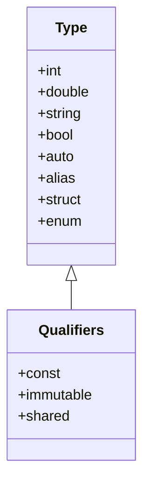

## 3.1 The D Type System and Type Safety

In the realm of systems programming, the D programming language stands out with its robust type system, offering a blend of safety, performance, and expressiveness. Understanding D's type system is crucial for expert software engineers and architects aiming to build high-performance, scalable, and maintainable software systems. In this section, we will delve into the intricacies of D's type system, focusing on strong typing, type inference, and custom types.

### Strong Typing in D

**Strong Typing** is a hallmark of the D language, ensuring that type errors are caught at compile time rather than at runtime. This feature enhances code reliability and maintainability by enforcing strict type checks.

#### Understanding Static Typing

D employs static typing, meaning that the type of a variable is known at compile time. This allows the compiler to perform type checks and optimizations, resulting in more efficient and error-free code.

```d
int x = 10; // x is explicitly declared as an integer
double y = 20.5; // y is explicitly declared as a double
```

In the above example, `x` and `y` are statically typed, and any attempt to assign a value of a different type will result in a compile-time error.

#### Benefits of Strong Typing

1. **Error Prevention**: Catch type mismatches early in the development process.
2. **Code Clarity**: Enhance readability by making data types explicit.
3. **Optimization**: Allow the compiler to optimize code based on known types.

### Type Inference in D

While D is a statically typed language, it offers **type inference** to reduce verbosity and improve code readability. The `auto` keyword is used to let the compiler infer the type of a variable based on the assigned value.

#### Utilizing `auto` for Cleaner Code

```d
auto a = 5; // a is inferred as an int
auto b = 3.14; // b is inferred as a double
auto c = "Hello, D!"; // c is inferred as a string
```

In this example, the types of `a`, `b`, and `c` are inferred by the compiler, reducing the need for explicit type declarations.

#### When to Use Type Inference

- **Readability**: Use `auto` when the type is obvious from the context.
- **Generic Programming**: Facilitate the use of templates and generic functions.
- **Rapid Prototyping**: Quickly iterate on code without worrying about explicit types.

### Custom Types in D

Creating **custom types** enhances code clarity and reusability. D allows the creation of aliases and custom types to represent domain-specific concepts.

#### Creating Aliases

Aliases provide a way to create new names for existing types, improving code readability and maintainability.

```d
alias Kilometer = double;
Kilometer distance = 5.0; // distance is of type double, but semantically a Kilometer
```

#### Defining Custom Types

Custom types can be defined using `structs` or `enums`, allowing for more complex data representations.

```d
struct Point {
    double x;
    double y;
}

Point p = Point(3.0, 4.0);
```

In this example, `Point` is a custom type representing a point in 2D space.

### Type Qualifiers in D

D provides several **type qualifiers** to enforce additional constraints on variables, enhancing safety and concurrency.

#### Using `const`, `immutable`, and `shared`

- **`const`**: Indicates that a variable's value cannot be changed after initialization.
- **`immutable`**: Ensures that a variable's value is fixed and cannot be altered, even by other references.
- **`shared`**: Marks a variable as accessible by multiple threads, facilitating safe concurrent programming.

```d
const int maxConnections = 100;
immutable string appName = "MyApp";
shared int sharedCounter;
```

### Visualizing D's Type System

To better understand the relationships between different types and qualifiers in D, let's visualize the type system using a class diagram.



**Diagram Description**: This diagram illustrates the core types in D and their relationship with type qualifiers. The `Type` class represents basic data types, while the `Qualifiers` class shows how types can be modified with `const`, `immutable`, and `shared`.

### Try It Yourself

Experiment with the following code snippets to deepen your understanding of D's type system:

1. Modify the `Point` struct to include a `z` coordinate for 3D space.
2. Use `auto` to infer the type of a complex expression involving arithmetic operations.
3. Create an alias for a `struct` and use it in a function signature.

### References and Further Reading

- [D Language Specification](https://dlang.org/spec/spec.html)
- [D Programming Language: Type System](https://dlang.org/spec/type.html)
- [MDN Web Docs on Static Typing](https://developer.mozilla.org/en-US/docs/Glossary/Static_typing)

### Knowledge Check

To reinforce your understanding of D's type system, consider the following questions:

1. What are the benefits of using strong typing in D?
2. How does type inference improve code readability?
3. When should you use custom types in your code?
4. What is the difference between `const` and `immutable` in D?

### Embrace the Journey

Remember, mastering D's type system is just the beginning. As you progress, you'll unlock new levels of performance and safety in your software. Keep experimenting, stay curious, and enjoy the journey!

## Quiz Time!



### What is a key benefit of strong typing in D?

- [x] Error prevention at compile time
- [ ] Faster runtime execution
- [ ] Dynamic type checking
- [ ] Automatic memory management

> **Explanation:** Strong typing in D helps catch type errors at compile time, preventing potential runtime issues.

### How does the `auto` keyword improve code readability?

- [x] By reducing verbosity
- [ ] By enforcing explicit type declarations
- [ ] By allowing dynamic typing
- [ ] By optimizing runtime performance

> **Explanation:** The `auto` keyword allows the compiler to infer types, reducing the need for explicit type declarations and improving readability.

### What is an alias in D?

- [x] A new name for an existing type
- [ ] A function that returns a type
- [ ] A dynamic type declaration
- [ ] A type qualifier

> **Explanation:** An alias in D provides a new name for an existing type, enhancing code clarity.

### Which type qualifier ensures a variable's value cannot be changed?

- [x] `const`
- [ ] `immutable`
- [ ] `shared`
- [ ] `volatile`

> **Explanation:** The `const` qualifier indicates that a variable's value cannot be changed after initialization.

### What is the purpose of the `shared` qualifier in D?

- [x] To mark a variable as accessible by multiple threads
- [ ] To make a variable immutable
- [ ] To enforce compile-time type checks
- [ ] To enable dynamic type inference

> **Explanation:** The `shared` qualifier is used to mark a variable as accessible by multiple threads, facilitating safe concurrent programming.

### How can custom types improve code maintainability?

- [x] By representing domain-specific concepts
- [ ] By enforcing dynamic typing
- [ ] By reducing compile-time checks
- [ ] By allowing runtime type changes

> **Explanation:** Custom types allow developers to represent domain-specific concepts, improving code clarity and maintainability.

### What is the difference between `const` and `immutable`?

- [x] `const` allows changes through other references, `immutable` does not
- [ ] `immutable` allows changes through other references, `const` does not
- [ ] Both allow changes through other references
- [ ] Neither allows changes through other references

> **Explanation:** `const` allows changes through other references, while `immutable` ensures that a variable's value is fixed and cannot be altered, even by other references.

### When should you use type inference in D?

- [x] When the type is obvious from the context
- [ ] When explicit types are required
- [ ] When dynamic typing is needed
- [ ] When runtime performance is a concern

> **Explanation:** Type inference should be used when the type is obvious from the context, reducing verbosity and improving readability.

### What is a struct in D?

- [x] A user-defined type for complex data representation
- [ ] A built-in type for basic data representation
- [ ] A type qualifier for concurrency
- [ ] A dynamic type declaration

> **Explanation:** A struct in D is a user-defined type that allows for complex data representation.

### True or False: The `auto` keyword in D allows for dynamic typing.

- [ ] True
- [x] False

> **Explanation:** The `auto` keyword in D does not allow for dynamic typing; it allows the compiler to infer the type at compile time, maintaining static typing.


