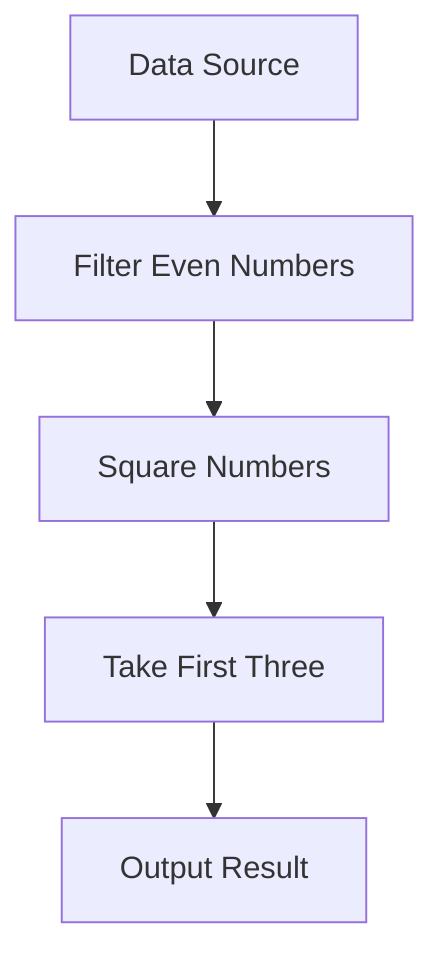

## 3.10 Ranges and Lazy Evaluation

In the realm of systems programming, efficiency and performance are paramount. The D programming language offers a powerful abstraction known as **ranges**, which, when combined with **lazy evaluation**, allows developers to handle large data sets and perform complex operations with minimal overhead. This section will delve into the concept of ranges, explore the different types of ranges available in D, and demonstrate how lazy evaluation can be leveraged for efficient computation.

### Understanding Ranges in D

Ranges are a central concept in D's standard library, `Phobos`, and provide a unified way to iterate over sequences of data. They are similar to iterators in other languages but offer more flexibility and power. Ranges in D are defined by a set of properties and methods that allow them to be used in a variety of contexts.

#### Types of Ranges

1. **Input Range**: The simplest form of a range, which allows one-way traversal of a sequence. An input range must define the methods `empty`, `front`, and `popFront`.

2. **Forward Range**: Extends the capabilities of an input range by allowing multiple passes over the data. A forward range must be copyable and support the same methods as an input range.

3. **Bidirectional Range**: Adds the ability to traverse the sequence in both directions. In addition to the forward range methods, a bidirectional range must implement `popBack` and `back`.

4. **Random Access Range**: Provides direct access to any element in the sequence using an index. This range must implement the `opIndex` method and support slicing.

#### Range Concept in Action

Let's explore a simple example of an input range in D:

```d
import std.stdio;

struct SimpleRange {
    int[] data;
    size_t index;

    bool empty() {
        return index >= data.length;
    }

    int front() {
        return data[index];
    }

    void popFront() {
        ++index;
    }
}

void main() {
    auto range = SimpleRange([1, 2, 3, 4, 5], 0);
    while (!range.empty()) {
        writeln(range.front());
        range.popFront();
    }
}
```

In this example, `SimpleRange` is a basic input range that iterates over an array of integers. The `empty`, `front`, and `popFront` methods are implemented to satisfy the input range requirements.

### Lazy Evaluation

Lazy evaluation is a technique where computation is deferred until the result is actually needed. This can lead to significant performance improvements, especially when dealing with large data sets or complex operations.

#### Benefits of Lazy Evaluation

- **Efficiency**: By deferring computation, unnecessary calculations are avoided, reducing the overall processing time.
- **Memory Usage**: Lazy evaluation can reduce memory consumption by generating values on-the-fly rather than storing them in memory.
- **Composability**: Operations can be composed into pipelines, allowing for more readable and maintainable code.

#### Implementing Lazy Evaluation with Ranges

D's range-based approach naturally supports lazy evaluation. Let's see how we can implement lazy evaluation using ranges:

```d
import std.stdio;
import std.range;
import std.algorithm;

void main() {
    auto numbers = iota(1, 1000); // Generates numbers from 1 to 999
    auto evenNumbers = numbers.filter!(n => n % 2 == 0);
    auto squaredNumbers = evenNumbers.map!(n => n * n);

    // Lazy evaluation: numbers are only processed when needed
    writeln(squaredNumbers.take(5).array); // Output: [4, 16, 36, 64, 100]
}
```

In this example, the `iota` function generates a range of numbers, which is then filtered to include only even numbers. The `map` function squares each number, and the `take` function retrieves the first five results. All these operations are performed lazily, meaning that no computation occurs until the `writeln` function is called.

### Composing Ranges

One of the most powerful aspects of ranges in D is their ability to be composed into pipelines. This allows developers to build complex operations by chaining simple transformations.

#### Building Range Pipelines

Consider the following example, which demonstrates how to compose ranges to process a sequence of data:

```d
import std.stdio;
import std.range;
import std.algorithm;

void main() {
    auto data = [1, 2, 3, 4, 5, 6, 7, 8, 9, 10];
    auto result = data
        .filter!(n => n % 2 == 0) // Filter even numbers
        .map!(n => n * n)         // Square each number
        .take(3)                  // Take the first three results
        .array;                   // Convert to an array

    writeln(result); // Output: [4, 16, 36]
}
```

In this example, we start with an array of numbers and apply a series of transformations using range functions. The result is a new array containing the squared values of the first three even numbers.

#### Practical Use Cases

Ranges and lazy evaluation are particularly useful in scenarios where performance and efficiency are critical. Here are some practical use cases:

- **Handling Large Data Sets**: Ranges allow you to process large data sets without loading the entire data into memory, making them ideal for big data applications.
- **Stream Processing**: With lazy evaluation, you can process data streams on-the-fly, reducing latency and improving throughput.
- **Complex Data Transformations**: By composing ranges, you can build complex data transformation pipelines that are both efficient and easy to understand.

### Visualizing Range Operations

To better understand how ranges and lazy evaluation work, let's visualize the flow of data through a range pipeline:



In this diagram, we see the flow of data from the initial data source through a series of transformations, culminating in the final output. Each step in the pipeline represents a range operation that is applied lazily.

### Try It Yourself

To deepen your understanding of ranges and lazy evaluation, try modifying the code examples provided:

- Change the range of numbers generated by `iota` and observe how it affects the output.
- Experiment with different filtering and mapping functions to see how they transform the data.
- Create your own range struct that implements additional methods, such as `popBack` for bidirectional traversal.

### References and Further Reading

- [D Language Ranges](https://dlang.org/phobos/std_range.html)
- [Lazy Evaluation in D](https://dlang.org/phobos/std_algorithm_iteration.html)
- [Functional Programming with Ranges](https://dlang.org/phobos/std_algorithm_iteration.html)

### Knowledge Check

Before we conclude, let's reinforce what we've learned with a few questions:

- What are the key differences between input, forward, bidirectional, and random access ranges?
- How does lazy evaluation improve performance and memory usage?
- What are some practical applications of ranges and lazy evaluation in systems programming?

### Embrace the Journey

Remember, mastering ranges and lazy evaluation is just one step in your journey to becoming an expert in D programming. As you continue to explore the language, you'll discover even more powerful tools and techniques to enhance your software development skills. Keep experimenting, stay curious, and enjoy the journey!

## Quiz Time!



### What is the primary benefit of lazy evaluation?

- [x] It defers computation until necessary, improving efficiency.
- [ ] It increases memory usage by storing all results in memory.
- [ ] It simplifies code by removing the need for functions.
- [ ] It allows for immediate execution of all operations.

> **Explanation:** Lazy evaluation defers computation until the result is needed, which can improve efficiency by avoiding unnecessary calculations.

### Which method must an input range implement?

- [x] `empty`
- [ ] `popBack`
- [ ] `opIndex`
- [ ] `slice`

> **Explanation:** An input range must implement the `empty` method to indicate whether the range has been fully traversed.

### What additional capability does a bidirectional range provide over a forward range?

- [x] Traversal in both directions
- [ ] Random access to elements
- [ ] Lazy evaluation
- [ ] Copyability

> **Explanation:** A bidirectional range allows traversal in both directions, unlike a forward range which only supports one-way traversal.

### How can ranges be composed in D?

- [x] By chaining operations like `filter`, `map`, and `take`
- [ ] By using nested loops
- [ ] By defining a new class for each operation
- [ ] By using global variables

> **Explanation:** Ranges can be composed by chaining operations such as `filter`, `map`, and `take`, creating a pipeline of transformations.

### What is a practical use case for ranges and lazy evaluation?

- [x] Handling large data sets efficiently
- [ ] Storing all data in memory
- [ ] Simplifying syntax by removing functions
- [ ] Immediate execution of all operations

> **Explanation:** Ranges and lazy evaluation are particularly useful for handling large data sets efficiently, as they allow processing without loading all data into memory.

### Which function generates a range of numbers in D?

- [x] `iota`
- [ ] `range`
- [ ] `generate`
- [ ] `sequence`

> **Explanation:** The `iota` function generates a range of numbers in D.

### What does the `take` function do in a range pipeline?

- [x] It retrieves a specified number of elements from the range.
- [ ] It filters elements based on a condition.
- [ ] It maps each element to a new value.
- [ ] It sorts the elements in the range.

> **Explanation:** The `take` function retrieves a specified number of elements from the range, effectively limiting the output.

### What is the role of the `map` function in a range pipeline?

- [x] It transforms each element in the range.
- [ ] It filters elements based on a condition.
- [ ] It retrieves a specified number of elements.
- [ ] It concatenates multiple ranges.

> **Explanation:** The `map` function transforms each element in the range, applying a specified operation to each one.

### Which of the following is NOT a type of range in D?

- [x] Circular Range
- [ ] Input Range
- [ ] Forward Range
- [ ] Random Access Range

> **Explanation:** Circular Range is not a recognized type of range in D. The recognized types include Input, Forward, Bidirectional, and Random Access Ranges.

### True or False: Lazy evaluation can reduce memory consumption.

- [x] True
- [ ] False

> **Explanation:** True. Lazy evaluation can reduce memory consumption by generating values on-the-fly rather than storing them in memory.


