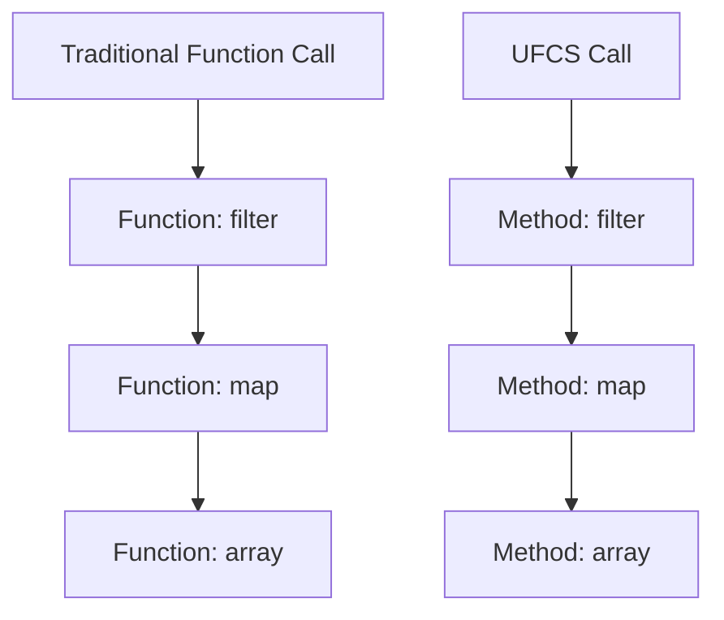

## 3.11 Uniform Function Call Syntax (UFCS)

Uniform Function Call Syntax (UFCS) is a powerful feature in the D programming language that allows functions to be called as if they were methods of an object. This capability enhances code readability, facilitates the creation of fluent interfaces, and integrates seamlessly with various design patterns and APIs. In this section, we will explore the concept of UFCS, demonstrate its benefits, and provide practical examples to illustrate its application in advanced systems programming.

### Concept of UFCS

UFCS allows you to call a free function (a function not bound to a specific class or struct) using method call syntax. This means that you can write code that flows naturally, making it easier to read and understand. UFCS is particularly useful when working with functions that operate on a specific type but are not defined as member functions of that type.

#### Example of UFCS

Consider a simple function that operates on a string:

```d
string toUpperCase(string s) {
    return s.toUpper();
}

void main() {
    string text = "hello";
    // Traditional function call
    string upperText = toUpperCase(text);
    // Using UFCS
    string upperTextUFCS = text.toUpperCase();
    writeln(upperTextUFCS); // Output: HELLO
}
```

In this example, `toUpperCase` is a free function, but UFCS allows us to call it as if it were a method of the `string` type. This makes the code more intuitive and aligns with how we typically think about operations on objects.

### Enhancing Readability

One of the primary benefits of UFCS is enhanced readability. By allowing functions to be called in a method-like fashion, UFCS helps create code that is more expressive and easier to follow. This is particularly beneficial in complex systems where understanding the flow of data and operations is crucial.

#### Readability Example

Consider a scenario where you have a series of transformations to apply to a data structure:

```d
import std.algorithm;
import std.range;

void main() {
    auto data = [1, 2, 3, 4, 5];
    // Traditional function calls
    auto result = map!(a => a * 2)(filter!(a => a % 2 == 0)(data));
    // Using UFCS
    auto resultUFCS = data.filter!(a => a % 2 == 0).map!(a => a * 2);
    writeln(resultUFCS); // Output: [4, 8]
}
```

In the UFCS version, the code reads from left to right, following the natural order of operations. This makes it easier to understand the sequence of transformations applied to the data.

### Chaining Calls

UFCS enables the chaining of function calls, which is a key aspect of creating fluent interfaces and pipelines. Fluent interfaces allow for a more declarative style of programming, where the code describes what should be done rather than how to do it.

#### Fluent Interface Example

Let's create a simple example of a fluent interface using UFCS:

```d
struct QueryBuilder {
    string query;

    QueryBuilder select(string fields) {
        query ~= "SELECT " ~ fields ~ " ";
        return this;
    }

    QueryBuilder from(string table) {
        query ~= "FROM " ~ table ~ " ";
        return this;
    }

    QueryBuilder where(string condition) {
        query ~= "WHERE " ~ condition ~ " ";
        return this;
    }

    string build() {
        return query;
    }
}

void main() {
    auto query = QueryBuilder().select("name, age").from("users").where("age > 18").build();
    writeln(query); // Output: SELECT name, age FROM users WHERE age > 18
}
```

In this example, UFCS allows us to chain method calls on the `QueryBuilder` struct, resulting in a clean and readable query construction process.

### Examples and Patterns

UFCS can be applied in various design patterns and APIs to improve code structure and usability. Let's explore some common patterns where UFCS can be beneficial.

#### Applying UFCS in Design Patterns

1. **Builder Pattern**: UFCS can enhance the builder pattern by allowing method chaining, making the construction of complex objects more intuitive.

2. **Decorator Pattern**: UFCS can be used to chain decorators, applying multiple layers of functionality to an object in a concise manner.

3. **Strategy Pattern**: UFCS can simplify the selection and application of strategies by allowing strategy functions to be called as methods.

#### UFCS in APIs

UFCS is particularly useful in designing APIs that are easy to use and understand. By allowing functions to be called as methods, UFCS can make APIs more consistent and intuitive.

### Code Examples

Let's delve into some more detailed code examples to illustrate the power of UFCS in D programming.

#### Example 1: Enhancing a Math Library

Consider a math library with various functions:

```d
module mathlib;

double square(double x) {
    return x * x;
}

double cube(double x) {
    return x * x * x;
}

double sqrt(double x) {
    return x.sqrt();
}
```

Using UFCS, we can call these functions in a more natural way:

```d
import mathlib;

void main() {
    double number = 4.0;
    double result = number.square().cube().sqrt();
    writeln(result); // Output: 8.0
}
```

#### Example 2: Data Processing Pipeline

Let's create a data processing pipeline using UFCS:

```d
import std.algorithm;
import std.range;

void main() {
    auto data = [1, 2, 3, 4, 5];
    auto processedData = data
        .filter!(a => a % 2 == 0)
        .map!(a => a * 2)
        .array();
    writeln(processedData); // Output: [4, 8]
}
```

In this example, UFCS allows us to chain the `filter`, `map`, and `array` functions, creating a clear and concise data processing pipeline.

### Visualizing UFCS

To better understand UFCS, let's visualize how it transforms function calls into method-like syntax.



**Figure 1**: Visualizing the transformation of traditional function calls into UFCS method calls.

### Try It Yourself

To fully grasp the power of UFCS, try modifying the code examples provided. Experiment with different functions and chaining sequences to see how UFCS can simplify and enhance your code.

### References and Links

- [D Language Specification](https://dlang.org/spec/spec.html)
- [D Programming Language: UFCS](https://dlang.org/spec/function.html#uniform-function-call-syntax)
- [MDN Web Docs: Method Chaining](https://developer.mozilla.org/en-US/docs/Web/JavaScript/Reference/Global_Objects/Promise/then)

### Knowledge Check

To reinforce your understanding of UFCS, consider the following questions:

1. What is the primary benefit of using UFCS in D programming?
2. How does UFCS enhance code readability?
3. In what scenarios is UFCS particularly useful?
4. How can UFCS be applied in design patterns like the Builder Pattern?
5. What are some potential pitfalls of using UFCS?

### Embrace the Journey

Remember, mastering UFCS is just one step in your journey to becoming an expert in D programming. As you continue to explore and experiment with UFCS, you'll discover new ways to leverage its power in your projects. Stay curious, keep learning, and enjoy the process!

## Quiz Time!



### What is Uniform Function Call Syntax (UFCS) in D?

- [x] A feature that allows functions to be called as if they were methods.
- [ ] A syntax for defining classes.
- [ ] A method for optimizing memory usage.
- [ ] A way to handle exceptions.

> **Explanation:** UFCS allows free functions to be called using method call syntax, enhancing readability and fluency.

### How does UFCS enhance code readability?

- [x] By allowing functions to be called in a method-like fashion.
- [ ] By reducing the number of lines of code.
- [ ] By enforcing strict type checking.
- [ ] By eliminating the need for comments.

> **Explanation:** UFCS makes code more intuitive by allowing functions to be called as methods, aligning with natural reading order.

### What is a common use case for UFCS?

- [x] Creating fluent interfaces.
- [ ] Defining global variables.
- [ ] Implementing low-level optimizations.
- [ ] Handling file I/O operations.

> **Explanation:** UFCS is often used to create fluent interfaces, enabling method chaining and declarative coding styles.

### How can UFCS be applied in the Builder Pattern?

- [x] By allowing method chaining for constructing complex objects.
- [ ] By defining static methods for object creation.
- [ ] By enforcing singleton behavior.
- [ ] By managing memory allocation.

> **Explanation:** UFCS facilitates method chaining in the Builder Pattern, making object construction more intuitive.

### What is a potential pitfall of using UFCS?

- [x] Overusing UFCS can lead to less efficient code.
- [ ] UFCS requires additional libraries to implement.
- [ ] UFCS is not supported in all versions of D.
- [ ] UFCS can cause memory leaks.

> **Explanation:** While UFCS enhances readability, overuse can lead to performance issues if not carefully managed.

### Which of the following is an example of UFCS?

- [x] `data.filter!(a => a % 2 == 0).map!(a => a * 2)`
- [ ] `filter(data, a => a % 2 == 0)`
- [ ] `map(data, a => a * 2)`
- [ ] `data.reduce!(a + b)`

> **Explanation:** The UFCS example shows method-like chaining of functions on `data`.

### What is the main advantage of using UFCS in APIs?

- [x] It makes APIs more consistent and intuitive.
- [ ] It reduces the need for documentation.
- [ ] It simplifies error handling.
- [ ] It improves memory management.

> **Explanation:** UFCS enhances API design by making function calls consistent and method-like, improving usability.

### How does UFCS relate to method chaining?

- [x] UFCS enables method chaining by allowing functions to be called as methods.
- [ ] UFCS prevents method chaining to improve performance.
- [ ] UFCS is unrelated to method chaining.
- [ ] UFCS requires additional syntax for method chaining.

> **Explanation:** UFCS directly supports method chaining by transforming function calls into method-like syntax.

### Can UFCS be used with any function in D?

- [x] True
- [ ] False

> **Explanation:** UFCS can be applied to any free function, allowing it to be called as if it were a method.

### What is the effect of UFCS on function calls?

- [x] It transforms function calls into method-like syntax.
- [ ] It optimizes function execution speed.
- [ ] It enforces strict type safety.
- [ ] It simplifies error handling.

> **Explanation:** UFCS changes the syntax of function calls to resemble method calls, enhancing readability and fluency.


